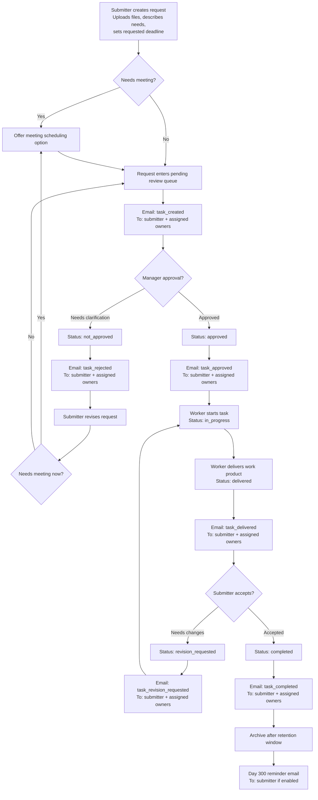

# Priority Portal Email Notification Flow

This diagram maps the current workflow to the email moments we need to audit.

Current implementation already sends workflow emails for:

- `task_created`
- `task_approved`
- `task_rejected`
- `task_revision_requested`
- `task_delivered`
- `task_completed`
- `retention_day_300`

Recipients currently fan out to:

- submitter
- assigned owners

Each recipient only receives the email if that event is enabled in their notification preferences.

## Workflow Audit Diagram

## Audit Notes

- `task_created` currently goes to both submitter and owners. If you want reviewer-only emails here, we should split recipients by event.
- `task_rejected` is the clarification loop email. That matches your workflow where the client goes back to the meeting-or-revise step.
- `task_delivered` and `task_revision_requested` currently notify both sides. If you want client-only or worker-only routing, we should add recipient rules per event.
- There is no separate email yet for `in_progress` or meeting scheduling. We can add those once you confirm the audit.
