# Technical Specification

# 1. Introduction

## 1.1 Executive Summary

### 1.1.1 Project Overview

The **WP Priority Queue Portal** is a purpose-built work management and billing platform designed for creative agencies and freelance service providers. Currently at version **0.23.4**, the system is implemented as a WordPress plugin (shortcode: `[pq_client_portal]`) that delivers a full-featured client-facing portal for managing prioritized work requests across a defined lifecycle — from intake and approval through execution, delivery, and invoicing.

| Attribute | Value |
|---|---|
| **Product Name** | WP Priority Queue Portal |
| **Current Version** | 0.23.4 (`WP_PQ_VERSION` constant) |
| **License** | MIT (Copyright 2026 BicycleGuy) |
| **Repository** | https://github.com/BicycleGuy/Priority-Queue |
| **Live Portal** | https://readspear.com/priority-portal/ |
| **Platform** | WordPress 6.0+ / PHP 8.1+ |

The plugin provides a unified workspace where clients submit work requests, managers approve and prioritize them, workers execute against a Kanban board, and completed work flows through an integrated billing pipeline — from work ledger entries through work statements to exportable invoice drafts. This end-to-end approach eliminates the fragmentation that arises when task management, communication, and billing are spread across disconnected tools.

### 1.1.2 Core Business Problem

Creative agencies and freelance service providers face a persistent operational problem: client requests arrive through scattered, informal channels — email threads, Slack messages, text messages, and verbal conversations. This fragmentation creates cascading inefficiencies:

- **For Managers:** No single view of all active work across clients, leading to lost requests, unclear priorities, and difficulty tracking what has been delivered versus what has been billed.
- **For Workers:** No definitive, prioritized queue, resulting in ambiguity about what to work on next and frequent context-switching driven by ad hoc re-prioritization.
- **For Clients:** No visibility into request status without actively chasing the service team, leading to frustration and eroded trust.
- **For Billing:** Work completion data is reconstructed retroactively rather than captured at the point of delivery, resulting in under-billing, inaccurate invoices, and manual time-tracking guesswork.

The WP Priority Queue Portal addresses these problems by establishing a **single source of truth** for task intake, prioritization, execution, delivery, and billing — all governed by a canonical status workflow and enforced through role-based access control.

### 1.1.3 Key Stakeholders and Users

The system serves four distinct user roles, each mapped to a WordPress role with specific capabilities defined in `includes/class-wp-pq-roles.php`:

| Role | WordPress Slug | Primary Responsibilities |
|---|---|---|
| **Client** | `pq_client` | Submit requests, upload reference files, track task status, request meetings, receive deliverables |
| **Worker** | `pq_worker` | Execute assigned tasks, update status, upload deliverables, communicate with clients |
| **Manager** | `pq_manager` | Approve/reject requests, assign workers, set priorities, manage clients and billing, generate statements |
| **Administrator** | `administrator` | Full system access — all tasks, clients, billing, settings, and configuration |

Role enforcement is implemented at the API level through WordPress capabilities (`pq_view_all_tasks`, `pq_reorder_all_tasks`, `pq_approve_requests`, `pq_assign_owners`, `pq_work_tasks`) — no access control decision relies on client-side logic alone. Clients are scoped exclusively to tasks associated with their client account, while managers and administrators have cross-client visibility.

### 1.1.4 Value Proposition and Business Impact

The WP Priority Queue Portal differentiates itself from general-purpose project management tools (Asana, Monday, Jira) and client portal platforms (Dubsado, HoneyBook) through its **native integration of task management with a billing pipeline**. The core value proposition centers on the following:

- **Unified Workflow:** The approval loop — client submits → manager approves → worker executes → manager bills — is the architectural backbone, not an afterthought bolted onto a generic task system.
- **Billing at the Point of Delivery:** Work ledger entries, work statements, and invoice drafts are first-class entities generated directly from completed work. Billing capture is mandatory when a task is marked "done" (the completion modal in the workflow cannot be bypassed), eliminating retroactive invoice reconstruction.
- **Purpose-Built for Service Businesses:** Unlike horizontal tools, every feature — drag-and-drop Kanban, priority reordering, client account management, job-based billing buckets — is designed for agencies and freelancers who bill by task, project, or retainer.
- **Reduced Operational Overhead:** Clients gain self-service visibility, workers gain queue clarity, and managers gain consolidated billing — reducing email volume, meeting load, and administrative friction.

---

## 1.2 System Overview

### 1.2.1 Project Context

#### Business Context and Market Positioning

The WP Priority Queue Portal occupies a niche at the intersection of task management and service-business billing. Mainstream project management tools offer robust boards and views but lack native billing pipelines; conversely, client portal and invoicing platforms lack real Kanban boards with drag-and-drop status transitions, worker assignment, and priority reordering. By combining both domains in a single product, the portal eliminates the need to synchronize data between separate task and billing systems — a process that is error-prone and time-consuming for small to mid-size service teams.

#### Current Implementation and Evolution Path

The system is currently deployed as a **single-site WordPress plugin** (version 0.23.4), leveraging the WordPress ecosystem for authentication, user management, cron scheduling, and content delivery. The frontend is rendered through a shortcode-driven portal (`[pq_client_portal]`) using vanilla JavaScript controllers with SortableJS, FullCalendar, and Uppy libraries for interactive capabilities.

A planned architectural evolution is documented in `docs/multitenant-v1/ARCHITECTURE.md`, which outlines a migration from the single-site WordPress plugin to a **multi-tenant SaaS architecture**. The target platform separates concerns between `readspear.com` (WordPress-based marketing and intake) and `app.readspear.com` (a new multi-tenant application). The user-specified target stack for this evolution includes React with Next.js (App Router), TypeScript, Tailwind CSS on the frontend, and a Node.js backend with PostgreSQL as the primary data store. The multi-tenant architecture introduces tenant-level isolation, expanded roles (`tenant_owner`, `viewer`), and non-negotiable controls including row-level isolation testing, immutable audit logs, and API rate limiting.

#### Integration with Enterprise Landscape

The portal integrates with the following external systems, managed through REST API endpoints registered in `includes/class-wp-pq-api.php` and `includes/class-wp-pq-manager-api.php`:

| Integration | Purpose | Mechanism |
|---|---|---|
| **Google Calendar / Meet** | Meeting scheduling, calendar sync | OAuth 2.0 via `pq/v1/google/oauth/*` endpoints |
| **OpenAI Responses API** | AI-powered task import and document parsing | Direct API calls from `class-wp-pq-ai-importer.php` |
| **SMTP / `wp_mail()`** | Email notifications, daily digests, retention reminders | WordPress mail subsystem |
| **Downstream Accounting** | Invoice finalization (Wave, QuickBooks) | Manual export of invoice drafts |

A critical architectural boundary is that the Priority Portal generates **invoice drafts** but is explicitly **not** the system of record for issued invoices. Final invoices are issued and tracked in downstream accounting systems. This boundary is documented in `docs/DEVELOPER_HANDOFF_2026-03-21.md` and enforced by the data model: once ledger entries are invoiced or paid, they cannot be reopened — a follow-up task must be created instead.

### 1.2.2 High-Level Description

#### Primary System Capabilities

The system delivers the following primary capabilities, organized by functional domain:

| Domain | Capabilities |
|---|---|
| **Task Management** | Task CRUD, 8-status canonical workflow, drag-and-drop Kanban board, calendar view, priority reordering, batch operations |
| **Collaboration** | Task messaging with @mentions, sticky notes, file exchange with versioning, meeting scheduling via Google Meet |
| **Client Management** | Client accounts, member-to-client mapping, job/billing bucket definitions, access scoping |
| **Billing Pipeline** | Work ledger entries on task completion, work statement generation, invoice draft creation with first-class line items |
| **Notifications** | 14 event types, in-app notification cards with 30-second polling, email notifications, per-user preference control, daily client digests |
| **AI Import** | OpenAI-powered document parsing for bulk task creation from unstructured text |

#### Major System Components

The system is composed of 11 PHP classes in the `includes/` directory, 4 JavaScript controllers in `assets/js/`, and a supporting CSS layer. The singleton bootstrap pattern in `class-wp-pq-plugin.php` coordinates initialization of all components.

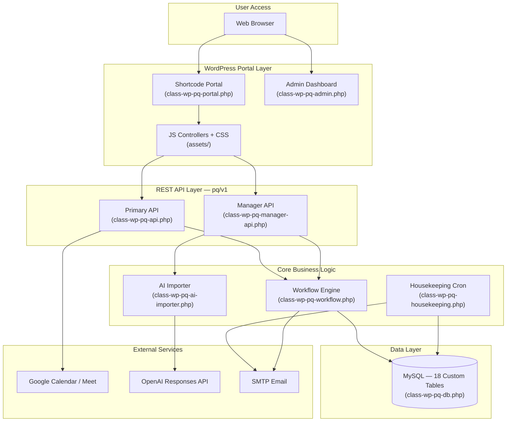

The boot sequence, orchestrated by `WP_PQ_Plugin::boot()` in `class-wp-pq-plugin.php`, follows a deterministic initialization order: database table creation and 12 migration routines first, then cron initialization (`WP_PQ_Housekeeping`), admin screen registration (`WP_PQ_Admin`), REST API registration (both `WP_PQ_API` and `WP_PQ_Manager_API`), and finally portal shortcode registration (`WP_PQ_Portal`).

#### Core Technical Approach

The system employs the following architectural patterns:

- **Singleton Bootstrap:** `WP_PQ_Plugin::instance()` ensures a single initialization point and deterministic component loading order.
- **WordPress Hooks-Based Wiring:** All component initialization is tied to WordPress lifecycle hooks (`plugins_loaded`, `rest_api_init`, `wp_enqueue_scripts`, activation/deactivation hooks).
- **REST-First API Surface:** Over 26 endpoints under the `pq/v1` namespace serve as the exclusive data access layer for frontend interactions, with permission callbacks enforcing RBAC at every route.
- **Canonical State Machine:** The workflow engine in `class-wp-pq-workflow.php` defines an explicit 8-status transition matrix with capability-gated transitions, ensuring no status change occurs outside the defined rules.
- **Custom Database Schema:** 18 purpose-built tables (prefixed `pq_`) extend the WordPress database with domain-specific entities, avoiding reliance on WordPress post types or meta tables for core business data.
- **Shortcode-Driven SPA:** The `[pq_client_portal]` shortcode renders a single-page-application-like experience within WordPress, with JavaScript controllers managing state and REST API communication client-side.

### 1.2.3 Success Criteria

#### Measurable Objectives

The system targets the following measurable outcomes for the service businesses it serves:

- **Request Consolidation:** 100% of client work requests flow through the portal, eliminating email/Slack/text-based request submission.
- **Billing Accuracy:** Every completed task produces a work ledger entry with captured billing details (mode, hours, rate, amount), ensuring zero unbilled delivered work.
- **Client Transparency:** Clients can self-serve their own task status at any time without contacting the service team.
- **Queue Clarity:** Workers have a single, prioritized, unambiguous queue with no reliance on verbal or ad hoc prioritization.

#### Critical Success Factors

- Adoption by all three user roles — the system is effective only if clients submit through the portal, managers approve within it, and workers execute against it.
- Reliable notification delivery (both in-app and email) to keep all parties informed without manual follow-up.
- Data integrity of the billing pipeline — ledger entries, statements, and invoice drafts must be accurate and immutable once finalized.
- Enforcement of the canonical workflow — status transitions must follow defined rules to maintain process integrity.

#### Key Performance Indicators

| Category | KPI | Target |
|---|---|---|
| **Performance** | Page load time | < 2 seconds |
| **Performance** | Board interactions (drag, reorder) | < 200ms response |
| **Performance** | API response time | < 500ms |
| **Scale** | Concurrent users | 50+ supported |
| **Scale** | Total tasks | 10,000+ supported |
| **Scale** | Client accounts | 100+ supported |
| **Reliability** | Billing data loss | Zero tolerance |
| **Reliability** | Status change integrity | Transactional (ledger entry created atomically with status change) |
| **Security** | Access control enforcement | API-level RBAC on 100% of endpoints |

---

## 1.3 Scope

### 1.3.1 In-Scope

#### Core Features and Functionalities

The following capabilities constitute the defined scope of the WP Priority Queue Portal, organized by implementation priority as specified in the business requirements:

| Priority | Feature Area | Description |
|---|---|---|
| **High** | Task CRUD | Create, read, update, and delete task requests with title, description, priority, deadline, file attachments, and meeting requests |
| **High** | Status Workflow | Full 8-status canonical state machine (`pending_approval` → `needs_clarification` → `approved` → `in_progress` → `needs_review` → `delivered` → `done` → `archived`) with enforced transition rules |
| **High** | Kanban Board | 6-column drag-and-drop board with task cards showing priority, avatar, and due-date badges; safe drag (reorder) and meaningful drag (cross-priority) behaviors |
| **High** | Role-Based Access | 4 roles (Client, Worker, Manager, Admin) with 5 custom WordPress capabilities enforced at API level |
| **High** | Task Detail Drawer | Right-side panel with tabs for Messages, Notes, Files, Meetings, Activity, and Billing |
| **High** | Messaging & Files | Task-scoped conversations with @mentions, sticky notes, file uploads with versioning (3-version limit), retention tracking (365 days) |
| **High** | Email Notifications | Configurable notifications on status changes, assignments, mentions, and 14 distinct event types |
| **Medium** | Billing Pipeline | Work ledger entries on task completion, work statement generation with PDF output, invoice draft creation with first-class line items |
| **Medium** | Client Management | Client accounts with member associations, job/billing bucket definitions, client-scoped data access |
| **Medium** | Calendar View | FullCalendar integration displaying tasks by deadline and scheduled meetings |
| **Medium** | Meeting Scheduling | Google Calendar/Meet integration for task-context meeting creation via OAuth 2.0 |
| **Medium** | AI Task Import | OpenAI Responses API-powered document parsing for bulk task creation from unstructured text |
| **Lower** | Dark Mode | CSS custom properties-based dark theme support |
| **Lower** | Notification Preferences | Per-user, per-event-type enable/disable controls stored in `pq_notification_prefs` |
| **Lower** | Bulk Operations | Archive all delivered tasks, batch statement generation |
| **Lower** | Daily Digests | Automated daily summary emails for client members via WordPress cron |
| **Lower** | File Retention Reminders | Email notification at day 300 before file expiration at day 365 |

#### Implementation Boundaries

The following boundaries define the operational perimeter of the system:

- **System Boundaries:** The portal operates as a WordPress plugin on a single WordPress installation. All data is stored in 18 custom MySQL tables (prefixed `pq_`) alongside standard WordPress tables. The REST API namespace `pq/v1` is the sole programmatic interface.
- **User Groups Covered:** All four defined roles — Client, Worker, Manager, Administrator — are fully supported with distinct permission sets and UI surfaces.
- **Geographic/Market Coverage:** The system is designed for English-language service businesses. No localization or multi-currency support is included in the current scope.
- **Data Domains:** Task management (tasks, statuses, priorities, assignments), collaboration (messages, notes, files, meetings), client management (accounts, members, jobs), billing (ledger entries, work statements, invoice drafts, line items), notifications (events, preferences, delivery), and audit (status history, transition logs).
- **Deployment Target:** Single-site WordPress deployment. The current live instance is hosted at `readspear.com/priority-portal/`.

The core business workflow that defines the primary user journey through the system is illustrated below:

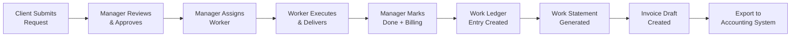

### 1.3.2 Out-of-Scope

#### Excluded Features and Capabilities

The following items are **explicitly excluded** from the current system scope, as documented in `docs/DEVELOPER_HANDOFF_2026-03-21.md` and confirmed by business requirements:

| Excluded Item | Rationale |
|---|---|
| **Full Accounting System** | The portal generates invoice drafts only. Final invoices are issued and tracked in downstream accounting systems (Wave, QuickBooks). The portal is not the system of record for issued invoices. |
| **Native Time Tracking** | Not included in the current phase. Billing is captured via manual entry in the completion modal (hours, rate, amount) rather than automated time tracking. |
| **Real-Time WebSocket Communication** | The notification system uses 30-second polling via `admin-queue-alerts.js`, not persistent WebSocket connections. |
| **Mobile Native Applications** | The portal is a responsive web application. No iOS or Android native apps are in scope. |
| **Multi-Currency / Localization** | The system operates in a single language (English) with no multi-currency billing support. |
| **Third-Party PM Tool Sync** | No synchronization with external project management tools (e.g., Jira, Asana, Focalboard) is implemented. |
| **OAuth / SSO Login** | Current authentication uses WordPress native session/cookie-based auth. Google OAuth is used solely for Calendar/Meet integration, not for user login. |

#### Future Phase Considerations

The following items are planned for future development phases but are not part of the current system:

| Future Item | Reference | Description |
|---|---|---|
| **Multi-Tenant SaaS** | `docs/multitenant-v1/ARCHITECTURE.md` | Migration from single-site WordPress plugin to multi-tenant architecture with tenant-level isolation, expanded roles, and a modern stack (Node.js/NestJS + PostgreSQL + S3) |
| **Target Stack Migration** | User-specified requirements | Evolution to React/Next.js (App Router) frontend with TypeScript, Tailwind CSS, and PostgreSQL backend (Supabase or self-hosted) |
| **Row-Level Security** | `docs/multitenant-v1/ARCHITECTURE.md` | Per-tenant data isolation enforced at the database level with `tenant_id` on every business object |
| **Advanced Auth** | User-specified requirements | NextAuth.js or Supabase Auth for session management and potential Google OAuth SSO for user login |
| **Immutable Audit Logs** | `docs/multitenant-v1/ARCHITECTURE.md` | Non-negotiable audit trail with encrypted secrets and backup/restore drills |
| **API Rate Limiting** | `docs/multitenant-v1/ARCHITECTURE.md` | Request throttling for multi-tenant API protection |

---

#### References

The following files and folders from the repository were examined to produce this section:

- `wp-priority-queue-plugin.php` — Plugin header (version, platform requirements), boot entry point, class autoloading
- `README.md` — Product overview, feature list, workflow states, configuration options
- `LICENSE` — MIT license, copyright attribution (2026 BicycleGuy)
- `includes/class-wp-pq-plugin.php` — Singleton bootstrap, migration sequence, component initialization order
- `includes/class-wp-pq-installer.php` — Activation/deactivation lifecycle, default option values, cron scheduling
- `includes/class-wp-pq-roles.php` — Role definitions (4 roles), capability constants (5 capabilities), role-to-capability mapping
- `includes/class-wp-pq-workflow.php` — 8-status canonical state machine, transition matrix, capability gates, 14 notification event keys
- `includes/class-wp-pq-db.php` — 18 custom table definitions, full DDL, migration routines
- `includes/class-wp-pq-api.php` — 26+ REST route registrations, permission callbacks, Google OAuth integration
- `includes/class-wp-pq-manager-api.php` — Manager-only REST endpoints for client, billing, and statement operations
- `includes/class-wp-pq-portal.php` — Shortcode renderer, frontend asset registration
- `includes/class-wp-pq-housekeeping.php` — Daily cron jobs (retention reminders, file cleanup, client daily digests)
- `includes/class-wp-pq-ai-importer.php` — OpenAI Responses API integration for document parsing
- `includes/class-wp-pq-admin.php` — WordPress admin screen registration and settings
- `docs/DEVELOPER_HANDOFF_2026-03-21.md` — Product boundary definitions, deployment notes, live portal URL, accounting boundary rules
- `docs/BOARD_REDESIGN_SPEC.md` — Board-first UI design, drag-and-drop rules, three-pane workspace layout
- `docs/WORKFLOW_LEDGER_REFACTOR_SPEC.md` — Status vocabulary, billing pipeline phases, line item types, billing modes
- `docs/multitenant-v1/ARCHITECTURE.md` — Future multi-tenant architecture, target stack, tenant isolation controls
- `assets/js/` — 4 JavaScript controller files (portal manager, queue, modals, alerts)
- `assets/css/` — Admin queue CSS with dark mode support via custom properties

# 2. Product Requirements

## 2.1 Feature Catalog Overview

This section documents the complete set of discrete, testable features that compose the WP Priority Queue Portal (v0.23.4). Each feature is cataloged with metadata, business context, dependencies, and testable functional requirements grounded in the codebase evidence from `includes/`, `assets/`, and `docs/`.

### 2.1.1 Complete Feature Registry

The following registry enumerates all 23 features identified through codebase analysis, organized by functional category and implementation priority.

| Feature ID | Feature Name | Category |
|---|---|---|
| F-001 | Task CRUD Operations | Task Management |
| F-002 | Status Workflow Engine | Task Management |
| F-003 | Kanban Board | Task Management |
| F-004 | Role-Based Access Control | Access Control |
| F-005 | Task Detail Drawer | Workspace |
| F-006 | Calendar View | Workspace |
| F-007 | Task Messaging | Collaboration |
| F-008 | File Exchange & Versioning | Collaboration |
| F-009 | Sticky Notes | Collaboration |
| F-010 | Meeting Scheduling | Collaboration |
| F-011 | Work Ledger | Billing Pipeline |
| F-012 | Work Statements | Billing Pipeline |
| F-013 | Invoice Drafts | Billing Pipeline |
| F-014 | Work Reporting | Billing Pipeline |
| F-015 | Client Account Management | Client Management |
| F-016 | Jobs (Billing Buckets) | Client Management |
| F-017 | Notification Delivery | Notifications |
| F-018 | Notification Preferences | Notifications |
| F-019 | Daily Digest Emails | Notifications |
| F-020 | AI Task Import | AI & Automation |
| F-021 | Bulk Operations | Operations |
| F-022 | File Retention System | Operations |
| F-023 | Dark Mode | User Experience |

### 2.1.2 Priority Distribution

Priority levels are derived directly from the business requirements specification and confirmed by codebase evidence. A feature is designated Critical if the system cannot function without it, High if it is essential to the primary user workflows, Medium if it supports secondary workflows or operational efficiency, and Low if it provides polish or convenience enhancements.

| Priority Level | Count | Feature IDs |
|---|---|---|
| **Critical** | 4 | F-001, F-002, F-003, F-004 |
| **High** | 4 | F-005, F-007, F-008, F-017 |
| **Medium** | 9 | F-006, F-010, F-011, F-012, F-013, F-014, F-015, F-016, F-020 |
| **Low** | 6 | F-009, F-018, F-019, F-021, F-022, F-023 |

### 2.1.3 Feature Category Summary

| Category | Features | Primary Source Files |
|---|---|---|
| Task Management | F-001, F-002, F-003 | `class-wp-pq-api.php`, `class-wp-pq-workflow.php` |
| Access Control | F-004 | `class-wp-pq-roles.php`, `class-wp-pq-api.php` |
| Workspace | F-005, F-006 | `class-wp-pq-portal.php`, `assets/js/admin-queue.js` |
| Collaboration | F-007 – F-010 | `class-wp-pq-api.php`, `class-wp-pq-db.php` |
| Billing Pipeline | F-011 – F-014 | `class-wp-pq-manager-api.php`, `class-wp-pq-db.php` |
| Client Management | F-015, F-016 | `class-wp-pq-manager-api.php`, `class-wp-pq-db.php` |
| Notifications | F-017 – F-019 | `class-wp-pq-housekeeping.php`, `class-wp-pq-workflow.php` |
| AI & Automation | F-020, F-021 | `class-wp-pq-ai-importer.php`, `class-wp-pq-api.php` |
| User Experience | F-022, F-023 | `assets/css/admin-queue.css` |

---

## 2.2 Task Management Features

### 2.2.1 F-001: Task CRUD Operations

#### Feature Metadata

| Attribute | Value |
|---|---|
| **Feature ID** | F-001 |
| **Feature Name** | Task CRUD Operations |
| **Category** | Task Management |
| **Priority** | Critical |
| **Status** | Completed |

#### Description

**Overview:** The Task CRUD feature provides the foundational data management layer for all task requests in the portal. It exposes REST API endpoints for creating, reading, updating, and deleting task records, backed by the `pq_tasks` table which contains over 30 fields capturing task metadata, scheduling, assignment, and billing attributes. Endpoints are registered in `includes/class-wp-pq-api.php` (lines 61–133), with the schema defined in `includes/class-wp-pq-db.php` (lines 79–134).

**Business Value:** Establishes the core data entity upon which the entire task lifecycle — intake, prioritization, execution, delivery, and billing — depends. Without reliable task creation and retrieval, no downstream workflow or billing function can operate.

**User Benefits:**
- **Clients** can submit structured work requests with title, description, priority, deadline, file attachments, and meeting requests.
- **Managers** can review, modify, and organize tasks across all client accounts.
- **Workers** can view and update tasks assigned to them.

**Technical Context:** Tasks are stored in the `pq_tasks` table with fields spanning identity (`title`, `description`), scheduling (`due_at`, `requested_deadline`), assignment (`submitter_id`, `client_id`, `client_user_id`, `action_owner_id`, `owner_ids`), workflow (`status`, `priority`, `queue_position`), billing (`is_billable`, `billing_bucket_id`, `billing_mode`, `billing_category`, `hours`, `rate`, `amount`, `billing_status`), and audit (`created_at`, `updated_at`, `delivered_at`, `completed_at`, `done_at`, `archived_at`). Four priority levels are supported: `low`, `normal`, `high`, and `urgent`.

#### Dependencies

| Dependency Type | Dependency |
|---|---|
| **Prerequisite Features** | None (foundational feature) |
| **System Dependencies** | WordPress 6.0+, PHP 8.1+, MySQL (18 custom tables) |
| **External Dependencies** | None |
| **Integration Requirements** | `pq_tasks` table, `pq/v1/tasks` REST namespace |

#### Functional Requirements

| Requirement ID | Description | Priority |
|---|---|---|
| F-001-RQ-001 | System shall create a task record with required fields (title, description, status, priority) and persist it to `pq_tasks` | Must-Have |
| F-001-RQ-002 | System shall list tasks with role-scoped filtering (clients see only their tasks; managers see all) | Must-Have |
| F-001-RQ-003 | System shall update individual task fields via PATCH without affecting unmodified fields | Must-Have |
| F-001-RQ-004 | System shall delete tasks and cascade-remove associated messages, notes, files, and meetings | Must-Have |
| F-001-RQ-005 | System shall assign default values on creation: `status=pending_approval`, `priority=normal`, `is_billable=1` | Must-Have |

| Requirement ID | Acceptance Criteria | Complexity |
|---|---|---|
| F-001-RQ-001 | POST to `/pq/v1/tasks` returns 201 with task ID; task is retrievable via GET | Medium |
| F-001-RQ-002 | Client role user receives only tasks where `client_id` matches their account; manager receives all tasks | Medium |
| F-001-RQ-003 | PATCH to `/pq/v1/tasks/{id}` with partial payload updates only specified fields; `updated_at` timestamp refreshes | Low |
| F-001-RQ-004 | DELETE to `/pq/v1/tasks/{id}` removes task and all FK-linked records; subsequent GET returns 404 | Medium |
| F-001-RQ-005 | GET on newly created task shows `pending_approval` status, `normal` priority, `is_billable=1` | Low |

| Requirement ID | Validation & Security Rules |
|---|---|
| F-001-RQ-001 | Title required (VARCHAR 255); description required (LONGTEXT); inputs sanitized via `sanitize_text_field()` |
| F-001-RQ-002 | Permission callback on GET endpoint enforces client scoping via `client_id` match |
| F-001-RQ-003 | Only permitted status transitions via F-002 workflow; direct status field overwrite rejected |
| F-001-RQ-004 | Delete restricted to managers/admins; ABSPATH guard on file inclusion |
| F-001-RQ-005 | Priority must be one of: `low`, `normal`, `high`, `urgent`; invalid values rejected with 400 |

---

### 2.2.2 F-002: Status Workflow Engine

#### Feature Metadata

| Attribute | Value |
|---|---|
| **Feature ID** | F-002 |
| **Feature Name** | Status Workflow Engine |
| **Category** | Task Management |
| **Priority** | Critical |
| **Status** | Completed |

#### Description

**Overview:** The Status Workflow Engine enforces the canonical 8-status state machine that governs all task lifecycle transitions. Implemented entirely in `includes/class-wp-pq-workflow.php` (lines 1–142), it defines the set of legal statuses, valid transitions between them, the capability gates required for each transition, and the notification events fired on status changes.

**Business Value:** Ensures process integrity by preventing ad hoc status changes that would break the approval-execution-delivery-billing pipeline. The workflow guarantees that billing capture occurs at the mandatory "done" transition and that only authorized users can perform sensitive transitions like approval or archival.

**User Benefits:**
- **Managers** maintain full control over the approval gate — no task enters execution without explicit approval.
- **Workers** have clear, linear workflow guidance from assignment through delivery.
- **Clients** receive predictable status progression updates that match the canonical lifecycle.

**Technical Context:** The engine defines 8 canonical statuses: `pending_approval`, `needs_clarification`, `approved`, `in_progress`, `needs_review`, `delivered`, `done`, and `archived`. The transition matrix (lines 93–101) restricts each status to a defined set of permitted next-statuses. Capability gates (lines 108–120) require `pq_approve_requests` for approval transitions and manager-level access for archival. The engine also declares 14 notification event keys (lines 123–141) triggered by status changes and assignment actions. Legacy status aliases (`draft`, `not_approved`, `pending_review`, `revision_requested`, `completed`) are mapped for migration purposes.

#### Dependencies

| Dependency Type | Dependency |
|---|---|
| **Prerequisite Features** | F-001 (Task CRUD), F-004 (RBAC) |
| **System Dependencies** | `pq_task_status_history` table for audit logging |
| **External Dependencies** | None |
| **Integration Requirements** | Consumed by F-003 (Kanban), F-011 (Work Ledger), F-017 (Notifications) |

#### Functional Requirements

| Requirement ID | Description | Priority |
|---|---|---|
| F-002-RQ-001 | System shall enforce the 8-status canonical state machine; only transitions defined in the matrix are permitted | Must-Have |
| F-002-RQ-002 | Transition to `approved` or `pending_approval`→`needs_clarification` shall require `pq_approve_requests` capability | Must-Have |
| F-002-RQ-003 | Transition to `archived` shall require manager-level access; `archived` is terminal (no outbound transitions) | Must-Have |
| F-002-RQ-004 | Every status change shall be logged in `pq_task_status_history` with user ID, old status, new status, and timestamp | Must-Have |
| F-002-RQ-005 | Status transitions shall fire the corresponding notification event key from the 14 defined event types | Should-Have |
| F-002-RQ-006 | System shall support legacy alias resolution for migration (`draft`→`pending_approval`, `completed`→`done`, etc.) | Should-Have |

| Requirement ID | Acceptance Criteria | Complexity |
|---|---|---|
| F-002-RQ-001 | Attempt to transition `pending_approval`→`in_progress` (not in matrix) returns 403/422; valid transitions succeed | High |
| F-002-RQ-002 | Worker attempting approval receives permission denied; manager with `pq_approve_requests` succeeds | Medium |
| F-002-RQ-003 | After archival, no further transitions are possible; API returns error on any status change attempt | Medium |
| F-002-RQ-004 | `pq_task_status_history` table contains a row for every transition with correct old/new status pair | Medium |
| F-002-RQ-005 | Status change to `delivered` triggers `task_delivered` event; assignment triggers `task_assigned` event | Medium |
| F-002-RQ-006 | Task with legacy status `completed` resolves to `done` in workflow engine queries | Low |

**Canonical Transition Matrix:**

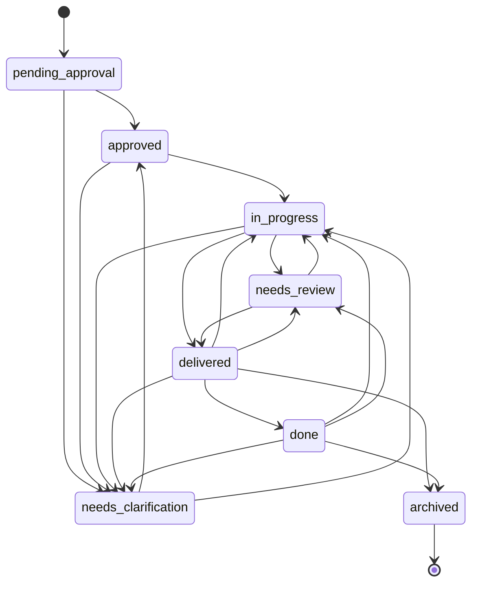

---

### 2.2.3 F-003: Kanban Board

#### Feature Metadata

| Attribute | Value |
|---|---|
| **Feature ID** | F-003 |
| **Feature Name** | Kanban Board |
| **Category** | Task Management |
| **Priority** | Critical |
| **Status** | Completed |

#### Description

**Overview:** The Kanban Board is the primary workspace for the portal, presenting tasks as cards arranged across 6 status columns corresponding to the board-visible statuses: `pending_approval`, `needs_clarification`, `approved`, `in_progress`, `needs_review`, and `delivered`. The hidden terminal statuses (`done`, `archived`) do not appear as columns. The board supports drag-and-drop reordering within and across columns using SortableJS, as documented in `docs/BOARD_REDESIGN_SPEC.md` and implemented in `assets/js/admin-queue.js`.

**Business Value:** Provides the central visual management surface that enables managers to see all active work across clients, prioritize by drag-and-drop, and track workflow progression at a glance.

**User Benefits:**
- **Managers** see all active tasks across clients with priority and due-date indicators, enabling quick reprioritization.
- **Workers** have a clear prioritized queue showing what to work on next.
- **Clients** can track their request status through visible column positions.

**Technical Context:** Task cards display title, short description, priority badge, due date badge, owner avatars, and meeting indicator. Drag-and-drop follows two behavioral patterns: "safe drag" (within same priority band, no dated task displaced — updates queue order only, no email, audit log entry only) and "meaningful drag" (crosses dated task or implies reprioritization — triggers confirmation modal). The reprioritization modal offers four options: reorder only, reorder + raise priority, reorder + swap due dates, or reorder + raise priority + swap due dates. Cancel reverts the drag visually with no data changes. API endpoints `POST /pq/v1/tasks/reorder` and `POST /pq/v1/tasks/move` handle server-side persistence. The board also supports list view and calendar view as switchable alternatives.

#### Dependencies

| Dependency Type | Dependency |
|---|---|
| **Prerequisite Features** | F-001 (Task CRUD), F-002 (Status Workflow) |
| **System Dependencies** | SortableJS library, `assets/js/admin-queue.js` controller |
| **External Dependencies** | None |
| **Integration Requirements** | `queue_position` field on `pq_tasks`, `/pq/v1/tasks/reorder` and `/pq/v1/tasks/move` endpoints |

#### Functional Requirements

| Requirement ID | Description | Priority |
|---|---|---|
| F-003-RQ-001 | Board shall display 6 columns matching board-visible statuses; `done` and `archived` shall be hidden | Must-Have |
| F-003-RQ-002 | Task cards shall display: title, description excerpt, priority badge, due date badge, owner avatars, meeting indicator | Must-Have |
| F-003-RQ-003 | Safe drag (within same priority band) shall update `queue_position` without confirmation modal or email notification | Must-Have |
| F-003-RQ-004 | Meaningful drag (cross-priority or displacing dated task) shall display reprioritization confirmation modal | Must-Have |
| F-003-RQ-005 | Drag cancel shall revert visual position; no server-side data changes shall occur | Must-Have |
| F-003-RQ-006 | Board shall support switchable view modes: Kanban, list, and calendar | Should-Have |

| Requirement ID | Acceptance Criteria | Complexity |
|---|---|---|
| F-003-RQ-001 | Board renders exactly 6 columns; tasks in `done`/`archived` status do not appear | Medium |
| F-003-RQ-002 | Each card shows all 6 data elements; priority badge color matches `low`/`normal`/`high`/`urgent` | Medium |
| F-003-RQ-003 | Drag within `approved` column among same-priority undated tasks persists new order via `/pq/v1/tasks/reorder` | High |
| F-003-RQ-004 | Modal presents 4 options (reorder, +priority, +swap dates, +both); selection persists correct changes | High |
| F-003-RQ-005 | After cancel, card returns to original position; no API calls issued; no audit log entry created | Medium |
| F-003-RQ-006 | View toggle switches between board, list, and calendar without page reload | Medium |

| Requirement ID | Performance Criteria |
|---|---|
| F-003-RQ-001 | Board renders with all columns in < 2 seconds for up to 200 visible tasks |
| F-003-RQ-003 | Drag-and-drop reorder completes (visual + API) in < 200ms |
| F-003-RQ-004 | Modal display latency < 100ms after drag release |

---

## 2.3 Access Control Features

### 2.3.1 F-004: Role-Based Access Control

#### Feature Metadata

| Attribute | Value |
|---|---|
| **Feature ID** | F-004 |
| **Feature Name** | Role-Based Access Control |
| **Category** | Access Control |
| **Priority** | Critical |
| **Status** | Completed |

#### Description

**Overview:** The RBAC system defines 4 user roles with 5 custom WordPress capabilities, enforced at the API level through permission callbacks on every REST route. No access control decision relies on client-side logic alone. The role and capability definitions are implemented in `includes/class-wp-pq-roles.php` (lines 1–45), with enforcement wired through permission callbacks in `includes/class-wp-pq-api.php` and `includes/class-wp-pq-manager-api.php`.

**Business Value:** Enforces the multi-party trust model essential for a client-facing portal — clients must never see other clients' data, workers should only access assigned work, and managers require elevated privileges for approval, assignment, and billing operations.

**User Benefits:**
- **Clients** are guaranteed data isolation — they see only tasks associated with their client account.
- **Workers** see their assigned tasks and can execute work without exposure to billing or client management.
- **Managers** have cross-client visibility and full control over the approval-billing pipeline.
- **Admins** have unrestricted access to all system capabilities and configuration.

**Technical Context:** Four WordPress roles are registered: `pq_client` (`read`, `upload_files`), `pq_worker` (`read`, `upload_files`, `pq_work_tasks`), `pq_manager` (adds `pq_view_all_tasks`, `pq_reorder_all_tasks`, `pq_approve_requests`, `pq_assign_owners`), and `administrator` (all WordPress admin + all 5 PQ capabilities). Client scoping is enforced by matching `client_id` on task queries. All `/manager/*` routes use a `can_manage()` callback requiring the `pq_approve_requests` capability.

#### Roles & Capabilities Matrix

| Role | WordPress Slug | Custom Capabilities |
|---|---|---|
| Client | `pq_client` | `read`, `upload_files` |
| Worker | `pq_worker` | + `pq_work_tasks` |
| Manager | `pq_manager` | + `pq_view_all_tasks`, `pq_reorder_all_tasks`, `pq_approve_requests`, `pq_assign_owners` |
| Admin | `administrator` | All capabilities |

#### Dependencies

| Dependency Type | Dependency |
|---|---|
| **Prerequisite Features** | None (foundational feature) |
| **System Dependencies** | WordPress user and role system, `class-wp-pq-roles.php` |
| **External Dependencies** | WordPress native session/cookie authentication |
| **Integration Requirements** | Permission callbacks on all 50+ REST routes |

#### Functional Requirements

| Requirement ID | Description | Priority |
|---|---|---|
| F-004-RQ-001 | System shall register 4 custom roles with distinct capability sets upon plugin activation | Must-Have |
| F-004-RQ-002 | Every REST endpoint shall include a `permission_callback` that validates the user's capabilities before processing | Must-Have |
| F-004-RQ-003 | Client users shall see only tasks where `client_id` matches their associated client account | Must-Have |
| F-004-RQ-004 | All `/manager/*` routes shall require `pq_approve_requests` capability | Must-Have |
| F-004-RQ-005 | Capability `pq_assign_owners` shall be required for worker assignment operations | Should-Have |

| Requirement ID | Acceptance Criteria | Complexity |
|---|---|---|
| F-004-RQ-001 | After activation, `get_role('pq_manager')` returns role with all 5 PQ capabilities | Low |
| F-004-RQ-002 | Unauthenticated request to any `/pq/v1/*` endpoint returns 401; client accessing manager route returns 403 | Medium |
| F-004-RQ-003 | Client A cannot retrieve tasks belonging to Client B via any API endpoint or parameter manipulation | High |
| F-004-RQ-004 | Worker user calling `/pq/v1/manager/clients` receives 403; manager receives 200 | Medium |
| F-004-RQ-005 | Worker calling assignment endpoint receives 403; manager with `pq_assign_owners` succeeds | Low |

---

## 2.4 Workspace Features

### 2.4.1 F-005: Task Detail Drawer

#### Feature Metadata

| Attribute | Value |
|---|---|
| **Feature ID** | F-005 |
| **Feature Name** | Task Detail Drawer |
| **Category** | Workspace |
| **Priority** | High |
| **Status** | Completed |

#### Description

**Overview:** The Task Detail Drawer is a right-side slide-over panel (not a full-column replacement) that opens when a task card is clicked on the Kanban board. It provides the complete task context including full description, status action buttons, assignment controls, and a tabbed workspace with six tabs: Messages, Notes (sticky notes), Files, Meetings, Activity (audit history), and Billing. Implemented in the frontend via `assets/js/admin-queue.js` and `includes/class-wp-pq-portal.php`.

**Business Value:** Centralizes all task-related actions and information in a single view, eliminating the need to navigate between separate pages for communication, file exchange, status updates, and billing review.

**User Benefits:**
- Users access all task interactions (messaging, file uploads, status changes, billing review) without leaving the board context.
- Audit history tab provides full traceability of all changes.
- Billing tab gives managers immediate access to work ledger data for completed tasks.

**Technical Context:** The drawer loads task data via the GET `/pq/v1/tasks/{id}` endpoint and populates tabs dynamically from their respective API endpoints (messages, notes, files, meetings). Status action buttons reflect the valid transitions from F-002 (Status Workflow Engine) for the current user's role. The assignment panel is visible only to users with `pq_assign_owners` capability.

#### Dependencies

| Dependency Type | Dependency |
|---|---|
| **Prerequisite Features** | F-001 (Task CRUD), F-002 (Workflow), F-004 (RBAC) |
| **System Dependencies** | `assets/js/admin-queue.js`, `class-wp-pq-portal.php` |
| **External Dependencies** | None |
| **Integration Requirements** | Consumes F-007 (Messaging), F-008 (Files), F-009 (Notes), F-010 (Meetings) tab content |

#### Functional Requirements

| Requirement ID | Description | Priority |
|---|---|---|
| F-005-RQ-001 | Clicking a task card on the board shall open the detail drawer as a right-side slide-over panel | Must-Have |
| F-005-RQ-002 | Drawer shall display 6 tabs: Messages, Notes, Files, Meetings, Activity, Billing | Must-Have |
| F-005-RQ-003 | Status action buttons shall reflect only valid transitions for the current user's role | Must-Have |
| F-005-RQ-004 | Assignment panel shall be visible only to users with `pq_assign_owners` capability | Should-Have |

| Requirement ID | Acceptance Criteria | Complexity |
|---|---|---|
| F-005-RQ-001 | Drawer slides in from right; board remains partially visible; drawer closes on outside click or close button | Medium |
| F-005-RQ-002 | All 6 tabs render correctly; switching tabs loads relevant data via API | Medium |
| F-005-RQ-003 | Worker sees only worker-permitted transitions; client sees no status buttons on approved tasks | High |
| F-005-RQ-004 | Client user opening drawer does not see assignment panel; manager sees assignable worker list | Medium |

---

### 2.4.2 F-006: Calendar View

#### Feature Metadata

| Attribute | Value |
|---|---|
| **Feature ID** | F-006 |
| **Feature Name** | Calendar View |
| **Category** | Workspace |
| **Priority** | Medium |
| **Status** | Completed |

#### Description

**Overview:** The Calendar View presents tasks and meetings on a visual calendar powered by the FullCalendar JavaScript library. It combines three data sources: task deadlines (from `due_at` and `requested_deadline` fields), internal meeting records (from `pq_task_meetings`), and Google Calendar events (when OAuth is connected). The view is accessible as a switchable mode from the Kanban board. API support is provided via `GET /pq/v1/calendar/events` and `POST /pq/v1/calendar/webhook` endpoints registered in `includes/class-wp-pq-api.php` (lines 192–227).

**Business Value:** Enables managers and workers to visualize scheduling constraints, identify deadline conflicts, and coordinate meeting availability alongside task work.

**User Benefits:** Users can see all deadlines and meetings in a unified calendar, preventing scheduling conflicts and providing a time-based alternative to the status-based Kanban view.

#### Dependencies

| Dependency Type | Dependency |
|---|---|
| **Prerequisite Features** | F-001 (Task CRUD), F-010 (Meeting Scheduling) |
| **System Dependencies** | FullCalendar JS library |
| **External Dependencies** | Google Calendar API (optional, for external events) |
| **Integration Requirements** | `/pq/v1/calendar/events` endpoint, Google OAuth connection |

#### Functional Requirements

| Requirement ID | Description | Priority |
|---|---|---|
| F-006-RQ-001 | System shall render a calendar view combining task deadlines, internal meetings, and Google Calendar events | Must-Have |
| F-006-RQ-002 | Calendar shall be accessible as a switchable view mode from the board interface | Should-Have |
| F-006-RQ-003 | Calendar events shall respect role-based task visibility (clients see only their tasks' deadlines) | Must-Have |

| Requirement ID | Acceptance Criteria | Complexity |
|---|---|---|
| F-006-RQ-001 | Calendar shows events from all 3 sources with distinguishable visual styling | Medium |
| F-006-RQ-002 | View toggle in board header switches to calendar without page reload | Low |
| F-006-RQ-003 | Client user sees only deadlines for their own tasks; manager sees all | Medium |

---

## 2.5 Collaboration Features

### 2.5.1 F-007: Task Messaging

#### Feature Metadata

| Attribute | Value |
|---|---|
| **Feature ID** | F-007 |
| **Feature Name** | Task Messaging |
| **Category** | Collaboration |
| **Priority** | High |
| **Status** | Completed |

#### Description

**Overview:** Task Messaging provides scoped conversational threads within each task, displayed in the Messages tab of the Task Detail Drawer. Messages support @mentions for direct user notification. The feature is backed by the `pq_task_messages` table (defined in `includes/class-wp-pq-db.php`, lines 166–174) and exposed via `GET/POST /pq/v1/tasks/{id}/messages` endpoints (registered in `includes/class-wp-pq-api.php`, lines 134–146).

**Business Value:** Replaces email and Slack threads as the communication channel for task-related discussions, creating an auditable record tied directly to the work item.

**User Benefits:** All parties (clients, workers, managers) communicate in context. @mentions trigger targeted notifications, ensuring important messages are not missed.

**Technical Context:** Message schema: `task_id`, `author_id`, `body`, `created_at`. Messages are distinct from sticky notes (F-009), which serve as non-conversational reference material. The `task_mentioned` event key triggers notification delivery when @mentions are detected.

#### Dependencies

| Dependency Type | Dependency |
|---|---|
| **Prerequisite Features** | F-001 (Task CRUD), F-005 (Task Detail Drawer) |
| **System Dependencies** | `pq_task_messages` table |
| **External Dependencies** | None |
| **Integration Requirements** | F-017 (Notifications) for @mention delivery |

#### Functional Requirements

| Requirement ID | Description | Priority |
|---|---|---|
| F-007-RQ-001 | System shall store and retrieve task-scoped messages with author attribution and timestamps | Must-Have |
| F-007-RQ-002 | Messages shall support @mentions that trigger `task_mentioned` notification event | Must-Have |
| F-007-RQ-003 | Message access shall be restricted to users who can access the parent task | Must-Have |

| Requirement ID | Acceptance Criteria | Complexity |
|---|---|---|
| F-007-RQ-001 | POST message returns 201; GET messages returns chronological list with author display names | Low |
| F-007-RQ-002 | @mention in body triggers notification to mentioned user; notification links to task | Medium |
| F-007-RQ-003 | Client A cannot retrieve messages for Client B's tasks | Medium |

---

### 2.5.2 F-008: File Exchange & Versioning

#### Feature Metadata

| Attribute | Value |
|---|---|
| **Feature ID** | F-008 |
| **Feature Name** | File Exchange & Versioning |
| **Category** | Collaboration |
| **Priority** | High |
| **Status** | Completed |

#### Description

**Overview:** File Exchange enables task-scoped file uploads, downloads, and deletion with built-in version tracking. The file system supports version limits (last 3 versions retained, configurable via `wp_pq_file_version_limit`), role-based file designations (`file_role`, default: `input`), and retention tracking (365 days with configurable reminder). Implemented via the `pq_task_files` table (`includes/class-wp-pq-db.php`, lines 151–164) and endpoints `GET/POST/DELETE /pq/v1/tasks/{id}/files` (`includes/class-wp-pq-api.php`, lines 166–178). Frontend uploads use the Uppy JavaScript library.

**Business Value:** Provides a structured alternative to email-based file exchange, ensuring deliverables and reference materials are version-tracked and tied to specific tasks.

**User Benefits:** Clients upload reference files when submitting requests; workers upload deliverables. All parties access a versioned file history within the task context, eliminating "which version?" confusion.

**Technical Context:** File schema: `task_id`, `uploader_id`, `media_id` (WordPress media library reference), `file_role`, `version_num` (default: 1), `storage_expires_at`, `created_at`. Maximum upload size is 1024 MB (configurable via `wp_pq_max_upload_mb`).

#### Dependencies

| Dependency Type | Dependency |
|---|---|
| **Prerequisite Features** | F-001 (Task CRUD), F-004 (RBAC) |
| **System Dependencies** | WordPress Media Library, Uppy JS library, `pq_task_files` table |
| **External Dependencies** | None (local WordPress media storage) |
| **Integration Requirements** | F-022 (File Retention System) for lifecycle management |

#### Functional Requirements

| Requirement ID | Description | Priority |
|---|---|---|
| F-008-RQ-001 | System shall upload files to task scope with version tracking (auto-increment `version_num`) | Must-Have |
| F-008-RQ-002 | System shall retain only the last 3 versions per file role, purging older versions | Must-Have |
| F-008-RQ-003 | Maximum upload size shall default to 1024 MB (configurable via `wp_pq_max_upload_mb`) | Should-Have |
| F-008-RQ-004 | File deletion shall be restricted to users with appropriate role-based permissions | Must-Have |

| Requirement ID | Acceptance Criteria | Complexity |
|---|---|---|
| F-008-RQ-001 | Uploading a second file with same role increments `version_num` to 2; both versions retrievable | Medium |
| F-008-RQ-002 | After 4th upload of same role, version 1 is purged; only versions 2, 3, 4 remain | Medium |
| F-008-RQ-003 | Upload of file exceeding configured limit returns 413 or validation error | Low |
| F-008-RQ-004 | Client cannot delete files on another client's task; appropriate role can delete own task files | Medium |

---

### 2.5.3 F-009: Sticky Notes

#### Feature Metadata

| Attribute | Value |
|---|---|
| **Feature ID** | F-009 |
| **Feature Name** | Sticky Notes |
| **Category** | Collaboration |
| **Priority** | Low |
| **Status** | Completed |

#### Description

**Overview:** Sticky Notes provide non-conversational reference material that is pinned to a task, distinct from the threaded message conversation. They appear in the Notes tab of the Task Detail Drawer. Backed by the `pq_task_comments` table (`includes/class-wp-pq-db.php`, lines 176–184) and exposed via `GET/POST /pq/v1/tasks/{id}/notes` endpoints (`includes/class-wp-pq-api.php`, lines 147–159).

**Business Value:** Allows users to capture persistent reference information (design requirements, brand guidelines, technical notes) that should not be buried in a conversational thread.

**Technical Context:** Schema: `task_id`, `author_id`, `body`, `created_at`. Architecturally separate from messages to maintain distinct UI and behavioral patterns.

#### Dependencies

| Dependency Type | Dependency |
|---|---|
| **Prerequisite Features** | F-001 (Task CRUD), F-005 (Task Detail Drawer) |
| **System Dependencies** | `pq_task_comments` table |
| **External Dependencies** | None |

#### Functional Requirements

| Requirement ID | Description | Priority |
|---|---|---|
| F-009-RQ-001 | System shall store and retrieve sticky notes scoped to a task, separate from messages | Must-Have |
| F-009-RQ-002 | Notes shall be accessible in the Notes tab of the Task Detail Drawer | Should-Have |

| Requirement ID | Acceptance Criteria | Complexity |
|---|---|---|
| F-009-RQ-001 | POST to `/pq/v1/tasks/{id}/notes` creates note; GET returns notes list distinct from messages | Low |
| F-009-RQ-002 | Notes tab displays all notes with author and timestamp; does not show messages | Low |

---

### 2.5.4 F-010: Meeting Scheduling

#### Feature Metadata

| Attribute | Value |
|---|---|
| **Feature ID** | F-010 |
| **Feature Name** | Meeting Scheduling |
| **Category** | Collaboration |
| **Priority** | Medium |
| **Status** | Completed |

#### Description

**Overview:** Meeting Scheduling enables users to create, view, and delete meeting records associated with specific tasks, with optional two-way synchronization to Google Calendar/Meet. Meetings are stored in `pq_task_meetings` (`includes/class-wp-pq-db.php`, lines 186–200). REST endpoints include `GET/POST/DELETE /pq/v1/tasks/{id}/meetings` and Google OAuth endpoints at `/pq/v1/google/oauth/*` (`includes/class-wp-pq-api.php`, lines 179–227). A `needs_meeting` flag on the `pq_tasks` table allows clients to indicate meeting requests at task creation.

**Business Value:** Integrates meeting coordination directly into the task workflow, eliminating back-and-forth scheduling emails. Google Calendar sync ensures meetings appear in participants' calendars automatically.

**Technical Context:** Meeting schema: `task_id`, `provider` (default: `google`), `event_id`, `meeting_url`, `starts_at`, `ends_at`, `sync_direction` (default: `two_way`). Google OAuth configuration uses `wp_pq_google_client_id`, `wp_pq_google_client_secret`, and `wp_pq_google_redirect_uri` with scopes `calendar.events` and `calendar.readonly`. Webhook endpoint at `POST /pq/v1/calendar/webhook` receives external calendar change notifications.

#### Dependencies

| Dependency Type | Dependency |
|---|---|
| **Prerequisite Features** | F-001 (Task CRUD), F-004 (RBAC) |
| **System Dependencies** | `pq_task_meetings` table, `pq_tasks.needs_meeting` flag |
| **External Dependencies** | Google Calendar/Meet API via OAuth 2.0 |
| **Integration Requirements** | Google OAuth config options, F-006 (Calendar View) |

#### Functional Requirements

| Requirement ID | Description | Priority |
|---|---|---|
| F-010-RQ-001 | System shall create task-scoped meeting records with start/end times and optional Google Calendar sync | Must-Have |
| F-010-RQ-002 | System shall support Google OAuth 2.0 flow for Calendar/Meet authorization | Must-Have |
| F-010-RQ-003 | `needs_meeting` flag on task creation shall indicate client meeting request | Should-Have |
| F-010-RQ-004 | System shall support two-way sync and receive webhook notifications from Google Calendar | Could-Have |

| Requirement ID | Acceptance Criteria | Complexity |
|---|---|---|
| F-010-RQ-001 | POST meeting returns 201 with `meeting_url`; meeting appears in task detail Meetings tab | Medium |
| F-010-RQ-002 | OAuth URL endpoint returns redirect URL; callback stores tokens; status endpoint confirms connection | High |
| F-010-RQ-003 | Task created with `needs_meeting=1` is visually indicated on board and in task detail | Low |
| F-010-RQ-004 | Webhook processes inbound changes; meeting record updates reflect external calendar edits | High |

---

## 2.6 Billing Pipeline Features

### 2.6.1 F-011: Work Ledger

#### Feature Metadata

| Attribute | Value |
|---|---|
| **Feature ID** | F-011 |
| **Feature Name** | Work Ledger |
| **Category** | Billing Pipeline |
| **Priority** | Medium |
| **Status** | Completed |

#### Description

**Overview:** The Work Ledger is the immutable billing record created atomically when a task transitions to "done." It captures a snapshot of the task's billing details at the moment of completion, ensuring billing accuracy and preventing retroactive modification of invoiced records. Defined in the `pq_work_ledger_entries` table (`includes/class-wp-pq-db.php`, lines 347–375) and documented in `docs/WORKFLOW_LEDGER_REFACTOR_SPEC.md`.

**Business Value:** Eliminates retroactive time-tracking guesswork by capturing billing data at the point of delivery. The mandatory completion modal ensures no task reaches "done" status without billing details, creating a complete and accurate billing record for every deliverable.

**User Benefits:**
- **Managers** have confidence that every completed task has captured billing data, enabling accurate statement generation.
- No unbilled delivered work — the system enforces billing capture as a mandatory step.

**Technical Context:** Ledger entry schema includes: `task_id` (UNIQUE), `client_id`, `billing_bucket_id`, `title_snapshot`, `work_summary`, `owner_id`, `completion_date`, `billable`, `billing_mode` (`hourly`, `fixed_fee`, `pass_through_expense`, `non_billable`), `billing_category`, `is_closed` (default: 1), `invoice_status` (default: `unbilled`), `statement_month`, `hours`, `rate`, `amount`. Critically, once a ledger entry's `invoice_status` is set to `invoiced` or `paid`, it cannot be reopened — a follow-up task (linked via `source_task_id`) must be created instead. The API endpoints `POST /pq/v1/tasks/{id}/done` and `POST /pq/v1/tasks/{id}/reopen-completed` (manager only) control ledger lifecycle.

#### Dependencies

| Dependency Type | Dependency |
|---|---|
| **Prerequisite Features** | F-001 (Task CRUD), F-002 (Workflow — "done" transition) |
| **System Dependencies** | `pq_work_ledger_entries` table, `class-wp-pq-manager-api.php` |
| **External Dependencies** | None |
| **Integration Requirements** | F-012 (Work Statements), F-013 (Invoice Drafts) |

#### Functional Requirements

| Requirement ID | Description | Priority |
|---|---|---|
| F-011-RQ-001 | System shall create a ledger entry atomically when a task transitions to "done" status | Must-Have |
| F-011-RQ-002 | Completion modal shall require billing details (mode, hours, rate, amount) before allowing "done" transition | Must-Have |
| F-011-RQ-003 | Ledger entries with `invoice_status` of `invoiced` or `paid` shall not be reopenable | Must-Have |
| F-011-RQ-004 | Follow-up tasks for invoiced/paid entries shall be creatable via `POST /pq/v1/tasks/{id}/followup` | Should-Have |
| F-011-RQ-005 | Ledger entries shall support four billing modes: `hourly`, `fixed_fee`, `pass_through_expense`, `non_billable` | Must-Have |

| Requirement ID | Acceptance Criteria | Complexity |
|---|---|---|
| F-011-RQ-001 | After "done" transition, `pq_work_ledger_entries` contains row with matching `task_id`; entry has `is_closed=1` | High |
| F-011-RQ-002 | Attempt to mark task "done" without billing details returns validation error; modal enforces required fields | High |
| F-011-RQ-003 | Reopen request on `invoiced` entry returns 422; follow-up task endpoint is offered as alternative | Medium |
| F-011-RQ-004 | Follow-up task is created with `source_task_id` referencing original; original remains closed | Medium |
| F-011-RQ-005 | Ledger entry for hourly task captures `hours`, `rate`, calculated `amount`; fixed-fee captures `amount` only | Medium |

| Requirement ID | Business & Security Rules |
|---|---|
| F-011-RQ-001 | Ledger creation is transactional — if entry creation fails, status does not change to "done" |
| F-011-RQ-002 | Billing data loss has zero tolerance (per KPI requirements) |
| F-011-RQ-003 | Immutability enforced at API level; no direct database manipulation path exists in the application layer |
| F-011-RQ-004 | Only managers can initiate reopen or follow-up operations |

---

### 2.6.2 F-012: Work Statements

#### Feature Metadata

| Attribute | Value |
|---|---|
| **Feature ID** | F-012 |
| **Feature Name** | Work Statements |
| **Category** | Billing Pipeline |
| **Priority** | Medium |
| **Status** | Completed |

#### Description

**Overview:** Work Statements aggregate completed work into client-facing billing documents with first-class line items. Statements are not simple task roll-ups — line items are independent entities that may be initialized from tasks but are never re-derived afterward. Implemented across the `pq_statements`, `pq_statement_items`, and `pq_statement_lines` tables (`includes/class-wp-pq-db.php`) with full CRUD via `includes/class-wp-pq-manager-api.php` (lines 122–184).

**Business Value:** Enables managers to produce professional billing documents directly from completed work records, with the flexibility to add manual adjustments, group by job, and customize line items before client delivery.

**Technical Context:** Statement schema includes `statement_code` (UNIQUE), `statement_month`, `client_id`, `billing_bucket_id`, `range_start`, `range_end`, `currency_code`, `total_amount`, `due_date`, `payment_status` (default: `unpaid`). Statement lines are first-class, with fields for `line_type` (default: `manual_adjustment`), `source_kind` (default: `manual`), `description`, `quantity`, `unit`, `unit_rate`, `line_amount`, `sort_order`. Totals derive exclusively from line items. Manager API endpoints cover GET/POST/PUT/DELETE for statements and lines, payment status updates, batch creation (`POST /pq/v1/statements/batch`), and email delivery (`POST /pq/v1/manager/statements/{id}/email-client`).

#### Dependencies

| Dependency Type | Dependency |
|---|---|
| **Prerequisite Features** | F-011 (Work Ledger), F-015 (Client Management) |
| **System Dependencies** | `pq_statements`, `pq_statement_items`, `pq_statement_lines` tables |
| **External Dependencies** | SMTP for email delivery to client |
| **Integration Requirements** | F-013 (Invoice Drafts) for downstream export |

#### Functional Requirements

| Requirement ID | Description | Priority |
|---|---|---|
| F-012-RQ-001 | System shall create statements with client scope, date range, and billing bucket association | Must-Have |
| F-012-RQ-002 | Statement totals shall derive exclusively from line items; no separate total field shall override line-item sum | Must-Have |
| F-012-RQ-003 | Line items shall be first-class entities supporting manual adjustments independent of task data | Must-Have |
| F-012-RQ-004 | System shall support batch statement creation across multiple clients | Should-Have |
| F-012-RQ-005 | System shall support email delivery of statements to client contacts | Should-Have |
| F-012-RQ-006 | System shall support PDF/print output of finalized statements | Should-Have |

| Requirement ID | Acceptance Criteria | Complexity |
|---|---|---|
| F-012-RQ-001 | POST creates statement; GET returns statement with all line items populated | Medium |
| F-012-RQ-002 | Modifying a line item's `line_amount` recalculates `total_amount`; no direct total override accepted | Medium |
| F-012-RQ-003 | Manual adjustment line (no linked task) can be created; statement reflects adjustment in total | Medium |
| F-012-RQ-004 | Batch endpoint creates statements for multiple clients in single request; each statement independent | High |
| F-012-RQ-005 | Email endpoint sends statement to client's primary contact; email contains statement details | Medium |
| F-012-RQ-006 | Print/PDF output renders statement with header, line items, and total amount | Medium |

---

### 2.6.3 F-013: Invoice Drafts

#### Feature Metadata

| Attribute | Value |
|---|---|
| **Feature ID** | F-013 |
| **Feature Name** | Invoice Drafts |
| **Category** | Billing Pipeline |
| **Priority** | Medium |
| **Status** | Completed |

#### Description

**Overview:** Invoice Drafts represent the terminal output of the portal's billing pipeline. A critical architectural boundary — documented in `docs/DEVELOPER_HANDOFF_2026-03-21.md` and enforced by the data model — is that the portal generates invoice **drafts** only. It is explicitly not the system of record for issued invoices. Final invoices are issued and tracked in downstream accounting systems (Wave, QuickBooks). The draft serves as the structured data export that feeds the accounting workflow.

**Business Value:** Bridges the gap between task completion and formal invoicing without requiring the portal to implement full accounting functionality. Managers can review and adjust drafts before manual export to their accounting system of choice.

**Technical Context:** Invoice draft data derives from work statements (F-012). The `invoice_draft_id` field on ledger entries links completed work to draft records. The `payment_status` field on statements tracks the lifecycle (`unpaid` → `paid`). Export is manual, not automated, reflecting the explicit exclusion of full accounting from scope.

#### Dependencies

| Dependency Type | Dependency |
|---|---|
| **Prerequisite Features** | F-011 (Work Ledger), F-012 (Work Statements) |
| **System Dependencies** | `pq_statements.payment_status`, `pq_work_ledger_entries.invoice_draft_id` |
| **External Dependencies** | Downstream accounting systems (Wave, QuickBooks) |
| **Integration Requirements** | Manual export workflow |

#### Functional Requirements

| Requirement ID | Description | Priority |
|---|---|---|
| F-013-RQ-001 | System shall generate invoice drafts from finalized work statements | Must-Have |
| F-013-RQ-002 | System shall track payment status on statements (`unpaid`, `paid`) | Must-Have |
| F-013-RQ-003 | Invoice drafts shall be exportable for import into downstream accounting systems | Should-Have |

| Requirement ID | Acceptance Criteria | Complexity |
|---|---|---|
| F-013-RQ-001 | Invoice draft includes all line items from source statement; amounts match | Medium |
| F-013-RQ-002 | Payment status update persists; `paid_at` and `paid_by` fields populated on payment recording | Low |
| F-013-RQ-003 | Draft data is downloadable or exportable in a format compatible with Wave/QuickBooks | Medium |

---

### 2.6.4 F-014: Work Reporting

#### Feature Metadata

| Attribute | Value |
|---|---|
| **Feature ID** | F-014 |
| **Feature Name** | Work Reporting (Logs & Rollup) |
| **Category** | Billing Pipeline |
| **Priority** | Medium |
| **Status** | Completed |

#### Description

**Overview:** Work Reporting encompasses two complementary capabilities: Work Logs and Billing Rollups. Work Logs capture point-in-time snapshots of task data for record-keeping, stored in `pq_work_logs` and `pq_work_log_items` tables (`includes/class-wp-pq-db.php`, lines 309–345). Billing Rollups aggregate billing data by date range and support assignment of completed work to jobs. Both are manager-only features exposed via `includes/class-wp-pq-manager-api.php`.

**Technical Context:** Work log schema includes `work_log_code` (UNIQUE), `client_id`, `billing_bucket_id`, `range_start`, `range_end`, `snapshot_filters`. Work log items capture task state at snapshot time. Rollup endpoints at `GET /pq/v1/manager/rollups` and `POST /pq/v1/manager/rollups/assign-job` provide aggregation and job assignment.

#### Dependencies

| Dependency Type | Dependency |
|---|---|
| **Prerequisite Features** | F-001 (Task CRUD), F-015 (Clients), F-016 (Jobs) |
| **System Dependencies** | `pq_work_logs`, `pq_work_log_items` tables |
| **External Dependencies** | None |

#### Functional Requirements

| Requirement ID | Description | Priority |
|---|---|---|
| F-014-RQ-001 | System shall create work logs with client/job scope and date range filtering | Must-Have |
| F-014-RQ-002 | Work log items shall capture a snapshot of task state at log creation time | Must-Have |
| F-014-RQ-003 | Billing rollups shall aggregate completed work data by date range | Should-Have |
| F-014-RQ-004 | System shall support assigning completed work to specific jobs via rollup | Should-Have |

| Requirement ID | Acceptance Criteria | Complexity |
|---|---|---|
| F-014-RQ-001 | GET `/pq/v1/manager/work-logs/preview` returns filterable preview; POST creates log | Medium |
| F-014-RQ-002 | Work log items contain `task_title`, `task_status`, `task_billing_status` at snapshot time | Medium |
| F-014-RQ-003 | Rollup endpoint returns aggregated billing totals for specified date range | Medium |
| F-014-RQ-004 | `POST /pq/v1/manager/rollups/assign-job` links tasks to billing bucket | Medium |

---

## 2.7 Client Management Features

### 2.7.1 F-015: Client Account Management

#### Feature Metadata

| Attribute | Value |
|---|---|
| **Feature ID** | F-015 |
| **Feature Name** | Client Account Management |
| **Category** | Client Management |
| **Priority** | Medium |
| **Status** | Completed |

#### Description

**Overview:** Client Account Management provides the organizational structure for grouping users, tasks, and billing data by client. Client accounts are stored in `pq_clients` (`includes/class-wp-pq-db.php`, lines 40–51) with a many-to-many user membership model via `pq_client_members` (lines 53–65). All client management is restricted to managers via the `/manager/*` API namespace.

**Business Value:** Enables agencies serving multiple clients to maintain clear data boundaries, ensuring each client's tasks, billing, and communications are properly scoped and accessible only to authorized parties.

**Technical Context:** Client schema: `name`, `slug` (UNIQUE), `primary_contact_user_id`, `created_by`. Client members schema: `client_id`, `user_id`, `role` (default: `client_contributor`), with UNIQUE constraint on `(client_id, user_id)`. API endpoints: `GET/POST /pq/v1/manager/clients`, `GET/PUT /pq/v1/manager/clients/{id}`, `POST /pq/v1/manager/clients/{id}/members`.

#### Dependencies

| Dependency Type | Dependency |
|---|---|
| **Prerequisite Features** | F-004 (RBAC) |
| **System Dependencies** | `pq_clients`, `pq_client_members` tables |
| **External Dependencies** | None |
| **Integration Requirements** | F-001 (tasks scoped by `client_id`), F-012 (statements scoped by client) |

#### Functional Requirements

| Requirement ID | Description | Priority |
|---|---|---|
| F-015-RQ-001 | System shall support creating client accounts with name, slug, and primary contact | Must-Have |
| F-015-RQ-002 | System shall support adding/removing user memberships to client accounts | Must-Have |
| F-015-RQ-003 | Client data (tasks, billing, files) shall be scoped by `client_id` across all features | Must-Have |
| F-015-RQ-004 | Client management operations shall be restricted to users with `pq_approve_requests` capability | Must-Have |

| Requirement ID | Acceptance Criteria | Complexity |
|---|---|---|
| F-015-RQ-001 | POST creates client; slug is unique; GET returns client with member list | Low |
| F-015-RQ-002 | Adding member creates `pq_client_members` row; removing deletes it; duplicate add returns error | Medium |
| F-015-RQ-003 | All task, billing, and file queries filter by `client_id`; cross-client data leakage is impossible | High |
| F-015-RQ-004 | Worker calling client management endpoint receives 403 | Low |

---

### 2.7.2 F-016: Jobs (Billing Buckets)

#### Feature Metadata

| Attribute | Value |
|---|---|
| **Feature ID** | F-016 |
| **Feature Name** | Jobs (Billing Buckets) |
| **Category** | Client Management |
| **Priority** | Medium |
| **Status** | Completed |

#### Description

**Overview:** Jobs (referred to as "billing buckets" in the backend) provide a sub-client organizational unit for grouping related tasks and billing. Each job belongs to a client and can have worker members assigned. Stored in `pq_billing_buckets` (`includes/class-wp-pq-db.php`, lines 231–246) with job-worker membership in `pq_job_members` (lines 67–77). The UI term "Job" maps to the backend entity `billing_bucket_id` as documented in `docs/WORKFLOW_LEDGER_REFACTOR_SPEC.md` (lines 72–73).

**Business Value:** Enables agencies to organize work by project, retainer, or campaign within a client account, facilitating accurate billing categorization and reporting.

**Technical Context:** Bucket schema: `client_id`, `client_user_id`, `bucket_name`, `bucket_slug`, `description`, `is_default`, `created_by`; UNIQUE on `(client_user_id, bucket_slug)`. Job members schema: `billing_bucket_id`, `user_id`; UNIQUE on `(billing_bucket_id, user_id)`. API endpoints: `POST /pq/v1/manager/jobs`, `DELETE /pq/v1/manager/jobs/{id}`, `POST/DELETE /pq/v1/manager/jobs/{id}/members`.

#### Dependencies

| Dependency Type | Dependency |
|---|---|
| **Prerequisite Features** | F-015 (Client Account Management) |
| **System Dependencies** | `pq_billing_buckets`, `pq_job_members` tables |
| **External Dependencies** | None |
| **Integration Requirements** | F-001 (`billing_bucket_id` on tasks), F-011 (ledger entries scoped by bucket) |

#### Functional Requirements

| Requirement ID | Description | Priority |
|---|---|---|
| F-016-RQ-001 | System shall create jobs within a client scope with name, slug, and default flag | Must-Have |
| F-016-RQ-002 | System shall support worker membership assignment to jobs | Should-Have |
| F-016-RQ-003 | Tasks and ledger entries shall be associable with a specific job via `billing_bucket_id` | Must-Have |

| Requirement ID | Acceptance Criteria | Complexity |
|---|---|---|
| F-016-RQ-001 | POST creates job; slug unique within client; `is_default` flag identifies primary bucket | Low |
| F-016-RQ-002 | Adding worker to job creates `pq_job_members` row; removing deletes it | Low |
| F-016-RQ-003 | Task creation and ledger entry reference `billing_bucket_id`; statements can filter by job | Medium |

---

## 2.8 Notification Features

### 2.8.1 F-017: Notification Delivery

#### Feature Metadata

| Attribute | Value |
|---|---|
| **Feature ID** | F-017 |
| **Feature Name** | Notification Delivery (In-App & Email) |
| **Category** | Notifications |
| **Priority** | High |
| **Status** | Completed |

#### Description

**Overview:** The Notification Delivery system provides dual-channel notification (in-app and email) for 14 defined event types spanning task lifecycle, assignment, collaboration, and billing activities. In-app notifications are stored in `pq_notifications` (`includes/class-wp-pq-db.php`, lines 213–229) and polled every 30 seconds via `assets/js/admin-queue-alerts.js`. Email notifications are dispatched via `wp_mail()` through the `includes/class-wp-pq-housekeeping.php` system. The 14 event keys are defined in `includes/class-wp-pq-workflow.php` (lines 123–141).

**Business Value:** Keeps all parties informed of relevant changes without manual follow-up, enabling asynchronous collaboration while ensuring time-sensitive actions (approvals, deliveries) are promptly noticed.

**Technical Context:** Notification schema: `user_id`, `task_id`, `event_key`, `title`, `body`, `payload` (LONGTEXT), `is_read` (default: 0), `created_at`, `read_at`. API endpoints: `GET /pq/v1/notifications` (retrieve), `POST /pq/v1/notifications/mark-read` (mark as read). In-app features include alert cards with categorized groups, auto-dismissal, restricted-view handling, and shortcut actions to jump into tasks.

**Supported Event Types:**

| Event Key | Trigger |
|---|---|
| `task_created` | New task submitted |
| `task_assigned` | Worker assigned to task |
| `task_approved` | Task approved by manager |
| `task_clarification_requested` | Clarification needed |
| `task_mentioned` | @mention in message |
| `task_reprioritized` | Priority changed |
| `task_schedule_changed` | Due date modified |
| `task_returned_to_work` | Task returned to active work |
| `task_delivered` | Deliverables submitted |
| `task_archived` | Task archived |
| `statement_batched` | Statement batch created |
| `client_status_updates` | Client-facing status change |
| `client_daily_digest` | Daily summary (see F-019) |
| `retention_day_300` | File retention warning |

#### Dependencies

| Dependency Type | Dependency |
|---|---|
| **Prerequisite Features** | F-002 (Status Workflow — event source) |
| **System Dependencies** | `pq_notifications` table, `wp_mail()`, `admin-queue-alerts.js` |
| **External Dependencies** | SMTP / WordPress mail for email delivery |
| **Integration Requirements** | F-018 (Preferences) for per-user filtering |

#### Functional Requirements

| Requirement ID | Description | Priority |
|---|---|---|
| F-017-RQ-001 | System shall create notification records for all 14 event types with appropriate recipients | Must-Have |
| F-017-RQ-002 | In-app notifications shall be polled at 30-second intervals and displayed as alert cards | Must-Have |
| F-017-RQ-003 | Email notifications shall be dispatched via `wp_mail()` for enabled event types | Must-Have |
| F-017-RQ-004 | Notification alert cards shall include shortcut actions to navigate directly to relevant task | Should-Have |
| F-017-RQ-005 | System shall support bulk mark-as-read via `POST /pq/v1/notifications/mark-read` | Should-Have |

| Requirement ID | Acceptance Criteria | Complexity |
|---|---|---|
| F-017-RQ-001 | Status change to `approved` creates notification with `event_key=task_approved` for task submitter | Medium |
| F-017-RQ-002 | Alert controller polls `/pq/v1/notifications` every 30s; new notifications appear without page refresh | Medium |
| F-017-RQ-003 | Email sent to user's registered email for enabled events; email contains task context | Medium |
| F-017-RQ-004 | Clicking notification alert opens corresponding task in Task Detail Drawer | Medium |
| F-017-RQ-005 | After mark-read, `is_read=1` and `read_at` timestamp set; alert disappears from inbox | Low |

---

### 2.8.2 F-018: Notification Preferences

#### Feature Metadata

| Attribute | Value |
|---|---|
| **Feature ID** | F-018 |
| **Feature Name** | Notification Preferences |
| **Category** | Notifications |
| **Priority** | Low |
| **Status** | Completed |

#### Description

**Overview:** Notification Preferences allow per-user, per-event-type control over notification delivery. Stored in `pq_notification_prefs` (`includes/class-wp-pq-db.php`, lines 202–211) and managed via `GET/PUT /pq/v1/notification-prefs` endpoints. All events are enabled by default unless explicitly disabled.

**Technical Context:** Preference schema: `user_id`, `event_key`, `is_enabled` (TINYINT, default: 1); UNIQUE on `(user_id, event_key)`. Default-enabled behavior is enforced in `includes/class-wp-pq-housekeeping.php` (lines 124–128).

#### Dependencies

| Dependency Type | Dependency |
|---|---|
| **Prerequisite Features** | F-017 (Notification Delivery) |
| **System Dependencies** | `pq_notification_prefs` table |

#### Functional Requirements

| Requirement ID | Description | Priority |
|---|---|---|
| F-018-RQ-001 | System shall provide per-user, per-event-type enable/disable controls | Must-Have |
| F-018-RQ-002 | All event types shall be enabled by default for new users | Must-Have |
| F-018-RQ-003 | Disabled preferences shall suppress both in-app and email notifications for the specified event | Should-Have |

| Requirement ID | Acceptance Criteria | Complexity |
|---|---|---|
| F-018-RQ-001 | PUT endpoint updates preference; GET returns full preference matrix for user | Low |
| F-018-RQ-002 | New user with no preference rows receives all 14 event types | Low |
| F-018-RQ-003 | User disables `task_delivered`; no notification created or email sent on delivery events for that user | Medium |

---

### 2.8.3 F-019: Daily Digest Emails

#### Feature Metadata

| Attribute | Value |
|---|---|
| **Feature ID** | F-019 |
| **Feature Name** | Daily Digest Emails |
| **Category** | Notifications |
| **Priority** | Low |
| **Status** | Completed |

#### Description

**Overview:** Daily Digest Emails are automated daily summary notifications sent to client members at 8:00 AM via WordPress cron. Implemented in `includes/class-wp-pq-housekeeping.php` (lines 141–311), digests group tasks into contextual sections: "Awaiting you," "Delivered," "Needs clarification," and "Other changes." Digest content is scoped to the client accounts the recipient is a member of, with task visibility filtered through `WP_PQ_API::can_access_task()`.

**Technical Context:** The digest cron job iterates all client members, checks the `client_daily_digest` preference, constructs per-client task summaries, and dispatches via `wp_mail()`. Tasks are only included if they belong to client accounts the user is a member of.

#### Dependencies

| Dependency Type | Dependency |
|---|---|
| **Prerequisite Features** | F-015 (Client Mgmt), F-018 (Preferences), F-004 (RBAC) |
| **System Dependencies** | WordPress cron, `class-wp-pq-housekeeping.php` |
| **External Dependencies** | SMTP for email delivery |

#### Functional Requirements

| Requirement ID | Description | Priority |
|---|---|---|
| F-019-RQ-001 | System shall send daily digest emails at 8:00 AM to all eligible client members | Must-Have |
| F-019-RQ-002 | Digest content shall be scoped to client accounts the recipient belongs to | Must-Have |
| F-019-RQ-003 | Users who have disabled `client_daily_digest` preference shall not receive digest emails | Must-Have |
| F-019-RQ-004 | Digest shall group tasks into sections: "Awaiting you," "Delivered," "Needs clarification," "Other changes" | Should-Have |

| Requirement ID | Acceptance Criteria | Complexity |
|---|---|---|
| F-019-RQ-001 | Cron fires at 8:00 AM; eligible users receive email with task summary | Medium |
| F-019-RQ-002 | User in Client A and Client B receives digest covering both; user in Client A only sees Client A tasks | High |
| F-019-RQ-003 | User with `client_daily_digest` disabled receives no digest email | Low |
| F-019-RQ-004 | Digest email contains 4 clearly labeled sections with relevant task lists | Medium |

---

## 2.9 AI & Automation Features

### 2.9.1 F-020: AI Task Import

#### Feature Metadata

| Attribute | Value |
|---|---|
| **Feature ID** | F-020 |
| **Feature Name** | AI Task Import |
| **Category** | AI & Automation |
| **Priority** | Medium |
| **Status** | Completed |

#### Description

**Overview:** AI Task Import enables managers to create multiple tasks from unstructured text or document uploads by leveraging the OpenAI Responses API. Implemented in `includes/class-wp-pq-ai-importer.php` with manager-only endpoints in `includes/class-wp-pq-manager-api.php` (lines 190–214). Input accepts pasted text or uploaded documents (PDF with base64 encoding, or text extraction for non-PDF). The AI system normalizes the input into structured task rows and provides a preview before final import.

**Business Value:** Dramatically reduces the time required to create multiple tasks from client briefs, meeting notes, or project scope documents. Managers can go from a raw document to a populated board in minutes rather than manually creating each task.

**Technical Context:** The AI importer uses the OpenAI Responses API (`https://api.openai.com/v1/responses`) with client context injection and known job name reuse guidance. Output follows a strict JSON schema returning: title, description, job name, priority, requested deadline, meeting flag, action-owner hint, billable state, and status hint. The workflow follows a four-step pipeline: parse → preview → (optional) revalidate → import or discard.

#### Dependencies

| Dependency Type | Dependency |
|---|---|
| **Prerequisite Features** | F-001 (Task CRUD), F-015 (Client Mgmt), F-016 (Jobs) |
| **System Dependencies** | `class-wp-pq-ai-importer.php`, `class-wp-pq-manager-api.php` |
| **External Dependencies** | OpenAI Responses API (requires API key) |
| **Integration Requirements** | Client context for job name matching, F-004 (manager-only access) |

#### Functional Requirements

| Requirement ID | Description | Priority |
|---|---|---|
| F-020-RQ-001 | System shall accept pasted text or uploaded documents (PDF, text) for AI parsing | Must-Have |
| F-020-RQ-002 | AI shall normalize input into structured task rows with title, description, priority, deadline, job, and billing attributes | Must-Have |
| F-020-RQ-003 | System shall provide a preview step before final import, allowing managers to review and adjust parsed results | Must-Have |
| F-020-RQ-004 | System shall support revalidation of parsed data before import | Should-Have |
| F-020-RQ-005 | System shall support discarding the preview without creating any tasks | Must-Have |
| F-020-RQ-006 | AI import shall be restricted to manager-level users | Must-Have |

| Requirement ID | Acceptance Criteria | Complexity |
|---|---|---|
| F-020-RQ-001 | POST to parse endpoint with text body returns parsed preview; PDF upload returns parsed preview | High |
| F-020-RQ-002 | Each parsed task row contains all required fields with valid values (priority within enum, etc.) | High |
| F-020-RQ-003 | Preview state retrievable via GET; import endpoint creates tasks from preview data | Medium |
| F-020-RQ-004 | Revalidate endpoint returns updated preview without re-parsing from scratch | Medium |
| F-020-RQ-005 | DELETE to discard endpoint clears preview state; no tasks created | Low |
| F-020-RQ-006 | Worker or client calling AI import endpoints receives 403 | Low |

---

### 2.9.2 F-021: Bulk Operations

#### Feature Metadata

| Attribute | Value |
|---|---|
| **Feature ID** | F-021 |
| **Feature Name** | Bulk Operations |
| **Category** | Operations |
| **Priority** | Low |
| **Status** | Completed |

#### Description

**Overview:** Bulk Operations provide batch processing capabilities for common administrative tasks. Two primary operations are supported: batch task approval (`POST /pq/v1/tasks/approve-batch`) and archive of all delivered tasks (`POST /pq/v1/tasks/archive-delivered`). Both are registered in `includes/class-wp-pq-api.php` (lines 86–97). Additional batch capabilities include invoice draft batching from the JavaScript controller.

**Technical Context:** Batch approve processes multiple task IDs in a single request, applying the same workflow transition logic (F-002) to each. Archive delivered transitions all tasks in `delivered` status to `archived`, respecting workflow rules and capability gates.

#### Dependencies

| Dependency Type | Dependency |
|---|---|
| **Prerequisite Features** | F-001 (Task CRUD), F-002 (Workflow), F-004 (RBAC) |
| **System Dependencies** | `class-wp-pq-api.php` |
| **External Dependencies** | None |

#### Functional Requirements

| Requirement ID | Description | Priority |
|---|---|---|
| F-021-RQ-001 | System shall batch-approve multiple tasks in a single API request | Should-Have |
| F-021-RQ-002 | System shall archive all tasks in `delivered` status via single API request | Should-Have |
| F-021-RQ-003 | Bulk operations shall respect workflow rules and capability gates per individual task | Must-Have |

| Requirement ID | Acceptance Criteria | Complexity |
|---|---|---|
| F-021-RQ-001 | POST with array of task IDs approves all; each creates audit log entry and notification | Medium |
| F-021-RQ-002 | After archive-delivered, no tasks remain in `delivered` status; all moved to `archived` | Medium |
| F-021-RQ-003 | If one task in batch fails validation, other tasks still process; partial success reported | High |

---

## 2.10 User Experience Features

### 2.10.1 F-022: File Retention System

#### Feature Metadata

| Attribute | Value |
|---|---|
| **Feature ID** | F-022 |
| **Feature Name** | File Retention System |
| **Category** | Operations |
| **Priority** | Low |
| **Status** | Completed |

#### Description

**Overview:** The File Retention System manages the lifecycle of uploaded files, enforcing a configurable retention period (default: 365 days) with email reminders before expiration (default: day 300). Implemented in `includes/class-wp-pq-housekeeping.php` (lines 34–108) with configuration defaults in `includes/class-wp-pq-installer.php` (lines 26–35). A daily cron job identifies and purges expired files, deleting both the database record and the WordPress media attachment.

**Technical Context:** Configuration options: `wp_pq_retention_days` (default: 365), `wp_pq_retention_reminder_day` (default: 300). Retention reminders are logged in task history with `retention_reminder_300` note. The `storage_expires_at` field on `pq_task_files` controls when files become eligible for purging.

#### Dependencies

| Dependency Type | Dependency |
|---|---|
| **Prerequisite Features** | F-008 (File Exchange), F-017 (Notification Delivery) |
| **System Dependencies** | WordPress cron, `class-wp-pq-housekeeping.php` |
| **External Dependencies** | SMTP for reminder emails |

#### Functional Requirements

| Requirement ID | Description | Priority |
|---|---|---|
| F-022-RQ-001 | System shall automatically delete files that exceed the configured retention period via daily cron | Must-Have |
| F-022-RQ-002 | System shall send email reminders at the configured reminder day (default: day 300) | Should-Have |
| F-022-RQ-003 | Retention reminders shall be logged in task activity history | Should-Have |

| Requirement ID | Acceptance Criteria | Complexity |
|---|---|---|
| F-022-RQ-001 | File with `storage_expires_at` in the past is deleted by cron; DB row and media attachment removed | Medium |
| F-022-RQ-002 | File reaching day 300 triggers email to task participants; `retention_day_300` event fires | Medium |
| F-022-RQ-003 | Task activity log contains `retention_reminder_300` entry with timestamp | Low |

---

### 2.10.2 F-023: Dark Mode

#### Feature Metadata

| Attribute | Value |
|---|---|
| **Feature ID** | F-023 |
| **Feature Name** | Dark Mode |
| **Category** | User Experience |
| **Priority** | Low |
| **Status** | Completed |

#### Description

**Overview:** Dark Mode provides an alternative visual theme for the portal interface via CSS custom properties. Implemented in `assets/css/admin-queue.css` using the `[data-theme="dark"]` attribute on the `.wp-pq-wrap` container element. The toggle uses a hidden checkbox mechanism with visual track/thumb states.

**Technical Context:** All color values are defined as CSS custom properties on `.wp-pq-wrap`, with dark overrides applied when the `data-theme="dark"` attribute is present. No JavaScript logic is required beyond toggling the attribute; all visual changes are CSS-driven.

#### Dependencies

| Dependency Type | Dependency |
|---|---|
| **Prerequisite Features** | None (purely presentational) |
| **System Dependencies** | `assets/css/admin-queue.css` |
| **External Dependencies** | None |

#### Functional Requirements

| Requirement ID | Description | Priority |
|---|---|---|
| F-023-RQ-001 | System shall support a dark theme toggled via user interaction | Could-Have |
| F-023-RQ-002 | Dark mode shall be implemented via CSS custom properties without layout changes | Could-Have |

| Requirement ID | Acceptance Criteria | Complexity |
|---|---|---|
| F-023-RQ-001 | Toggling dark mode changes `data-theme` attribute; all colors update without page reload | Low |
| F-023-RQ-002 | All UI elements remain readable in dark mode; no contrast violations | Low |

---

## 2.11 Feature Relationships

### 2.11.1 Feature Dependency Map

The following diagram illustrates the dependency relationships between all features. Arrows indicate "depends on" relationships — a feature at the arrow's target is required by the feature at the arrow's source.

```mermaid
flowchart TB
    subgraph Foundation["Foundation Layer"]
        F001["F-001<br/>Task CRUD"]
        F004["F-004<br/>RBAC"]
    end

    subgraph Workflow["Workflow Layer"]
        F002["F-002<br/>Status Workflow"]
        F003["F-003<br/>Kanban Board"]
    end

    subgraph WorkspaceLayer["Workspace Layer"]
        F005["F-005<br/>Task Detail Drawer"]
        F006["F-006<br/>Calendar View"]
    end

    subgraph CollaborationLayer["Collaboration Layer"]
        F007["F-007<br/>Task Messaging"]
        F008["F-008<br/>File Exchange"]
        F009["F-009<br/>Sticky Notes"]
        F010["F-010<br/>Meeting Scheduling"]
    end

    subgraph ClientLayer["Client Management Layer"]
        F015["F-015<br/>Client Accounts"]
        F016["F-016<br/>Jobs"]
    end

    subgraph BillingLayer["Billing Pipeline Layer"]
        F011["F-011<br/>Work Ledger"]
        F012["F-012<br/>Work Statements"]
        F013["F-013<br/>Invoice Drafts"]
        F014["F-014<br/>Work Reporting"]
    end

    subgraph NotificationLayer["Notification Layer"]
        F017["F-017<br/>Notification Delivery"]
        F018["F-018<br/>Preferences"]
        F019["F-019<br/>Daily Digest"]
    end

    subgraph AILayer["AI & Operations Layer"]
        F020["F-020<br/>AI Task Import"]
        F021["F-021<br/>Bulk Operations"]
        F022["F-022<br/>File Retention"]
    end

    F001 --> F002
    F001 --> F004
    F002 --> F003
    F001 --> F005
    F002 --> F005
    F001 --> F006
    F010 --> F006
    F001 --> F007
    F005 --> F007
    F001 --> F008
    F001 --> F009
    F001 --> F010
    F004 --> F015
    F015 --> F016
    F002 --> F011
    F015 --> F012
    F011 --> F012
    F012 --> F013
    F001 --> F014
    F016 --> F014
    F002 --> F017
    F017 --> F018
    F015 --> F019
    F018 --> F019
    F001 --> F020
    F015 --> F020
    F002 --> F021
    F008 --> F022
end
```

### 2.11.2 Integration Points

The following table documents the key integration points between features, identifying where data flows cross feature boundaries.

| Source Feature | Target Feature | Integration Mechanism |
|---|---|---|
| F-002 (Workflow) | F-011 (Work Ledger) | "Done" transition triggers atomic ledger entry creation |
| F-002 (Workflow) | F-017 (Notifications) | Status changes fire event keys from 14-event registry |
| F-001 (Tasks) | F-015 (Clients) | `client_id` on tasks links to `pq_clients` for scoping |
| F-001 (Tasks) | F-016 (Jobs) | `billing_bucket_id` on tasks links to `pq_billing_buckets` |
| F-011 (Work Ledger) | F-012 (Statements) | Ledger entries populate statement line items |
| F-012 (Statements) | F-013 (Invoice Drafts) | Statements generate exportable invoice drafts |
| F-010 (Meetings) | F-006 (Calendar) | Meeting records appear as calendar events |
| F-008 (Files) | F-022 (Retention) | `storage_expires_at` triggers cron-based retention enforcement |
| F-007 (Messaging) | F-017 (Notifications) | @mentions trigger `task_mentioned` notification event |
| F-017 (Notifications) | F-018 (Preferences) | Delivery checks user preferences before creating notification |
| F-015 (Clients) | F-019 (Digest) | Digest scoped to client memberships via `pq_client_members` |

### 2.11.3 Shared Components & Common Services

The following components are shared across multiple features and serve as common infrastructure within the system.

| Component | Shared By | Source File |
|---|---|---|
| Workflow Engine | F-002, F-003, F-011, F-017, F-021 | `includes/class-wp-pq-workflow.php` |
| Role & Capability System | F-004, all API endpoints | `includes/class-wp-pq-roles.php` |
| Database Abstraction | All features | `includes/class-wp-pq-db.php` |
| Housekeeping Cron | F-017, F-019, F-022 | `includes/class-wp-pq-housekeeping.php` |
| Static User Cache | All API responses with user data | `class-wp-pq-api.php` (internal cache) |
| Portal Bridge (JS) | F-003, F-005, F-006, F-017 | `assets/js/` controllers |

---

## 2.12 Implementation Considerations

### 2.12.1 Technical Constraints

| Constraint | Description | Affected Features |
|---|---|---|
| WordPress Plugin Architecture | All features operate within the WordPress plugin lifecycle, using hooks, shortcodes, and REST API extensions | All |
| Single-Site Deployment | No multi-tenant isolation; all data shares a single MySQL database | All |
| Shortcode-Driven SPA | The portal renders within a WordPress page via `[pq_client_portal]` shortcode, limiting full SPA routing | F-003, F-005, F-006 |
| No WebSocket Support | Real-time updates limited to 30-second polling; latency-sensitive features cannot push instant updates | F-017 |
| SMTP Dependency | Email delivery reliability depends on WordPress mail configuration and SMTP provider | F-017, F-019, F-022 |
| OpenAI API Dependency | AI import availability and response quality depend on external API uptime and model performance | F-020 |
| Google OAuth Scope Limitation | OAuth is for Calendar/Meet integration only, not user authentication | F-010 |

### 2.12.2 Performance Requirements

Performance targets are defined in the system KPIs (Section 1.2.3) and apply across all features:

| Metric | Target | Primary Features |
|---|---|---|
| Page load time | < 2 seconds | F-003 (Kanban Board), F-006 (Calendar) |
| Board interactions | < 200ms | F-003 (Drag-and-drop reorder) |
| API response time | < 500ms | All REST endpoints (50+) |
| Notification polling | 30-second interval | F-017 (In-App Notifications) |
| Concurrent users | 50+ supported | All |
| Task volume | 10,000+ tasks | F-001, F-003, F-006 |
| Client accounts | 100+ accounts | F-015, F-019 |

### 2.12.3 Scalability Considerations

| Feature | Scalability Factor | Consideration |
|---|---|---|
| F-003 (Kanban Board) | Task volume per column | Board must remain performant with hundreds of cards per status column |
| F-017 (Notifications) | Notification volume growth | `pq_notifications` table grows linearly with events; may require archival strategy |
| F-019 (Daily Digest) | Client member count | Digest generation iterates all client members; processing time scales linearly |
| F-012 (Statements) | Line item count | Statement total recalculation must remain efficient with many line items |
| F-020 (AI Import) | OpenAI rate limits | Parsing large documents may encounter API rate limits or token limits |
| F-008 (File Exchange) | Storage volume | WordPress media library storage scales with file count and retention period |

### 2.12.4 Security Implications

| Security Concern | Mitigation | Features Affected |
|---|---|---|
| Cross-client data leakage | `client_id` scoping on all queries; API-level RBAC with `permission_callback` | All client-facing features |
| Unauthorized status transitions | Capability-gated transitions in `WP_PQ_Workflow::can_transition()` | F-002, F-003, F-011 |
| Billing data tampering | Immutability rule on invoiced/paid ledger entries; no reopen allowed | F-011, F-012, F-013 |
| Input injection | `sanitize_text_field()`, `sanitize_key()` on all user inputs | All API endpoints |
| File access control | File operations restricted by task access; ABSPATH guards on all PHP includes | F-008, F-022 |
| OAuth token security | Google OAuth tokens stored server-side; redirect URI validated | F-010 |
| Unauthorized manager operations | All `/manager/*` routes require `pq_approve_requests` capability | F-015, F-016, F-020 |

### 2.12.5 Maintenance Requirements

| Area | Requirement | Source |
|---|---|---|
| Database Migrations | 12 migration routines in `class-wp-pq-db.php` must execute on plugin update; new migrations additive only | `class-wp-pq-db.php` |
| Cron Jobs | Daily housekeeping cron must be registered on activation, cleared on deactivation | `class-wp-pq-housekeeping.php` |
| Role Management | Roles and capabilities created on activation, removed on deactivation | `class-wp-pq-roles.php` |
| File Cleanup | Daily cron purges expired files; retention settings configurable without code changes | `class-wp-pq-installer.php` |
| Legacy Status Migration | Alias mapping must be maintained for backward compatibility during upgrades | `class-wp-pq-workflow.php` |
| Configuration Options | 8 configurable options with sensible defaults installed on activation | `class-wp-pq-installer.php` |

---

## 2.13 Requirements Traceability Matrix

The following matrix maps each feature to its implementing source files, the user role(s) it serves, and the primary data tables it operates on.

| Feature ID | Feature Name | Source Files |
|---|---|---|
| F-001 | Task CRUD | `class-wp-pq-api.php`, `class-wp-pq-db.php` |
| F-002 | Status Workflow | `class-wp-pq-workflow.php` |
| F-003 | Kanban Board | `admin-queue.js`, `class-wp-pq-portal.php` |
| F-004 | RBAC | `class-wp-pq-roles.php`, `class-wp-pq-api.php` |
| F-005 | Task Detail Drawer | `admin-queue.js`, `class-wp-pq-portal.php` |
| F-006 | Calendar View | `class-wp-pq-api.php`, `class-wp-pq-portal.php` |
| F-007 | Task Messaging | `class-wp-pq-api.php`, `class-wp-pq-db.php` |
| F-008 | File Exchange | `class-wp-pq-api.php`, `class-wp-pq-db.php` |
| F-009 | Sticky Notes | `class-wp-pq-api.php`, `class-wp-pq-db.php` |
| F-010 | Meeting Scheduling | `class-wp-pq-api.php`, `class-wp-pq-db.php` |
| F-011 | Work Ledger | `class-wp-pq-manager-api.php`, `class-wp-pq-db.php` |
| F-012 | Work Statements | `class-wp-pq-manager-api.php`, `class-wp-pq-db.php` |
| F-013 | Invoice Drafts | `class-wp-pq-manager-api.php`, `class-wp-pq-admin.php` |
| F-014 | Work Reporting | `class-wp-pq-manager-api.php`, `class-wp-pq-db.php` |
| F-015 | Client Accounts | `class-wp-pq-manager-api.php`, `class-wp-pq-db.php` |
| F-016 | Jobs (Buckets) | `class-wp-pq-manager-api.php`, `class-wp-pq-db.php` |
| F-017 | Notifications | `class-wp-pq-housekeeping.php`, `admin-queue-alerts.js` |
| F-018 | Preferences | `class-wp-pq-api.php`, `class-wp-pq-db.php` |
| F-019 | Daily Digest | `class-wp-pq-housekeeping.php` |
| F-020 | AI Task Import | `class-wp-pq-ai-importer.php`, `class-wp-pq-manager-api.php` |
| F-021 | Bulk Operations | `class-wp-pq-api.php` |
| F-022 | File Retention | `class-wp-pq-housekeeping.php` |
| F-023 | Dark Mode | `admin-queue.css` |

| Feature ID | User Roles | Primary Tables |
|---|---|---|
| F-001 | All | `pq_tasks` |
| F-002 | Manager, Worker | `pq_tasks`, `pq_task_status_history` |
| F-003 | All | `pq_tasks` |
| F-004 | All | WordPress `usermeta` (capabilities) |
| F-005 | All | `pq_tasks` (+ tab tables) |
| F-006 | All | `pq_tasks`, `pq_task_meetings` |
| F-007 | All | `pq_task_messages` |
| F-008 | All | `pq_task_files` |
| F-009 | All | `pq_task_comments` |
| F-010 | All | `pq_task_meetings` |
| F-011 | Manager | `pq_work_ledger_entries` |
| F-012 | Manager | `pq_statements`, `pq_statement_items`, `pq_statement_lines` |
| F-013 | Manager | `pq_statements` |
| F-014 | Manager | `pq_work_logs`, `pq_work_log_items` |
| F-015 | Manager | `pq_clients`, `pq_client_members` |
| F-016 | Manager | `pq_billing_buckets`, `pq_job_members` |
| F-017 | All | `pq_notifications` |
| F-018 | All | `pq_notification_prefs` |
| F-019 | Client | `pq_notifications`, `pq_client_members` |
| F-020 | Manager | `pq_tasks` (bulk insert) |
| F-021 | Manager | `pq_tasks` (bulk update) |
| F-022 | System (cron) | `pq_task_files` |
| F-023 | All | N/A (CSS only) |

---

## 2.14 Assumptions and Constraints

### 2.14.1 Assumptions

| ID | Assumption |
|---|---|
| A-001 | Users authenticate via WordPress native session/cookie mechanism; no SSO or external auth is required for portal access |
| A-002 | The system operates in a single-language (English), single-currency environment |
| A-003 | Google OAuth credentials are provided by the deploying organization via WordPress options |
| A-004 | OpenAI API key is configured and available for AI import features |
| A-005 | WordPress cron is reliably triggered (either via traffic or external cron service) for daily housekeeping |
| A-006 | SMTP/mail configuration is functional in the WordPress environment for email delivery |
| A-007 | All four user roles are managed by a WordPress administrator prior to system use |

### 2.14.2 Constraints

| ID | Constraint |
|---|---|
| C-001 | Portal is not the system of record for issued invoices; only drafts are generated |
| C-002 | Time tracking is manual entry only; no automated timers or integrations |
| C-003 | Notification delivery uses 30-second polling, not real-time push |
| C-004 | No mobile native applications; responsive web only |
| C-005 | No multi-currency or localization support |
| C-006 | No third-party PM tool synchronization |
| C-007 | Google OAuth is for Calendar/Meet integration only, not user login |

---

## 2.15 References

#### Source Files Examined

- `includes/class-wp-pq-api.php` — REST API route registrations (50+ endpoints), task CRUD, file/message/meeting endpoints, Google OAuth, notification endpoints, permission callbacks
- `includes/class-wp-pq-manager-api.php` — Manager-only REST routes for clients, jobs, rollups, work logs, statements, line items, payment status, AI import
- `includes/class-wp-pq-workflow.php` — Canonical 8-status state machine, transition matrix, capability gates, 14 notification event keys, legacy alias mapping
- `includes/class-wp-pq-roles.php` — 4 role definitions, 5 custom capability constants, role-to-capability mapping
- `includes/class-wp-pq-db.php` — 18 custom table DDL definitions (tasks, clients, members, files, messages, comments, meetings, notifications, preferences, billing buckets, statements, ledger entries, work logs), migration routines
- `includes/class-wp-pq-installer.php` — Plugin activation lifecycle, 8 default configuration options, cron scheduling
- `includes/class-wp-pq-housekeeping.php` — Daily cron jobs for file retention reminders, expired file cleanup, client daily digest generation
- `includes/class-wp-pq-ai-importer.php` — OpenAI Responses API integration, document parsing, strict JSON schema for task normalization
- `includes/class-wp-pq-portal.php` — Shortcode renderer, frontend asset registration (SortableJS, FullCalendar, Uppy)
- `includes/class-wp-pq-admin.php` — WordPress admin screen registration, settings management
- `assets/js/admin-queue.js` — Kanban board controller, drag-and-drop, task detail drawer, view switching
- `assets/js/admin-queue-alerts.js` — Notification polling controller (30-second interval), alert card rendering
- `assets/css/admin-queue.css` — Portal styling, dark mode CSS custom properties
- `docs/BOARD_REDESIGN_SPEC.md` — Board-first UI specification, drag-and-drop behavioral rules, reprioritization modal
- `docs/WORKFLOW_LEDGER_REFACTOR_SPEC.md` — Status vocabulary, billing modes, line item architecture, billing-bucket-to-job naming convention
- `docs/DEVELOPER_HANDOFF_2026-03-21.md` — Product boundaries, billing system scope, deployment context
- `README.md` — Feature overview, configuration options, workflow states

#### Technical Specification Cross-References

- Section 1.1 — Executive Summary (product context, value proposition, stakeholder roles)
- Section 1.2 — System Overview (component architecture, KPIs, success criteria)
- Section 1.3 — Scope (in-scope features, excluded items, future phase considerations)

# 3. Technology Stack

The WP Priority Queue Portal is built on the WordPress plugin ecosystem, leveraging PHP for server-side logic, vanilla JavaScript for frontend interactivity, and MySQL/MariaDB for data persistence. This section documents every technology component in the current production system (version 0.23.4), including programming languages, platform frameworks, open-source dependencies, third-party integrations, data stores, and development tooling. A concluding subsection addresses the planned architectural evolution toward a modern SaaS stack, as documented in `docs/multitenant-v1/ARCHITECTURE.md`.

> **Important:** The technology choices documented below reflect the **actual implemented codebase** as deployed at `readspear.com/priority-portal/`. The user-specified target stack (React/Next.js, TypeScript, Tailwind CSS, PostgreSQL, Node.js) represents the planned multi-tenant SaaS evolution and is addressed in Section 3.7.

```mermaid
flowchart TB
    subgraph Languages["Programming Languages"]
        PHP["PHP 8.1+<br/>Backend Logic"]
        JS["JavaScript ES6+<br/>Frontend Controllers"]
        CSS["CSS3<br/>Custom Properties"]
        SQL["SQL<br/>MySQL/MariaDB DDL & Queries"]
    end

    subgraph Platform["Core Platform"]
        WP["WordPress 6.0+<br/>Application Framework"]
    end

    subgraph FrontendLibs["Frontend Libraries (CDN)"]
        SORT["SortableJS v1.15.6"]
        FC["FullCalendar v6.1.19"]
        UPPY["Uppy v3.27.1"]
    end

    subgraph ExternalAPIs["Third-Party Services"]
        GCAL["Google Calendar API v3"]
        GMEET["Google Meet<br/>(via Calendar API)"]
        OAUTH["Google OAuth 2.0"]
        OAI["OpenAI Responses API<br/>gpt-4o-mini"]
        SMTP["SMTP / wp_mail()"]
    end

    subgraph DataLayer["Data Layer"]
        MYSQL["MySQL/MariaDB<br/>18 Custom Tables"]
        MEDIA["WordPress Media Library<br/>File Storage"]
        OPTS["wp_options<br/>Configuration Store"]
    end

    PHP --> WP
    JS --> FrontendLibs
    WP --> DataLayer
    WP --> ExternalAPIs
    FrontendLibs --> WP
end
```

---

## 3.1 Programming Languages

The system employs four languages, each serving a distinct architectural role. The language selection is constrained by the WordPress plugin platform, which mandates PHP for server-side logic and provides a browser-based frontend that uses JavaScript and CSS natively.

### 3.1.1 PHP 8.1+

| Attribute | Detail |
|---|---|
| **Role** | Primary backend language for all server-side logic |
| **Minimum Version** | 8.1 (declared in `wp-priority-queue-plugin.php`, line 8: `Requires PHP: 8.1`) |
| **Codebase Scope** | 11 classes in `includes/` directory (~13,482 lines of PHP) |
| **Paradigm** | Static utility/controller classes with a singleton bootstrap pattern |

#### Selection Justification

PHP is the mandatory runtime for WordPress plugin development. The choice of PHP 8.1 as the minimum version reflects a deliberate decision to leverage modern PHP capabilities while maintaining broad hosting compatibility:

- **Enum Support (PHP 8.1):** Enables typed enumerations for status workflow states and billing modes defined in `class-wp-pq-workflow.php`.
- **Fibers (PHP 8.1):** Available for asynchronous patterns if needed by future extensions.
- **Read-Only Properties:** Supports immutable value objects for billing data integrity — critical for zero-tolerance billing data loss as specified in the KPIs (Section 1.2.3).
- **WordPress Ecosystem Alignment:** WordPress 6.0+ requires PHP 7.4 minimum, but the plugin enforces 8.1+ to access modern language features while remaining deployable on mainstream hosting providers.

#### Key Files by Size and Responsibility

| File | Lines | Responsibility |
|---|---|---|
| `includes/class-wp-pq-api.php` | ~4,981 | 50+ REST endpoints, Google OAuth, notification delivery |
| `includes/class-wp-pq-admin.php` | ~4,264 | WordPress admin screens, settings management |
| `includes/class-wp-pq-db.php` | ~1,446 | 18 custom table DDLs, migration routines |
| `includes/class-wp-pq-manager-api.php` | ~1,428 | Manager-only REST routes for clients, billing, AI import |
| `includes/class-wp-pq-workflow.php` | — | 8-status canonical state machine, transition matrix |
| `includes/class-wp-pq-plugin.php` | — | Singleton bootstrap, 12 migration routines |

### 3.1.2 JavaScript (ES6+, Vanilla)

| Attribute | Detail |
|---|---|
| **Role** | Frontend interaction layer — DOM manipulation, REST API communication, drag-and-drop |
| **Paradigm** | Immediately Invoked Function Expressions (IIFEs) with WordPress global checks |
| **Codebase Scope** | 4 controller files in `assets/js/` (~5,398 lines) |
| **Transpilation** | None — plain ES6+ shipped directly to the browser |
| **Framework** | None — vanilla JavaScript with no React, Vue, or Angular dependency |

#### Selection Justification

The decision to use vanilla JavaScript without a framework or bundler reflects several architectural considerations:

- **Zero Build Dependency:** No webpack, Rollup, Vite, or any transpilation step is required, simplifying deployment to standard WordPress hosting environments.
- **WordPress Compatibility:** JavaScript controllers check for WordPress globals (`wp`, `wpApiSettings`) before bootstrapping, integrating natively with the WordPress script loading system via `wp_enqueue_script()`.
- **Reduced Attack Surface:** Eliminating a build toolchain removes an entire category of supply-chain vulnerabilities from the dependency graph.
- **CDN-Loaded Libraries:** All third-party functionality (drag-and-drop, calendar, file upload) is provided by CDN-delivered libraries, avoiding local `node_modules` dependencies entirely.

#### Frontend Controller Architecture

| File | Lines | Responsibility |
|---|---|---|
| `assets/js/admin-queue.js` | ~2,640 | Main Kanban board controller, drag-and-drop interactions, task detail drawer, view switching |
| `assets/js/admin-portal-manager.js` | ~1,771 | Manager portal — client management, billing, work statements |
| `assets/js/admin-queue-modals.js` | ~636 | Modal workflow layer — confirmation dialogs, completion modal |
| `assets/js/admin-queue-alerts.js` | ~351 | Notification polling controller (30-second interval), alert card rendering |

### 3.1.3 CSS3 with Custom Properties

| Attribute | Detail |
|---|---|
| **Role** | Complete visual styling system for the portal |
| **File** | `assets/css/admin-queue.css` (~3,096 lines) |
| **Features Used** | CSS custom properties (variables), `[data-theme="dark"]` attribute selector for dark mode |
| **Preprocessing** | None — plain CSS3 with no Sass, Less, or PostCSS |
| **Responsive Design** | Breakpoints at 1240px, 900px, and 640px |

The CSS layer implements a comprehensive theming system using CSS custom properties, enabling the dark mode toggle (Feature F-023) via a `data-theme` attribute on the document root. This approach avoids any build-time CSS processing while maintaining full theme customizability.

### 3.1.4 SQL (MySQL/MariaDB)

| Attribute | Detail |
|---|---|
| **Role** | Database schema definitions (DDL) and all data access queries |
| **Access Method** | WordPress `$wpdb` global abstraction layer |
| **Security** | Parameterized queries via `$wpdb->prepare()` for all user-influenced queries |
| **Schema Tool** | WordPress `dbDelta()` function for idempotent table creation and migration |

SQL is used both for the 18 custom table DDL definitions in `class-wp-pq-db.php` and for all runtime data operations. The `$wpdb->prepare()` method ensures all queries are parameterized, mitigating SQL injection risks across the 50+ REST API endpoints.

---

## 3.2 Frameworks & Libraries

### 3.2.1 WordPress 6.0+ (Core Application Platform)

| Attribute | Detail |
|---|---|
| **Role** | Full-stack application platform providing authentication, routing, cron, media, and database abstraction |
| **Minimum Version** | 6.0 (declared in `wp-priority-queue-plugin.php`, line 7: `Requires at least: 6.0`) |
| **Plugin Version** | 0.23.4 (defined as `WP_PQ_VERSION` constant) |
| **License** | MIT (Copyright 2026 BicycleGuy) |

WordPress serves as the complete application framework, not merely a content management system. The plugin leverages the following WordPress subsystems as core infrastructure:

#### WordPress Subsystems Utilized

| WordPress Subsystem | Plugin Usage | Key Functions |
|---|---|---|
| **REST API Framework** | 50+ endpoints registered under `pq/v1` namespace across 2 API classes | `register_rest_route()` |
| **Authentication & Sessions** | Native cookie-based session management for all portal access | `is_user_logged_in()`, `current_user_can()` |
| **CSRF Protection** | Nonce-based request validation on all REST API calls | `wp_create_nonce()`, `X-WP-Nonce` header |
| **User/Role System** | 3 custom roles (`pq_client`, `pq_worker`, `pq_manager`) + administrator capabilities | `add_role()`, `add_cap()` |
| **Cron System** | Daily housekeeping jobs at 8:00 AM for retention, cleanup, and digests | `wp_schedule_event()` |
| **Media Library** | File storage for task attachments and deliverables, referenced by `media_id` | `wp_handle_upload()` |
| **Options API** | 12+ configurable settings stored persistently | `get_option()`, `update_option()` |
| **HTTP API** | External service calls to Google Calendar, OpenAI, and Google OAuth | `wp_remote_post()`, `wp_remote_get()`, `wp_remote_request()` |
| **Email System** | All notification and digest email delivery | `wp_mail()` |
| **Shortcode System** | SPA-like portal rendering within a WordPress page | `[pq_client_portal]` shortcode |
| **Hooks System** | All component initialization and lifecycle management | `plugins_loaded`, `rest_api_init`, `wp_enqueue_scripts` |

#### Selection Justification

WordPress was selected as the application platform for the following reasons:

1. **Rapid Deployment:** WordPress provides authentication, user management, media handling, cron scheduling, and database abstraction out of the box, eliminating the need to build these capabilities from scratch.
2. **Hosting Ubiquity:** WordPress runs on virtually every PHP hosting provider, lowering the operational barrier for the target audience of creative agencies and freelancers.
3. **Plugin Architecture:** The WordPress plugin lifecycle (activation/deactivation hooks, shortcode registration, REST API extensions) provides a well-defined framework for encapsulating the entire application as a self-contained, installable module.
4. **Existing Ecosystem Integration:** Agencies already running WordPress sites can add the priority queue portal without provisioning additional infrastructure.

### 3.2.2 WordPress Plugin Architecture Pattern

The plugin follows a **singleton bootstrap pattern** orchestrated by `WP_PQ_Plugin::instance()` in `class-wp-pq-plugin.php`. The deterministic initialization sequence is:

1. `plugins_loaded` hook fires → `WP_PQ_Plugin::instance()->boot()`
2. **Database Layer:** Table creation via `dbDelta()` + execution of 12 idempotent migration routines
3. **Housekeeping:** `WP_PQ_Housekeeping` cron registration
4. **Admin:** `WP_PQ_Admin` screen and settings registration
5. **APIs:** `WP_PQ_API` (primary) + `WP_PQ_Manager_API` (manager-only) REST endpoint registration
6. **Portal:** `WP_PQ_Portal` shortcode registration and frontend asset enqueueing
7. **Roles:** `WP_PQ_Roles` capability verification (via `WP_PQ_Installer` on activation)

Activation and deactivation lifecycle management is handled by `WP_PQ_Installer`, which creates roles, registers default options, and schedules cron jobs on activation, then cleans up on deactivation.

---

## 3.3 Open-Source Dependencies

All third-party JavaScript libraries are loaded via CDN — no package manager (`npm`, `yarn`, `composer`) or dependency lock files exist in the repository. This approach eliminates build-step complexity and supply-chain risks associated with local `node_modules` directories.

### 3.3.1 Dependency Inventory

| Library | Version | CDN Source | Purpose | Script Handle |
|---|---|---|---|---|
| **SortableJS** | v1.15.6 | `cdn.jsdelivr.net/npm/sortablejs@1.15.6/Sortable.min.js` | Drag-and-drop Kanban board interactions | `sortable-js` |
| **FullCalendar** | v6.1.19 | `cdn.jsdelivr.net/npm/fullcalendar@6.1.19/index.global.min.js` | Calendar view of tasks and meetings | `wp-pq-fullcalendar` |
| **Uppy** | v3.27.1 | `releases.transloadit.com/uppy/v3.27.1/uppy.min.js` | File upload interface for task attachments | `wp-pq-uppy` |

All three libraries are registered via `wp_register_script()` and `wp_register_style()` in `class-wp-pq-portal.php` (lines 20–24) and conditionally enqueued on portal pages.

### 3.3.2 SortableJS v1.15.6

| Attribute | Detail |
|---|---|
| **Purpose** | Drag-and-drop list reordering for the Kanban board columns |
| **License** | MIT |
| **CDN URL** | `https://cdn.jsdelivr.net/npm/sortablejs@1.15.6/Sortable.min.js` |
| **Consumed By** | `assets/js/admin-queue.js` (listed as script dependency) |
| **Current Latest** | v1.15.7 |

SortableJS provides the core drag-and-drop engine for the Kanban board (Feature F-003). It enables two interaction modes defined in the board specification: **safe drag** (reorder within a column) and **meaningful drag** (cross-column status transitions with confirmation modals). The library was selected because it is framework-agnostic (matching the vanilla JS architecture) and supports both mouse and touch interactions for modern browsers.

### 3.3.3 FullCalendar v6.1.19

| Attribute | Detail |
|---|---|
| **Purpose** | Calendar view combining task deadlines, internal meetings, and Google Calendar events |
| **License** | MIT |
| **CDN URL (JS)** | `https://cdn.jsdelivr.net/npm/fullcalendar@6.1.19/index.global.min.js` |
| **CDN URL (CSS)** | `https://cdn.jsdelivr.net/npm/fullcalendar@6.1.19/index.global.min.css` |
| **Consumed By** | Calendar view mode (Feature F-006) |
| **Current Latest** | v6.1.20 |

FullCalendar renders the calendar view that combines three data sources: task deadlines (from `due_at` and `requested_deadline`), internal meeting records (from `pq_task_meetings`), and Google Calendar events (when OAuth is connected). The `index.global.min.js` bundle is used as a browser global, consistent with the no-build-step architecture.

### 3.3.4 Uppy v3.27.1

| Attribute | Detail |
|---|---|
| **Purpose** | File upload interface for task attachments and deliverables |
| **License** | MIT |
| **CDN URL (JS)** | `https://releases.transloadit.com/uppy/v3.27.1/uppy.min.js` |
| **CDN URL (CSS)** | `https://releases.transloadit.com/uppy/v3.27.1/uppy.min.css` |
| **Consumed By** | File Exchange feature (Feature F-008) |
| **Current Latest** | v5.2.4 (major version jump; v3.x is a stable LTS line) |

Uppy provides the file upload UI for the Files tab in the Task Detail Drawer, supporting drag-and-drop file selection, upload progress indication, and file type restrictions. Files uploaded through Uppy are stored via the WordPress Media Library and referenced by `media_id` in the `pq_task_files` table. The v3.x line is used, which attaches to `window.Uppy` as a browser global — consistent with the CDN-only delivery model.

### 3.3.5 Dependency Management Strategy

| Aspect | Approach |
|---|---|
| **Package Manager** | None — no `package.json`, `composer.json`, or lock files |
| **Dependency Resolution** | All dependencies delivered via public CDNs (jsDelivr, Transloadit) |
| **Version Pinning** | Exact versions pinned in CDN URLs (no floating ranges) |
| **Update Strategy** | Manual CDN URL updates in `class-wp-pq-portal.php` |
| **Offline Availability** | Requires internet access for CDN resources at page load |
| **Security Implications** | CDN integrity depends on provider trust (jsDelivr, Transloadit); no Subresource Integrity (SRI) hashes observed |

---

## 3.4 Third-Party Services

The portal integrates with four external service providers for calendar management, AI document parsing, authentication token exchange, and email delivery. All integrations are implemented via REST API calls using the WordPress HTTP API (`wp_remote_post()`, `wp_remote_get()`, `wp_remote_request()`) in `class-wp-pq-api.php` and `class-wp-pq-ai-importer.php`.

### 3.4.1 Third-Party Service Overview

```mermaid
flowchart LR
    subgraph Portal["WP Priority Queue Portal"]
        API["REST API Layer<br/>(class-wp-pq-api.php)"]
        AIM["AI Importer<br/>(class-wp-pq-ai-importer.php)"]
        HK["Housekeeping<br/>(class-wp-pq-housekeeping.php)"]
    end

    subgraph Google["Google Cloud Services"]
        GCAL["Google Calendar API v3<br/>googleapis.com/calendar/v3"]
        GOAUTH["Google OAuth 2.0<br/>oauth2.googleapis.com/token"]
    end

    subgraph OpenAI["OpenAI"]
        OAIAPI["Responses API<br/>api.openai.com/v1/responses"]
    end

    subgraph Email["Email Infrastructure"]
        SMTPSVC["SMTP Provider<br/>(Environment-Dependent)"]
    end

    API -->|"Event CRUD<br/>OAuth 2.0 Bearer"| GCAL
    API -->|"Token Refresh"| GOAUTH
    AIM -->|"Document Parsing<br/>Bearer Token"| OAIAPI
    HK -->|"wp_mail()"| SMTPSVC
    API -->|"Notifications"| SMTPSVC
end
```

### 3.4.2 Google Calendar API v3

| Attribute | Detail |
|---|---|
| **Purpose** | Calendar event creation, synchronization, and management for task-context meeting scheduling |
| **Base URL** | `https://www.googleapis.com/calendar/v3` |
| **Authentication** | OAuth 2.0 Bearer token |
| **Implementation** | `class-wp-pq-api.php` (lines ~4,679–4,750) |
| **Features Used** | Event CRUD, Google Meet conference data creation, webhook notifications |

#### API Endpoints Consumed

| Operation | HTTP Method | Endpoint | Usage |
|---|---|---|---|
| Create event with Meet link | `POST` | `/calendars/primary/events?conferenceDataVersion=1&sendUpdates=all` | Meeting creation with automatic Google Meet link generation |
| Update event | `PUT` | `/calendars/primary/events/{eventId}?sendUpdates=none` | Meeting rescheduling and sync |
| Delete event | `DELETE` | `/calendars/primary/events/{eventId}?sendUpdates=none` | Meeting cancellation |
| List events | `GET` | `/calendars/primary/events?singleEvents=true&orderBy=startTime` | Calendar view event population |

#### Google Meet Integration

Google Meet conference links are generated automatically when creating calendar events through the `conferenceData.createRequest` field with type `hangoutsMeet`. This is not a separate API integration — it leverages the Calendar API's built-in conference data support, ensuring every scheduled meeting includes a video conferencing link without requiring a separate Google Meet API subscription.

### 3.4.3 Google OAuth 2.0

| Attribute | Detail |
|---|---|
| **Purpose** | Token management for Calendar/Meet integration (NOT user authentication) |
| **Token Endpoint** | `https://oauth2.googleapis.com/token` |
| **OAuth Scopes** | `https://www.googleapis.com/auth/calendar.events`, `https://www.googleapis.com/auth/calendar.readonly` |
| **Token Storage** | Server-side via `update_option('wp_pq_google_tokens', ...)` — never exposed to client |
| **Flow** | Authorization code → access token + refresh token → automatic refresh on expiry |

#### Portal REST Endpoints for OAuth Management

| Endpoint | Method | Purpose |
|---|---|---|
| `pq/v1/google/oauth/url` | `GET` | Generate OAuth authorization URL for admin setup |
| `pq/v1/google/oauth/callback` | `GET/POST` | Handle OAuth callback, exchange code for tokens |
| `pq/v1/google/oauth/status` | `GET` | Check Google Calendar connection status |

#### Security Considerations

- OAuth tokens are stored exclusively in the `wp_options` table, server-side. No token data is transmitted to the browser.
- The OAuth state parameter (`wp_pq_google_oauth_state`) provides CSRF protection during the authorization flow.
- Google OAuth is used **solely** for Calendar/Meet integration — user authentication remains WordPress-native (Constraint C-007 from Section 2.14).

#### Configuration Settings

| Option Key | Description |
|---|---|
| `wp_pq_google_client_id` | Google OAuth client ID |
| `wp_pq_google_client_secret` | Google OAuth client secret |
| `wp_pq_google_redirect_uri` | OAuth redirect URI |
| `wp_pq_google_scopes` | Requested OAuth scopes |

### 3.4.4 OpenAI Responses API

| Attribute | Detail |
|---|---|
| **Purpose** | AI-powered document parsing for bulk task import (Feature F-020) |
| **Endpoint** | `POST https://api.openai.com/v1/responses` |
| **Default Model** | `gpt-4o-mini` (configurable via `wp_pq_openai_model` option) |
| **Implementation** | `class-wp-pq-ai-importer.php` (line 30) |
| **Timeout** | 90 seconds |

#### Integration Details

The AI importer uses OpenAI's Responses API — the newer unified interface that supports multiple input types and structured output. Key capabilities leveraged:

- **Strict JSON Schema Output:** The `json_schema` response format type with `strict: true` ensures the model returns structured task data (title, description, job name, priority, deadline, meeting flag, billing state, action-owner hint) conforming to a predefined schema.
- **Multi-Modal Input:** Supports both `input_text` (pasted text from client briefs or meeting notes) and `input_file` (base64-encoded PDFs) for document parsing.
- **Client Context Injection:** The prompt includes existing client job names and context for intelligent job-name matching during import.

#### Configuration Settings

| Option Key | Description |
|---|---|
| `wp_pq_openai_api_key` | OpenAI API key for authentication |
| `wp_pq_openai_model` | Model selection (default: `gpt-4o-mini`) |

#### Security Implications

- The OpenAI API key is stored in `wp_options` and never exposed to the frontend.
- A 90-second timeout prevents long-running requests from degrading portal performance.
- AI import is restricted to manager-level users (`pq_approve_requests` capability), limiting API cost exposure.

### 3.4.5 SMTP / WordPress Mail System

| Attribute | Detail |
|---|---|
| **Purpose** | Email delivery for all notifications, digests, and retention reminders |
| **Mechanism** | `wp_mail()` function — delegates to WordPress/server SMTP configuration |
| **Implementation** | `class-wp-pq-housekeeping.php`, `class-wp-pq-api.php` |

#### Email Types Delivered

| Email Category | Trigger | Source |
|---|---|---|
| Status change notifications | Task transitions through workflow states | `class-wp-pq-api.php` |
| Assignment notifications | Worker assigned to task | `class-wp-pq-api.php` |
| @mention notifications | User mentioned in task message | `class-wp-pq-api.php` |
| Retention reminders | Day 300 of 365-day file retention period | `class-wp-pq-housekeeping.php` |
| Daily client digests | 8:00 AM cron job | `class-wp-pq-housekeeping.php` |
| Statement delivery | Manager sends statement to client | `class-wp-pq-manager-api.php` |

Email delivery reliability is environment-dependent (Assumption A-006 from Section 2.14), relying on the WordPress installation's SMTP configuration. The system does not bundle its own SMTP transport.

### 3.4.6 Downstream Accounting Systems

| Attribute | Detail |
|---|---|
| **Systems** | Wave, QuickBooks |
| **Integration Type** | Manual export (CSV export, print/PDF output) |
| **Boundary** | Portal generates invoice drafts only; final invoices are issued in accounting systems |
| **Source** | `docs/DEVELOPER_HANDOFF_2026-03-21.md` |

This is an explicit architectural boundary — the portal is **not** the system of record for issued invoices (Constraint C-001 from Section 2.14). Once ledger entries are marked `invoiced` or `paid`, they cannot be reopened; a follow-up task must be created instead.

---

## 3.5 Databases & Storage

### 3.5.1 Data Architecture Overview

```mermaid
flowchart TB
    subgraph PrimaryDB["MySQL/MariaDB — Primary Database"]
        direction TB
        TaskTables["Task Domain<br/>pq_tasks, pq_task_status_history,<br/>pq_task_files, pq_task_messages,<br/>pq_task_comments, pq_task_meetings"]
        ClientTables["Client Domain<br/>pq_clients, pq_client_members,<br/>pq_job_members, pq_billing_buckets"]
        BillingTables["Billing Domain<br/>pq_work_ledger_entries, pq_statements,<br/>pq_statement_items, pq_statement_lines,<br/>pq_work_logs, pq_work_log_items"]
        NotifTables["Notification Domain<br/>pq_notifications,<br/>pq_notification_prefs"]
    end

    subgraph FileStore["WordPress Media Library"]
        MediaFiles["Uploaded Files<br/>(referenced by media_id)"]
    end

    subgraph ConfigStore["WordPress Options Table"]
        Settings["12+ Configuration Options<br/>(wp_options)"]
    end

    TaskTables --- ClientTables
    ClientTables --- BillingTables
    TaskTables -.->|"media_id FK"| MediaFiles
    Settings -.->|"Runtime Config"| PrimaryDB
end
```

### 3.5.2 MySQL/MariaDB (Primary Database)

| Attribute | Detail |
|---|---|
| **Role** | Primary relational data store for all business entities |
| **Access Method** | WordPress `$wpdb` global (PHP database abstraction layer) |
| **Character Set** | Determined by `$wpdb->get_charset_collate()` (typically `utf8mb4_unicode_ci`) |
| **Schema Management** | `dbDelta()` for idempotent table creation; 12 migration routines in `class-wp-pq-db.php` |
| **Table Prefix** | All custom tables use `wp_pq_` prefix (via `$wpdb->prefix`) |

#### Custom Table Inventory (18 Tables)

| Table | Domain | Purpose | Key Columns |
|---|---|---|---|
| `pq_tasks` | Task | Core task records | 35+ columns including `title`, `status`, `priority`, `client_id`, `owner_id`, `due_at` |
| `pq_task_status_history` | Task | Audit trail of status transitions | `task_id`, `old_status`, `new_status`, `changed_by`, `changed_at` |
| `pq_task_files` | Task | File attachment records with retention tracking | `task_id`, `media_id`, `file_role`, `version_num`, `storage_expires_at` |
| `pq_task_messages` | Collaboration | Task-scoped directed messages | `task_id`, `author_id`, `body`, `created_at` |
| `pq_task_comments` | Collaboration | Sticky notes (non-conversational) | `task_id`, `author_id`, `body`, `created_at` |
| `pq_task_meetings` | Collaboration | Meeting records with Google Calendar sync | `task_id`, `provider`, `event_id`, `meeting_url`, `starts_at`, `ends_at` |
| `pq_notifications` | Notification | In-app notification records | `user_id`, `task_id`, `event_key`, `is_read`, `created_at` |
| `pq_notification_prefs` | Notification | Per-user, per-event notification preferences | `user_id`, `event_key`, `is_enabled` |
| `pq_clients` | Client | Client account records | `name`, `slug`, `status` |
| `pq_client_members` | Client | User-to-client membership mapping | `user_id`, `client_id`, `role` |
| `pq_job_members` | Client | User-to-job membership mapping | `user_id`, `billing_bucket_id` |
| `pq_billing_buckets` | Billing | Job/billing bucket definitions | `client_id`, `name`, `code`, `status` |
| `pq_statements` | Billing | Work statement / invoice draft headers | `statement_code`, `client_id`, `total_amount`, `payment_status` |
| `pq_statement_items` | Billing | Task-to-statement associations | `statement_id`, `task_id` |
| `pq_statement_lines` | Billing | First-class invoice line items | `statement_id`, `line_type`, `description`, `quantity`, `unit_rate`, `line_amount` |
| `pq_work_logs` | Reporting | Work log report headers | `work_log_code`, `client_id`, `range_start`, `range_end` |
| `pq_work_log_items` | Reporting | Work log task snapshots | `work_log_id`, `task_id`, `task_title`, `task_status` |
| `pq_work_ledger_entries` | Billing | Immutable billing ledger (one per task completion) | `task_id` (UNIQUE), `billing_mode`, `hours`, `rate`, `amount`, `invoice_status` |

#### Data Type Conventions

| SQL Type | Usage |
|---|---|
| `BIGINT UNSIGNED` | All primary and foreign key identifiers |
| `VARCHAR` | Status fields, codes, slugs (constrained lengths) |
| `DECIMAL(12,2)` | All financial amounts (rates, totals, line amounts) |
| `DATETIME` | All timestamps (creation, modification, scheduling) |
| `LONGTEXT` | Descriptions, message bodies, JSON metadata payloads |
| `TINYINT` | Boolean flags (`is_read`, `is_enabled`, `billable`) |

#### Indexing Strategy

The database schema employs the following indexing patterns:

- **Primary Keys:** Auto-incrementing `BIGINT UNSIGNED` on all tables.
- **Unique Constraints:** On business-critical identifier fields (`statement_code`, `work_log_code`, `task_id` on `pq_work_ledger_entries`).
- **Foreign Key Indexes:** On all `_id` reference columns for join performance (`client_id`, `task_id`, `user_id`, `billing_bucket_id`).
- **Status Indexes:** On `status` and `invoice_status` columns used in filtering queries.
- **Composite Indexes:** Unique constraint on `(user_id, event_key)` in `pq_notification_prefs` for preference lookup.

#### Migration System

The database migration system comprises 12+ idempotent routines in `class-wp-pq-db.php`. Each migration:

1. Checks an option flag (e.g., `wp_pq_migration_v12_completed`) before execution.
2. Performs additive schema changes (new columns, new tables, data transformations).
3. Sets the option flag on successful completion.
4. Runs on every plugin boot via `WP_PQ_Plugin::boot()`, ensuring newly updated installations are automatically migrated.

This approach ensures zero-downtime upgrades — the plugin can be updated without manual database intervention.

### 3.5.3 WordPress Media Library (File Storage)

| Attribute | Detail |
|---|---|
| **Purpose** | Storage of uploaded task files (reference materials, deliverables) |
| **Mechanism** | Files stored through WordPress media system; referenced by `media_id` in `pq_task_files` |
| **Physical Storage** | WordPress `uploads/` directory on the server filesystem |

#### File Management Configuration

| Option Key | Default | Description |
|---|---|---|
| `wp_pq_max_upload_mb` | 1024 (1 GB) | Maximum upload file size |
| `wp_pq_retention_days` | 365 | File retention period in days |
| `wp_pq_retention_reminder_day` | 300 | Day to send retention reminder email |
| `wp_pq_file_version_limit` | 3 | Maximum versions retained per file role |

The file storage strategy uses WordPress's built-in media management rather than external object storage (e.g., S3). This decision aligns with the single-site deployment model and simplifies administration. The version limit (3 versions per file role) and retention policy (365 days with day-300 reminder) are enforced by the daily housekeeping cron in `class-wp-pq-housekeeping.php`.

### 3.5.4 WordPress Options Table (Configuration Store)

The `wp_options` table serves as the persistent configuration store for all plugin settings. This includes both administrator-configured values and runtime state:

| Option Key | Category | Description |
|---|---|---|
| `wp_pq_max_upload_mb` | File Management | Max upload size (default: 1024) |
| `wp_pq_retention_days` | File Management | Retention period (default: 365) |
| `wp_pq_retention_reminder_day` | File Management | Reminder day (default: 300) |
| `wp_pq_file_version_limit` | File Management | Max versions per file role (default: 3) |
| `wp_pq_google_client_id` | Google OAuth | OAuth client ID |
| `wp_pq_google_client_secret` | Google OAuth | OAuth client secret |
| `wp_pq_google_redirect_uri` | Google OAuth | OAuth redirect URI |
| `wp_pq_google_scopes` | Google OAuth | Requested OAuth scopes |
| `wp_pq_google_tokens` | Google OAuth (Runtime) | Access + refresh tokens (server-side only) |
| `wp_pq_google_oauth_state` | Google OAuth (Runtime) | CSRF state parameter |
| `wp_pq_openai_api_key` | OpenAI | API key for AI import |
| `wp_pq_openai_model` | OpenAI | Model selection (default: `gpt-4o-mini`) |

Default values are installed on plugin activation by `WP_PQ_Installer`, ensuring the system operates with sensible defaults even without explicit administrator configuration.

### 3.5.5 Caching Strategy

The system implements **request-local caching** (not distributed caching) to reduce redundant database queries within a single HTTP request cycle:

- `$client_memberships_cache` — Caches client membership lookups for the current user within `class-wp-pq-db.php`.
- `$user_cache` — Caches user metadata to avoid repeated `get_userdata()` calls during response construction.

No external caching layer (Redis, Memcached) is deployed. WordPress's built-in object cache (`wp_cache_get()`/`wp_cache_set()`) is available if a persistent cache backend is configured at the hosting level.

---

## 3.6 Development & Deployment

### 3.6.1 Development Tools

| Tool | Purpose | Details |
|---|---|---|
| **Git** | Version control | GitHub repository at `BicycleGuy/Priority-Queue`, `origin/main` branch |
| **Text Editor/IDE** | Code editing | No IDE-specific configuration files in repository (no `.vscode/`, `.idea/`) |

#### Absence of Build Tooling

A defining characteristic of the development workflow is the **complete absence of build tools**:

| Build Category | Status | Implication |
|---|---|---|
| JavaScript Bundler | None (no webpack, Rollup, Vite, Grunt) | JS files deployed as-is |
| JavaScript Transpiler | None (no Babel, TypeScript compiler) | ES6+ shipped directly |
| CSS Preprocessor | None (no Sass, Less, PostCSS) | Plain CSS3 deployed as-is |
| Package Manager | None (no npm, yarn, composer) | No `node_modules/` or `vendor/` |
| Task Runner | None (no Gulp, Grunt, Make) | No automated build pipeline |
| Linter/Formatter | None observed in repository | No `.eslintrc`, `.prettierrc` |

This zero-build architecture means that any PHP, JavaScript, or CSS file edited is immediately deployable — there is no compilation, transpilation, or bundling step between development and production.

### 3.6.2 Deployment Model

| Attribute | Detail |
|---|---|
| **Deployment Type** | WordPress plugin installation (single-site) |
| **Live URL** | `https://readspear.com/priority-portal/` |
| **Repository** | `https://github.com/BicycleGuy/Priority-Queue` |
| **Current Commit** | `d9705f0` (referenced in `docs/DEVELOPER_HANDOFF_2026-03-21.md`) |

#### Deployment Verification

As documented in `docs/DEVELOPER_HANDOFF_2026-03-21.md`, deployment verification includes:

1. **Remote PHP Lint:** Syntax validation of PHP files against the target environment.
2. **Public Asset Version Checks:** Verification that CDN-loaded library versions are accessible.
3. **File-Manifest Comparison:** Comparison of deployed files against the repository manifest.

### 3.6.3 Scheduled Task Infrastructure

| Attribute | Detail |
|---|---|
| **Mechanism** | WordPress Cron (`wp_schedule_event()`) |
| **Event Name** | `wp_pq_daily_housekeeping` |
| **Schedule** | Daily at 8:00 AM (next day from activation) |
| **Implementation** | `class-wp-pq-housekeeping.php` |

#### Housekeeping Tasks Performed

| Task | Description |
|---|---|
| Retention reminders | Email notification at day 300 before file expiration |
| Expired file cleanup | Purge files past the 365-day retention period |
| Client daily digests | Send grouped task summary emails to all eligible client members |

WordPress Cron is pseudo-cron — it fires on page load requests. For reliable execution (Assumption A-005 from Section 2.14), the deployment should configure an external cron trigger (e.g., `wp-cron.php` invoked by a system cron job or monitoring service) to ensure daily housekeeping fires even during periods of low traffic.

### 3.6.4 Containerization & Infrastructure

The current system does **not** employ containerization (Docker), infrastructure-as-code (Terraform), or CI/CD pipelines (GitHub Actions). Deployment is a standard WordPress plugin upload/update to the target server. This is consistent with the single-site deployment model targeting creative agencies on shared or managed WordPress hosting.

---

## 3.7 Future Technology Evolution

A planned architectural evolution from the current WordPress plugin to a **multi-tenant SaaS platform** is documented in `docs/multitenant-v1/ARCHITECTURE.md`. The user-specified target stack for this evolution aligns with the requirements in the business context. This section documents the planned migration for forward-looking architectural decisions.

### 3.7.1 Migration Comparison Matrix

| Layer | Current (WordPress Plugin) | Planned (Multi-Tenant SaaS) |
|---|---|---|
| **Backend Language** | PHP 8.1+ | Node.js |
| **Backend Framework** | WordPress Plugin API | NestJS (structured alternative) or Next.js API Routes |
| **Frontend Framework** | Vanilla JavaScript (IIFEs) | React + Next.js (App Router) + TypeScript |
| **CSS Framework** | Plain CSS3 with custom properties | Tailwind CSS |
| **Database** | MySQL (via `$wpdb`) | PostgreSQL (Supabase or self-hosted) with `pgcrypto` |
| **Authentication** | WordPress sessions/cookies | NextAuth.js, Supabase Auth, or Auth0/Clerk |
| **File Storage** | WordPress Media Library | S3-compatible object storage |
| **Job Queue** | WordPress Cron | BullMQ or equivalent |
| **Deployment** | WordPress plugin upload | Vercel (frontend + API) or similar Node.js hosting |
| **Tenancy Model** | Single-site | Multi-tenant with `tenant_id` isolation |

### 3.7.2 Planned PostgreSQL Schema

The multi-tenant database schema documented in `docs/multitenant-v1/DB_SCHEMA.sql` introduces:

- **UUID Primary Keys:** Generated via `pgcrypto` (`gen_random_uuid()`) replacing auto-increment integers.
- **Tenant Isolation:** Every business table includes a `tenant_id` column for row-level data isolation.
- **Expanded Entity Set:** `tenants`, `users`, `memberships`, `projects`, `tasks`, `task_assignments`, `task_events`, `task_comments`, `task_files`, `meetings`, `integrations_google`, `notification_prefs`, `audit_log`.
- **Timezone-Aware Timestamps:** `timestamptz` for all temporal columns, replacing MySQL `DATETIME`.
- **Referential Integrity:** Foreign keys with `ON DELETE CASCADE` for proper data cleanup.

### 3.7.3 Non-Negotiable Controls for Multi-Tenant Evolution

The planned architecture specifies non-negotiable controls not present in the current single-site deployment:

| Control | Current Status | Planned Implementation |
|---|---|---|
| Row-level isolation testing | Client-scoped queries via `client_id` | Database-enforced `tenant_id` on every query |
| Immutable audit logs | `pq_task_status_history` table | Dedicated `audit_log` table with encrypted secrets |
| API rate limiting | Not implemented | Per-tenant request throttling |
| Backup/restore drills | Standard WordPress backup | Documented procedures with regular verification |

### 3.7.4 Technology Migration Continuity

Several current technology choices are designed to carry forward into the multi-tenant architecture, ensuring continuity of user experience:

| Component | Current Version | Planned Continuation |
|---|---|---|
| SortableJS | v1.15.6 (CDN) | npm package in React build |
| FullCalendar | v6.1.19 (CDN) | `@fullcalendar/react` package |
| Uppy | v3.27.1 (CDN) | `@uppy/react` package |
| Google Calendar API | v3 (REST) | v3 (via official client library) |
| OpenAI API | Responses API | Responses API (via Node.js SDK) |

---

## 3.8 Technology Stack Security Summary

Security is enforced across all layers of the technology stack. The following table consolidates security-relevant technology decisions:

| Layer | Security Mechanism | Implementation |
|---|---|---|
| **API Authentication** | WordPress session/cookie + RBAC | `is_user_logged_in()`, `current_user_can()` on every `permission_callback` |
| **CSRF Protection** | WordPress nonce system | `X-WP-Nonce` header required on all REST API calls |
| **Input Sanitization** | WordPress sanitization functions | `sanitize_text_field()`, `sanitize_key()`, `esc_url_raw()` on all user inputs |
| **Output Escaping** | WordPress escaping functions | `esc_url()`, `esc_html()` in portal rendering |
| **SQL Injection Prevention** | Parameterized queries | `$wpdb->prepare()` on all database queries with user input |
| **OAuth Token Security** | Server-side storage only | Google tokens in `wp_options`, never exposed to client JavaScript |
| **File Access Control** | Task-scoped file operations | File access restricted by task visibility; ABSPATH guards on all PHP includes |
| **Data Scoping** | Client-level query isolation | `client_id` enforced on all queries for client-role users |
| **Capability Gating** | Custom WordPress capabilities | 5 capabilities (`pq_view_all_tasks`, `pq_reorder_all_tasks`, `pq_approve_requests`, `pq_assign_owners`, `pq_work_tasks`) |
| **API Key Protection** | Options table (server-side) | OpenAI API key and Google OAuth secrets stored in `wp_options` |

---

#### References

#### Source Files Examined

- `wp-priority-queue-plugin.php` — Plugin header, version (0.23.4), PHP/WordPress minimum requirements, boot entry point
- `includes/class-wp-pq-plugin.php` — Singleton bootstrap pattern, 12 migration routines, component initialization order
- `includes/class-wp-pq-portal.php` — Frontend asset registration with CDN URLs and versions (SortableJS, FullCalendar, Uppy)
- `includes/class-wp-pq-admin.php` — WordPress admin screen registration, Google OAuth settings, OpenAI settings
- `includes/class-wp-pq-api.php` — 50+ REST endpoint registrations, Google Calendar/Meet API integration, OAuth token management, notification delivery
- `includes/class-wp-pq-manager-api.php` — Manager-only REST routes for clients, jobs, billing, AI import
- `includes/class-wp-pq-db.php` — 18 custom table DDL definitions (MySQL), migration routines, request-local caching
- `includes/class-wp-pq-workflow.php` — 8-status canonical state machine, transition matrix, capability gates, 14 notification event keys
- `includes/class-wp-pq-roles.php` — 4 role definitions, 5 custom capability constants, role-to-capability mapping
- `includes/class-wp-pq-installer.php` — Activation/deactivation lifecycle, 8+ default configuration options, cron scheduling
- `includes/class-wp-pq-housekeeping.php` — Daily cron scheduling, retention reminders, expired file cleanup, client daily digest generation
- `includes/class-wp-pq-ai-importer.php` — OpenAI Responses API integration, `gpt-4o-mini` default model, strict JSON schema
- `README.md` — Feature overview, workflow states, plugin configuration options
- `docs/DEVELOPER_HANDOFF_2026-03-21.md` — Deployment context, product boundaries, accounting system boundary, live portal URL
- `docs/multitenant-v1/ARCHITECTURE.md` — Planned multi-tenant architecture, target stack migration details
- `docs/multitenant-v1/DB_SCHEMA.sql` — PostgreSQL schema for planned multi-tenant system (UUID keys, tenant isolation)

#### Frontend Asset Files

- `assets/js/admin-queue.js` — Main board controller (vanilla JS IIFE, ~2,640 lines)
- `assets/js/admin-portal-manager.js` — Manager portal controller (~1,771 lines)
- `assets/js/admin-queue-modals.js` — Modal workflow layer (~636 lines)
- `assets/js/admin-queue-alerts.js` — Notification polling controller (~351 lines)
- `assets/css/admin-queue.css` — Portal styling, dark mode CSS custom properties (~3,096 lines)

#### Technical Specification Cross-References

- Section 1.1 — Executive Summary (product context, platform requirements, value proposition)
- Section 1.2 — System Overview (component architecture, KPIs, integration landscape)
- Section 1.3 — Scope (in-scope features, excluded items, future phase considerations)
- Section 2.12 — Implementation Considerations (technical constraints, performance requirements, security implications)
- Section 2.14 — Assumptions and Constraints (operational assumptions, system constraints)
- Section 2.15 — References (complete source file listing)

#### External Sources Consulted

- SortableJS GitHub releases — Version verification (v1.15.6 confirmed, latest v1.15.7)
- FullCalendar GitHub releases — Version verification (v6.1.19 confirmed, released August 10, 2025)
- Uppy/Transloadit GitHub releases — Version verification (v3.27.1 in v3.x LTS line, latest v5.2.4)
- OpenAI API documentation — Responses API endpoint and `gpt-4o-mini` model capabilities confirmation
- Google Calendar API documentation — v3 REST API endpoint structure and OAuth scope confirmation

# 4. Process Flowchart

This section documents the complete set of process workflows, state transitions, decision flows, and integration sequences that govern the WP Priority Queue Portal system. Every workflow described herein is grounded in the implementations found in `includes/class-wp-pq-workflow.php`, `includes/class-wp-pq-api.php`, `includes/class-wp-pq-manager-api.php`, `includes/class-wp-pq-housekeeping.php`, and `includes/class-wp-pq-ai-importer.php`. The system orchestrates an 8-status canonical state machine, a transactional billing pipeline, role-based access control across 4 roles with 5 custom capabilities, and notification delivery spanning 14 event types — all exposed through REST API endpoints under the `pq/v1` namespace with permission callbacks enforcing RBAC at every route.

---

## 4.1 HIGH-LEVEL SYSTEM WORKFLOW

### 4.1.1 Core Business Process Overview

The Priority Queue Portal implements a linear approval-execution-delivery-billing pipeline that serves as the primary value stream for creative agencies and freelance service providers. The end-to-end business process flows from client request submission through manager approval, worker execution, deliverable handoff, billing capture, and statement generation — culminating in invoice draft export to downstream accounting systems (Wave, QuickBooks). The portal generates invoice **drafts** only and is explicitly not the system of record for issued invoices, as documented in `docs/DEVELOPER_HANDOFF_2026-03-21.md`.

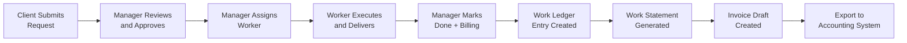

Each stage in this pipeline maps to specific REST API endpoints, workflow engine transitions, and RBAC capability checks. The handoff points between actors (Client → Manager → Worker → Manager) represent the critical touchpoints where notifications are emitted, access control is enforced, and audit history is recorded in the `pq_task_status_history` table.

### 4.1.2 Actor Roles and System Boundaries

The system defines four actor roles, each with distinct capabilities that gate their participation at specific stages of every workflow. These roles are registered in `includes/class-wp-pq-roles.php` and enforced via `permission_callback` on all 50+ REST routes.

| Actor | Role Slug | Workflow Participation | Key Capabilities |
|---|---|---|---|
| **Client** | `pq_client` | Submit requests, upload files, send messages, request meetings, review deliverables | `read`, `upload_files` |
| **Worker** | `pq_worker` | Execute tasks, update status, upload deliverables, communicate with clients | + `pq_work_tasks` |
| **Manager** | `pq_manager` | Approve, assign, reprioritize, capture billing, generate statements, manage clients | + `pq_view_all_tasks`, `pq_reorder_all_tasks`, `pq_approve_requests`, `pq_assign_owners` |
| **Admin** | `administrator` | Full unrestricted access to all system capabilities and configuration | All WordPress + all 5 PQ capabilities |
| **System** | *(automated)* | Cron-based housekeeping, notification dispatch, calendar sync, file retention | Executes under WordPress cron context |

### 4.1.3 Feature Layer Integration

All process flows documented in this section depend on the feature dependency hierarchy established across six architectural layers. The Foundation Layer (F-001 Task CRUD + F-004 RBAC) underpins every operation. The Workflow Layer (F-002 Status Workflow) governs all state transitions and fires events consumed by the Notification Layer (F-017) and Billing Pipeline Layer (F-011 through F-014). The Collaboration Layer (F-007 Messaging, F-008 Files, F-009 Notes, F-010 Meetings) provides side-channel interactions within each task context, while the Client Management Layer (F-015 Clients, F-016 Jobs) scopes all data access by client account.

---

## 4.2 TASK LIFECYCLE STATE MACHINE

### 4.2.1 Canonical Status Transitions

The workflow engine in `includes/class-wp-pq-workflow.php` (lines 93–101) defines the authoritative transition matrix governing all task status changes. The system enforces 8 canonical statuses with an explicit set of legal transitions — no status change can occur outside this matrix. The `archived` status is strictly terminal with no outbound transitions permitted.

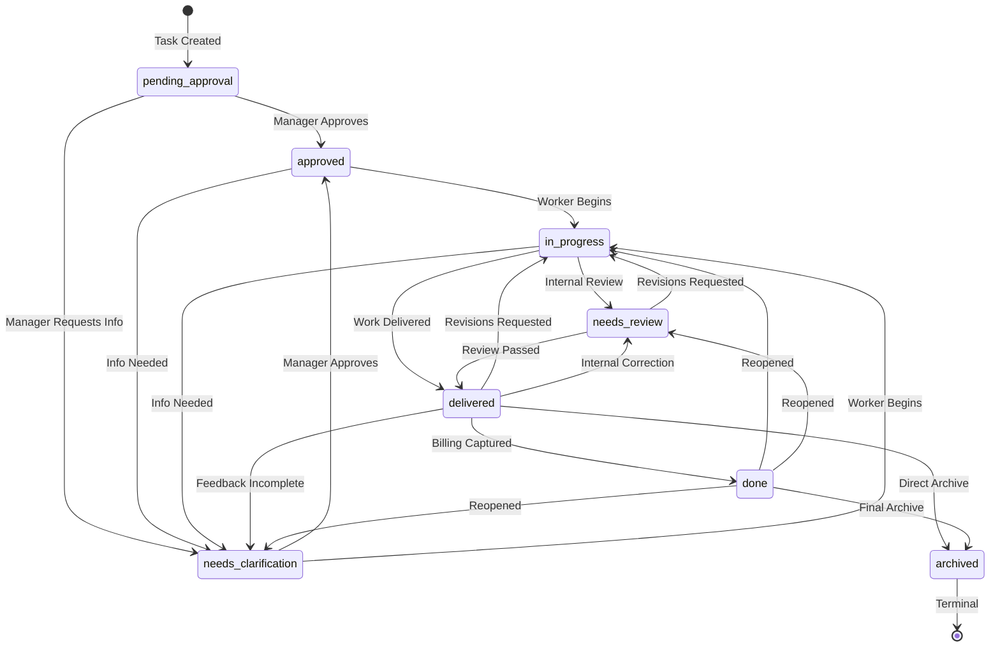

#### Board-Visible vs. Terminal Statuses

Only 6 of the 8 statuses appear as columns on the Kanban board (defined in `class-wp-pq-workflow.php`, lines 38–48): `pending_approval`, `needs_clarification`, `approved`, `in_progress`, `needs_review`, and `delivered`. The `done` and `archived` statuses are hidden terminal states — tasks reaching these statuses disappear from the active board. Only tasks in `delivered`, `done`, or `archived` are eligible for billing operations (lines 50–53).

#### Legacy Status Aliases

For migration compatibility, the workflow engine maps 5 legacy aliases (lines 13–22): `draft` → `pending_approval`, `not_approved` → `needs_clarification`, `pending_review` → `needs_review`, `revision_requested` → `in_progress`, and `completed` → `done`.

### 4.2.2 Capability Gates and Transition Rules

Every status transition passes through the `WP_PQ_Workflow::can_transition()` method (lines 108–120), which enforces both the transition matrix and role-based capability requirements:

| Transition Target | Required Capability | Eligible Roles |
|---|---|---|
| → `approved` | `pq_approve_requests` | Manager, Admin |
| `pending_approval` → `needs_clarification` | `pq_approve_requests` | Manager, Admin |
| → `archived` | `pq_approve_requests` | Manager, Admin |
| → `in_progress`, `needs_clarification`, `needs_review`, `delivered`, `done` | `pq_approve_requests` OR `pq_work_tasks` | Manager, Worker, Admin |

A critical design rule enforced at the API level: the `done` status cannot be reached through the standard `update_status()` endpoint. It requires the dedicated `mark_task_done()` endpoint (`POST /pq/v1/tasks/{id}/done`), which enforces the mandatory billing capture modal. This ensures zero unbilled delivered work per the system's KPI requirements.

#### Transition Reason Codes

Each status transition is annotated with a semantic reason code (resolved by `transition_reason_code()` in `class-wp-pq-api.php`, lines 4255–4285) that provides context for audit history and notification content:

| Transition | Reason Code |
|---|---|
| → `approved` | `approved` |
| → `done` | `marked_done` |
| → `archived` | `archived` |
| → `needs_clarification` (from `delivered`) | `feedback_incomplete` |
| → `needs_clarification` (from other) | `clarification_requested` |
| → `needs_review` (from `delivered`) | `internal_correction` |
| → `in_progress` (from `needs_review` or `delivered`) | `revisions_requested` |

---

## 4.3 CORE TASK WORKFLOWS

### 4.3.1 Task Creation Process

The task creation flow in `class-wp-pq-api.php` (`create_task()`, lines 286–360) follows a multi-step resolution pipeline where the system resolves submitter, client, billing bucket, and action owner identities before persisting the task record. New tasks always enter the system in `pending_approval` status.

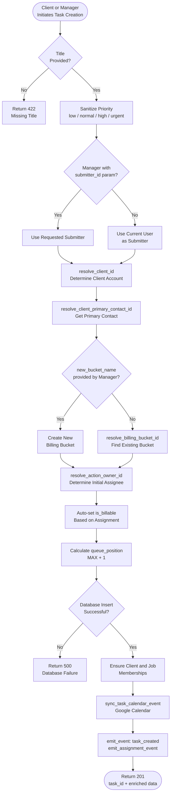

#### Key Decision Points

- **Submitter Resolution**: When a manager creates a task on behalf of a client, the `submitter_id` parameter allows attribution to the actual requestor. Otherwise, the authenticated user is recorded as the submitter.
- **Billing Bucket Resolution**: Managers can create new jobs (billing buckets) inline during task creation by providing `new_bucket_name`. Client submitters are routed to their existing default bucket via `resolve_billing_bucket_id()`.
- **Billable Default**: The `is_billable` flag is auto-set based on whether the action owner is a non-client assignee — tasks assigned to workers default to billable.

### 4.3.2 Status Transition Process

The status transition flow in `class-wp-pq-api.php` (`update_status()`, lines 763–843) implements a 15-step validation and execution pipeline. This is the primary mechanism for moving tasks through the workflow, with the notable exception of the `done` transition which is handled by the dedicated billing capture endpoint.

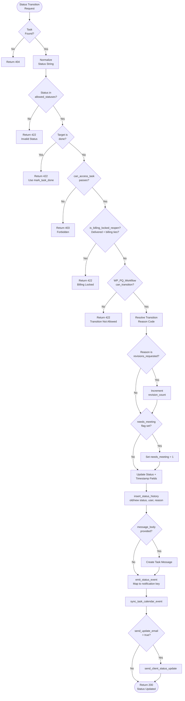

#### Status-Specific Timestamp Fields

When a status transition succeeds, the system updates status-specific timestamp columns on the `pq_tasks` record: `delivered_at` on transition to `delivered`, `done_at` on transition to `done`, and `archived_at` on transition to `archived`. Calendar sync via `sync_task_calendar_event()` is called for all transitions except archival.

#### Notification Event Mapping

The `emit_status_event()` method (lines 3012–3028) maps each target status to the corresponding notification event key: `approved` → `task_approved`, `needs_clarification` → `task_clarification_requested`, `in_progress` (from review/delivered) → `task_returned_to_work`, `delivered` → `task_delivered`, `archived` → `task_archived`.

### 4.3.3 Drag-and-Drop Move Process

The `move_task()` handler (`class-wp-pq-api.php`, lines 486–721) is the most complex single operation in the system, handling queue reordering, cross-column status changes, priority shifts, and date swaps in a single coordinated transaction. It powers the Kanban board's drag-and-drop interactions, with two behavioral patterns: "safe drag" (within same priority band, no confirmation required) and "meaningful drag" (crosses priority boundary or displaces dated task, triggers confirmation modal).

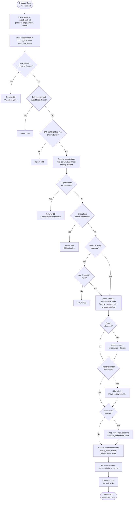

#### Reprioritization Modal Options

When a "meaningful drag" triggers the confirmation modal, the user is presented with four choices that map to distinct parameter combinations:

| Modal Choice | `priority_direction` | `swap_due_dates` | Effect |
|---|---|---|---|
| Reorder only | `keep` | `false` | Queue position update only |
| Reorder + raise priority | `up` | `false` | Queue position + priority level change |
| Reorder + swap due dates | `keep` | `true` | Queue position + deadline swap with target |
| Reorder + raise + swap | `up` | `true` | Queue position + priority + deadline swap |

Canceling the modal reverts the card visually with no API call and no data changes, ensuring zero side effects on cancellation as required by F-003-RQ-005.

### 4.3.4 Task Assignment Flow

The assignment flow in `update_assignment()` (lines 396–439) manages worker-to-task binding with automatic billing synchronization:

1. **Task Lookup and Validation** — Verifies the task exists and the caller has `pq_assign_owners` capability (manager/admin only).
2. **User Existence Check** — Validates the assigned user ID exists in WordPress (returns 422 if not found).
3. **Owner List Update** — Adds the new assignee to the `owner_ids` array on the task record.
4. **Billing Sync** — `billing_sync_for_assignment()` auto-adjusts the `is_billable` flag based on whether the new assignee is a client member (client assignees default to non-billable).
5. **Database Update** — Persists `action_owner_id`, `owner_ids`, and updated billing fields.
6. **History Recording** — Records `action_owner:id` or `action_owner:none` in status history.
7. **Notification** — `emit_assignment_event()` fires the `task_assigned` event, notifying only the newly assigned user.

---

## 4.4 BILLING PIPELINE WORKFLOWS

### 4.4.1 Mark Done — Transactional Billing Capture

The `mark_task_done()` handler (`class-wp-pq-api.php`, lines 845–955) is the most critical financial integrity flow in the system. It is the **only operation** that uses explicit SQL transactions (`START TRANSACTION` / `COMMIT` / `ROLLBACK`) to guarantee atomic consistency between the task status update and the work ledger entry creation. This ensures the zero-billing-data-loss KPI is met.

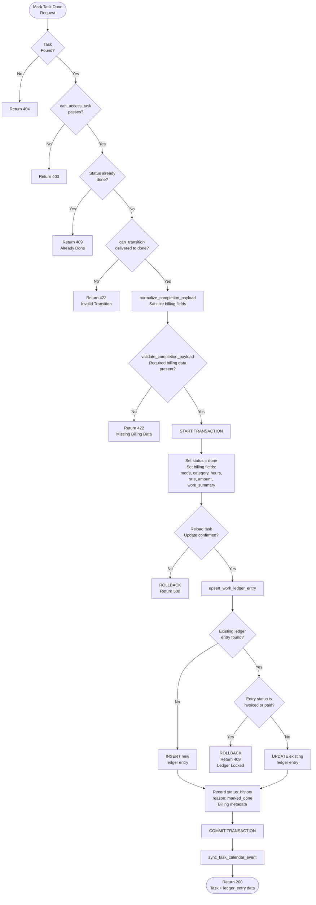

#### Transaction Boundary Details

The transaction boundary encompasses exactly three database operations: (1) task status and billing field update, (2) ledger entry upsert, and (3) status history recording. If any step fails, the entire transaction rolls back, leaving the task in its previous `delivered` state. This is the only flow in the system with explicit transaction management — all other operations rely on single-statement atomicity.

#### Completion Payload Requirements

The mandatory completion modal captures: `billing_mode` (one of `hourly`, `fixed_fee`, `pass_through_expense`, `non_billable`), `billing_category`, `hours` (for hourly mode), `rate` (for hourly mode), `amount`, and `work_summary`. The `normalize_completion_payload()` function sanitizes all fields, and `validate_completion_payload()` rejects submissions with missing required billing data (returning 422).

### 4.4.2 End-to-End Billing Pipeline

The complete billing pipeline flows across four system phases, from task delivery through to accounting export. Each phase operates as a discrete workflow with clear handoff points.

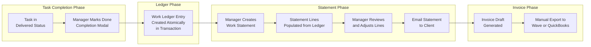

#### Work Ledger Entry Schema

Each ledger entry in the `pq_work_ledger_entries` table captures a point-in-time snapshot: `task_id` (UNIQUE constraint), `client_id`, `billing_bucket_id`, `title_snapshot`, `work_summary`, `owner_id`, `completion_date`, `billable`, `billing_mode`, `billing_category`, `is_closed` (default: 1), `invoice_status` (default: `unbilled`), `statement_month`, `hours`, `rate`, and `amount`.

#### Work Statement Structure

Statements use a code format of `STM-YYYYMM-NNN` and are managed via CRUD endpoints at `GET/POST /pq/v1/manager/statements` and `GET/POST/DELETE /pq/v1/manager/statements/{id}`. Statement lines are first-class entities — initialized from ledger entries but never re-derived afterward. Totals derive exclusively from line items, with no separate total field that could override the line-item sum. Additional manager endpoints support batch creation (`POST /pq/v1/statements/batch`), payment recording (`POST /pq/v1/manager/statements/{id}/payment`), and email delivery (`POST /pq/v1/manager/statements/{id}/email-client`).

### 4.4.3 Billing Immutability Rules

The billing pipeline enforces immutability through two complementary mechanisms implemented in `class-wp-pq-api.php`:

**Billing Lock Logic** (`is_billing_locked_reopen()`, lines 4287–4302): Blocks any attempt to reopen (change status away from `delivered`) a task that has `statement_id > 0` or `billing_status` in `['batched', 'statement_sent', 'paid']`. This prevents data inconsistency between task status and billing records.

**Ledger Immutability**: Once a ledger entry's `invoice_status` is set to `invoiced` or `paid`, the entry cannot be reopened or modified. The system returns HTTP 409 and directs the user to create a follow-up task (via `POST /pq/v1/tasks/{id}/followup`, which links the new task via `source_task_id`). This rule is the non-negotiable guarantee of billing data integrity.

---

## 4.5 NOTIFICATION DELIVERY WORKFLOWS

### 4.5.1 Event-Driven Notification Flow

The notification system in `class-wp-pq-api.php` (lines 2556–2660) implements dual-channel delivery (in-app + email) for 14 event types defined in `class-wp-pq-workflow.php` (lines 123–141). The `emit_event()` function is the central dispatch point, called by task creation, status transitions, assignments, mentions, priority changes, and schedule changes.

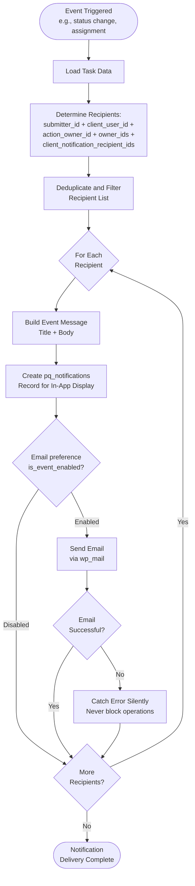

#### Critical Design Decision: Silent Email Failure

Email delivery failures are caught in a try/catch block and never propagate to the calling business operation. This ensures that SMTP configuration issues or transient email failures cannot block status transitions, billing capture, or any other core workflow. The in-app notification record is always created regardless of email delivery outcome.

#### In-App Notification Polling

The client-side polling mechanism in `assets/js/admin-queue-alerts.js` polls `GET /pq/v1/notifications` every 30 seconds to retrieve unread notifications. Users can mark notifications as read via `POST /pq/v1/notifications/mark-read`. Alert cards include shortcut actions to navigate directly to the relevant task in the Task Detail Drawer.

### 4.5.2 Supported Event Types

The complete registry of 14 notification event types, their triggers, and the workflows that emit them:

| Event Key | Trigger | Source Workflow |
|---|---|---|
| `task_created` | New task submitted | Task Creation (§4.3.1) |
| `task_assigned` | Worker assigned to task | Task Assignment (§4.3.4) |
| `task_approved` | Task approved by manager | Status Transition (§4.3.2) |
| `task_clarification_requested` | Clarification needed | Status Transition (§4.3.2) |
| `task_mentioned` | @mention in message | Messaging Flow (§4.5.3) |
| `task_reprioritized` | Priority changed | Drag-and-Drop Move (§4.3.3) |
| `task_schedule_changed` | Due date modified | Drag-and-Drop Move (§4.3.3) |
| `task_returned_to_work` | Task returned to active work | Status Transition (§4.3.2) |
| `task_delivered` | Deliverables submitted | Status Transition (§4.3.2) |
| `task_archived` | Task archived | Status Transition (§4.3.2) |
| `statement_batched` | Statement batch created | Billing Pipeline (§4.4.2) |
| `client_status_updates` | Client-facing status change | Status Transition (§4.3.2) |
| `client_daily_digest` | Daily summary | Housekeeping Cron (§4.7.1) |
| `retention_day_300` | File retention warning | Housekeeping Cron (§4.7.1) |

### 4.5.3 Messaging and @Mention Flow

The messaging system (`POST /pq/v1/tasks/{id}/messages`) follows a three-step flow: (1) access verification via `can_access_task()`, (2) message storage in `pq_task_messages` via `store_task_message()` with sanitization, and (3) @mention parsing via `notify_mentions()` which matches @-referenced usernames to task participants and emits the `task_mentioned` notification event for each matched user. This integration point between F-007 (Messaging) and F-017 (Notifications) is triggered on every message creation.

---

## 4.6 INTEGRATION WORKFLOWS

### 4.6.1 AI Import Pipeline

The AI Import feature (`includes/class-wp-pq-ai-importer.php` and `includes/class-wp-pq-manager-api.php`, lines 190–218) implements a 4-step pipeline restricted to manager-level users. It leverages the OpenAI Responses API to parse unstructured text or PDF documents into structured task rows.

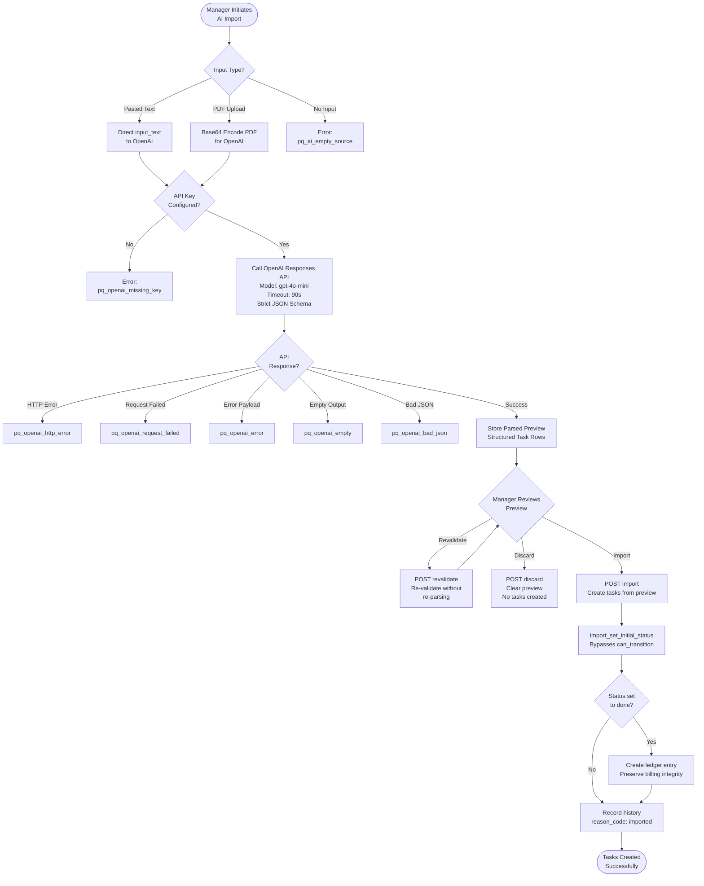

#### AI Output Schema

The OpenAI API call uses a strict JSON schema enforcing structured output with the following fields per parsed task: `title`, `description`, `job_name`, `priority`, `requested_deadline`, `needs_meeting`, `action_owner_hint`, `is_billable`, and `status_hint`. Client context and known job names are injected into the prompt to improve parsing accuracy and job name reuse.

#### Import Status Override

Imported tasks bypass the normal `can_transition()` workflow engine via `import_set_initial_status()` (lines 966–1007), allowing tasks to be created at any status including `done`. When a task is imported directly at `done` status, the system creates a corresponding ledger entry to preserve billing pipeline integrity.

### 4.6.2 Google Calendar and Meet Integration

The Google Calendar/Meet integration follows a standard OAuth 2.0 authorization code flow, with subsequent calendar synchronization triggered by task lifecycle events.

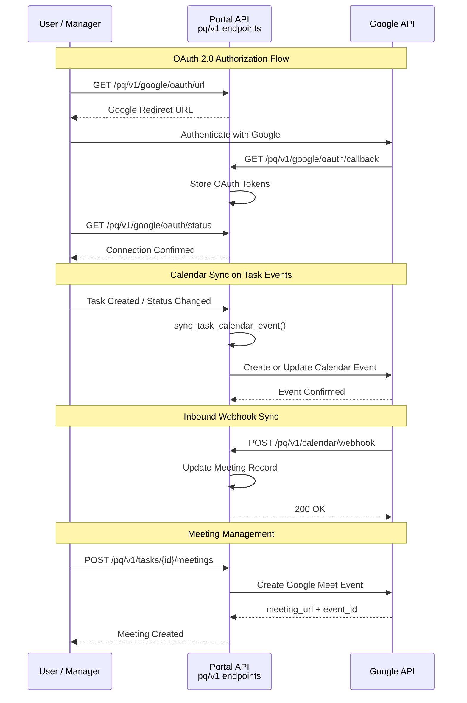

#### Calendar Sync Trigger Points

The `sync_task_calendar_event()` function is called during: task creation, status transitions (except archival), schedule changes, and drag-and-drop moves. Meeting records use the schema: `task_id`, `provider` (default: `google`), `event_id`, `meeting_url`, `starts_at`, `ends_at`, `sync_direction` (default: `two_way`). The `needs_meeting` flag on tasks allows clients to indicate a meeting request at task creation time.

---

## 4.7 SCHEDULED AND BATCH OPERATIONS

### 4.7.1 Daily Housekeeping Cron

The housekeeping cron in `includes/class-wp-pq-housekeeping.php` executes three sequential jobs daily at 8:00 AM via the WordPress cron event `wp_pq_daily_housekeeping`. The cron is registered during plugin activation in `init()` and unregistered during deactivation via `unschedule()`.

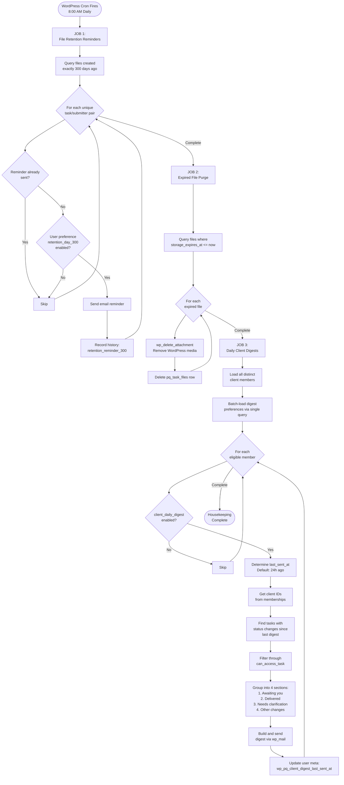

#### Job 1: File Retention Reminders (Lines 42–95)

Queries files created exactly 300 days ago (between day 300 and day 301 boundaries). For each unique task/submitter pair, the system checks if a reminder has already been sent by looking for a `retention_reminder_300` note in `pq_task_status_history`. Duplicate reminders are prevented by recording a history entry after each successful notification. Files themselves expire at 365 days, enforced by Job 2.

#### Job 2: Expired File Purge (Lines 97–108)

Queries all file records where `storage_expires_at <= UTC_TIMESTAMP()` and performs a two-step deletion: first removing the WordPress media attachment via `wp_delete_attachment()`, then deleting the `pq_task_files` row. This ensures both the physical file and the database record are cleaned up.

#### Job 3: Daily Client Digests (Lines 141–268)

The most complex cron job, iterating all distinct client members with a single batched preference query for efficiency. The digest groups tasks into four contextual sections scoped to the recipient's client memberships: "Awaiting you" (tasks where user is action_owner in active statuses), "Delivered," "Needs clarification," and "Other changes." Task visibility is filtered through `can_access_task()` to respect RBAC boundaries.

### 4.7.2 Batch Operations

Two batch operations are exposed via `includes/class-wp-pq-api.php`, both requiring the `pq_approve_requests` capability:

**Batch Approve** (`approve_batch()`, lines 1009–1061): Accepts an array of `task_ids` and iterates each, validating access, current status (must be `pending_approval` or `needs_clarification`), and transition eligibility. Each approved task receives a status update, history record, notification emission, and calendar sync. Partial success is supported — if one task fails validation, others still process.

**Archive Delivered** (`archive_delivered()`, lines 1063–1107): Transitions all tasks currently in `delivered` status to `archived`, with an optional `client_id` filter for scoping. Each task receives an `archived_at` timestamp, history record, and notification emission.

---

## 4.8 ACCESS CONTROL DECISION FLOWS

### 4.8.1 Task Access Decision Tree

The `can_access_task()` method (`class-wp-pq-api.php`, lines 3279–3324) implements a cascading authorization check that evaluates 8 conditions in priority order. This function is invoked on every task-specific API operation — status transitions, messaging, file access, billing capture — making it the central authorization gatekeeper.

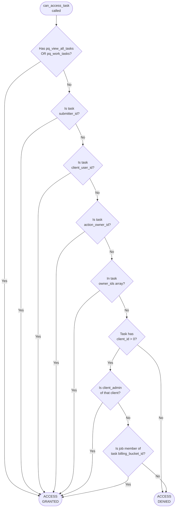

#### Role-Based Fast Paths

The first check (`pq_view_all_tasks` OR `pq_work_tasks`) serves as a fast path for managers, admins, and workers — these roles bypass all subsequent checks. Client users, who lack both capabilities, must satisfy one of the remaining 6 conditions, ensuring strict client-scoped data isolation.

### 4.8.2 Task Deletion Authorization

The `can_delete_task()` method (lines 3326–3345) implements a stricter authorization model:

- **Manager/Admin**: Can delete any task, subject to billing tie checks.
- **Submitter**: Can delete only their own tasks in `pending_approval` or `needs_clarification` status AND with no billing ties (`statement_id`, `work_log_id`, or `billing_status` in `['batched', 'statement_sent', 'paid']`).

Deletion cascades to all associated records: messages (`pq_task_messages`), notes (`pq_task_comments`), files (`pq_task_files`), and meetings (`pq_task_meetings`).

### 4.8.3 API-Level RBAC Enforcement

All manager-only operations under the `/pq/v1/manager/*` namespace use a `can_manage()` permission callback requiring the `pq_approve_requests` capability. This covers client account management, job management, statement CRUD, work log operations, AI import, and billing rollup endpoints — 20+ routes with consistent capability gating as defined in `includes/class-wp-pq-manager-api.php`.

---

## 4.9 ERROR HANDLING AND RECOVERY

### 4.9.1 Error Classification and HTTP Responses

The system implements a structured error handling model with predictable HTTP status codes and recovery paths for every error category.

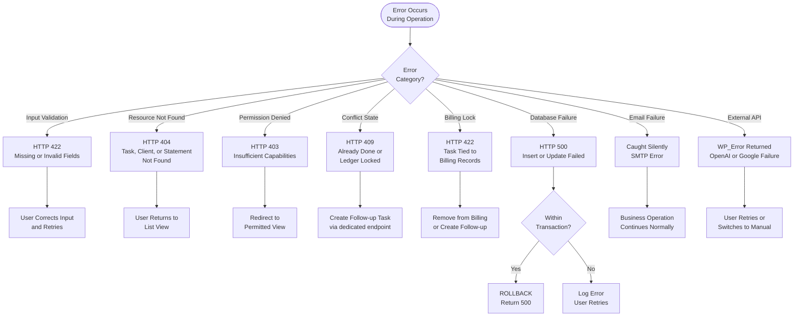

### 4.9.2 Transaction Boundaries and Rollback

The `mark_task_done()` flow is the singular point in the system where explicit SQL transaction management is employed. The transaction boundary is deliberately narrow, encompassing only the task update, ledger upsert, and history recording. If any operation within the transaction fails:

1. **Task update fails** → `ROLLBACK`, return HTTP 500. Task remains in `delivered` status.
2. **Ledger entry conflicts** (invoiced/paid status) → `ROLLBACK`, return HTTP 409. Task remains in `delivered` status with no ledger modification.
3. **History recording fails** → `ROLLBACK`, return HTTP 500. No partial state persists.

All other API operations use single-statement atomicity and do not require explicit transaction management. This design minimizes lock contention on the MySQL tables while guaranteeing billing data integrity at the critical capture point.

### 4.9.3 External Service Failure Handling

External service failures are handled with distinct strategies based on the service criticality:

| External Service | Failure Mode | Error Code | Recovery Strategy |
|---|---|---|---|
| **OpenAI API** | Missing API key | `pq_openai_missing_key` | Admin configures API key |
| **OpenAI API** | HTTP request failure | `pq_openai_request_failed` | User retries or uses manual task creation |
| **OpenAI API** | Non-2xx response | `pq_openai_http_error` | User retries |
| **OpenAI API** | Malformed output | `pq_openai_bad_json` | User retries or adjusts input |
| **Google Calendar** | OAuth not connected | N/A | Calendar sync silently skipped |
| **Google Calendar** | API failure | N/A | Calendar sync skipped; task operation succeeds |
| **SMTP / wp_mail** | Email delivery failure | Caught silently | In-app notification still created; email skipped |

The guiding principle is that no external service failure should block a core business operation. AI import failures prevent task creation (acceptable, as it is a convenience feature), but Google Calendar and email failures are absorbed silently to ensure task lifecycle integrity.

---

## 4.10 PERFORMANCE AND TIMING CONSTRAINTS

### 4.10.1 Response Time Targets

All process flows documented in this section operate under the following performance constraints, defined in the system KPIs (Section 1.2.3):

| Operation | Target | Relevant Workflows |
|---|---|---|
| Page load time | < 2 seconds | Board rendering, calendar view, task list |
| Board interactions (drag, reorder) | < 200ms | Drag-and-Drop Move (§4.3.3), Queue Reorder |
| API response time | < 500ms | All REST endpoints across all workflows |
| Notification polling interval | Every 30 seconds | In-app notification retrieval (§4.5.1) |
| AI API timeout | 90 seconds | OpenAI Responses API call (§4.6.1) |
| Daily housekeeping cron | 8:00 AM daily | All three housekeeping jobs (§4.7.1) |
| File retention period | 365 days | Retention reminders at day 300 (§4.7.1) |

### 4.10.2 Scalability Targets

| Metric | Target | Constraint Source |
|---|---|---|
| Concurrent users | 50+ | All workflows |
| Total tasks | 10,000+ | Board rendering, query performance |
| Client accounts | 100+ | Digest generation, client scoping |

### 4.10.3 Data Integrity SLAs

| Guarantee | Mechanism | Reference |
|---|---|---|
| Zero billing data loss | Explicit SQL transactions on `mark_task_done()` | §4.4.1 |
| Immutable invoiced records | Ledger entry lock at `invoiced`/`paid` status | §4.4.3 |
| Complete audit trail | `pq_task_status_history` entry on every status change | §4.3.2 |
| No unbilled delivered work | Mandatory completion modal blocks `done` without billing data | §4.4.1 |

---

#### References

The following files and folders from the repository were examined to produce this section:

- `includes/class-wp-pq-workflow.php` — Complete 8-status canonical state machine, transition matrix (lines 93–101), capability gates (lines 108–120), board-visible statuses (lines 38–48), billing source statuses (lines 50–53), legacy aliases (lines 13–22), 14 notification event keys (lines 123–141)
- `includes/class-wp-pq-api.php` — Task creation (`create_task()`, lines 286–360), status transitions (`update_status()`, lines 763–843), mark done with transactional billing (`mark_task_done()`, lines 845–955), drag-and-drop move (`move_task()`, lines 486–721), task assignment (`update_assignment()`, lines 396–439), batch approve (lines 1009–1061), archive delivered (lines 1063–1107), task delete (lines 1109–1137), notification emission (`emit_event()`, lines 2556–2660), status event mapping (`emit_status_event()`, lines 3012–3028), access control (`can_access_task()`, lines 3279–3324; `can_delete_task()`, lines 3326–3345), ledger upsert (`upsert_work_ledger_entry()`, lines 4071–4105), billing lock (`is_billing_locked_reopen()`, lines 4287–4302), transition reasons (`transition_reason_code()`, lines 4255–4285), message storage and @mention parsing (lines 1139–1188, 4304–4327, 2640–2660), REST route registrations (lines 61–227)
- `includes/class-wp-pq-housekeeping.php` — Daily cron scheduling, file retention reminders (lines 42–95), expired file purge (lines 97–108), daily client digest generation (lines 141–268), preference checking (`is_event_enabled()`, lines 124–128)
- `includes/class-wp-pq-manager-api.php` — Manager-only REST routes for clients, jobs, statements, work logs, AI import (lines 190–218), client creation flow (lines 233–300), statement CRUD (lines 122–184)
- `includes/class-wp-pq-ai-importer.php` — OpenAI Responses API integration, document parsing pipeline, strict JSON schema output, error handling codes (lines 1–72)
- `includes/class-wp-pq-roles.php` — Role definitions (4 roles), capability constants (5 custom capabilities), role-to-capability mapping
- `includes/class-wp-pq-db.php` — Custom table definitions for `pq_tasks`, `pq_task_status_history`, `pq_work_ledger_entries`, `pq_notifications`, `pq_notification_prefs`, `pq_task_messages`, `pq_task_files`, `pq_task_meetings`, `pq_statements`, `pq_statement_lines`
- `includes/class-wp-pq-portal.php` — Shortcode-driven SPA rendering, frontend asset registration
- `assets/js/admin-queue.js` — Drag-and-drop behavioral patterns, SortableJS integration, reprioritization modal
- `assets/js/admin-queue-alerts.js` — 30-second notification polling, alert card rendering
- `docs/DEVELOPER_HANDOFF_2026-03-21.md` — Billing boundary rules, accounting system integration boundary
- `docs/BOARD_REDESIGN_SPEC.md` — Safe drag vs. meaningful drag definitions, reprioritization modal options
- `docs/WORKFLOW_LEDGER_REFACTOR_SPEC.md` — Billing pipeline phases, billing mode definitions, statement code format

# 5. System Architecture

This section documents the complete system architecture of the WP Priority Queue Portal (v0.23.4), a full-stack WordPress plugin that unifies task management, status workflow enforcement, and a billing pipeline for creative agencies and freelance service providers. The architecture is grounded in the implementations found across 11 PHP classes in the `includes/` directory, 4 JavaScript controllers in `assets/js/`, and supporting CSS in `assets/css/`. Every architectural statement in this section is traceable to specific source files within the repository.

---

## 5.1 HIGH-LEVEL ARCHITECTURE

### 5.1.1 System Overview

#### Architecture Style and Rationale

The WP Priority Queue Portal is designed as a **monolithic, full-stack WordPress plugin** that leverages WordPress not merely as a content management system, but as the complete application framework providing authentication, user management, cron scheduling, media handling, REST API routing, and database abstraction. This architecture style was selected for three strategic reasons: rapid deployment on ubiquitous PHP hosting, elimination of separate infrastructure provisioning for the target audience of small creative agencies and freelancers, and the ability to encapsulate the entire application as a self-contained, installable plugin module within the WordPress ecosystem (`wp-priority-queue-plugin.php`).

The system exposes a **REST-first API surface** with over 50 endpoints under the `pq/v1` namespace — registered across `class-wp-pq-api.php` (26+ primary routes) and `class-wp-pq-manager-api.php` (20+ manager-only routes) — as the exclusive data access layer for the frontend. The frontend is rendered through a shortcode-driven single-page-application (SPA) pattern, where the `[pq_client_portal]` shortcode in `class-wp-pq-portal.php` emits the application shell and JavaScript controllers hydrate it via REST API calls.

#### Key Architectural Principles

The system is governed by the following architectural principles, each traceable to specific implementation choices:

| Principle | Implementation |
|---|---|
| **Singleton Bootstrap** | `WP_PQ_Plugin::instance()` in `class-wp-pq-plugin.php` ensures single initialization and deterministic component loading order |
| **Hooks-Based Wiring** | All initialization tied to WordPress lifecycle hooks (`plugins_loaded`, `rest_api_init`, `wp_enqueue_scripts`) |
| **Canonical State Machine** | 8-status explicit transition matrix with capability-gated transitions in `class-wp-pq-workflow.php` |
| **Custom Domain Schema** | 18 purpose-built tables prefixed `pq_` — avoids reliance on WordPress post types or meta tables for core business data (`class-wp-pq-db.php`) |

#### System Boundaries

The portal operates within well-defined boundaries that determine what the system owns versus what it delegates:

- **Authentication Boundary**: WordPress native session/cookie authentication manages all user access. Google OAuth is used solely for Calendar/Meet integration, not user login (Constraint C-007 from Section 2.14).
- **Billing Boundary**: The portal generates invoice **drafts** only and is explicitly not the system of record for issued invoices (Constraint C-001). Final invoices are issued in downstream accounting systems such as Wave or QuickBooks via manual CSV/PDF export from `class-wp-pq-admin.php`.
- **Real-Time Boundary**: Notification delivery uses 30-second polling from `admin-queue-alerts.js`, not WebSocket or server-push (Constraint C-003). This constraint reflects the standard WordPress hosting model where persistent connections are not reliably supported.
- **Deployment Boundary**: Single-site WordPress installation at `https://readspear.com/priority-portal/` with zero-build architecture — no webpack, Babel, npm, or any build pipeline (`Section 3.6`).

### 5.1.2 Core Components

The system is composed of 11 PHP backend classes, 4 JavaScript frontend controllers, and a unified CSS layer. The following table identifies each component's primary responsibility and critical dependencies.

#### Backend Components

| Component | Source File | Primary Responsibility |
|---|---|---|
| **Plugin Bootstrap** | `class-wp-pq-plugin.php` | Singleton initialization, migration orchestration, deterministic component wiring |
| **Installer** | `class-wp-pq-installer.php` | Activation/deactivation lifecycle — roles, tables, default options, cron scheduling |
| **Roles & Capabilities** | `class-wp-pq-roles.php` | Definition of 4 roles and 5 custom capabilities for RBAC enforcement |
| **Workflow Engine** | `class-wp-pq-workflow.php` | 8-status state machine, transition matrix, capability gates, 14 notification event keys |
| **Database Layer** | `class-wp-pq-db.php` | 18-table DDL, 14 idempotent migrations, request-local caching helpers |
| **Primary REST API** | `class-wp-pq-api.php` | 26+ endpoints: tasks, messages, files, meetings, notifications, Google OAuth, billing |
| **Manager REST API** | `class-wp-pq-manager-api.php` | 20+ manager-only endpoints: clients, jobs, statements, work logs, AI import |
| **AI Importer** | `class-wp-pq-ai-importer.php` | OpenAI Responses API integration for bulk task parsing |
| **Housekeeping** | `class-wp-pq-housekeeping.php` | Daily cron: file retention enforcement, expired file purge, client daily digests |
| **Admin Screens** | `class-wp-pq-admin.php` | WordPress admin dashboard: settings, clients, billing, statements, AI import UI |
| **Portal Renderer** | `class-wp-pq-portal.php` | Shortcode SPA rendering, CDN asset registration, role-conditional script loading |

#### Frontend Components

| Component | Source File | Primary Responsibility |
|---|---|---|
| **Queue Controller** | `assets/js/admin-queue.js` | Kanban board, drag-and-drop, task CRUD, drawer, view switching, file uploads |
| **Portal Manager** | `assets/js/admin-portal-manager.js` | Manager portal: clients, billing, statements, AI import, deep linking |
| **Modal Workflows** | `assets/js/admin-queue-modals.js` | Revision, move/status, completion, and delete confirmation modals |
| **Notification Alerts** | `assets/js/admin-queue-alerts.js` | 30-second polling, alert card rendering, preference management |
| **Portal Stylesheet** | `assets/css/admin-queue.css` | Theme tokens, dark mode via `[data-theme="dark"]`, responsive breakpoints |

### 5.1.3 Data Flow Description

#### Primary Data Flow: Request-to-Invoice Pipeline

The core value stream of the portal is a linear approval-execution-delivery-billing pipeline. Data originates as a client-submitted task request and flows through progressively richer states until it becomes an immutable billing record.

**Client submission** — A client creates a task via `POST /pq/v1/tasks` in `class-wp-pq-api.php`. The task record is inserted into `pq_tasks` with status `pending_approval`, and a `task_created` notification event is emitted to all relevant recipients through the dual-channel notification system (in-app record in `pq_notifications` plus conditional email via `wp_mail()`). Every status transition is logged in `pq_task_status_history` for full audit trail.

**Manager approval and assignment** — A manager transitions the task through `POST /pq/v1/tasks/{id}/status`, validated against the transition matrix in `WP_PQ_Workflow::can_transition()`. Assignment is performed via `POST /pq/v1/tasks/{id}/assignment`, which updates the `action_owner_id` on the task record and emits a `task_assigned` notification event.

**Worker execution and delivery** — Workers progress tasks through `in_progress`, `needs_review`, and `delivered` statuses. Collaboration data (messages in `pq_task_messages`, files in `pq_task_files`, notes in `pq_task_comments`, meetings in `pq_task_meetings`) flows through task-scoped REST endpoints, all gated by the `can_access_task()` authorization check.

**Billing capture** — The most architecturally significant data flow occurs at the `mark_task_done()` endpoint (`POST /pq/v1/tasks/{id}/done`), which is the single point in the system where an explicit SQL transaction boundary is employed. Within a single `START TRANSACTION` / `COMMIT` block, the system atomically: (1) updates the task to `done` status with billing fields, (2) upserts a work ledger entry in `pq_work_ledger_entries`, and (3) records the status history entry. This guarantees zero billing data loss.

**Statement and invoice generation** — Ledger entries flow into work statements (`pq_statements`, `pq_statement_items`, `pq_statement_lines`) through manager operations in `class-wp-pq-manager-api.php`. Statements are then exported as invoice drafts for downstream accounting systems.

#### Integration Data Patterns

All external service communication uses the WordPress HTTP API (`wp_remote_post()`, `wp_remote_get()`, `wp_remote_request()`) as the transport layer. Google Calendar event data flows bidirectionally — task-originated meetings push events to Google Calendar, and meeting metadata (event_id, meeting_url) is persisted in `pq_task_meetings` with `sync_direction` tracking. OpenAI data flows unidirectionally — client documents are sent for parsing and structured task data is returned.

#### Configuration and Caching Data

Runtime configuration is persisted in the WordPress `wp_options` table across 12+ option keys covering file management, Google OAuth credentials, and OpenAI settings. Request-local caches (`$client_memberships_cache`, `$user_cache`, `$job_member_ids_cache`) in `class-wp-pq-db.php` and `class-wp-pq-api.php` reduce redundant database queries within a single HTTP request cycle. No external distributed caching layer (Redis, Memcached) is deployed.

```mermaid
flowchart LR
    subgraph ClientLayer["Client Actions"]
        CR["Submit Request"]
        CF["Upload Files"]
        CM["Send Messages"]
    end

    subgraph APILayer["REST API — pq/v1"]
        TaskEP["Task Endpoints"]
        CollabEP["Collaboration Endpoints"]
        BillingEP["Billing Endpoints"]
    end

    subgraph BusinessLogic["Core Logic"]
        WFE["Workflow Engine"]
        NTF["Notification Dispatch"]
        BLC["Billing Capture"]
    end

    subgraph DataStore["Data Layer"]
        TaskDB[("pq_tasks +\nHistory Tables")]
        LedgerDB[("pq_work_ledger_entries\n+ Statements")]
        NotifDB[("pq_notifications")]
    end

    CR --> TaskEP
    CF --> CollabEP
    CM --> CollabEP
    TaskEP --> WFE
    WFE --> NTF
    WFE --> BLC
    WFE --> TaskDB
    BLC --> LedgerDB
    NTF --> NotifDB
    BillingEP --> LedgerDB
```

### 5.1.4 External Integration Points

The portal integrates with four external systems, all managed through REST API calls from `class-wp-pq-api.php`, `class-wp-pq-ai-importer.php`, and `class-wp-pq-housekeeping.php`.

| System Name | Integration Type | Data Exchange Pattern |
|---|---|---|
| **Google Calendar API v3** | REST API, OAuth 2.0 Bearer | Bidirectional — event CRUD, Google Meet link creation, webhook notifications |
| **Google OAuth 2.0** | Token management | Request-response — authorization code exchange, token refresh on expiry |
| **OpenAI Responses API** | REST API, Bearer token | Unidirectional — document text/PDF sent, structured task JSON returned |
| **SMTP / `wp_mail()`** | WordPress mail subsystem | Outbound only — notifications, digests, retention reminders, statement delivery |

| System Name | Protocol/Format | SLA Considerations |
|---|---|---|
| **Google Calendar API v3** | HTTPS/JSON | Failures absorbed silently; task operations succeed regardless of calendar sync outcome |
| **Google OAuth 2.0** | HTTPS/JSON | Server-side token storage; CSRF state parameter for authorization flow protection |
| **OpenAI Responses API** | HTTPS/JSON | 90-second timeout; failures prevent AI import only — convenience feature, not core path |
| **SMTP / `wp_mail()`** | SMTP (environment-dependent) | Email failures caught silently; in-app notification always created; no core operation blocked |

A critical architectural principle governs all external integrations: **no external service failure blocks a core business operation**. AI import failures prevent bulk task creation (an acceptable degradation of a convenience feature), Google Calendar failures are absorbed silently so task operations proceed, and email delivery failures are caught in try/catch blocks while the in-app notification record is always created.

---

## 5.2 COMPONENT DETAILS

### 5.2.1 Plugin Bootstrap and Lifecycle Management

#### Purpose and Responsibilities

The bootstrap system coordinates the deterministic initialization of all system components, ensuring that database schema, roles, cron jobs, REST API routes, and frontend assets are registered in the correct order with no missing dependencies. The lifecycle system handles plugin activation, deactivation, and upgrade scenarios.

#### Boot Sequence

The entry point chain begins when WordPress fires the `plugins_loaded` hook, which triggers `WP_PQ_Plugin::instance()->boot()` (defined in `wp-priority-queue-plugin.php`, lines 35–37). The `boot()` method in `class-wp-pq-plugin.php` (lines 20–44) executes the following deterministic sequence:

1. **Database Schema** — `WP_PQ_DB::create_tables()` ensures all 18 custom tables exist via WordPress's `dbDelta()` function for idempotent creation
2. **Migrations** — 14 idempotent migration routines execute, each gated by an option flag (e.g., `wp_pq_migration_v12_completed`), performing additive-only schema changes
3. **Housekeeping** — `WP_PQ_Housekeeping::init()` registers the daily cron event (`wp_pq_daily_housekeeping`)
4. **Admin** — `WP_PQ_Admin::init()` registers WordPress admin screens for settings and management
5. **Primary API** — `WP_PQ_API::init()` registers 26+ REST endpoints under `pq/v1`
6. **Manager API** — `WP_PQ_Manager_API::init()` registers 20+ manager-only REST endpoints under `pq/v1/manager`
7. **Portal** — `WP_PQ_Portal::init()` registers the `[pq_client_portal]` shortcode and enqueues frontend assets

#### Class Loading Order

The file `wp-priority-queue-plugin.php` (lines 20–30) loads all class files via `require_once` in a specific order that ensures dependencies are available before dependents: Installer → Roles → DB → Workflow → Housekeeping → API → Manager API → AI Importer → Admin → Portal → Plugin. This explicit ordering eliminates autoloader complexity while maintaining reliable initialization.

#### Activation and Deactivation

The `WP_PQ_Installer` class manages the full plugin lifecycle through WordPress activation and deactivation hooks:

- **Activation**: Creates 4 custom roles with 5 capabilities, triggers `WP_PQ_DB::create_tables()`, seeds 12+ default configuration options in `wp_options`, and schedules the daily housekeeping cron event
- **Deactivation**: Removes custom roles and capabilities, clears the scheduled cron event

```mermaid
sequenceDiagram
    participant WP as WordPress Core
    participant Entry as wp-priority-queue-plugin.php
    participant Plugin as WP_PQ_Plugin
    participant DB as WP_PQ_DB
    participant HK as WP_PQ_Housekeeping
    participant API as WP_PQ_API
    participant MAPI as WP_PQ_Manager_API
    participant Portal as WP_PQ_Portal

    WP->>Entry: plugins_loaded hook
    Entry->>Entry: require_once (11 class files)
    Entry->>Plugin: instance()->boot()
    Plugin->>DB: create_tables()
    DB-->>Plugin: 18 tables ensured
    Plugin->>DB: migrate_* (14 routines)
    DB-->>Plugin: migrations complete
    Plugin->>HK: init()
    HK-->>Plugin: cron registered
    Plugin->>API: init() [rest_api_init hook]
    API-->>Plugin: 26+ routes registered
    Plugin->>MAPI: init() [rest_api_init hook]
    MAPI-->>Plugin: 20+ routes registered
    Plugin->>Portal: init() [wp_enqueue_scripts hook]
    Portal-->>Plugin: shortcode + assets registered
```

### 5.2.2 Workflow Engine

#### Purpose and Responsibilities

The workflow engine in `class-wp-pq-workflow.php` serves as the authoritative source of truth for all task status governance. It defines the 8 canonical statuses, the complete transition matrix, capability-gated transition rules, board visibility classifications, billing eligibility rules, legacy status alias mappings, and the 14 notification event keys that drive the dual-channel notification system.

#### Status Classification

The engine classifies statuses into three orthogonal categories:

- **Board-Visible (6)**: `pending_approval`, `needs_clarification`, `approved`, `in_progress`, `needs_review`, `delivered` — these appear as Kanban columns
- **Terminal/Hidden (2)**: `done`, `archived` — tasks in these statuses disappear from the active board
- **Billing-Eligible (3)**: `delivered`, `done`, `archived` — only tasks in these statuses can participate in billing operations

#### Transition Matrix

The transition matrix (lines 93–101 of `class-wp-pq-workflow.php`) defines every legal status transition as an explicit source→destinations mapping. The `archived` status is strictly terminal with no outbound transitions. The `done` status can only be reached via the dedicated `mark_task_done()` endpoint, never through the standard `update_status()` flow — ensuring mandatory billing capture.

#### Capability Gates

The `can_transition()` method (lines 108–120) applies role-based capability requirements on top of the transition matrix:

| Transition Target | Required Capability |
|---|---|
| → `approved` | `pq_approve_requests` (Manager/Admin only) |
| `pending_approval` → `needs_clarification` | `pq_approve_requests` (Manager/Admin only) |
| → `archived` | `pq_approve_requests` (Manager/Admin only) |
| → all other statuses | `pq_approve_requests` OR `pq_work_tasks` |

```mermaid
stateDiagram-v2
    [*] --> pending_approval : Task Created
    pending_approval --> approved : Manager Approves
    pending_approval --> needs_clarification : Manager Requests Info
    needs_clarification --> approved : Manager Approves
    needs_clarification --> in_progress : Worker Begins
    approved --> in_progress : Worker Begins
    approved --> needs_clarification : Info Needed
    in_progress --> needs_clarification : Info Needed
    in_progress --> needs_review : Internal Review
    in_progress --> delivered : Work Delivered
    needs_review --> in_progress : Revisions Requested
    needs_review --> delivered : Review Passed
    delivered --> in_progress : Revisions Requested
    delivered --> needs_clarification : Feedback Incomplete
    delivered --> needs_review : Internal Correction
    delivered --> done : Billing Captured
    delivered --> archived : Direct Archive
    done --> archived : Final Archive
    done --> in_progress : Reopened
    done --> needs_clarification : Reopened
    done --> needs_review : Reopened
    archived --> [*] : Terminal
```

### 5.2.3 Database Layer

#### Purpose and Responsibilities

The database layer in `class-wp-pq-db.php` manages the complete custom schema of 18 tables organized across four business domains. It provides DDL definitions, 14 idempotent migration routines, request-local caching helpers, and data access methods consumed by both API classes. All database access flows through WordPress's `$wpdb` global, which provides parameterized query support via `$wpdb->prepare()`.

#### Table Organization by Domain

**Task Domain** — 6 tables providing the core task data model:

| Table | Purpose |
|---|---|
| `pq_tasks` | Core task records (35+ columns: status, priority, billing fields, queue_position, Google event tracking) |
| `pq_task_status_history` | Full audit trail with reason_code, metadata, and note per transition |
| `pq_task_files` | File records with retention tracking (`storage_expires_at`), version numbering, and `file_role` classification |
| `pq_task_messages` | Directed messages with @mention support |
| `pq_task_comments` | Sticky notes (non-conversational annotations) |
| `pq_task_meetings` | Meeting records with Google Calendar sync (event_id, meeting_url, sync_direction) |

**Client Domain** — 4 tables scoping users to client accounts and jobs:

| Table | Purpose |
|---|---|
| `pq_clients` | Client account records with slug, primary_contact_user_id |
| `pq_client_members` | User-to-client membership mapping (UNIQUE on `client_id`, `user_id`) |
| `pq_job_members` | User-to-job membership mapping |
| `pq_billing_buckets` | Job/billing bucket definitions linked to clients |

**Billing Domain** — 6 tables implementing the immutable billing pipeline:

| Table | Purpose |
|---|---|
| `pq_work_ledger_entries` | Immutable billing ledger (UNIQUE on `task_id`); `invoice_status` tracks `unbilled`/`invoiced`/`paid` |
| `pq_statements` | Work statement headers (`STM-YYYYMM-NNN` format) |
| `pq_statement_items` | Task-to-statement association records |
| `pq_statement_lines` | First-class invoice line items with description, quantity, unit_rate, line_amount |
| `pq_work_logs` | Work log report headers |
| `pq_work_log_items` | Work log task snapshots |

**Notification Domain** — 2 tables for in-app notifications and user preferences:

| Table | Purpose |
|---|---|
| `pq_notifications` | In-app notification records (user_id, task_id, event_key, is_read) |
| `pq_notification_prefs` | Per-user, per-event preferences (UNIQUE on `user_id`, `event_key`) |

#### Data Type Conventions and Indexing

All primary and foreign keys use `BIGINT UNSIGNED` for consistency and future-proofing. Financial amounts uniformly use `DECIMAL(12,2)` to avoid floating-point precision issues. The indexing strategy includes primary auto-incrementing keys on all tables, unique constraints on business-critical identifiers (`statement_code`, `work_log_code`, `task_id` on ledger entries), foreign key indexes on all `_id` reference columns, and status indexes on `status`, `billing_status`, and `invoice_status` columns used in filtering queries.

#### Migration System

The 14 migration routines follow a consistent pattern: each checks an option flag (e.g., `wp_pq_migration_v12_completed`) before execution, performs additive schema changes only, sets the flag on completion, and runs on every plugin boot. This ensures zero-downtime upgrades — the plugin can be updated without manual database intervention.

### 5.2.4 REST API Layer

#### Purpose and Responsibilities

The REST API layer is the exclusive data access interface for all frontend interactions. It is split into two classes — `class-wp-pq-api.php` for primary operations accessible to all authenticated roles, and `class-wp-pq-manager-api.php` for manager-only operations — with every route protected by a `permission_callback` that enforces RBAC.

#### Primary API Endpoint Groups (`class-wp-pq-api.php`)

| Endpoint Group | Key Routes | Operations |
|---|---|---|
| **Task CRUD** | `GET/POST /tasks`, `DELETE /tasks/{id}` | List, create, delete tasks |
| **Task Workflow** | `POST /tasks/{id}/status`, `/tasks/{id}/done` | Status transitions, billing capture |
| **Board Operations** | `POST /tasks/reorder`, `/tasks/move` | Drag-and-drop reorder, cross-column move |
| **Batch Operations** | `POST /tasks/approve-batch`, `/tasks/archive-delivered` | Bulk approve, bulk archive |
| **Collaboration** | `GET/POST /tasks/{id}/messages`, `/files`, `/notes`, `/meetings` | Messages, files, sticky notes, meetings |
| **Google Integration** | `GET /google/oauth/url`, `/oauth/callback`, `/oauth/status` | OAuth flow, connection status |
| **Calendar** | `POST /calendar/webhook`, `GET /calendar/events` | Webhook ingestion, event listing |
| **Notifications** | `GET /notifications`, `POST /notifications/mark-read`, `GET/POST /notification-prefs` | Alert retrieval, read marking, preferences |

#### Manager API Endpoint Groups (`class-wp-pq-manager-api.php`)

All routes under `/pq/v1/manager/*` are gated by the `pq_approve_requests` capability via a shared `can_manage()` permission callback.

| Endpoint Group | Key Routes | Operations |
|---|---|---|
| **Client Management** | `/manager/clients`, `/clients/{id}`, `/clients/{id}/members` | Client CRUD, member management |
| **Job Management** | `/manager/jobs`, `/jobs/{id}`, `/jobs/{id}/members` | Job/billing bucket CRUD |
| **Billing** | `/manager/rollups`, `/manager/monthly-statements` | Billing rollup aggregation, statement generation |
| **Work Logs** | `/manager/work-logs`, `/work-logs/preview`, `/work-logs/{id}` | Work log report CRUD |
| **Statements** | `/statements/batch`, `/manager/statements/{id}/payment` | Statement batching, payment recording |

```mermaid
flowchart TD
    subgraph Frontend["Frontend Controllers"]
        QC["Queue Controller\n(admin-queue.js)"]
        PM["Portal Manager\n(admin-portal-manager.js)"]
        MW["Modal Workflows\n(admin-queue-modals.js)"]
        NA["Notification Alerts\n(admin-queue-alerts.js)"]
    end

    subgraph PrimaryAPI["Primary API — class-wp-pq-api.php"]
        TaskRoutes["Task CRUD +\nWorkflow Endpoints"]
        CollabRoutes["Collaboration\nEndpoints"]
        NotifRoutes["Notification\nEndpoints"]
        GoogleRoutes["Google OAuth +\nCalendar Endpoints"]
    end

    subgraph ManagerAPI["Manager API — class-wp-pq-manager-api.php"]
        ClientRoutes["Client + Job\nManagement"]
        BillingRoutes["Billing + Statements\n+ Work Logs"]
        AIRoutes["AI Import\nEndpoints"]
    end

    subgraph Auth["Authorization Layer"]
        PermCB["permission_callback\n(RBAC enforcement)"]
    end

    QC --> TaskRoutes
    QC --> CollabRoutes
    MW --> TaskRoutes
    NA --> NotifRoutes
    PM --> ClientRoutes
    PM --> BillingRoutes
    PM --> AIRoutes
    QC --> GoogleRoutes

    TaskRoutes --> PermCB
    CollabRoutes --> PermCB
    NotifRoutes --> PermCB
    GoogleRoutes --> PermCB
    ClientRoutes --> PermCB
    BillingRoutes --> PermCB
    AIRoutes --> PermCB
```

### 5.2.5 Frontend Architecture

#### Purpose and Responsibilities

The frontend architecture delivers an interactive single-page-application experience within a WordPress page. The `[pq_client_portal]` shortcode in `class-wp-pq-portal.php` renders the complete HTML application shell — sidebar, board, drawer, modals, and forms — while JavaScript controllers hydrate the shell and manage all state via REST API communication. This is a **zero-build architecture**: no webpack, Babel, npm, or transpilation pipeline exists. All JavaScript and CSS files are deployed as-is.

#### Asset Loading Hierarchy

The `class-wp-pq-portal.php` (lines 19–28) orchestrates a precise dependency chain for frontend assets:

1. **CSS**: `admin-queue.css` (portal styles + dark mode) → FullCalendar CSS (CDN) → Uppy CSS (CDN)
2. **JavaScript CDN Libraries**: SortableJS v1.15.6 → FullCalendar v6.1.19 → Uppy v3.27.1
3. **Application Controllers**: `admin-queue.js` (depends on CDN scripts) → `admin-queue-modals.js` (depends on queue) → `admin-queue-alerts.js` (depends on queue) → `admin-portal-manager.js` (depends on all above, **loaded only for users with `pq_approve_requests` capability**)

#### Frontend Configuration Bridge

The PHP backend injects runtime configuration into the JavaScript layer via `wp_localize_script()`, creating the `wpPqConfig` and `wpPqManagerConfig` objects. These bridge objects provide the REST API base URL, WordPress CSRF nonce, portal URL, capability flags (`canApprove`, `canWork`, `canAssign`, `canBatch`, `canViewAll`), and user context (`currentUserId`, `isManager`). This mechanism allows the zero-build frontend to adapt its behavior based on the authenticated user's role without any server-side rendering of conditional JavaScript.

#### CDN Dependencies

| Library | Version | Purpose |
|---|---|---|
| SortableJS | v1.15.6 | Drag-and-drop Kanban board interaction |
| FullCalendar | v6.1.19 | Calendar view rendering |
| Uppy | v3.27.1 | File upload interface |

### 5.2.6 Housekeeping and Scheduled Operations

#### Purpose and Responsibilities

The `class-wp-pq-housekeeping.php` class manages all automated background operations through a single daily cron event (`wp_pq_daily_housekeeping`) scheduled at 8:00 AM via `wp_schedule_event()`. This component operates independently of user-initiated requests, performing maintenance and outbound communication tasks.

#### Scheduled Jobs

| Job | Description | Data Source |
|---|---|---|
| **Retention Reminders** | Emails file owners at day 300 of the 365-day retention period | `pq_task_files.storage_expires_at` |
| **Expired File Purge** | Deletes WordPress media entries and database rows for files past 365 days | `pq_task_files` + WordPress Media Library |
| **Client Daily Digests** | Sends grouped task summary emails with 4 sections: Awaiting You, Delivered, Needs Clarification, Other Changes | `pq_tasks` scoped by `pq_client_members` |

WordPress cron is pseudo-cron — it fires on page load requests rather than system-level scheduling. For reliable execution (Assumption A-005), the deployment should configure an external cron trigger to ensure daily housekeeping fires even during periods of low traffic.

```mermaid
sequenceDiagram
    participant Cron as WordPress Cron
    participant HK as WP_PQ_Housekeeping
    participant DB as WP_PQ_DB
    participant Media as WordPress Media Library
    participant Mail as wp_mail()

    Cron->>HK: wp_pq_daily_housekeeping fires
    
    Note over HK: Job 1: Retention Reminders
    HK->>DB: Query files at day 300
    DB-->>HK: Expiring file list
    HK->>Mail: Send reminder emails
    
    Note over HK: Job 2: Expired File Purge
    HK->>DB: Query files past 365 days
    DB-->>HK: Expired file records
    HK->>Media: Delete media entries
    HK->>DB: Remove file records
    
    Note over HK: Job 3: Client Daily Digests
    HK->>DB: Query active tasks by client
    DB-->>HK: Grouped task summaries
    HK->>DB: Check notification preferences
    HK->>Mail: Send digest emails
```

---

## 5.3 TECHNICAL DECISIONS

### 5.3.1 Architecture Style Decisions

#### WordPress as Application Platform

The decision to build the entire application as a WordPress plugin — rather than a standalone application or a headless architecture — represents the most consequential architecture choice in the system.

| Factor | Decision Rationale |
|---|---|
| **Target Audience** | Creative agencies and freelancers already running WordPress sites can add the portal without provisioning additional infrastructure |
| **Built-in Services** | WordPress provides authentication, user management, media handling, cron, email, and database abstraction — eliminating the need to build these from scratch |
| **Hosting Ubiquity** | WordPress runs on virtually every PHP hosting provider, lowering the operational barrier significantly |
| **Plugin Encapsulation** | The WordPress plugin lifecycle (activation/deactivation hooks, shortcode registration, REST API extensions) provides a well-defined framework for packaging the application as an installable module |

**Tradeoff acknowledged**: This choice constrains the system to WordPress's request lifecycle model (no persistent connections or WebSockets), its pseudo-cron implementation (fires on page loads), and PHP's execution model. The planned multi-tenant SaaS evolution documented in `docs/multitenant-v1/ARCHITECTURE.md` addresses these constraints by migrating to Node.js (NestJS) with React/Next.js.

#### REST-First API Surface

All frontend data access flows through the `pq/v1` REST namespace rather than PHP-rendered views or AJAX admin endpoints. This decision provides a clean separation between the server-side data layer and the client-side rendering layer, enables independent evolution of frontend and backend, and produces a well-documented API surface that could be consumed by future clients (mobile apps, third-party integrations).

#### Custom Database Schema over WordPress Post Types

The system uses 18 purpose-built tables rather than WordPress's native `wp_posts` and `wp_postmeta` tables. This decision was driven by the domain's relational complexity — tasks have structured relationships with clients, billing buckets, multiple status fields, queue positions, and financial data — which would result in an explosion of meta rows and poor query performance in the EAV (Entity-Attribute-Value) pattern of WordPress meta tables. Custom tables allow proper foreign keys, unique constraints, composite indexes, and `DECIMAL(12,2)` financial columns with full SQL query optimization.

### 5.3.2 Communication Pattern Choices

| Pattern | Decision | Rationale |
|---|---|---|
| **Frontend ↔ Backend** | REST API with JSON payloads | WordPress REST API framework provides route registration, permission callbacks, and nonce validation as built-in infrastructure |
| **Real-time Updates** | 30-second polling via `admin-queue-alerts.js` | WordPress hosting environments do not reliably support persistent WebSocket connections; polling provides acceptable latency for the target use case |
| **Backend → External APIs** | WordPress HTTP API (`wp_remote_*`) | Provides consistent error handling, timeout management, and SSL verification across all external service calls |
| **Scheduled Operations** | WordPress cron (`wp_schedule_event`) | Native integration with the hosting environment; no external job queue infrastructure required |

### 5.3.3 Data Storage Solution Rationale

| Decision | Chosen Approach | Alternatives Considered |
|---|---|---|
| **Primary Data Store** | MySQL via WordPress `$wpdb` | PostgreSQL (deferred to multi-tenant evolution) |
| **File Storage** | WordPress Media Library (`uploads/` dir) | S3-compatible storage (deferred to multi-tenant evolution) |
| **Configuration** | `wp_options` table (12+ keys) | Environment variables, config files |
| **Session Management** | WordPress native cookies | JWT tokens, external auth services |

The current storage decisions optimize for operational simplicity within the single-site WordPress deployment model. The planned multi-tenant evolution targets PostgreSQL (with `pgcrypto`) for the primary database and S3-compatible object storage for file uploads, as documented in `docs/multitenant-v1/ARCHITECTURE.md`.

### 5.3.4 Caching Strategy Justification

The system implements **request-local caching only** — no Redis, Memcached, or any distributed cache layer is deployed.

| Cache | Location | Scope |
|---|---|---|
| `$client_memberships_cache` | `class-wp-pq-db.php` | Per-request client membership lookups |
| `$user_cache` + `preload_users()` | `class-wp-pq-api.php` | Per-request user metadata batch loading |
| `$job_member_ids_cache` | `class-wp-pq-db.php` | Per-request job membership lookups |
| `$user_client_memberships_cache` | `class-wp-pq-db.php` | Per-request client membership lookups |

**Rationale**: The target scale (50+ concurrent users, 10,000+ tasks) does not demand distributed caching for adequate performance. Request-local caching eliminates redundant database queries during complex API responses (e.g., board rendering where multiple tasks reference the same users and clients). WordPress's built-in object cache (`wp_cache_get()`/`wp_cache_set()`) remains available for hosting environments that provide a persistent cache backend, offering a zero-code-change performance upgrade path.

### 5.3.5 Security Architecture Decisions

Security enforcement is distributed across multiple layers, each relying on battle-tested WordPress subsystems rather than custom implementations.

| Security Layer | Mechanism | Implementation |
|---|---|---|
| **API Authentication** | WordPress session/cookie + RBAC | `is_user_logged_in()`, `current_user_can()` on every `permission_callback` |
| **CSRF Protection** | WordPress nonce system | `X-WP-Nonce` header required on all REST API calls |
| **Input Sanitization** | WordPress sanitization functions | `sanitize_text_field()`, `sanitize_key()`, `esc_url_raw()` on all user inputs |
| **SQL Injection Prevention** | Parameterized queries | `$wpdb->prepare()` on all database queries with user-influenced data |
| **Output Escaping** | WordPress escaping functions | `esc_url()`, `esc_html()` in portal rendering |
| **Secret Storage** | Server-side options table | Google OAuth tokens and OpenAI API key stored in `wp_options`, never exposed to browser |
| **Data Scoping** | Client-level query isolation | `client_id` enforced on all queries for client-role users via `can_access_task()` |

**Rationale**: Leveraging WordPress's established security functions provides coverage that has been hardened across millions of installations. The `permission_callback` on every REST route ensures that no endpoint can be accessed without explicit authorization, and the cascading `can_access_task()` check (8 conditions evaluated in priority order) provides fine-grained data isolation at the task level.

```mermaid
flowchart TD
    subgraph RequestFlow["Incoming API Request"]
        REQ["Client HTTP Request\nwith X-WP-Nonce Header"]
    end

    subgraph AuthLayer["Authentication Layer"]
        NonceCheck["WordPress Nonce\nValidation"]
        SessionCheck["Session/Cookie\nVerification"]
    end

    subgraph AuthzLayer["Authorization Layer"]
        PermCB["permission_callback\n(role capability check)"]
        TaskAccess["can_access_task()\n8-condition cascade"]
    end

    subgraph SanitizeLayer["Input Sanitization"]
        Sanitize["sanitize_text_field()\nsanitize_key()\nesc_url_raw()"]
        Prepare["wpdb->prepare()\nParameterized Queries"]
    end

    subgraph BusinessOp["Business Operation"]
        Execute["Execute Authorized\nOperation"]
    end

    REQ --> NonceCheck
    NonceCheck -->|Valid| SessionCheck
    NonceCheck -->|Invalid| Reject403["HTTP 403\nForbidden"]
    SessionCheck -->|Authenticated| PermCB
    SessionCheck -->|Not Logged In| Reject401["HTTP 401\nUnauthorized"]
    PermCB -->|Authorized| TaskAccess
    PermCB -->|Insufficient Caps| Reject403
    TaskAccess -->|Access Granted| Sanitize
    TaskAccess -->|Access Denied| Reject403
    Sanitize --> Prepare
    Prepare --> Execute
```

---

## 5.4 CROSS-CUTTING CONCERNS

### 5.4.1 Audit Trail and Observability

#### Status History Logging

Every status transition in the system creates an entry in the `pq_task_status_history` table, recording the `old_status`, `new_status`, `changed_by` user, `changed_at` timestamp, a semantic `reason_code`, and optional `metadata` and `note` fields. The reason codes (resolved by `transition_reason_code()` in `class-wp-pq-api.php`, lines 4255–4285) provide human-readable audit context: `approved`, `marked_done`, `archived`, `feedback_incomplete`, `clarification_requested`, `internal_correction`, `revisions_requested`.

This audit trail is permanent and append-only — history records are never deleted or modified. Combined with the immutable billing ledger (where invoiced/paid entries cannot be reopened), this provides complete traceability from request creation through billing finalization.

#### Notification Event Registry

The 14 notification event keys defined in `class-wp-pq-workflow.php` (lines 123–141) serve as an observability mechanism, documenting every significant business event: `task_created`, `task_assigned`, `task_approved`, `task_clarification_requested`, `task_mentioned`, `task_reprioritized`, `task_schedule_changed`, `task_returned_to_work`, `task_delivered`, `task_archived`, `statement_batched`, `client_status_updates`, `client_daily_digest`, and `retention_day_300`. Each event creates both an in-app notification record and a conditional email, providing two persistence points for event tracking.

### 5.4.2 Error Handling Patterns

The system implements a structured error handling model with predictable HTTP status codes and well-defined recovery paths for every error category.

#### Error Classification

| Category | HTTP Code | Recovery Path |
|---|---|---|
| Input Validation | 422 | User corrects input and retries |
| Resource Not Found | 404 | Return to list view |
| Permission Denied | 403 | Redirect to permitted view |
| Conflict State (already done / ledger locked) | 409 | Create follow-up task via dedicated endpoint |
| Billing Lock (task tied to billing records) | 422 | Remove from billing or create follow-up |
| Database Failure | 500 | Rollback if in transaction; log and retry otherwise |
| Email Failure | Caught silently | Business operation continues normally |
| External API Failure | `WP_Error` codes | User retries or switches to manual fallback |

#### Transaction Boundary

The `mark_task_done()` flow in `class-wp-pq-api.php` is the **single point** in the system where explicit SQL transaction management is employed. The transaction boundary is deliberately narrow, encompassing only three atomic operations: task status update with billing fields, ledger entry upsert in `pq_work_ledger_entries`, and status history recording. If any operation fails:

- Task update fails → `ROLLBACK`, return HTTP 500; task remains in `delivered` status
- Ledger entry conflicts (invoiced/paid) → `ROLLBACK`, return HTTP 409; no modification occurs
- History recording fails → `ROLLBACK`, return HTTP 500; no partial state persists

All other API operations use single-statement atomicity and do not require explicit transactions. This design minimizes lock contention on MySQL tables while guaranteeing billing data integrity at the critical capture point.

```mermaid
flowchart TD
    Start(["Error Occurs\nDuring Operation"]) --> Classify{"Error\nCategory?"}

    Classify -->|Input Validation| IV["HTTP 422\nInvalid Fields"]
    IV --> UserFix["User Corrects\nand Retries"]

    Classify -->|Permission Denied| PD["HTTP 403\nInsufficient Capabilities"]
    PD --> RedirectView["Redirect to\nPermitted View"]

    Classify -->|Conflict State| CF["HTTP 409\nLedger Locked"]
    CF --> FollowUp["Create Follow-up\nTask"]

    Classify -->|Database Failure| DB["HTTP 500\nOperation Failed"]
    DB --> TxCheck{"Within\nTransaction?"}
    TxCheck -->|Yes| Rollback["ROLLBACK\nReturn 500"]
    TxCheck -->|No| RetryOp["Log Error\nUser Retries"]

    Classify -->|External API| EA["WP_Error\nReturned"]
    EA --> ManualFallback["User Retries or\nManual Fallback"]

    Classify -->|Email Failure| EF["Caught Silently"]
    EF --> Continue["Business Operation\nContinues"]
```

### 5.4.3 Authentication and Authorization Framework

#### Role-Based Access Control

The RBAC system is defined in `class-wp-pq-roles.php` with 4 roles and 5 custom capabilities, enforced at the API level via `permission_callback` on every REST route.

| Role | Slug | Custom Capabilities |
|---|---|---|
| **Client** | `pq_client` | `read`, `upload_files` (no custom PQ capabilities) |
| **Worker** | `pq_worker` | `pq_work_tasks` |
| **Manager** | `pq_manager` | `pq_work_tasks`, `pq_view_all_tasks`, `pq_reorder_all_tasks`, `pq_approve_requests`, `pq_assign_owners` |
| **Administrator** | `administrator` | All WordPress capabilities + all 5 PQ capabilities |

#### Task-Level Access Control

The `can_access_task()` method in `class-wp-pq-api.php` (lines 3279–3324) implements an 8-condition cascading authorization check invoked on every task-specific operation:

1. Has `pq_view_all_tasks` OR `pq_work_tasks` → **GRANTED** (fast path for managers/workers)
2. Is task `submitter_id` → **GRANTED**
3. Is task `client_user_id` → **GRANTED**
4. Is task `action_owner_id` → **GRANTED**
5. In task `owner_ids` array → **GRANTED**
6. Task has `client_id > 0`? → If no → **DENIED**
7. Is `client_admin` of that client → **GRANTED**
8. Is `job_member` of task's `billing_bucket_id` → **GRANTED**
9. Otherwise → **DENIED**

The first condition serves as a fast path — managers, admins, and workers bypass all subsequent checks. Client users, who lack both `pq_view_all_tasks` and `pq_work_tasks`, must satisfy one of the remaining conditions, enforcing strict client-scoped data isolation.

### 5.4.4 Performance Requirements and SLAs

#### Response Time Targets

| Operation | Target | Relevant Components |
|---|---|---|
| Page load time | < 2 seconds | `class-wp-pq-portal.php`, CDN assets |
| Board interactions (drag, reorder) | < 200ms | `admin-queue.js`, SortableJS |
| API response time | < 500ms | All 50+ REST endpoints |
| Notification polling interval | 30 seconds | `admin-queue-alerts.js` |
| AI API timeout | 90 seconds | `class-wp-pq-ai-importer.php` |

#### Scalability Targets

| Metric | Target | Key Constraint |
|---|---|---|
| Concurrent users | 50+ | Request-local caching must prevent N+1 query patterns |
| Total tasks | 10,000+ | Board rendering must remain performant with hundreds of cards per column |
| Client accounts | 100+ | Digest generation iterates all client members; scales linearly |

#### Data Integrity SLAs

| Guarantee | Enforcement Mechanism |
|---|---|
| **Zero billing data loss** | Explicit SQL transactions on `mark_task_done()` |
| **Immutable invoiced records** | Ledger entry lock at `invoiced`/`paid` status; reopen blocked by `is_billing_locked_reopen()` |
| **Complete audit trail** | `pq_task_status_history` entry on every status change |
| **No unbilled delivered work** | Mandatory completion modal blocks `done` without billing data capture |

### 5.4.5 Operational Considerations

#### Deployment Model

The system is deployed as a standard WordPress plugin installation with no containerization (Docker), infrastructure-as-code (Terraform), or CI/CD pipeline. The zero-build architecture means any PHP, JavaScript, or CSS file edited is immediately deployable. Deployment verification (per `docs/DEVELOPER_HANDOFF_2026-03-21.md`) includes remote PHP lint, public asset version checks, and file-manifest comparison.

| Attribute | Detail |
|---|---|
| **Deployment Type** | WordPress plugin upload (single-site) |
| **Live URL** | `https://readspear.com/priority-portal/` |
| **Repository** | `https://github.com/BicycleGuy/Priority-Queue`, `origin/main` branch |
| **Current Commit** | `d9705f0` |

#### Scheduled Task Reliability

WordPress cron is pseudo-cron — it fires on page load requests. For the daily housekeeping jobs (retention reminders, expired file purge, client digests) to execute reliably even during low-traffic periods, an external cron trigger (e.g., `wp-cron.php` invoked by a system cron job or monitoring service) is recommended (Assumption A-005).

#### Architecture Evolution Path

A multi-tenant SaaS migration is documented in `docs/multitenant-v1/ARCHITECTURE.md`. The evolution path separates the product into two surfaces: `readspear.com` (WordPress-based marketing and intake) and `app.readspear.com` (new multi-tenant application).

| Aspect | Current Architecture | Target Architecture |
|---|---|---|
| **Backend** | PHP 8.1+ (WordPress Plugin API) | Node.js (NestJS) |
| **Frontend** | Vanilla JS (IIFEs) | React + Next.js (App Router) + TypeScript |
| **Database** | MySQL via `$wpdb` | PostgreSQL with `pgcrypto` |
| **Auth** | WordPress sessions/cookies | NextAuth.js / Supabase Auth |
| **File Storage** | WordPress Media Library | S3-compatible object storage |
| **Job Queue** | WordPress cron | BullMQ or equivalent |
| **Tenancy** | Single-site | Multi-tenant with `tenant_id` row-level isolation |

Non-negotiable controls for the rollout include row-level tenant isolation tests, immutable audit logs, encrypted secrets/tokens, backup and restore drills, and API rate limiting — indicating that the current architecture's data integrity patterns (immutable ledger, audit trail) will be carried forward.

---

## 5.5 ARCHITECTURAL ASSUMPTIONS AND CONSTRAINTS

### 5.5.1 Assumptions

| ID | Assumption |
|---|---|
| A-001 | Users authenticate via WordPress native session/cookie mechanism; no SSO or external auth is required |
| A-002 | Single-language (English), single-currency operating environment |
| A-003 | Google OAuth credentials are provided by the deploying organization via WordPress options |
| A-004 | OpenAI API key is configured and available for AI import features |
| A-005 | WordPress cron is reliably triggered (via traffic or external cron service) for daily housekeeping |
| A-006 | SMTP/mail configuration is functional in the WordPress environment for email delivery |
| A-007 | All four user roles are managed by a WordPress administrator prior to system use |

### 5.5.2 Constraints

| ID | Constraint |
|---|---|
| C-001 | Portal is NOT the system of record for issued invoices — only drafts are generated |
| C-002 | Time tracking is manual entry only; no automated timers or integrations |
| C-003 | 30-second polling for notifications, NOT real-time push (no WebSocket) |
| C-004 | No mobile native applications; responsive web only |
| C-005 | No multi-currency or localization support |
| C-006 | No third-party project management tool synchronization |
| C-007 | Google OAuth for Calendar/Meet integration only, NOT user login |

---

#### References

#### Source Files

- `wp-priority-queue-plugin.php` — Plugin header, constants, boot entry point, class loading order
- `includes/class-wp-pq-plugin.php` — Singleton bootstrap, migration orchestration, deterministic boot sequence
- `includes/class-wp-pq-roles.php` — 4 role definitions, 5 custom capability constants
- `includes/class-wp-pq-workflow.php` — 8-status state machine, transition matrix, capability gates, 14 event keys
- `includes/class-wp-pq-db.php` — 18-table DDL definitions, 14 migration routines, request-local caching
- `includes/class-wp-pq-api.php` — 26+ REST route registrations, task CRUD, workflow transitions, billing capture, access control, Google OAuth, notification emission
- `includes/class-wp-pq-manager-api.php` — 20+ manager-only REST routes with `can_manage` gating
- `includes/class-wp-pq-ai-importer.php` — OpenAI Responses API integration, strict JSON schema, 90-second timeout
- `includes/class-wp-pq-installer.php` — Activation/deactivation lifecycle, default options seeding
- `includes/class-wp-pq-portal.php` — Shortcode SPA renderer, CDN asset registration, role-conditional script loading
- `includes/class-wp-pq-housekeeping.php` — Daily cron scheduling, file retention, digest generation
- `includes/class-wp-pq-admin.php` — WordPress admin screens, settings, billing UI

#### Frontend Assets

- `assets/js/admin-queue.js` — Main board controller (Kanban, drag-and-drop, task CRUD, drawer)
- `assets/js/admin-portal-manager.js` — Manager portal controller (clients, billing, statements)
- `assets/js/admin-queue-modals.js` — Modal workflow layer (status, completion, delete)
- `assets/js/admin-queue-alerts.js` — Notification polling controller (30-second interval)
- `assets/css/admin-queue.css` — Portal styling, dark mode, responsive breakpoints

#### Documentation

- `docs/DEVELOPER_HANDOFF_2026-03-21.md` — Deployment context, billing boundaries, accounting system integration
- `docs/multitenant-v1/ARCHITECTURE.md` — Multi-tenant SaaS architecture plan, target stack evolution

#### Technical Specification Cross-References

- Section 1.2 — System Overview (component architecture, KPIs, integration landscape)
- Section 2.11 — Feature Relationships (dependency map, integration points, shared components)
- Section 2.12 — Implementation Considerations (technical constraints, scalability, security)
- Section 2.14 — Assumptions and Constraints (operational assumptions, system constraints)
- Section 3.2 — Frameworks & Libraries (WordPress platform details, selection justification)
- Section 3.4 — Third-Party Services (Google Calendar, OpenAI, SMTP integration details)
- Section 3.5 — Databases & Storage (table inventory, data types, indexing, migration system)
- Section 3.6 — Development & Deployment (zero-build architecture, deployment model)
- Section 3.8 — Technology Stack Security Summary (security mechanism inventory)
- Section 4.1 — High-Level System Workflow (core business process, actor roles)
- Section 4.2 — Task Lifecycle State Machine (canonical transitions, capability gates)
- Section 4.5 — Notification Delivery Workflows (dual-channel delivery, event registry)
- Section 4.8 — Access Control Decision Flows (task access cascade, deletion authorization)
- Section 4.9 — Error Handling and Recovery (error classification, transaction boundaries)
- Section 4.10 — Performance and Timing Constraints (response targets, scalability, data integrity SLAs)

# 6. SYSTEM COMPONENTS DESIGN

## 6.1 Core Services Architecture

### 6.1.1 Architecture Classification and Applicability

#### Distributed Services Inapplicability Statement

**Core Services Architecture — as traditionally defined by microservices, distributed service components, service meshes, API gateways, service discovery, load balancers, and circuit breakers — is not applicable to this system.**

The WP Priority Queue Portal (v0.23.4) is architected as a **monolithic, full-stack WordPress plugin** in which all business logic, data access, API routing, scheduled operations, and frontend rendering execute within a single PHP process on a single server instance. There are no separately deployed services, no inter-service network communication, no container orchestration, and no distributed infrastructure of any kind.

The following distributed-architecture concerns are explicitly absent from the system:

| Distributed Concern | Status | Rationale |
|---|---|---|
| Service Discovery | Not applicable | All components are co-located in a single PHP process |
| Load Balancing | Not applicable | Single-site WordPress deployment; no replicas |
| Circuit Breakers | Not applicable | No inter-service calls to protect |
| Service Mesh / Sidecar | Not applicable | No containerization or service-to-service traffic |
| API Gateway | Not applicable | WordPress REST API framework serves as the unified endpoint layer |
| Message Queues | Not applicable | No asynchronous inter-service messaging; WordPress cron handles scheduled work |

#### Rationale for Monolithic Design

The monolithic architecture was a deliberate strategic choice driven by four factors documented in `class-wp-pq-plugin.php` and the architecture rationale in Section 5.3.1:

| Factor | Decision Rationale |
|---|---|
| **Target Audience** | Creative agencies and freelancers already running WordPress sites — adding a plugin requires zero additional infrastructure provisioning |
| **Built-in Services** | WordPress provides authentication, user management, media handling, cron, email delivery, and database abstraction, eliminating the need to build or integrate these as separate services |
| **Hosting Ubiquity** | WordPress runs on virtually every PHP hosting provider, lowering the operational barrier for the target audience |
| **Plugin Encapsulation** | The WordPress plugin lifecycle (activation/deactivation hooks, shortcode registration, REST API extensions) provides a well-defined packaging framework for the entire application as an installable module |

The acknowledged tradeoff is that this constrains the system to WordPress's request lifecycle model (no persistent connections or WebSockets), its pseudo-cron implementation (firing on page loads rather than system-level scheduling), and PHP's synchronous execution model. These constraints are addressed in the documented evolution path (Section 6.1.5).

#### Internal Service-Layer Equivalents

While the system lacks distributed services, it implements well-defined **internal component boundaries** that function as logical service layers within the monolith. These layers enforce separation of concerns, have distinct responsibilities, and communicate through deterministic static method calls rather than network protocols. The remainder of this section documents these internal layers, their interaction patterns, scalability characteristics, and resilience mechanisms — providing the complete architectural picture for a system that achieves service-level modularity within a monolithic deployment.

### 6.1.2 Internal Service Layer Architecture

#### 6.1.2.1 Service Layer Boundaries and Responsibilities

The system is organized into five functional layers, each encapsulated by one or more PHP classes in the `includes/` directory and JavaScript controllers in `assets/js/`. Every layer has a clearly defined boundary with explicit entry points and dependencies.

```mermaid
flowchart TB
    subgraph PresentationLayer["Presentation Layer"]
        Portal["Portal Renderer<br/>(class-wp-pq-portal.php)"]
        Admin["Admin Screens<br/>(class-wp-pq-admin.php)"]
        QueueJS["Queue Controller<br/>(admin-queue.js)"]
        ManagerJS["Portal Manager<br/>(admin-portal-manager.js)"]
        ModalsJS["Modal Workflows<br/>(admin-queue-modals.js)"]
        AlertsJS["Notification Alerts<br/>(admin-queue-alerts.js)"]
    end

    subgraph APIGatewayLayer["API Gateway Layer"]
        PrimaryAPI["Primary REST API<br/>(class-wp-pq-api.php)<br/>26+ Endpoints"]
        ManagerAPI["Manager REST API<br/>(class-wp-pq-manager-api.php)<br/>20+ Endpoints"]
    end

    subgraph BusinessLogicLayer["Business Logic Layer"]
        Workflow["Workflow Engine<br/>(class-wp-pq-workflow.php)<br/>State Machine + Capability Gates"]
        AIImport["AI Importer<br/>(class-wp-pq-ai-importer.php)<br/>OpenAI Integration"]
        Housekeeping["Housekeeping<br/>(class-wp-pq-housekeeping.php)<br/>Daily Cron Jobs"]
    end

    subgraph AuthorizationLayer["Authorization & Identity Layer"]
        Roles["Roles & Capabilities<br/>(class-wp-pq-roles.php)<br/>4 Roles, 5 Capabilities"]
        AccessControl["can_access_task()<br/>8-Condition Cascade"]
    end

    subgraph DataLayer["Data Access Layer"]
        DB["Database Layer<br/>(class-wp-pq-db.php)<br/>18 Tables, 14 Migrations"]
        Cache["Request-Local Caches<br/>($client_memberships_cache,<br/>$user_cache, etc.)"]
    end

    subgraph OrchestrationLayer["Orchestration Layer"]
        Bootstrap["Plugin Bootstrap<br/>(class-wp-pq-plugin.php)<br/>Singleton + Boot Sequence"]
        Installer["Installer<br/>(class-wp-pq-installer.php)<br/>Activation / Deactivation"]
    end

    QueueJS --> PrimaryAPI
    ManagerJS --> ManagerAPI
    ModalsJS --> PrimaryAPI
    AlertsJS --> PrimaryAPI

    PrimaryAPI --> Workflow
    PrimaryAPI --> AccessControl
    ManagerAPI --> Workflow
    ManagerAPI --> AIImport

    Workflow --> DB
    Housekeeping --> DB
    AIImport --> DB

    AccessControl --> Roles
    AccessControl --> Cache

    DB --> Cache

    Bootstrap --> DB
    Bootstrap --> Housekeeping
    Bootstrap --> PrimaryAPI
    Bootstrap --> ManagerAPI
    Bootstrap --> Portal
    Installer --> Roles
    Installer --> DB
end
```

The following table maps each functional layer to its component classes, boundary type, and primary consumers:

| Layer | Components | Boundary Type | Consumers |
|---|---|---|---|
| **Presentation** | `class-wp-pq-portal.php`, `class-wp-pq-admin.php`, 4 JS controllers | HTTP (browser → REST) | End users via web browser |
| **API Gateway** | `class-wp-pq-api.php`, `class-wp-pq-manager-api.php` | REST endpoints (`pq/v1`) | Frontend JS controllers exclusively |
| **Business Logic** | `class-wp-pq-workflow.php`, `class-wp-pq-ai-importer.php`, `class-wp-pq-housekeeping.php` | Static method calls | API layer, Housekeeping cron |
| **Authorization** | `class-wp-pq-roles.php`, `can_access_task()` in `class-wp-pq-api.php` | Inline capability checks | Every API endpoint via `permission_callback` |
| **Data Access** | `class-wp-pq-db.php`, request-local caches | `$wpdb->prepare()` queries | All backend components |
| **Orchestration** | `class-wp-pq-plugin.php`, `class-wp-pq-installer.php` | WordPress lifecycle hooks | WordPress core (one-time boot) |

#### 6.1.2.2 Intra-Process Communication Patterns

All internal communication occurs within a single PHP process via synchronous static method calls. There is no network-based inter-service communication, no message passing, and no event bus. The following table documents every communication pattern in the system:

| Communication Path | Mechanism | Protocol | Example |
|---|---|---|---|
| Frontend → Backend | REST API with JSON payloads | HTTP/HTTPS with `X-WP-Nonce` | `admin-queue.js` → `POST /pq/v1/tasks` |
| Backend → External APIs | WordPress HTTP API | `wp_remote_post()` / `wp_remote_get()` | `class-wp-pq-api.php` → Google Calendar API v3 |
| API → Workflow Engine | Direct static method call | In-process PHP | `WP_PQ_Workflow::can_transition($from, $to)` |
| API → Database Layer | Direct static method call | In-process PHP via `$wpdb` | `WP_PQ_DB::get_tasks()`, `$wpdb->prepare()` |
| Cron → Database | Direct static method call | In-process PHP | `WP_PQ_Housekeeping` → `WP_PQ_DB` queries |
| Cron → Email | WordPress mail subsystem | `wp_mail()` → SMTP | Digest emails, retention reminders |
| Browser → Notifications | 30-second HTTP polling | `GET /pq/v1/notifications` | `admin-queue-alerts.js` polling loop |

The REST API serves as the **exclusive data access interface** between the frontend and backend. No PHP-rendered views or WordPress AJAX admin endpoints are used. This strict separation, established through the WordPress REST API framework with `register_rest_route()`, enables the frontend controllers to operate as a pseudo-SPA hydrated via API calls against the `[pq_client_portal]` shortcode shell rendered by `class-wp-pq-portal.php`.

#### 6.1.2.3 Deterministic Boot Orchestration

The `WP_PQ_Plugin::instance()->boot()` method in `class-wp-pq-plugin.php` orchestrates a strict initialization sequence that ensures all dependencies are satisfied before dependents initialize. This boot sequence functions as the system's service orchestrator — analogous to a service startup dependency graph in distributed systems, but executed within a single process.

**Class Loading Order** (from `wp-priority-queue-plugin.php`, lines 20–30):

```
Installer → Roles → DB → Workflow → Housekeeping → API → Manager API → AI Importer → Admin → Portal → Plugin
```

**Boot Execution Order** (from `class-wp-pq-plugin.php` `boot()` method):

| Step | Component | Operation | Dependency |
|---|---|---|---|
| 1 | `WP_PQ_DB` | `create_tables()` — 18 tables via `dbDelta()` | None (foundation) |
| 2 | `WP_PQ_DB` | 14 idempotent migration routines | Step 1 (tables must exist) |
| 3 | `WP_PQ_Housekeeping` | `init()` — daily cron registration | Step 1 (DB queries in cron jobs) |
| 4 | `WP_PQ_Admin` | `init()` — WordPress admin screens | Steps 1–2 (settings read from DB) |
| 5 | `WP_PQ_API` | `init()` — 26+ REST routes under `pq/v1` | Steps 1–2 (routes query DB) |
| 6 | `WP_PQ_Manager_API` | `init()` — 20+ manager routes under `pq/v1/manager` | Steps 1–2 (routes query DB) |
| 7 | `WP_PQ_Portal` | `init()` — shortcode + frontend assets | Steps 5–6 (portal consumes API) |

This deterministic ordering eliminates race conditions and autoloader complexity. The singleton pattern (`WP_PQ_Plugin::instance()`) guarantees that the entire boot sequence executes exactly once per WordPress request, regardless of how many times the plugin file is referenced.

### 6.1.3 Scalability Design

#### 6.1.3.1 Vertical Scaling Approach

The system follows a **vertical-only scaling model** — a single WordPress server instance handles all traffic. There is no horizontal scaling, no load balancer, no service replicas, and no auto-scaling infrastructure. This is consistent with the single-site deployment at `https://readspear.com/priority-portal/` and the target audience of small creative agencies.

| Scaling Attribute | Current Approach |
|---|---|
| Scaling Direction | Vertical only (upgrade server resources) |
| Server Instances | Single WordPress installation |
| Load Balancer | None |
| Auto-Scaling | None |
| Service Replicas | None |
| Database Instances | Single MySQL/MariaDB server |

**Scale Targets** defined in Section 4.10.2 and Section 1.2.3:

| Metric | Target | Key Constraint |
|---|---|---|
| Concurrent Users | 50+ | Request-local caching must prevent N+1 query patterns |
| Total Tasks | 10,000+ | Board rendering must remain performant with hundreds of cards per column |
| Client Accounts | 100+ | Digest generation iterates all client members; scales linearly |

```mermaid
flowchart TB
    subgraph ScaleModel["Vertical Scaling Model"]
        direction TB
        Browser["Web Browsers<br/>(50+ concurrent users)"]
        
        subgraph SingleServer["Single WordPress Server"]
            PHP["PHP 8.1+ Runtime"]
            WP["WordPress 6.0+ Core"]
            Plugin["WP Priority Queue Plugin<br/>(11 PHP classes)"]
            WPDB["$wpdb Abstraction Layer"]
        end

        subgraph DatabaseTier["Database Tier"]
            MySQL[("MySQL / MariaDB<br/>18 Custom Tables")]
        end

        subgraph FileStorage["File Storage"]
            Uploads["WordPress uploads/<br/>Media Library"]
        end

        subgraph ExternalAPIs["External Services"]
            Google["Google Calendar API"]
            OpenAI["OpenAI Responses API"]
            SMTP["SMTP Gateway"]
        end
    end

    Browser --> PHP
    PHP --> WP
    WP --> Plugin
    Plugin --> WPDB
    WPDB --> MySQL
    Plugin --> Uploads
    Plugin --> Google
    Plugin --> OpenAI
    Plugin --> SMTP
end
```

#### 6.1.3.2 Performance Optimization Techniques

Despite the single-server constraint, the system implements several performance optimization patterns within the monolith:

**Request-Local Caching** — Implemented in `class-wp-pq-db.php` and `class-wp-pq-api.php`, these in-memory caches eliminate redundant database queries within a single HTTP request cycle:

| Cache Variable | Location | Purpose |
|---|---|---|
| `$client_memberships_cache` | `class-wp-pq-db.php` | Caches client membership lookups per request |
| `$job_member_ids_cache` | `class-wp-pq-db.php` | Caches job membership lookups per request |
| `$user_client_memberships_cache` | `class-wp-pq-db.php` | Caches user-to-client mappings per request |
| `$user_cache` | `class-wp-pq-api.php` | Caches user metadata to avoid repeated `get_userdata()` calls |
| `$staff_cache` | `class-wp-pq-api.php` | Caches staff user list per request |

**Batch User Preloading** — The `preload_users()` method in `class-wp-pq-api.php` batches all user lookups needed for list views (such as the Kanban board) into a single database query rather than executing individual queries per task card. This prevents the classic N+1 query problem during board rendering.

**CDN-Loaded Frontend Libraries** — The three primary frontend libraries (SortableJS v1.15.6, FullCalendar v6.1.19, Uppy v3.27.1) are loaded from CDN endpoints registered in `class-wp-pq-portal.php`, offloading static asset delivery from the WordPress server.

**Performance Targets** (from Sections 1.2.3 and 4.10.1):

| Operation | Target | Optimized By |
|---|---|---|
| Page load | < 2 seconds | CDN assets, shortcode SPA pattern |
| Board interactions (drag/reorder) | < 200ms | Client-side SortableJS, optimistic UI |
| API responses | < 500ms | Request-local caching, batch preloading |
| Notification polling | Every 30 seconds | Lightweight `GET /pq/v1/notifications` endpoint |
| AI API timeout | 90 seconds | Dedicated timeout configuration for OpenAI calls |

#### 6.1.3.3 Capacity Planning Guidelines

The system's vertical scaling model provides a clear upgrade path through hosting environment enhancements that require no code changes:

| Upgrade Path | Mechanism | Impact |
|---|---|---|
| **Object Cache Backend** | WordPress persistent cache (Redis/Memcached drop-in) | Zero-code caching improvement; `wp_cache_get()`/`wp_cache_set()` already available in the WordPress API |
| **PHP OPcache** | Standard PHP OPcache configuration | Eliminates PHP file parsing overhead on every request |
| **MySQL Tuning** | `innodb_buffer_pool_size`, query cache | Improves query performance for the 18-table schema |
| **External Cron Trigger** | System cron invoking `wp-cron.php` | Guarantees reliable daily housekeeping execution during low-traffic periods (addresses Assumption A-005) |
| **Server Resources** | CPU/RAM scaling on hosting provider | Supports higher concurrent user counts beyond the 50+ target |

For environments exceeding the defined scale targets, the documented multi-tenant SaaS evolution (Section 6.1.5) provides the path to horizontal scalability through platform migration.

### 6.1.4 Resilience Patterns

#### 6.1.4.1 Fault Tolerance Mechanisms

Although the system lacks distributed-architecture resilience patterns (circuit breakers, bulkheads, service replicas), it implements targeted fault tolerance mechanisms appropriate to its monolithic deployment.

**Transaction Boundary** — The `mark_task_done()` method in `class-wp-pq-api.php` (lines 845–955) is the **single explicit SQL transaction** in the entire system, deliberately narrowed to the most critical data operation — the atomic capture of billing data at task completion:

| Transaction Step | Operation | Failure Behavior |
|---|---|---|
| `START TRANSACTION` | Begin atomic block | If start fails, operations attempt individually |
| Step 1 | Task status update with billing fields | On failure: `ROLLBACK`, HTTP 500; task remains `delivered` |
| Step 2 | Ledger entry upsert in `pq_work_ledger_entries` | On conflict (invoiced/paid): `ROLLBACK`, HTTP 409; no modification |
| Step 3 | Status history insert in `pq_task_status_history` | On failure: `ROLLBACK`, HTTP 500; no partial state |
| `COMMIT` | Finalize all three operations atomically | Success: billing data guaranteed captured |

All other API operations rely on MySQL's single-statement auto-commit atomicity, minimizing lock contention across the 18-table schema while guaranteeing integrity at the critical billing capture point.

**Immutable Data Guarantees** — The system enforces immutability on sensitive business records through application-level locks:

| Guarantee | Enforcement | Evidence |
|---|---|---|
| Invoiced ledger entries cannot be reopened | `is_billing_locked_reopen()` in `class-wp-pq-api.php` | Entries at `invoiced`/`paid` status return HTTP 409 on modification |
| Audit trail is append-only | `pq_task_status_history` records are never updated or deleted | Every status change logged with `old_status`, `new_status`, `changed_by`, semantic `reason_code` |
| Mandatory billing capture | `mark_task_done()` endpoint enforces completion modal | Status cannot reach `done` without billing data via the standard `update_status()` flow |

```mermaid
flowchart TD
    subgraph TransactionFlow["Billing Capture Transaction Boundary"]
        TaskDone["POST /pq/v1/tasks/{id}/done<br/>mark_task_done()"]
        StartTx["START TRANSACTION"]
        UpdateTask["Step 1: Update task status<br/>to 'done' with billing fields"]
        UpsertLedger["Step 2: Upsert work ledger entry<br/>in pq_work_ledger_entries"]
        InsertHistory["Step 3: Insert status history<br/>in pq_task_status_history"]
        CommitTx["COMMIT"]
        Success["HTTP 200<br/>Billing data captured atomically"]
    end

    subgraph FailurePaths["Failure Recovery Paths"]
        TaskFail["Task update fails"]
        LedgerConflict["Ledger conflict<br/>(invoiced/paid)"]
        HistoryFail["History insert fails"]
        Rollback["ROLLBACK<br/>Zero partial state"]
        HTTP500["HTTP 500<br/>Task remains 'delivered'"]
        HTTP409["HTTP 409<br/>Create follow-up task"]
    end

    TaskDone --> StartTx
    StartTx --> UpdateTask
    UpdateTask --> UpsertLedger
    UpsertLedger --> InsertHistory
    InsertHistory --> CommitTx
    CommitTx --> Success

    UpdateTask -->|Failure| TaskFail
    UpsertLedger -->|Conflict| LedgerConflict
    InsertHistory -->|Failure| HistoryFail

    TaskFail --> Rollback
    LedgerConflict --> Rollback
    HistoryFail --> Rollback

    Rollback --> HTTP500
    LedgerConflict --> HTTP409
end
```

#### 6.1.4.2 External Service Isolation

A critical architectural principle governs all external integrations: **no external service failure blocks a core business operation**. This principle, documented in Section 5.1.4, provides the system's primary resilience pattern — graceful degradation when third-party services are unavailable.

| External Service | Failure Strategy | Impact on Core Operations |
|---|---|---|
| **Google Calendar API** | Failures absorbed silently; task operations proceed regardless of calendar sync outcome | Zero — task lifecycle unaffected |
| **OpenAI Responses API** | Returns `WP_Error` codes (`pq_openai_request_failed`, `pq_openai_http_error`, `pq_openai_bad_json`); prevents AI import only | Minimal — convenience feature only; manual task creation remains available |
| **SMTP / `wp_mail()`** | Email failures caught silently; in-app notification record always created first | Zero — in-app notifications serve as the guaranteed delivery channel |

This isolation model means the system can operate at full business-process fidelity with all three external services completely offline. The only degraded capabilities would be calendar synchronization, AI-powered bulk task import, and email notification delivery — none of which affect the core approval → execution → billing pipeline.

#### 6.1.4.3 Error Classification and Recovery

The system implements a structured error handling model with predictable HTTP status codes and well-defined recovery paths, as documented in `class-wp-pq-api.php` and Section 4.9:

| Error Category | HTTP Code | Recovery Path |
|---|---|---|
| Input Validation | 422 | User corrects input and retries |
| Resource Not Found | 404 | Return to list/board view |
| Permission Denied | 403 | Redirect to permitted view |
| Conflict State (ledger locked) | 409 | Create follow-up task via dedicated endpoint |
| Billing Lock (task tied to billing) | 422 | Remove from billing or create follow-up |
| Database Failure | 500 | `ROLLBACK` if in transaction; user retries otherwise |
| Email Failure | Silent | Business operation continues; in-app notification created |
| External API Failure | `WP_Error` | User retries or switches to manual fallback |

#### 6.1.4.4 Scheduled Task Reliability

The housekeeping system in `class-wp-pq-housekeeping.php` performs three daily jobs critical to data lifecycle management:

| Job | Description | Data Affected |
|---|---|---|
| Retention Reminders | Email file owners at day 300 of 365-day retention | `pq_task_files.storage_expires_at` |
| Expired File Purge | Delete WordPress media entries and DB rows for files past 365 days | `pq_task_files` + WordPress Media Library |
| Client Daily Digests | Send grouped task summary emails per client | `pq_tasks` scoped by `pq_client_members` |

WordPress cron is pseudo-cron — it fires on page load requests rather than system-level scheduling (Constraint C-003). For reliable execution, an external cron trigger (e.g., system cron invoking `wp-cron.php`) is recommended as documented in Assumption A-005. This is the single identified reliability risk in the current deployment model.

### 6.1.5 Architecture Evolution Path

#### 6.1.5.1 Current-to-Target Migration

The system has a documented evolution plan from its current monolithic WordPress plugin to a multi-tenant SaaS architecture, detailed in `docs/multitenant-v1/ARCHITECTURE.md`. This evolution addresses the inherent scaling and capability constraints of the WordPress deployment model identified in Sections 6.1.1 and 6.1.3.

| Aspect | Current (WordPress Plugin) | Target (Multi-Tenant SaaS) |
|---|---|---|
| **Backend** | PHP 8.1+ (WordPress Plugin API) | Node.js (NestJS) |
| **Frontend** | Vanilla JS (IIFEs) | React + Next.js (App Router) + TypeScript |
| **Database** | MySQL via `$wpdb` | PostgreSQL with `pgcrypto` |
| **Authentication** | WordPress sessions/cookies | NextAuth.js / Supabase Auth or Auth0/Clerk |
| **File Storage** | WordPress Media Library (`uploads/`) | S3-compatible object storage |
| **Job Queue** | WordPress cron (pseudo-cron) | BullMQ or equivalent |
| **Tenancy** | Single-site | Multi-tenant with `tenant_id` row-level isolation |
| **Deployment** | `readspear.com` (single WP site) | `readspear.com` (marketing) + `app.readspear.com` (application) |

```mermaid
flowchart LR
    subgraph CurrentArch["Current Architecture<br/>(Monolithic WordPress Plugin)"]
        WP["WordPress 6.0+<br/>PHP 8.1+"]
        MySQLCurrent[("MySQL<br/>18 Tables")]
        WPMedia["uploads/ Directory"]
        WPCron["WordPress Cron"]
    end

    subgraph TransitionPhase["Migration Phase"]
        DataSync["Schema Migration<br/>MySQL → PostgreSQL"]
        FileSync["File Migration<br/>uploads/ → S3"]
        AuthMigration["Auth Migration<br/>WP Sessions → NextAuth"]
    end

    subgraph TargetArch["Target Architecture<br/>(Multi-Tenant SaaS)"]
        NextJS["Next.js + React<br/>TypeScript + Tailwind"]
        NestJS["NestJS Backend<br/>Node.js Runtime"]
        PG[("PostgreSQL<br/>+ pgcrypto")]
        S3["S3-Compatible<br/>Object Storage"]
        BullMQ["BullMQ<br/>Job Queue"]
    end

    WP --> DataSync
    MySQLCurrent --> DataSync
    WPMedia --> FileSync
    WPCron --> AuthMigration

    DataSync --> PG
    FileSync --> S3
    AuthMigration --> NextJS
    NestJS --> PG
    NestJS --> S3
    NestJS --> BullMQ
    NextJS --> NestJS
end
```

#### 6.1.5.2 Service Decomposition Blueprint

The target architecture introduces the distributed concerns absent from the current system. The user-specified target stack includes React with Next.js (App Router), TypeScript, and Tailwind CSS on the frontend; Next.js API routes or a Node.js REST API backend; PostgreSQL (Supabase or self-hosted) as the primary data store; and infrastructure on Vercel or similar Node.js hosting with S3-compatible storage for files. This evolution would introduce true service boundaries, horizontal scaling capabilities, and the need for the distributed resilience patterns (circuit breakers, load balancing, auto-scaling) currently not required.

#### 6.1.5.3 Non-Negotiable Evolution Controls

The migration plan in `docs/multitenant-v1/ARCHITECTURE.md` specifies controls that must be in place before the distributed architecture is deployed:

| Control | Purpose |
|---|---|
| Row-level tenant isolation tests | Verify `tenant_id` isolation prevents cross-tenant data access |
| Immutable audit logs | Carry forward the `pq_task_status_history` append-only pattern |
| Encrypted secrets/tokens | Secure credential management replacing `wp_options` server-side storage |
| Backup and restore drills | Validate disaster recovery procedures before production migration |
| API rate limiting and abuse controls | Protect multi-tenant endpoints from denial-of-service and abuse |

These controls indicate that the current architecture's data integrity patterns — the immutable billing ledger, the append-only audit trail, and the mandatory billing capture workflow — are considered foundational and will be preserved in the target architecture.

### 6.1.6 References

#### Source Files

- `wp-priority-queue-plugin.php` — Plugin entry point, constants, class loading order (lines 20–37), WordPress hooks
- `includes/class-wp-pq-plugin.php` — Singleton bootstrap, deterministic boot sequence, 14 migration orchestration calls
- `includes/class-wp-pq-api.php` — 26+ REST route registrations, `mark_task_done()` transaction boundary (lines 845–955), `can_access_task()` authorization cascade (lines 3279–3324), request-local caches (`$user_cache`, `$staff_cache`)
- `includes/class-wp-pq-manager-api.php` — 20+ manager-only REST routes with `can_manage()` permission gating
- `includes/class-wp-pq-workflow.php` — 8-status state machine, transition matrix (lines 93–101), capability gates (lines 108–120), 14 notification event keys
- `includes/class-wp-pq-db.php` — 18-table DDL definitions, 14 migration routines, request-local caching variables (`$client_memberships_cache`, `$job_member_ids_cache`, `$user_client_memberships_cache`)
- `includes/class-wp-pq-housekeeping.php` — Daily cron scheduling, retention reminders, expired file purge, client digest generation
- `includes/class-wp-pq-installer.php` — Activation/deactivation lifecycle, role creation, default option seeding
- `includes/class-wp-pq-roles.php` — 4 role definitions, 5 custom capability constants
- `includes/class-wp-pq-portal.php` — Shortcode SPA rendering, CDN asset registration, role-conditional script loading
- `includes/class-wp-pq-ai-importer.php` — OpenAI Responses API integration, 90-second timeout configuration

#### Frontend Assets

- `assets/js/admin-queue.js` — Kanban board controller, drag-and-drop, task CRUD
- `assets/js/admin-portal-manager.js` — Manager portal controller
- `assets/js/admin-queue-modals.js` — Modal workflow layer
- `assets/js/admin-queue-alerts.js` — 30-second notification polling controller

#### Documentation

- `docs/multitenant-v1/ARCHITECTURE.md` — Multi-tenant SaaS evolution path, target stack specification

#### Technical Specification Cross-References

- Section 1.2 — System Overview (component architecture, KPIs, integration landscape)
- Section 3.5 — Databases & Storage (18-table inventory, data types, indexing, migration system)
- Section 3.6 — Development & Deployment (zero-build architecture, deployment model)
- Section 4.9 — Error Handling and Recovery (error classification, transaction boundaries)
- Section 4.10 — Performance and Timing Constraints (response targets, scalability targets, data integrity SLAs)
- Section 5.1 — High-Level Architecture (architecture style, system boundaries, data flow)
- Section 5.2 — Component Details (boot sequence, workflow engine, database layer, REST API, frontend)
- Section 5.3 — Technical Decisions (architecture rationale, communication patterns, caching strategy, security)
- Section 5.4 — Cross-Cutting Concerns (audit trail, error handling, auth framework, performance SLAs)
- Section 5.5 — Architectural Assumptions and Constraints (7 assumptions, 7 constraints, evolution path)

## 6.2 Database Design

The WP Priority Queue Portal (v0.23.4) implements a comprehensive relational database architecture built on MySQL/MariaDB within the WordPress ecosystem. The system employs 18 purpose-built custom tables organized across four business domains — Task, Client, Billing, and Notification — all accessed through WordPress's `$wpdb` abstraction layer. This section provides the authoritative reference for the complete database design, including schema definitions, data management practices, compliance considerations, and performance optimization patterns.

---

### 6.2.1 SCHEMA DESIGN

#### 6.2.1.1 Database Engine and Access Layer

The database tier operates within the standard WordPress infrastructure, leveraging MySQL/MariaDB as the primary relational data store. All data access flows through a single abstraction layer with consistent security enforcement.

| Attribute | Detail |
|---|---|
| **Database Engine** | MySQL / MariaDB (WordPress standard) |
| **Access Method** | WordPress `$wpdb` global (PHP abstraction) |
| **Character Set** | `utf8mb4_unicode_ci` (via `$wpdb->get_charset_collate()`) |
| **Table Prefix** | `{$wpdb->prefix}pq_` (e.g., `wp_pq_tasks`) |
| **Schema Management** | WordPress `dbDelta()` for idempotent creation |

| Attribute | Detail |
|---|---|
| **SQL Injection Prevention** | `$wpdb->prepare()` parameterized queries on all user-influenced data |
| **WordPress Version** | 6.0+ required |
| **PHP Version** | 8.1+ required |
| **Plugin Version** | 0.23.4 |

All 18 custom tables are created and managed by the `WP_PQ_DB` class in `includes/class-wp-pq-db.php`. Configuration state is stored separately in the WordPress `wp_options` table, and binary file content is managed through the WordPress Media Library on the server filesystem — both of which are documented as ancillary storage mechanisms in this section.

#### 6.2.1.2 Design Rationale — Custom Tables Over WordPress Post Types

The system deliberately avoids WordPress's native `wp_posts` and `wp_postmeta` tables in favor of 18 purpose-built tables. This fundamental design decision, documented in `class-wp-pq-db.php` and the architectural rationale in Section 5.3.1, was driven by the domain's relational complexity:

| Justification | Explanation |
|---|---|
| **Relational Complexity** | Tasks have structured relationships with clients, billing buckets, status fields, queue positions, and financial data — ill-suited to the EAV (Entity-Attribute-Value) pattern of `wp_postmeta` |
| **Query Performance** | Custom tables allow targeted indexing on status, billing, and foreign key columns without the overhead of meta-key lookups |
| **Financial Precision** | `DECIMAL(12,2)` columns ensure billing amounts are never subject to floating-point rounding — impossible with WordPress's generic `meta_value` LONGTEXT column |
| **Constraint Enforcement** | Unique constraints (e.g., one ledger entry per task), composite indexes, and proper column typing are only possible with custom table definitions |

#### 6.2.1.3 Domain Model Architecture

The 18 custom tables are organized into four cohesive business domains. The following entity-relationship diagram illustrates the complete relational structure, with all application-enforced foreign key references shown as connecting lines.

```mermaid
erDiagram
    pq_clients ||--o{ pq_client_members : "has members"
    pq_clients ||--o{ pq_billing_buckets : "defines jobs"
    pq_clients ||--o{ pq_tasks : "owns tasks"
    pq_clients ||--o{ pq_statements : "billed via"
    pq_clients ||--o{ pq_work_logs : "reported in"
    pq_billing_buckets ||--o{ pq_job_members : "assigns users"
    pq_billing_buckets ||--o{ pq_tasks : "categorizes"
    pq_tasks ||--o{ pq_task_status_history : "logs transitions"
    pq_tasks ||--o{ pq_task_files : "attaches files"
    pq_tasks ||--o{ pq_task_messages : "has messages"
    pq_tasks ||--o{ pq_task_comments : "has notes"
    pq_tasks ||--o{ pq_task_meetings : "schedules meetings"
    pq_tasks ||--o| pq_work_ledger_entries : "captures billing"
    pq_tasks ||--o{ pq_statement_items : "appears in"
    pq_tasks ||--o{ pq_work_log_items : "logged in"
    pq_tasks ||--o{ pq_notifications : "triggers"
    pq_statements ||--o{ pq_statement_items : "contains tasks"
    pq_statements ||--o{ pq_statement_lines : "itemizes charges"
    pq_work_logs ||--o{ pq_work_log_items : "contains snapshots"
```

#### Domain Inventory Summary

| Domain | Table Count | Purpose |
|---|---|---|
| **Task** | 6 | Core task records, audit trail, files, messages, comments, meetings |
| **Client** | 4 | Client accounts, user memberships, jobs/billing buckets, job assignments |
| **Billing** | 6 | Immutable billing ledger, statements, statement items/lines, work logs/items |
| **Notification** | 2 | In-app notifications and per-user preference configuration |

#### External WordPress Dependencies

The custom tables reference three WordPress core tables through application-level foreign keys — these are not formal `FOREIGN KEY` constraints in the DDL, but are enforced by the application layer:

| WordPress Table | Referenced By | Purpose |
|---|---|---|
| `wp_users` | 15+ `_id` columns across all domains | User identity (submitter, owner, author, member) |
| `wp_posts` (Media) | `pq_task_files.media_id` | WordPress media attachment references |
| `wp_options` | Configuration subsystem | 12+ plugin settings and runtime tokens |

#### 6.2.1.4 Table Definitions — Task Domain (6 Tables)

#### `pq_tasks` — Core Task Records

The central entity of the system containing 35+ columns. The table is organized here by functional column group for clarity. Source: `class-wp-pq-db.php`, lines 79–134.

**Identity and Content Columns**

| Column | Type | Constraints |
|---|---|---|
| `id` | `BIGINT UNSIGNED` | PRIMARY KEY, AUTO_INCREMENT |
| `title` | `VARCHAR(255)` | NOT NULL |
| `description` | `LONGTEXT` | NULL |

**Status and Queue Columns**

| Column | Type | Constraints |
|---|---|---|
| `status` | `VARCHAR(50)` | NOT NULL DEFAULT `'pending_approval'`, KEY |
| `priority` | `VARCHAR(20)` | NOT NULL DEFAULT `'normal'` |
| `queue_position` | `INT UNSIGNED` | NOT NULL DEFAULT 0, KEY |

**People and Assignment Columns**

| Column | Type | Constraints |
|---|---|---|
| `submitter_id` | `BIGINT UNSIGNED` | NOT NULL, KEY |
| `client_id` | `BIGINT UNSIGNED` | NULL, KEY |
| `client_user_id` | `BIGINT UNSIGNED` | NULL, KEY |
| `action_owner_id` | `BIGINT UNSIGNED` | NULL, KEY |
| `owner_ids` | `LONGTEXT` | NULL (JSON array of user IDs) |

**Scheduling Columns**

| Column | Type | Constraints |
|---|---|---|
| `due_at` | `DATETIME` | NULL |
| `requested_deadline` | `DATETIME` | NULL |
| `needs_meeting` | `TINYINT(1)` | NOT NULL DEFAULT 0 |

**Billing and Financial Columns**

| Column | Type | Constraints |
|---|---|---|
| `is_billable` | `TINYINT(1)` | NOT NULL DEFAULT 1, KEY |
| `billing_bucket_id` | `BIGINT UNSIGNED` | NULL, KEY |
| `billing_mode` | `VARCHAR(40)` | NULL |
| `billing_category` | `VARCHAR(80)` | NULL |
| `hours` | `DECIMAL(10,2)` | NULL |
| `rate` | `DECIMAL(12,2)` | NULL |
| `amount` | `DECIMAL(12,2)` | NULL |
| `work_summary` | `LONGTEXT` | NULL |
| `non_billable_reason` | `LONGTEXT` | NULL |
| `expense_reference` | `VARCHAR(191)` | NULL |

**Billing Pipeline Columns**

| Column | Type | Constraints |
|---|---|---|
| `billing_status` | `VARCHAR(30)` | NOT NULL DEFAULT `'unbilled'`, KEY |
| `work_log_id` | `BIGINT UNSIGNED` | NULL, KEY |
| `work_logged_at` | `DATETIME` | NULL |
| `statement_id` | `BIGINT UNSIGNED` | NULL, KEY |
| `statement_batched_at` | `DATETIME` | NULL |
| `revision_count` | `INT UNSIGNED` | NOT NULL DEFAULT 0 |

**Lineage and Integration Columns**

| Column | Type | Constraints |
|---|---|---|
| `source_task_id` | `BIGINT UNSIGNED` | NULL, KEY (self-referencing FK for follow-ups) |
| `google_event_id` | `VARCHAR(191)` | NULL, KEY |
| `google_event_url` | `VARCHAR(500)` | NULL |
| `google_event_synced_at` | `DATETIME` | NULL |

**Lifecycle Timestamp Columns**

| Column | Type | Constraints |
|---|---|---|
| `delivered_at` | `DATETIME` | NULL |
| `completed_at` | `DATETIME` | NULL (legacy) |
| `done_at` | `DATETIME` | NULL |
| `archived_at` | `DATETIME` | NULL |
| `created_at` | `DATETIME` | NOT NULL |
| `updated_at` | `DATETIME` | NOT NULL |

#### `pq_task_status_history` — Audit Trail (Append-Only)

An immutable, append-only audit log that records every task status transition. Records are never updated or deleted. Source: `class-wp-pq-db.php`, lines 136–149.

| Column | Type | Constraints |
|---|---|---|
| `id` | `BIGINT UNSIGNED` | PRIMARY KEY, AUTO_INCREMENT |
| `task_id` | `BIGINT UNSIGNED` | NOT NULL, KEY |
| `old_status` | `VARCHAR(50)` | NULL |
| `new_status` | `VARCHAR(50)` | NOT NULL, KEY |
| `changed_by` | `BIGINT UNSIGNED` | NOT NULL |
| `reason_code` | `VARCHAR(50)` | NULL |
| `note` | `LONGTEXT` | NULL |
| `metadata` | `LONGTEXT` | NULL (JSON payload) |
| `created_at` | `DATETIME` | NOT NULL |

#### `pq_task_files` — File Attachments with Retention Tracking

Tracks file attachments with built-in retention lifecycle management. Source: `class-wp-pq-db.php`, lines 151–164.

| Column | Type | Constraints |
|---|---|---|
| `id` | `BIGINT UNSIGNED` | PRIMARY KEY, AUTO_INCREMENT |
| `task_id` | `BIGINT UNSIGNED` | NOT NULL, KEY |
| `uploader_id` | `BIGINT UNSIGNED` | NOT NULL |
| `media_id` | `BIGINT UNSIGNED` | NOT NULL (WordPress media FK) |
| `file_role` | `VARCHAR(30)` | NOT NULL DEFAULT `'input'`, KEY |
| `version_num` | `INT UNSIGNED` | NOT NULL DEFAULT 1 |
| `storage_expires_at` | `DATETIME` | NOT NULL, KEY |
| `created_at` | `DATETIME` | NOT NULL |

#### `pq_task_messages` — Directed Messages

| Column | Type | Constraints |
|---|---|---|
| `id` | `BIGINT UNSIGNED` | PRIMARY KEY, AUTO_INCREMENT |
| `task_id` | `BIGINT UNSIGNED` | NOT NULL, KEY |
| `author_id` | `BIGINT UNSIGNED` | NOT NULL |
| `body` | `LONGTEXT` | NOT NULL |
| `created_at` | `DATETIME` | NOT NULL |

#### `pq_task_comments` — Sticky Notes

Identical structure to `pq_task_messages`, serving as non-conversational annotations. Source: `class-wp-pq-db.php`, lines 176–184.

#### `pq_task_meetings` — Meeting Records with Google Calendar Sync

| Column | Type | Constraints |
|---|---|---|
| `id` | `BIGINT UNSIGNED` | PRIMARY KEY, AUTO_INCREMENT |
| `task_id` | `BIGINT UNSIGNED` | NOT NULL, KEY |
| `provider` | `VARCHAR(30)` | NOT NULL DEFAULT `'google'` |
| `event_id` | `VARCHAR(191)` | NULL, KEY |
| `meeting_url` | `VARCHAR(500)` | NULL |
| `starts_at` | `DATETIME` | NULL |
| `ends_at` | `DATETIME` | NULL |
| `sync_direction` | `VARCHAR(20)` | NOT NULL DEFAULT `'two_way'` |
| `created_at` | `DATETIME` | NOT NULL |
| `updated_at` | `DATETIME` | NOT NULL |

#### 6.2.1.5 Table Definitions — Client Domain (4 Tables)

#### `pq_clients` — Client Accounts

| Column | Type | Constraints |
|---|---|---|
| `id` | `BIGINT UNSIGNED` | PRIMARY KEY, AUTO_INCREMENT |
| `name` | `VARCHAR(190)` | NOT NULL |
| `slug` | `VARCHAR(190)` | NOT NULL, UNIQUE |
| `primary_contact_user_id` | `BIGINT UNSIGNED` | NULL, KEY |
| `created_by` | `BIGINT UNSIGNED` | NOT NULL |
| `created_at` | `DATETIME` | NOT NULL |
| `updated_at` | `DATETIME` | NOT NULL |

#### `pq_client_members` — User-to-Client Membership

| Column | Type | Constraints |
|---|---|---|
| `id` | `BIGINT UNSIGNED` | PRIMARY KEY, AUTO_INCREMENT |
| `client_id` | `BIGINT UNSIGNED` | NOT NULL |
| `user_id` | `BIGINT UNSIGNED` | NOT NULL, KEY |
| `role` | `VARCHAR(40)` | NOT NULL DEFAULT `'client_contributor'`, KEY |
| `created_by` | `BIGINT UNSIGNED` | NOT NULL |
| `created_at` | `DATETIME` | NOT NULL |
| `updated_at` | `DATETIME` | NOT NULL |

**Unique Constraint:** `client_user` on `(client_id, user_id)` — prevents duplicate membership assignments.

#### `pq_billing_buckets` — Job/Billing Bucket Definitions

| Column | Type | Constraints |
|---|---|---|
| `id` | `BIGINT UNSIGNED` | PRIMARY KEY, AUTO_INCREMENT |
| `client_id` | `BIGINT UNSIGNED` | NULL, KEY |
| `client_user_id` | `BIGINT UNSIGNED` | NOT NULL, KEY |
| `bucket_name` | `VARCHAR(190)` | NOT NULL |
| `bucket_slug` | `VARCHAR(190)` | NOT NULL |
| `description` | `LONGTEXT` | NULL |
| `is_default` | `TINYINT(1)` | NOT NULL DEFAULT 0, KEY |
| `created_by` | `BIGINT UNSIGNED` | NOT NULL |
| `created_at` | `DATETIME` | NOT NULL |

**Unique Constraint:** `client_slug` on `(client_user_id, bucket_slug)` — ensures unique bucket slugs per client.

#### `pq_job_members` — User-to-Job Membership

Follows the same structure as `pq_client_members` with `billing_bucket_id` replacing `client_id`. Source: `class-wp-pq-db.php`, lines 67–77.

**Unique Constraint:** `job_user` on `(billing_bucket_id, user_id)` — prevents duplicate job assignments.

#### 6.2.1.6 Table Definitions — Billing Domain (6 Tables)

#### `pq_work_ledger_entries` — Immutable Billing Ledger

The financial core of the system. Each record captures a point-in-time billing snapshot when a task is marked done. The `UNIQUE` constraint on `task_id` enforces the one-entry-per-task invariant. Once an entry reaches `invoiced` or `paid` status, it becomes immutable. Source: `class-wp-pq-db.php`, lines 347–376.

| Column | Type | Constraints |
|---|---|---|
| `id` | `BIGINT UNSIGNED` | PRIMARY KEY, AUTO_INCREMENT |
| `task_id` | `BIGINT UNSIGNED` | NOT NULL, **UNIQUE** |
| `client_id` | `BIGINT UNSIGNED` | NULL, KEY |
| `billing_bucket_id` | `BIGINT UNSIGNED` | NULL, KEY |
| `title_snapshot` | `VARCHAR(255)` | NOT NULL |
| `work_summary` | `LONGTEXT` | NULL |
| `owner_id` | `BIGINT UNSIGNED` | NULL |
| `completion_date` | `DATETIME` | NOT NULL |

| Column | Type | Constraints |
|---|---|---|
| `billable` | `TINYINT(1)` | NOT NULL DEFAULT 1 |
| `billing_mode` | `VARCHAR(40)` | NULL |
| `billing_category` | `VARCHAR(80)` | NULL |
| `is_closed` | `TINYINT(1)` | NOT NULL DEFAULT 1, KEY |
| `invoice_status` | `VARCHAR(30)` | NOT NULL DEFAULT `'unbilled'`, KEY |
| `statement_month` | `VARCHAR(7)` | NULL, KEY |
| `invoice_draft_id` | `BIGINT UNSIGNED` | NULL, KEY |
| `hours` | `DECIMAL(10,2)` | NULL |
| `rate` | `DECIMAL(12,2)` | NULL |
| `amount` | `DECIMAL(12,2)` | NULL |
| `created_at` | `DATETIME` | NOT NULL |
| `updated_at` | `DATETIME` | NOT NULL |

#### `pq_statements` — Work Statement / Invoice Draft Headers

| Column | Type | Constraints |
|---|---|---|
| `id` | `BIGINT UNSIGNED` | PRIMARY KEY, AUTO_INCREMENT |
| `statement_code` | `VARCHAR(191)` | NOT NULL, UNIQUE (format: `STM-YYYYMM-NNN`) |
| `client_id` | `BIGINT UNSIGNED` | KEY |
| `total_amount` | `DECIMAL(12,2)` | NULL |
| `payment_status` | `VARCHAR(30)` | KEY (values: `unpaid`, `paid`) |
| `due_date` | `DATE` | NULL |
| `created_at` | `DATETIME` | NOT NULL |
| `updated_at` | `DATETIME` | NOT NULL |

Source: `class-wp-pq-db.php`, lines 248–274.

#### `pq_statement_items` — Task-to-Statement Associations

| Column | Type | Constraints |
|---|---|---|
| `id` | `BIGINT UNSIGNED` | PRIMARY KEY, AUTO_INCREMENT |
| `statement_id` | `BIGINT UNSIGNED` | NOT NULL |
| `task_id` | `BIGINT UNSIGNED` | NOT NULL |

**Unique Constraint:** `statement_task` on `(statement_id, task_id)` — prevents duplicate task inclusion per statement.

#### `pq_statement_lines` — First-Class Invoice Line Items

Statement lines are initialized from ledger entries but are never re-derived — they are independently editable first-class entities. Source: `class-wp-pq-db.php`, lines 286–307.

| Column | Type | Constraints |
|---|---|---|
| `id` | `BIGINT UNSIGNED` | PRIMARY KEY, AUTO_INCREMENT |
| `statement_id` | `BIGINT UNSIGNED` | NOT NULL |
| `line_type` | `VARCHAR(40)` | NOT NULL |
| `source_kind` | `VARCHAR(40)` | NULL |
| `description` | `LONGTEXT` | NULL |
| `quantity` | `DECIMAL(12,2)` | NULL |
| `unit` | `VARCHAR(40)` | NULL |
| `unit_rate` | `DECIMAL(12,2)` | NULL |
| `line_amount` | `DECIMAL(12,2)` | NULL |
| `source_snapshot` | `LONGTEXT` | NULL (JSON) |

#### `pq_work_logs` — Work Log Report Headers

| Column | Type | Constraints |
|---|---|---|
| `id` | `BIGINT UNSIGNED` | PRIMARY KEY, AUTO_INCREMENT |
| `work_log_code` | `VARCHAR(191)` | UNIQUE (format: `LOG-YYYYMM-NNN`) |
| `client_id` | `BIGINT UNSIGNED` | KEY |
| `range_start` | `DATE` | KEY |
| `range_end` | `DATE` | KEY |
| `created_at` | `DATETIME` | NOT NULL |

Source: `class-wp-pq-db.php`, lines 309–328.

#### `pq_work_log_items` — Work Log Task Snapshots

Contains denormalized task snapshots captured at the time of work log generation. Source: `class-wp-pq-db.php`, lines 330–345.

| Column | Type | Constraints |
|---|---|---|
| `id` | `BIGINT UNSIGNED` | PRIMARY KEY, AUTO_INCREMENT |
| `work_log_id` | `BIGINT UNSIGNED` | NOT NULL |
| `task_id` | `BIGINT UNSIGNED` | NOT NULL |
| `task_title` | `VARCHAR(255)` | NOT NULL |
| `task_status` | `VARCHAR(50)` | NOT NULL |
| `task_billing_status` | `VARCHAR(30)` | NULL |
| `task_bucket_name` | `VARCHAR(190)` | NULL |

**Unique Constraint:** `work_log_task` on `(work_log_id, task_id)`.

#### 6.2.1.7 Table Definitions — Notification Domain (2 Tables)

#### `pq_notifications` — In-App Notifications

| Column | Type | Constraints |
|---|---|---|
| `id` | `BIGINT UNSIGNED` | PRIMARY KEY, AUTO_INCREMENT |
| `user_id` | `BIGINT UNSIGNED` | NOT NULL, KEY |
| `task_id` | `BIGINT UNSIGNED` | NULL, KEY |
| `event_key` | `VARCHAR(80)` | NOT NULL, KEY |
| `is_read` | `TINYINT(1)` | NOT NULL DEFAULT 0, KEY |
| `created_at` | `DATETIME` | NOT NULL |

Source: `class-wp-pq-db.php`, lines 213–229.

#### `pq_notification_prefs` — Per-User Event Preferences

| Column | Type | Constraints |
|---|---|---|
| `id` | `BIGINT UNSIGNED` | PRIMARY KEY, AUTO_INCREMENT |
| `user_id` | `BIGINT UNSIGNED` | NOT NULL |
| `event_key` | `VARCHAR(80)` | NOT NULL |
| `is_enabled` | `TINYINT(1)` | NOT NULL DEFAULT 1 |

**Unique Constraint:** `user_event` on `(user_id, event_key)` — one preference record per user per event type.

Source: `class-wp-pq-db.php`, lines 202–211.

#### 6.2.1.8 Data Type Conventions

All tables follow strict type conventions that enforce data integrity and support the system's financial and temporal requirements.

| SQL Type | Usage Pattern |
|---|---|
| `BIGINT UNSIGNED` | All primary keys and foreign key references |
| `VARCHAR(n)` | Status fields, codes, slugs with constrained lengths |
| `DECIMAL(12,2)` | All financial amounts (rates, totals, line amounts) |
| `DECIMAL(10,2)` | Hours fields (allowing 99,999,999.99 maximum) |
| `DATETIME` | All timestamps (stored as UTC via `current_time('mysql', true)`) |
| `LONGTEXT` | Descriptions, message bodies, JSON metadata payloads |
| `TINYINT(1)` | Boolean flags (`is_read`, `is_enabled`, `billable`, `is_default`) |
| `INT UNSIGNED` | Counters (`revision_count`, `version_num`, `queue_position`) |
| `DATE` | Range boundaries (`range_start`, `range_end`, `due_date`) |

#### 6.2.1.9 Indexing Strategy

The database schema employs a comprehensive indexing strategy with 60+ indexes across 18 tables, designed to optimize the system's most frequent access patterns: board rendering, task filtering, billing queries, and access control checks.

#### Primary Key Strategy

All 18 tables use auto-incrementing `BIGINT UNSIGNED` primary keys, providing guaranteed uniqueness, efficient B-tree indexing, and compatibility with WordPress's `$wpdb` abstraction layer.

#### Unique Constraints

Unique constraints enforce critical business invariants at the database level, preventing application-level race conditions.

| Table | Constraint Name | Columns |
|---|---|---|
| `pq_clients` | (column-level) | `slug` |
| `pq_client_members` | `client_user` | `(client_id, user_id)` |
| `pq_job_members` | `job_user` | `(billing_bucket_id, user_id)` |
| `pq_notification_prefs` | `user_event` | `(user_id, event_key)` |
| `pq_work_ledger_entries` | (column-level) | `task_id` |
| `pq_statements` | (column-level) | `statement_code` |
| `pq_work_logs` | (column-level) | `work_log_code` |
| `pq_statement_items` | `statement_task` | `(statement_id, task_id)` |
| `pq_work_log_items` | `work_log_task` | `(work_log_id, task_id)` |
| `pq_billing_buckets` | `client_slug` | `(client_user_id, bucket_slug)` |

#### Foreign Key Indexes

Individual `KEY` indexes exist on all `_id` reference columns to optimize join performance. The following table lists the most heavily queried foreign key indexes.

| Table | Indexed Column | Query Pattern |
|---|---|---|
| `pq_tasks` | `client_id` | Client-scoped task filtering |
| `pq_tasks` | `submitter_id` | Task ownership checks |
| `pq_tasks` | `action_owner_id` | Worker assignment filtering |
| `pq_tasks` | `billing_bucket_id` | Job-scoped task grouping |
| `pq_tasks` | `statement_id` | Billing pipeline joins |
| `pq_tasks` | `work_log_id` | Work log association |
| `pq_task_status_history` | `task_id` | Audit trail retrieval |
| `pq_task_files` | `task_id` | File listing per task |
| `pq_work_ledger_entries` | `client_id` | Billing rollup queries |
| `pq_work_ledger_entries` | `invoice_draft_id` | Statement-to-ledger joins |

#### Status and Filter Indexes

Indexes on status columns support the Kanban board's primary query patterns — filtering active tasks and grouping by billing status.

| Table | Indexed Column |
|---|---|
| `pq_tasks` | `status` |
| `pq_tasks` | `billing_status` |
| `pq_tasks` | `is_billable` |
| `pq_work_ledger_entries` | `invoice_status` |
| `pq_work_ledger_entries` | `is_closed` |
| `pq_work_ledger_entries` | `statement_month` |
| `pq_notifications` | `is_read` |
| `pq_notifications` | `event_key` |

#### Specialized Indexes

| Table | Indexed Column | Purpose |
|---|---|---|
| `pq_tasks` | `queue_position` | Kanban board ordering |
| `pq_tasks` | `google_event_id` | Calendar sync lookups |
| `pq_tasks` | `source_task_id` | Follow-up task chain traversal |
| `pq_task_files` | `storage_expires_at` | Retention housekeeping queries |
| `pq_task_files` | `file_role` | File type filtering |
| `pq_task_meetings` | `event_id` | Google Calendar event matching |
| `pq_work_logs` | `range_start` | Date range report queries |
| `pq_work_logs` | `range_end` | Date range report queries |

#### 6.2.1.10 Partitioning, Replication, and Backup Architecture

#### Partitioning

The system does **not** implement table partitioning. All data resides in standard, unpartitioned InnoDB tables. Given the scale targets of 10,000+ tasks and 100+ client accounts (as defined in Section 4.10.2), partitioning introduces operational complexity without measurable benefit. The indexing strategy described in Section 6.2.1.9 is sufficient to maintain query performance within the target response times.

#### Replication

The system operates on a **single MySQL/MariaDB server instance** with no replication configured. This is consistent with the single-site WordPress deployment model described in Section 6.1.3.1 — there are no read replicas, no primary-replica failover, and no geographic distribution.

#### Backup Architecture

No explicit backup mechanism is implemented within the plugin codebase. The system relies on hosting-level MySQL backup infrastructure provided by the WordPress hosting environment. The evolution path documented in `docs/multitenant-v1/ARCHITECTURE.md` identifies "backup and restore drills" as a non-negotiable control that must be established before the planned multi-tenant migration.

```mermaid
flowchart TB
    subgraph CurrentArch["Current Database Architecture"]
        direction TB
        AppServer["WordPress PHP 8.1+<br/>Single Server Instance"]
        SingleDB[("MySQL / MariaDB<br/>18 Custom Tables<br/>No Replication")]
        MediaStore["WordPress uploads/<br/>Media Library<br/>Server Filesystem"]
        HostBackup["Hosting-Level<br/>MySQL Backups"]
    end

    subgraph TargetArch["Target Multi-Tenant Architecture"]
        direction TB
        NodeServer["Node.js / NestJS<br/>Horizontal Scaling"]
        PGPrimary[("PostgreSQL Primary<br/>pgcrypto + tenant_id<br/>Row-Level Isolation")]
        S3Store["S3-Compatible<br/>Object Storage"]
        ManagedBackup["Managed Backups<br/>+ Restore Drills"]
    end

    AppServer --> SingleDB
    AppServer --> MediaStore
    SingleDB -.-> HostBackup

    NodeServer --> PGPrimary
    NodeServer --> S3Store
    PGPrimary -.-> ManagedBackup
```

---

### 6.2.2 DATA MANAGEMENT

#### 6.2.2.1 Migration System

The database employs a robust, idempotent migration system consisting of a base schema creation step followed by 14 sequential migration routines. All routines execute on every plugin boot via `WP_PQ_Plugin::boot()` in `class-wp-pq-plugin.php`, ensuring that newly updated installations are automatically migrated with zero downtime.

```mermaid
flowchart TD
    subgraph BootPhase["Plugin Boot Sequence"]
        B1["WP_PQ_Plugin::boot<br/>called on every request"]
        B2["WP_PQ_DB::create_tables<br/>dbDelta for 18 tables"]
    end

    subgraph MigrationLoop["Migration Execution Loop"]
        M1{"Check option flag<br/>e.g. wp_pq_migration_vXX"}
        M2["Execute migration<br/>additive schema changes"]
        M3["Set option flag<br/>update_option"]
        M4["Skip — already applied"]
    end

    subgraph Completion["Completion"]
        N1{"More migrations?"}
        N2["Process next routine"]
        N3["Boot complete<br/>all 14 migrations verified"]
    end

    B1 --> B2
    B2 --> M1
    M1 -->|Not applied| M2
    M1 -->|Already applied| M4
    M2 --> M3
    M3 --> N1
    M4 --> N1
    N1 -->|Yes| N2
    N2 --> M1
    N1 -->|No| N3
```

#### Migration Routine Inventory

The following table catalogs all 14 migration routines with their gating option flags and operational purpose. Each routine is defined in `class-wp-pq-db.php`.

| # | Method | Option Flag |
|---|---|---|
| 1 | `migrate_legacy_statuses()` | `wp_pq_status_migration_066_applied` |
| 2 | `migrate_workflow_status_model()` | `wp_pq_workflow_status_migration_130_applied` |
| 3 | `migrate_task_context_fields()` | `wp_pq_task_context_migration_087_applied` |
| 4 | `migrate_client_accounts()` | `wp_pq_client_account_migration_098_applied` |
| 5 | `migrate_named_default_buckets()` | `wp_pq_named_bucket_migration_090_applied` |
| 6 | `migrate_invoice_draft_models()` | `wp_pq_invoice_draft_migration_120_applied` |
| 7 | `migrate_work_statement_snapshots()` | `wp_pq_work_statement_snapshot_migration_120_applied` |

| # | Method | Option Flag |
|---|---|---|
| 8 | `ensure_default_billing_buckets()` | `wp_pq_default_billing_buckets_applied` |
| 9 | `migrate_workflow_ledger_model()` | `wp_pq_workflow_ledger_migration_131_applied` |
| 10 | `migrate_portal_manager_model()` | `wp_pq_portal_manager_migration_160_applied` |
| 11 | `migrate_ledger_closure_model()` | `wp_pq_ledger_closure_migration_161_applied` |
| 12 | `migrate_notification_event_keys()` | `wp_pq_notification_event_rename_180_applied` |
| 13 | `migrate_rejected_event_key()` | `wp_pq_notification_event_rename_rejected_applied` |
| 14 | `migrate_clear_false_archived_at()` | `wp_pq_clear_false_archived_at_applied` |

#### Migration Categories

| Category | Migrations | Purpose |
|---|---|---|
| **Status Model Evolution** | #1, #2, #14 | Remap legacy status values to canonical 8-status model |
| **Schema Backfill** | #3, #4, #5, #8 | Populate new columns and tables from existing data |
| **Billing Pipeline** | #6, #7, #9, #10, #11 | Build ledger, statement lines, and manager model from prior billing data |
| **Event Key Rename** | #12, #13 | Rename notification event keys to match updated terminology |

#### 6.2.2.2 Version Control Strategy

The migration system uses WordPress options as persistent version flags. Each migration writes a distinct option key upon successful completion. This approach provides several guarantees:

| Property | Mechanism |
|---|---|
| **Idempotency** | Each migration checks its option flag before execution — re-running is safe |
| **Additive-Only** | Migrations never drop columns or tables; they add, rename, or backfill data |
| **Atomicity** | Each migration sets its flag only after successful completion |
| **Boot-Time Execution** | All migrations run on every WordPress request via `WP_PQ_Plugin::boot()` |
| **Zero Downtime** | Plugin updates are deployed without manual database intervention |

The base table creation step uses WordPress's `dbDelta()` function, which performs intelligent schema comparison — creating new tables, adding new columns, and modifying column types without data loss.

#### 6.2.2.3 Data Storage and Retrieval Mechanisms

#### Primary Data Access

All database reads and writes flow through WordPress's `$wpdb` abstraction layer. This provides automatic connection management, character set handling, and parameterized query support. The system does not maintain its own database connections or implement connection pooling — the WordPress runtime manages the single persistent connection per PHP request.

#### File Storage

Binary file content is stored in the WordPress Media Library (`uploads/` directory on the server filesystem). The `pq_task_files` table maintains metadata references to these files via the `media_id` column, linking to WordPress's `wp_posts` table where media attachments are registered.

| Aspect | Implementation |
|---|---|
| **Storage Backend** | WordPress Media Library (`uploads/` directory) |
| **Reference Pattern** | `pq_task_files.media_id` → `wp_posts.ID` |
| **Version Control** | `version_num` column (max 3 per file role) |
| **Retention Tracking** | `storage_expires_at` column per file record |
| **Size Limit** | Configurable via `wp_pq_max_upload_mb` (default: 1024 MB) |

#### Configuration Storage

Runtime configuration and integration credentials are stored in the WordPress `wp_options` table through 12+ option keys seeded on plugin activation by `WP_PQ_Installer`.

| Option Key | Default | Category |
|---|---|---|
| `wp_pq_max_upload_mb` | 1024 | File Management |
| `wp_pq_retention_days` | 365 | File Management |
| `wp_pq_retention_reminder_day` | 300 | File Management |
| `wp_pq_file_version_limit` | 3 | File Management |
| `wp_pq_google_client_id` | `''` | Google OAuth |
| `wp_pq_google_client_secret` | `''` | Google OAuth |
| `wp_pq_google_redirect_uri` | (computed) | Google OAuth |
| `wp_pq_google_scopes` | (calendar scopes) | Google OAuth |
| `wp_pq_google_tokens` | (runtime) | Google OAuth |
| `wp_pq_google_oauth_state` | (runtime) | Google OAuth |
| `wp_pq_openai_api_key` | (not seeded) | OpenAI |
| `wp_pq_openai_model` | `gpt-4o-mini` | OpenAI |

#### 6.2.2.4 Caching Policies

The system implements **request-local caching only** — no distributed cache layer (Redis, Memcached) is deployed. In-memory PHP variables cache frequently accessed data within a single HTTP request lifecycle and are discarded when the request completes.

| Cache Variable | Class | Purpose |
|---|---|---|
| `$client_memberships_cache` | `class-wp-pq-db.php` | Client membership lookups |
| `$job_member_ids_cache` | `class-wp-pq-db.php` | Job membership lookups |
| `$job_member_ids_for_user_cache` | `class-wp-pq-db.php` | User-to-job reverse lookups |
| `$user_client_memberships_cache` | `class-wp-pq-db.php` | User-to-client reverse lookups |
| `$user_cache` | `class-wp-pq-api.php` | User metadata per request |
| `$staff_cache` | `class-wp-pq-api.php` | Staff user list per request |

#### Cache Invalidation

Explicit invalidation methods are provided for membership caches, called when the underlying data is modified:

| Invalidation Method | Trigger |
|---|---|
| `clear_client_membership_cache()` | Client member added or updated |
| `clear_job_membership_cache()` | Job member added or removed |

WordPress's built-in object cache (`wp_cache_get()` / `wp_cache_set()`) remains available as a zero-code-change upgrade path if a persistent cache backend (e.g., Redis) is configured at the hosting level.

#### 6.2.2.5 Archival and Retention Policies

#### Task Archival

Tasks reach `archived` status through two pathways: manual archive from `done` or `delivered` status (by a manager), and bulk archive of all delivered tasks. Archived tasks are removed from the active Kanban board but remain in the `pq_tasks` table indefinitely — there is no automatic purge of archived task records.

#### File Retention Lifecycle

File retention is actively managed through a configurable lifecycle enforced by the daily housekeeping cron in `class-wp-pq-housekeeping.php`.

```mermaid
flowchart LR
    subgraph UploadPhase["File Upload"]
        U1["User uploads file"]
        U2["WordPress media<br/>created in uploads/"]
        U3["pq_task_files record<br/>with storage_expires_at"]
    end

    subgraph ActivePhase["Active Period (Day 0-300)"]
        A1["File available<br/>for download"]
    end

    subgraph ReminderPhase["Retention Warning (Day 300)"]
        R1["Daily cron checks<br/>storage_expires_at"]
        R2["Email reminder<br/>sent to file owner"]
    end

    subgraph PurgePhase["Expiration (Day 365)"]
        P1["Daily cron checks<br/>expired files"]
        P2["WordPress media<br/>attachment deleted"]
        P3["pq_task_files<br/>record deleted"]
    end

    U1 --> U2
    U2 --> U3
    U3 --> A1
    A1 --> R1
    R1 --> R2
    R2 --> P1
    P1 --> P2
    P2 --> P3
```

| Parameter | Default | Option Key |
|---|---|---|
| Retention period | 365 days | `wp_pq_retention_days` |
| Reminder trigger | Day 300 | `wp_pq_retention_reminder_day` |
| Max versions per role | 3 | `wp_pq_file_version_limit` |
| Max upload size | 1024 MB | `wp_pq_max_upload_mb` |

---

### 6.2.3 COMPLIANCE AND DATA INTEGRITY

#### 6.2.3.1 Audit Mechanisms

#### Append-Only Status History

The `pq_task_status_history` table serves as the system's primary audit trail. Every task status transition generates a new record capturing the full transition context — records in this table are **never updated or deleted**, guaranteeing a complete, tamper-resistant history.

| Captured Data | Column | Purpose |
|---|---|---|
| Previous state | `old_status` | State before transition |
| New state | `new_status` | State after transition |
| Actor identity | `changed_by` | WordPress user ID of actor |
| Semantic context | `reason_code` | Machine-readable reason (e.g., `approved`, `marked_done`, `revisions_requested`) |
| Human notes | `note` | Optional free-text annotation |
| Structured metadata | `metadata` | JSON payload with billing details or additional context |
| Timestamp | `created_at` | UTC timestamp of transition |

The 7 semantic reason codes — `approved`, `marked_done`, `archived`, `feedback_incomplete`, `clarification_requested`, `internal_correction`, and `revisions_requested` — are resolved by `transition_reason_code()` in `class-wp-pq-api.php` (lines 4255–4285), providing human-readable audit context for every transition.

#### Immutable Billing Ledger

The `pq_work_ledger_entries` table enforces financial immutability. The `is_billing_locked_reopen()` method in `class-wp-pq-api.php` (lines 4287–4302) blocks any modification to entries at `invoiced` or `paid` status, returning HTTP 409 and directing users to create a follow-up task instead. This guarantees that billing records tied to issued invoices can never be retroactively altered.

| Immutability Rule | Enforcement |
|---|---|
| One entry per task | UNIQUE constraint on `task_id` |
| Invoiced entries locked | `is_billing_locked_reopen()` → HTTP 409 |
| Paid entries locked | Same mechanism, `invoice_status = 'paid'` |
| Follow-up required | New task via `source_task_id` reference |

#### 6.2.3.2 Data Retention Rules

| Data Category | Retention Policy |
|---|---|
| **Task records** | Indefinite — never automatically purged |
| **Status history** | Indefinite — append-only, never deleted |
| **Billing ledger** | Indefinite — immutable once invoiced/paid |
| **Statements** | Indefinite — permanent billing artifacts |
| **File attachments** | 365 days with day-300 reminder, then auto-purged |
| **Messages/Comments** | Indefinite — tied to task lifecycle |
| **Notifications** | Indefinite — no automatic cleanup |
| **Configuration** | Persistent until plugin deactivation |

The portal is **not** the system of record for issued invoices (Constraint C-001 from Section 2.14.2) — only invoice drafts are generated. This limits the system's compliance scope to draft billing data rather than formal accounting records.

#### 6.2.3.3 Privacy Controls and Access Control

#### Row-Level Data Isolation

Client users are restricted to viewing only tasks associated with their client account. This isolation is enforced at the API level through the `can_access_task()` method in `class-wp-pq-api.php` (lines 3279–3324), which implements an 8-condition cascading authorization check:

| Priority | Condition | Result |
|---|---|---|
| 1 | User has `pq_view_all_tasks` or `pq_work_tasks` | GRANTED (fast path) |
| 2 | User is task `submitter_id` | GRANTED |
| 3 | User is task `client_user_id` | GRANTED |
| 4 | User is task `action_owner_id` | GRANTED |
| 5 | User is in task `owner_ids` JSON array | GRANTED |
| 6 | Task has `client_id` = 0 or NULL | DENIED |
| 7 | User is `client_admin` of task's client | GRANTED |
| 8 | User is `job_member` of task's `billing_bucket_id` | GRANTED |

Conditions 1 is the fast path — managers, admins, and workers with `pq_view_all_tasks` or `pq_work_tasks` capabilities bypass all subsequent checks. Client users, who lack both capabilities, must satisfy one of conditions 2–8.

#### Input Security Controls

| Control | Mechanism |
|---|---|
| **CSRF Protection** | `X-WP-Nonce` header required on all REST calls |
| **SQL Injection** | `$wpdb->prepare()` parameterized queries |
| **Input Sanitization** | `sanitize_text_field()`, `sanitize_key()`, `sanitize_textarea_field()`, `esc_url_raw()` |
| **Secret Storage** | OAuth tokens and API keys in `wp_options`, never exposed to browser |

#### Environmental Constraints

The system operates under the following compliance-relevant constraints (from Section 2.14):

| Constraint | Implication |
|---|---|
| Single-language (English) | No localization compliance required (Assumption A-002) |
| Single-currency | No multi-currency handling (Constraint C-005) |
| Draft invoices only | Not the accounting system of record (Constraint C-001) |
| Manual time tracking | No automated timer data collection (Constraint C-002) |

#### 6.2.3.4 Backup and Fault Tolerance

#### Transaction Boundary

The `mark_task_done()` method in `class-wp-pq-api.php` (lines 845–955) is the **single explicit SQL transaction** in the entire system. This transaction is deliberately narrowed to the most critical financial operation — the atomic capture of billing data at task completion.

| Transaction Step | Operation | On Failure |
|---|---|---|
| `START TRANSACTION` | Begin atomic block | — |
| Step 1 | Update task status and billing fields | ROLLBACK → HTTP 500; task remains `delivered` |
| Step 2 | Upsert work ledger entry | ROLLBACK → HTTP 409 if invoiced/paid |
| Step 3 | Insert status history record | ROLLBACK → HTTP 500; no partial state |
| `COMMIT` | Finalize atomically | Billing data captured |

All other API operations rely on MySQL's single-statement auto-commit atomicity, minimizing lock contention across the 18-table schema while guaranteeing integrity at the critical billing capture point.

#### Fault Tolerance Summary

| Guarantee | Mechanism |
|---|---|
| Zero billing data loss | Explicit SQL transaction on `mark_task_done()` |
| Immutable invoiced records | `is_billing_locked_reopen()` blocks modification |
| Complete audit trail | Append-only `pq_task_status_history` |
| No unbilled delivered work | Mandatory completion modal blocks `done` without billing data |
| External service isolation | Google, OpenAI, and SMTP failures never block core operations |

---

### 6.2.4 PERFORMANCE OPTIMIZATION

#### 6.2.4.1 Query Optimization Patterns

The system implements several query optimization patterns targeted at the most performance-critical operation: rendering the Kanban board for managers with hundreds of active task cards.

#### Board Query — Primary Access Pattern

The `get_visible_tasks_for_request()` method in `class-wp-pq-api.php` (lines 1503–1586) constructs the board query differently based on user role:

| User Role | Query Pattern |
|---|---|
| **Managers/Admins** | `SELECT * FROM pq_tasks WHERE status NOT IN ('done','archived') ORDER BY queue_position ASC, id DESC` |
| **Client Users** | Same base query with additional `OR`-chain scope filters on `submitter_id`, `client_user_id`, `action_owner_id`, `JSON_CONTAINS(owner_ids)`, `client_id IN (...)`, `billing_bucket_id IN (...)` |

The manager query benefits from the `status` and `queue_position` indexes. The client query uses the individual foreign key indexes on `submitter_id`, `client_user_id`, `action_owner_id`, `client_id`, and `billing_bucket_id` for its scope filtering.

#### Batch Enrichment — N+1 Prevention

The `enrich_task_rows()` method in `class-wp-pq-api.php` (lines 3030–3117) prevents N+1 query problems by collecting all task IDs from the board query result and executing batched enrichment queries:

| Enrichment Query | Pattern |
|---|---|
| **Comment Counts** | `SELECT task_id, COUNT(*) ... WHERE task_id IN (...) GROUP BY task_id` |
| **Latest Comments** | Subquery with `MAX(id)` per task |
| **Statement Codes** | `SELECT id, statement_code ... WHERE id IN (...)` |
| **Bucket Names** | `SELECT id, bucket_name, is_default ... WHERE id IN (...)` |

This approach replaces what would be 4 × N individual queries (for N task cards) with 4 batched queries, reducing database round trips from potentially hundreds to a constant 4, regardless of board size.

#### Batch User Preloading

The `preload_users()` method in `class-wp-pq-api.php` (lines 25–52) collects all unique user IDs referenced across the task list — submitters, owners, assignees — and fetches all user metadata in a single `get_users()` call. The results populate the `$user_cache` variable, which subsequent per-card rendering draws from without additional database queries.

#### 6.2.4.2 Caching Architecture

The request-local caching strategy is designed for the system's target scale of 50+ concurrent users and 10,000+ tasks. No distributed caching infrastructure is required at this scale, as confirmed by the performance analysis in Section 5.3.4.

| Cache Tier | Scope | TTL |
|---|---|---|
| **Request-Local** (current) | Single PHP request | Request duration |
| **WordPress Object Cache** (available) | Per-server or distributed | Configurable by hosting |

The upgrade path from request-local caching to persistent caching requires zero code changes. If a hosting environment provides a Redis or Memcached backend for the WordPress object cache, the existing `wp_cache_get()` / `wp_cache_set()` calls within the WordPress runtime immediately benefit from persistent caching without any plugin modifications.

#### 6.2.4.3 Transaction Management

The system's transaction management strategy is deliberately minimalist — exactly one explicit transaction exists in the entire codebase, covering the `mark_task_done()` billing capture flow. All other database operations use MySQL's default auto-commit behavior.

| Design Decision | Rationale |
|---|---|
| Single explicit transaction | Minimizes lock contention across 18 tables |
| Auto-commit for all other operations | Individual statements are atomic by default in InnoDB |
| Narrow transaction scope (3 statements) | Reduces time locks are held; prevents deadlock scenarios |
| Transaction in write-heavy path only | Read-heavy board queries never hold transaction locks |

#### 6.2.4.4 Connection Handling

The system relies on WordPress's `$wpdb` for all connection management. WordPress maintains a single persistent database connection per PHP request, established on first use and closed when the request completes. There is no application-level connection pooling, connection multiplexing, or read/write splitting.

| Aspect | Implementation |
|---|---|
| **Connection Pooling** | Handled by WordPress runtime and PHP-FPM |
| **Read/Write Splitting** | Not applicable — single database instance |
| **Connection Lifecycle** | One connection per PHP request (WordPress default) |
| **Prepared Statements** | `$wpdb->prepare()` for parameterized queries |

#### 6.2.4.5 Batch Processing

#### Scheduled Batch Operations

Three daily housekeeping jobs execute as a single cron event (`wp_pq_daily_housekeeping`) scheduled at 8:00 AM via `class-wp-pq-housekeeping.php`:

| Job | Batch Pattern | Tables Affected |
|---|---|---|
| **Retention Reminders** | Query files at day 300 → email owners | `pq_task_files` (read) |
| **Expired File Purge** | Query expired files → delete media + records | `pq_task_files` (delete), WordPress media |
| **Client Daily Digests** | Query all active tasks grouped by client → email | `pq_tasks`, `pq_client_members` (read) |

#### API-Level Batch Operations

| Operation | Endpoint | Batch Pattern |
|---|---|---|
| **Bulk Approve** | `POST /pq/v1/tasks/approve-batch` | Iterates task IDs with per-task status transition |
| **Archive Delivered** | `POST /pq/v1/tasks/archive-delivered` | Updates all `delivered` tasks to `archived` |
| **AI Task Import** | `POST /pq/v1/manager/ai-import` | Parses document → creates multiple tasks |
| **Statement Batching** | `POST /pq/v1/statements/batch` | Groups eligible tasks into statement with line items |

#### 6.2.4.6 Performance Targets

The following targets, defined in Section 4.10, govern database design and query optimization decisions:

| Metric | Target |
|---|---|
| API response time | < 500ms |
| Board interactions | < 200ms |
| Page load time | < 2 seconds |
| Concurrent users | 50+ |
| Total tasks supported | 10,000+ |
| Client accounts supported | 100+ |

---

### 6.2.5 ARCHITECTURE EVOLUTION PATH

#### 6.2.5.1 Target Database Platform

The documented multi-tenant evolution in `docs/multitenant-v1/ARCHITECTURE.md` and `docs/multitenant-v1/DB_SCHEMA.sql` plans a migration from the current MySQL schema to PostgreSQL with the `pgcrypto` extension. This migration addresses the scaling and tenancy limitations inherent in the single-site WordPress deployment.

| Aspect | Current (MySQL) | Target (PostgreSQL) |
|---|---|---|
| **Primary Keys** | `BIGINT UNSIGNED` AUTO_INCREMENT | UUID via `gen_random_uuid()` |
| **Tenancy** | Implicit via `client_id` | Explicit `tenant_id` on every table |
| **Timestamps** | `DATETIME` (UTC by convention) | `timestamptz` (timezone-aware) |
| **JSON Storage** | `LONGTEXT` with `JSON_CONTAINS()` | Native `jsonb` with GIN indexes |
| **Boolean Columns** | `TINYINT(1)` | Native `boolean` |
| **Referential Integrity** | Application-enforced | `REFERENCES ... ON DELETE CASCADE` |
| **Audit Model** | `pq_task_status_history` | Generic `task_events` + dedicated `audit_log` |
| **Assignment Model** | `owner_ids` JSON in `pq_tasks` | Normalized `task_assignments` join table |
| **Secret Storage** | `wp_options` | `integrations_google` with encrypted tokens |

#### 6.2.5.2 Target Schema Differences

The target PostgreSQL schema reduces to 13 tables from 18 through consolidation while adding multi-tenancy and expanded audit capabilities.

#### New Tables in Target Schema

| Target Table | Replaces | Key Change |
|---|---|---|
| `tenants` | (none) | Tenant management entity |
| `users` | WordPress `wp_users` | Self-managed user store |
| `memberships` | `pq_client_members` + `pq_job_members` | Unified membership model |
| `task_assignments` | `pq_tasks.owner_ids` JSON | Normalized many-to-many |
| `task_events` | `pq_task_status_history` | Generic event model with `jsonb` payloads |
| `integrations_google` | `wp_options` tokens | Encrypted per-user token storage |
| `audit_log` | (none) | First-class system-wide audit table |

#### Target Composite Indexes

| Index Name | Columns |
|---|---|
| `idx_tasks_tenant_status` | `(tenant_id, status)` |
| `idx_tasks_tenant_queue` | `(tenant_id, queue_position)` |
| `idx_task_events_tenant_task` | `(tenant_id, task_id)` |
| `idx_task_files_tenant_task_role` | `(tenant_id, task_id, file_role)` |
| `idx_audit_tenant_created` | `(tenant_id, created_at)` |

#### 6.2.5.3 Non-Negotiable Migration Controls

The evolution plan specifies controls that must be validated before the database migration is executed, as documented in `docs/multitenant-v1/ARCHITECTURE.md`:

| Control | Purpose |
|---|---|
| Row-level tenant isolation tests | Verify `tenant_id` prevents all cross-tenant data access |
| Immutable audit log carryforward | Preserve append-only pattern from `pq_task_status_history` |
| Encrypted secrets management | Replace `wp_options` with encrypted credential storage |
| Backup and restore drills | Validate disaster recovery before production cutover |
| API rate limiting | Protect multi-tenant endpoints from abuse |

---

### 6.2.6 BILLING PIPELINE DATA FLOW

The following diagram illustrates the complete data flow through the billing pipeline, from task completion through statement generation, showing the specific database tables written at each stage.

```mermaid
flowchart TD
    subgraph CompletionPhase["Task Completion Phase"]
        CD1["Manager clicks Done<br/>on delivered task"]
        CD2["Completion modal captures:<br/>billing_mode, hours, rate,<br/>amount, work_summary"]
    end

    subgraph TransactionScope["SQL Transaction Boundary"]
        TX1["UPDATE pq_tasks<br/>status = done<br/>billing fields populated"]
        TX2["UPSERT pq_work_ledger_entries<br/>immutable billing snapshot<br/>task_id UNIQUE enforced"]
        TX3["INSERT pq_task_status_history<br/>reason_code = marked_done<br/>metadata = billing JSON"]
    end

    subgraph StatementPhase["Statement Generation Phase"]
        SG1["Manager creates work statement<br/>INSERT pq_statements<br/>code: STM-YYYYMM-NNN"]
        SG2["Tasks batched into statement<br/>INSERT pq_statement_items<br/>UNIQUE: statement_id + task_id"]
        SG3["Line items generated<br/>INSERT pq_statement_lines<br/>from ledger entry data"]
    end

    subgraph WorkLogPhase["Work Log Phase"]
        WL1["Manager generates work log<br/>INSERT pq_work_logs<br/>code: LOG-YYYYMM-NNN"]
        WL2["Task snapshots captured<br/>INSERT pq_work_log_items<br/>denormalized task data"]
    end

    CD1 --> CD2
    CD2 --> TX1
    TX1 --> TX2
    TX2 --> TX3
    TX3 --> SG1
    SG1 --> SG2
    SG2 --> SG3
    TX3 --> WL1
    WL1 --> WL2
```

---

### 6.2.7 REFERENCES

#### Source Files

- `includes/class-wp-pq-db.php` — Complete DDL for 18 tables, 14 migration routines, request-local caching variables, data access helpers (1,447 lines)
- `includes/class-wp-pq-api.php` — Transaction boundary (`mark_task_done()`, lines 845–955), access control (`can_access_task()`, lines 3279–3324), batch enrichment (`enrich_task_rows()`, lines 3030–3117), user preloading (`preload_users()`, lines 25–52), board query (`get_visible_tasks_for_request()`, lines 1503–1586), ledger upsert (`upsert_work_ledger_entry()`, lines 4071–4105), billing lock (`is_billing_locked_reopen()`, lines 4287–4302)
- `includes/class-wp-pq-workflow.php` — 8 canonical status definitions, transition matrix, capability gates, 14 notification event keys
- `includes/class-wp-pq-installer.php` — Plugin activation lifecycle, default option seeding, role creation
- `includes/class-wp-pq-plugin.php` — Singleton bootstrap, boot sequence with 14 migration orchestration calls
- `includes/class-wp-pq-housekeeping.php` — Daily cron scheduling, file retention reminders, expired file purge, client digest generation
- `includes/class-wp-pq-roles.php` — 4 role definitions, 5 custom capability constants
- `wp-priority-queue-plugin.php` — Plugin entry point, constants, class loading order

#### Documentation Files

- `docs/multitenant-v1/DB_SCHEMA.sql` — Target PostgreSQL schema with 13 tables and UUID primary keys
- `docs/multitenant-v1/ARCHITECTURE.md` — Multi-tenant SaaS evolution plan, non-negotiable migration controls
- `docs/WORKFLOW_LEDGER_REFACTOR_SPEC.md` — Billing pipeline specification, ledger entry schema

#### Technical Specification Cross-References

- Section 2.14 — Assumptions and Constraints (7 assumptions, 7 constraints affecting database design)
- Section 3.5 — Databases & Storage (table inventory, data types, indexing, migration system, caching)
- Section 3.7 — Future Technology Evolution (PostgreSQL migration matrix, target schema changes)
- Section 4.2 — Task Lifecycle State Machine (canonical statuses stored in `pq_tasks.status`)
- Section 4.4 — Billing Pipeline Workflows (transaction boundary details, ledger immutability rules)
- Section 4.10 — Performance and Timing Constraints (response time targets, scalability targets, data integrity SLAs)
- Section 5.2 — Component Details (database layer architecture, boot sequence, API layer)
- Section 5.3 — Technical Decisions (custom tables rationale, caching strategy justification, security architecture)
- Section 5.4 — Cross-Cutting Concerns (audit trail, error handling, authentication framework)
- Section 6.1 — Core Services Architecture (vertical scaling model, resilience patterns, evolution path)

## 6.3 Integration Architecture

### 6.3.1 INTEGRATION LANDSCAPE

#### 6.3.1.1 System Integration Context

The WP Priority Queue Portal (v0.23.4) operates as a **monolithic WordPress plugin** in which all internal communication occurs through synchronous PHP method calls within a single server process. There are no microservices, no message brokers, no service mesh, no API gateway appliance, and no distributed infrastructure. Integration architecture for this system therefore spans two distinct domains:

1. **Internal API Integration** — A REST-first API surface of 50+ endpoints under the `pq/v1` namespace, registered across `class-wp-pq-api.php` (26+ primary routes) and `class-wp-pq-manager-api.php` (20+ manager-only routes). This API layer functions as the system's unified gateway, serving as the exclusive data access interface between the JavaScript frontend controllers and the PHP backend. No PHP-rendered views or WordPress AJAX admin endpoints are consumed by the frontend.

2. **External Service Integration** — Four external services consumed via outbound REST API calls using the WordPress HTTP API (`wp_remote_post()`, `wp_remote_get()`, `wp_remote_request()`): Google Calendar API v3, Google OAuth 2.0, OpenAI Responses API, and SMTP email delivery. One downstream boundary exists for manual accounting system exports.

All external integration is implemented in three PHP classes within the `includes/` directory: `class-wp-pq-api.php` handles Google Calendar and OAuth operations; `class-wp-pq-ai-importer.php` manages OpenAI communication; and `class-wp-pq-housekeeping.php` drives scheduled email delivery alongside `class-wp-pq-api.php` for event-triggered notifications.

#### 6.3.1.2 External Service Inventory

The following table documents every external service consumed by the portal, its integration characteristics, and its relationship to core business operations:

| External Service | Data Flow | Transport |
|---|---|---|
| Google Calendar API v3 | Bidirectional (event CRUD + webhook) | `wp_remote_post/get/request()` |
| Google OAuth 2.0 | Request-response (token exchange) | `wp_remote_post()` |
| OpenAI Responses API | Unidirectional (document → tasks) | `wp_remote_post()` |
| SMTP / `wp_mail()` | Outbound only (notifications) | WordPress mail subsystem |

| External Service | Auth Method | Timeout |
|---|---|---|
| Google Calendar API v3 | OAuth 2.0 Bearer token | 3–25 seconds (operation-dependent) |
| Google OAuth 2.0 | Client credentials | 20 seconds |
| OpenAI Responses API | API key Bearer token | 90 seconds |
| SMTP / `wp_mail()` | Environment SMTP config | WordPress default |

#### 6.3.1.3 Service Isolation Principle

A critical architectural principle governs all external integrations, documented as a foundational design decision in Section 5.1.4: **no external service failure blocks a core business operation**. The system operates at full business-process fidelity — from task submission through approval, execution, delivery, and billing capture — with all four external services completely offline.

| External Service | Failure Impact | Degraded Capability |
|---|---|---|
| Google Calendar API | Zero — sync absorbed silently | Calendar event synchronization only |
| OpenAI Responses API | Minimal — convenience feature | AI bulk task import only |
| SMTP / `wp_mail()` | Zero — in-app notifications persist | Email delivery only |
| Wave / QuickBooks | Zero — manual export boundary | Accounting export only |

This isolation model is enforced through consistent error absorption patterns: Google Calendar calls are wrapped in try/catch blocks where failures are silently consumed (`class-wp-pq-api.php`, line 4734); email delivery failures are caught silently with in-app notification records always created first (`class-wp-pq-api.php`, lines 2601–2605); and OpenAI failures return structured `WP_Error` codes that prevent only the AI import convenience feature from completing.

The following diagram illustrates the complete integration topology:

```mermaid
flowchart TB
    subgraph BrowserLayer["Browser Layer"]
        SPAFrontend["SPA Frontend<br/>4 JS Controllers"]
    end

    subgraph PortalMonolith["WP Priority Queue Portal — Monolith"]
        PrimaryAPI["Primary REST API<br/>class-wp-pq-api.php<br/>26+ Endpoints"]
        ManagerAPI["Manager REST API<br/>class-wp-pq-manager-api.php<br/>20+ Endpoints"]
        WorkflowEng["Workflow Engine<br/>class-wp-pq-workflow.php"]
        AIImporterSvc["AI Importer<br/>class-wp-pq-ai-importer.php"]
        HousekeepingJob["Housekeeping Cron<br/>class-wp-pq-housekeeping.php"]
        MySQLStore[("MySQL / MariaDB<br/>18 Custom Tables")]
    end

    subgraph GoogleCloud["Google Cloud Services"]
        GCalendarEndpoint["Google Calendar API v3<br/>googleapis.com/calendar/v3"]
        GOAuthEndpoint["Google OAuth 2.0<br/>oauth2.googleapis.com/token"]
    end

    subgraph AIService["AI Services"]
        OpenAIEndpoint["OpenAI Responses API<br/>api.openai.com/v1/responses"]
    end

    subgraph EmailInfra["Email Infrastructure"]
        SMTPEndpoint["SMTP Provider<br/>Environment-Dependent"]
    end

    subgraph AccountingBoundary["Downstream Accounting"]
        WaveQBSystem["Wave / QuickBooks<br/>Manual CSV / PDF Export"]
    end

    SPAFrontend -->|"REST JSON<br/>X-WP-Nonce"| PrimaryAPI
    SPAFrontend -->|"REST JSON<br/>X-WP-Nonce"| ManagerAPI

    PrimaryAPI --> WorkflowEng
    PrimaryAPI --> MySQLStore
    ManagerAPI --> AIImporterSvc
    ManagerAPI --> MySQLStore
    WorkflowEng --> MySQLStore
    HousekeepingJob --> MySQLStore

    PrimaryAPI -->|"OAuth 2.0 Bearer<br/>Bidirectional"| GCalendarEndpoint
    PrimaryAPI -->|"Token Exchange<br/>Refresh"| GOAuthEndpoint
    AIImporterSvc -->|"Bearer Token<br/>90s Timeout"| OpenAIEndpoint
    PrimaryAPI -->|"wp_mail()"| SMTPEndpoint
    HousekeepingJob -->|"wp_mail()"| SMTPEndpoint

    GCalendarEndpoint -->|"Webhook POST<br/>/calendar/webhook"| PrimaryAPI

    ManagerAPI -.->|"Manual Export"| WaveQBSystem
```

### 6.3.2 API DESIGN

#### 6.3.2.1 Protocol Specifications

The internal REST API operates under the following protocol specifications, all leveraging the WordPress REST API framework registered via `register_rest_route()` on the `rest_api_init` WordPress hook:

| Attribute | Specification |
|---|---|
| **Protocol** | REST over HTTPS |
| **Namespace** | `pq/v1` (all 50+ endpoints) |
| **Data Format** | JSON request/response payloads |
| **CSRF Protection** | `X-WP-Nonce` header on every request |
| **SPA Pattern** | Frontend JS controllers communicate exclusively via REST API |
| **Transport** | Standard HTTP verbs: GET, POST, DELETE |

The REST API is split into two controller classes with distinct permission boundaries:

- **Primary API** (`class-wp-pq-api.php`) — 26+ routes handling tasks, messages, files, meetings, notifications, Google OAuth, calendar operations, and billing batch operations. Accessible to all authenticated roles with route-specific permission callbacks.
- **Manager API** (`class-wp-pq-manager-api.php`) — 20+ routes under the `/pq/v1/manager/*` namespace, handling clients, jobs, statements, work logs, AI import, and billing rollups. All routes gated by the `pq_approve_requests` capability via a shared `can_manage()` permission callback.

#### 6.3.2.2 Endpoint Catalog

**Primary API Endpoints** (from `class-wp-pq-api.php`, lines 61–265):

| Endpoint Group | Key Routes | Methods |
|---|---|---|
| Task CRUD | `/tasks`, `/tasks/{id}` | GET, POST, DELETE |
| Task Workflow | `/tasks/{id}/status`, `/tasks/{id}/done` | POST |
| Board Operations | `/tasks/reorder`, `/tasks/move` | POST |
| Batch Operations | `/tasks/approve-batch`, `/tasks/archive-delivered` | POST |
| Collaboration | `/tasks/{id}/messages`, `/files`, `/notes`, `/meetings` | GET, POST |
| Google OAuth | `/google/oauth/url`, `/oauth/callback`, `/oauth/status` | GET |
| Calendar | `/calendar/webhook`, `/calendar/events` | POST, GET |
| Notifications | `/notifications`, `/notifications/mark-read`, `/notification-prefs` | GET, POST |
| Workers | `/workers` | GET |

**Manager API Endpoints** (from `class-wp-pq-manager-api.php`, lines 16–231):

| Endpoint Group | Key Routes | Methods |
|---|---|---|
| Client Management | `/manager/clients`, `/clients/{id}`, `/clients/{id}/members` | GET, POST |
| Job Management | `/manager/jobs`, `/jobs/{id}`, `/jobs/{id}/members` | POST, DELETE |
| Billing Rollups | `/manager/rollups`, `/manager/monthly-statements` | GET |
| Work Logs | `/manager/work-logs`, `/work-logs/preview`, `/work-logs/{id}` | GET, POST |
| Statements | `/manager/statements`, `/statements/{id}/lines`, `/statements/{id}/payment` | GET, POST, DELETE |
| AI Import | `/manager/ai-import`, `/ai-import/parse`, `/ai-import/import`, `/ai-import/discard` | GET, POST |
| Task Recovery | `/tasks/{id}/reopen-completed`, `/tasks/{id}/followup` | POST |

#### 6.3.2.3 Authentication Methods

The system employs a layered authentication architecture that combines WordPress-native mechanisms for user authentication with protocol-specific credentials for external service communication.

**Internal API Authentication:**

| Mechanism | Implementation | Scope |
|---|---|---|
| WordPress Session/Cookie | `is_user_logged_in()` on each endpoint | All 50+ REST endpoints |
| CSRF Nonce | `wp_create_nonce('wp_rest')` → `X-WP-Nonce` header | Every REST API request |
| Frontend Bridge | `wp_localize_script()` injects nonce as `wpPqConfig.nonce` | `class-wp-pq-portal.php`, line 97 |

The nonce is generated during page rendering in `class-wp-pq-portal.php` (lines 94–110) and injected into the JavaScript layer via the `wpPqConfig` configuration object. All frontend controllers include this nonce in the `X-WP-Nonce` header on every REST call, and WordPress core validates it automatically before the `permission_callback` is invoked.

**External Service Authentication:**

| Service | Auth Type | Credential Storage |
|---|---|---|
| Google Calendar API | OAuth 2.0 Bearer token | `wp_pq_google_tokens` in `wp_options` |
| Google OAuth 2.0 | Client ID + Client Secret | `wp_pq_google_client_id/secret` in `wp_options` |
| OpenAI Responses API | API Key Bearer token | `wp_pq_openai_api_key` in `wp_options` |
| SMTP | Environment SMTP configuration | WordPress/hosting SMTP settings |

All external service credentials are stored exclusively in the server-side `wp_options` table and are never exposed to the browser. Google OAuth tokens and the OpenAI API key are transmitted only in server-to-server HTTP requests via `Authorization: Bearer` headers. Google OAuth is used **solely** for Calendar/Meet integration — it does not serve as a user authentication mechanism (Constraint C-007 from Section 2.14).

#### 6.3.2.4 Authorization Framework

The authorization framework implements a four-tier Role-Based Access Control (RBAC) system defined in `class-wp-pq-roles.php`, enforced at the API level through WordPress `permission_callback` functions on every REST route registration.

**Role and Capability Matrix:**

| Role | Slug | Custom Capabilities |
|---|---|---|
| Client | `pq_client` | `read`, `upload_files` only |
| Worker | `pq_worker` | `pq_work_tasks` |
| Manager | `pq_manager` | All 5 PQ capabilities |
| Administrator | `administrator` | All WordPress + all 5 PQ capabilities |

**Five Custom Capability Constants** (from `class-wp-pq-roles.php`, lines 9–13): `pq_view_all_tasks` (cross-client visibility), `pq_reorder_all_tasks` (queue reordering), `pq_approve_requests` (manager gate for approvals and billing), `pq_assign_owners` (worker assignment), and `pq_work_tasks` (task execution gate).

**Permission Callback Patterns** applied to route registrations:

| Pattern | Implementation | Used For |
|---|---|---|
| Open access | `__return_true` | OAuth callbacks, calendar webhook |
| Authenticated user | `is_user_logged_in()` | Task views, notifications |
| Manager gate | `current_user_can(CAP_APPROVE)` | Approvals, billing, statements |
| Assignment gate | `current_user_can(CAP_ASSIGN)` | Worker assignment |
| Manager API shared gate | `can_manage()` method | All 20+ manager endpoints |

**Task-Level Authorization** — The `can_access_task()` method in `class-wp-pq-api.php` (lines 3279–3324) provides fine-grained data isolation through an 8-condition cascade evaluated in priority order on every task-specific operation. The first condition (`pq_view_all_tasks` OR `pq_work_tasks`) serves as a fast path for managers and workers. Client users, lacking both capabilities, must satisfy one of six remaining conditions — being the task submitter, client user, action owner, listed owner, client admin, or job member — ensuring strict client-scoped data isolation.

```mermaid
flowchart TD
    subgraph RequestFlow["API Request Authorization Flow"]
        IncomingReq["HTTP Request<br/>with X-WP-Nonce"]
        NonceGate["WordPress Nonce<br/>Validation"]
        SessionGate["Session / Cookie<br/>Verification"]
        CapGate["permission_callback<br/>Role Capability Check"]
        TaskGate["can_access_task()<br/>8-Condition Cascade"]
        InputSanitize["Input Sanitization<br/>sanitize_text_field()<br/>esc_url_raw()"]
        QueryPrepare["$wpdb-&gt;prepare()<br/>Parameterized Queries"]
        Execution["Execute Authorized<br/>Business Operation"]
    end

    subgraph RejectionPaths["Rejection Paths"]
        HTTP403["HTTP 403<br/>Forbidden"]
        HTTP401["HTTP 401<br/>Unauthorized"]
    end

    IncomingReq --> NonceGate
    NonceGate -->|"Valid"| SessionGate
    NonceGate -->|"Invalid"| HTTP403
    SessionGate -->|"Authenticated"| CapGate
    SessionGate -->|"Not Logged In"| HTTP401
    CapGate -->|"Authorized"| TaskGate
    CapGate -->|"Insufficient Caps"| HTTP403
    TaskGate -->|"Access Granted"| InputSanitize
    TaskGate -->|"Access Denied"| HTTP403
    InputSanitize --> QueryPrepare
    QueryPrepare --> Execution
```

#### 6.3.2.5 Rate Limiting, Versioning, and Documentation Standards

**Rate Limiting:** No explicit rate limiting exists in the current WordPress plugin architecture. All API requests are processed synchronously within the PHP request lifecycle, constrained only by server resource limits. Rate limiting is identified as a non-negotiable evolution control for the planned multi-tenant SaaS migration documented in `docs/multitenant-v1/ARCHITECTURE.md` (see Section 6.3.6).

**API Versioning:** All routes are registered under a single `pq/v1` namespace with no version negotiation mechanism. The REST API surface is consumed exclusively by co-deployed frontend controllers, eliminating the need for backward-compatible versioning. The multi-tenant API contract in `docs/multitenant-v1/API_CONTRACT.md` documents the target V1 endpoint surface for the evolution path.

**Documentation Standards:** The API is self-documenting through the WordPress REST API framework, which exposes route metadata via the `/wp-json/pq/v1` discovery endpoint. The frontend configuration bridge in `class-wp-pq-portal.php` (lines 94–110) provides the primary developer reference, injecting the `wpPqConfig` object via `wp_localize_script()` with the following runtime parameters:

| Config Key | Purpose |
|---|---|
| `root` | REST API base URL (`pq/v1/`) |
| `coreRoot` | WordPress core REST URL (`wp/v2/`) |
| `nonce` | CSRF token for `X-WP-Nonce` |
| `portalUrl` | Portal page URL |
| `canApprove`, `canWork`, `canAssign` | Capability flags for UI adaptation |
| `currentUserId`, `isManager` | User context for role-conditional behavior |

### 6.3.3 MESSAGE PROCESSING

#### 6.3.3.1 Event Processing Architecture

The system implements a **synchronous, in-process event dispatch** pattern through the `emit_event()` method in `class-wp-pq-api.php` (lines 2556–2608). This is not a message queue, event bus, or pub/sub system — all notification processing occurs within the same PHP request that triggers the business event, executing as part of the synchronous response lifecycle.

**Central Dispatch Mechanism:** The `emit_event()` function is called by task creation, status transitions, worker assignments, @mentions, priority changes, and schedule changes. It implements dual-channel delivery for every event:

1. **In-App Notification Record** — Always created in the `pq_notifications` table, regardless of any other delivery outcome. This serves as the guaranteed notification channel.
2. **Conditional Email** — Delivered via `wp_mail()` only if the recipient's per-user preference for that event type is enabled, as determined by the `is_event_enabled()` check against the `pq_notification_prefs` table.

**14 Notification Event Keys** defined in `class-wp-pq-workflow.php` (lines 123–141) form the complete event registry:

| Event Category | Event Keys |
|---|---|
| Task Lifecycle | `task_created`, `task_approved`, `task_delivered`, `task_archived` |
| Collaboration | `task_assigned`, `task_mentioned`, `task_returned_to_work` |
| Workflow Changes | `task_clarification_requested`, `task_reprioritized`, `task_schedule_changed` |
| Billing and Client | `statement_batched`, `client_status_updates`, `client_daily_digest`, `retention_day_300` |

```mermaid
flowchart TD
    subgraph EventSources["Event Trigger Sources"]
        StatusTrigger["Status Transition"]
        AssignTrigger["Worker Assignment"]
        MentionTrigger["@Mention in Message"]
        ScheduleTrigger["Schedule / Priority Change"]
    end

    subgraph DispatchLayer["Central Dispatch — emit_event()"]
        LoadTaskData["Load Task Context"]
        DetermineRecipients["Build Recipient List<br/>submitter + client + owners"]
        DeduplicateList["Deduplicate and<br/>Exclude Triggering User"]
    end

    subgraph GuaranteedChannel["In-App Channel — Guaranteed"]
        InsertNotification["INSERT pq_notifications<br/>Always Created First"]
        PollRetrieve["GET /pq/v1/notifications<br/>30-Second Polling"]
        AlertDisplay["Alert Card Rendered<br/>in Notification Inbox"]
    end

    subgraph ConditionalChannel["Email Channel — Conditional"]
        CheckPreference["Check is_event_enabled()<br/>Per-User Preference"]
        SendViaWPMail["wp_mail() to SMTP"]
        CatchSilently["Catch Error Silently<br/>Never Block Operations"]
        SkipDelivery["Skip Email"]
    end

    StatusTrigger --> LoadTaskData
    AssignTrigger --> LoadTaskData
    MentionTrigger --> LoadTaskData
    ScheduleTrigger --> LoadTaskData
    LoadTaskData --> DetermineRecipients
    DetermineRecipients --> DeduplicateList

    DeduplicateList --> InsertNotification
    InsertNotification --> PollRetrieve
    PollRetrieve --> AlertDisplay

    DeduplicateList --> CheckPreference
    CheckPreference -->|"Enabled"| SendViaWPMail
    CheckPreference -->|"Disabled"| SkipDelivery
    SendViaWPMail -->|"Success"| DeliveryDone["Complete"]
    SendViaWPMail -->|"Failure"| CatchSilently
    CatchSilently --> DeliveryDone
```

#### 6.3.3.2 Message Queue and Stream Processing Applicability

**Message Queue Architecture — Not Applicable.** The system has no message queue infrastructure. All processing is synchronous within the PHP request lifecycle. WordPress pseudo-cron (`wp_schedule_event`) serves as the sole scheduled-work mechanism, firing on page load requests rather than through a dedicated queue worker. The planned multi-tenant SaaS evolution targets **BullMQ** as the job queue replacement for scenarios requiring asynchronous processing.

**Stream Processing Design — Not Applicable.** No event streaming, log aggregation pipelines, or real-time data processing systems are employed. The notification system operates through HTTP polling rather than server-push or streaming protocols. WebSocket connections are precluded by the WordPress hosting model (Constraint C-003 from Section 2.14).

**Pseudo Real-Time Notification Delivery:** The client-side polling mechanism in `assets/js/admin-queue-alerts.js` queries `GET /pq/v1/notifications` every 30 seconds to retrieve unread notifications. Users mark notifications as read via `POST /pq/v1/notifications/mark-read`. Alert cards include shortcut actions to navigate directly to the relevant task. Notification preferences are stored per-user, per-event in the `pq_notification_prefs` table, enabling granular control over which event types generate email notifications.

#### 6.3.3.3 Batch Processing Flows

Two batch operations are exposed via `class-wp-pq-api.php`, both requiring the `pq_approve_requests` capability:

| Operation | Endpoint | Behavior |
|---|---|---|
| Batch Approve | `POST /tasks/approve-batch` | Accepts array of `task_ids`; partial success supported |
| Archive Delivered | `POST /tasks/archive-delivered` | All delivered tasks; optional `client_id` filter |

**Batch Approve** (lines 1009–1061): Iterates each task ID, validating access, current status (must be `pending_approval` or `needs_clarification`), and transition eligibility. Each approved task receives a status update, history record, notification emission, and calendar sync. If one task fails validation, others still process — partial success is supported.

**Archive Delivered** (lines 1063–1107): Transitions all tasks currently in `delivered` status to `archived`, scoped by optional `client_id`. Each task receives an `archived_at` timestamp, history record, and notification emission.

#### 6.3.3.4 Scheduled Processing

The housekeeping system in `class-wp-pq-housekeeping.php` executes three sequential jobs daily at 8:00 AM via the WordPress cron event `wp_pq_daily_housekeeping`, registered during plugin activation and unregistered during deactivation.

| Job | Trigger | Purpose |
|---|---|---|
| File Retention Reminders | Day 300 of 365-day retention | Email file owners before expiry |
| Expired File Purge | `storage_expires_at <= now()` | Delete media + DB rows |
| Client Daily Digests | 8:00 AM for all client members | Grouped task summary emails |

The daily digest job is the most complex, iterating all distinct client members with a single batched preference query for efficiency. Digests group tasks into four contextual sections: "Awaiting You," "Delivered," "Needs Clarification," and "Other Changes" — all filtered through `can_access_task()` to enforce RBAC boundaries.

**Reliability Consideration:** WordPress cron is pseudo-cron — it fires on page load requests rather than system-level scheduling. An external cron trigger (e.g., system cron invoking `wp-cron.php`) is recommended for reliable execution during low-traffic periods (Assumption A-005).

#### 6.3.3.5 Error Handling Strategy

The system implements a structured error handling model with predictable HTTP status codes and well-defined recovery paths, as documented in `class-wp-pq-api.php` and Section 4.9.

| Error Category | HTTP Code | Recovery Path |
|---|---|---|
| Input Validation | 422 | User corrects input and retries |
| Resource Not Found | 404 | Return to list/board view |
| Permission Denied | 403 | Redirect to permitted view |
| Conflict State (ledger locked) | 409 | Create follow-up task |
| Database Failure | 500 | ROLLBACK if in transaction |
| Email Failure | Silent | Business operation continues |
| External API Failure | `WP_Error` codes | Retry or manual fallback |

**Single Transaction Boundary:** The `mark_task_done()` method in `class-wp-pq-api.php` (lines 845–956) is the sole explicit SQL transaction in the entire system. Within a `START TRANSACTION` / `COMMIT` block, it atomically performs: (1) task status update with billing fields, (2) ledger entry upsert in `pq_work_ledger_entries`, and (3) status history insert. Any failure triggers a `ROLLBACK` — the task remains in `delivered` status with zero partial state. If a ledger conflict occurs (entry already at `invoiced` or `paid` status), the system returns HTTP 409 and requires a follow-up task to be created instead.

**OpenAI-Specific Error Codes** (from `class-wp-pq-ai-importer.php`): Seven distinct `WP_Error` codes provide granular diagnostics for AI import failures — `pq_openai_missing_key`, `pq_ai_empty_source`, `pq_openai_request_failed`, `pq_openai_http_error`, `pq_openai_error`, `pq_openai_empty`, and `pq_openai_bad_json`.

### 6.3.4 EXTERNAL SYSTEMS

#### 6.3.4.1 Google Calendar API v3 Integration

The Google Calendar integration in `class-wp-pq-api.php` (lines 4657–4880) implements bidirectional calendar synchronization with Google Meet video conferencing link generation. This is the most complex external integration in the system.

**API Endpoints Consumed:**

| Operation | Method | Google Endpoint |
|---|---|---|
| Create event + Meet link | POST | `/calendars/primary/events?conferenceDataVersion=1&sendUpdates=all` |
| Update event | PUT | `/calendars/primary/events/{eventId}?sendUpdates=none` |
| Delete event | DELETE | `/calendars/primary/events/{eventId}?sendUpdates=none` |
| List events | GET | `/calendars/primary/events?singleEvents=true&orderBy=startTime` |

**Calendar Sync Implementation** — The `sync_task_calendar_event()` function (lines 4729–4825) is triggered during task creation, status transitions (except archival), schedule changes, and drag-and-drop moves. The function is wrapped in a try/catch block that silently absorbs all failures, ensuring task operations always succeed regardless of calendar sync outcome. On success, the task record stores `google_event_id`, `google_event_url`, and `google_event_synced_at`. Cross-referencing uses `extendedProperties.private.wp_pq_task_id` in the Google Calendar event payload.

**Google Meet Integration** — The `create_google_calendar_event()` method (lines 4657–4712) uses the `conferenceData.createRequest` field with type `hangoutsMeet` to generate a Google Meet video link for every meeting. This leverages the Calendar API's built-in conference data support, requiring no separate Google Meet API subscription. Attendees are populated from the task submitter. Timeout is set to 20–25 seconds for meeting creation and deletion operations.

**Inbound Webhook** — The `POST /pq/v1/calendar/webhook` endpoint (lines 192–196) receives push notifications from Google Calendar. This endpoint uses `__return_true` as its permission callback (open access) to accept Google's server-to-server webhook notifications. Meeting records are updated locally based on the incoming event data.

```mermaid
sequenceDiagram
    participant M as Manager
    participant P as Portal API<br/>class-wp-pq-api.php
    participant G as Google APIs

    Note over M,G: One-Time OAuth Setup
    M->>P: GET /pq/v1/google/oauth/url
    P->>P: Generate state parameter<br/>wp_generate_password()
    P-->>M: Authorization URL with state
    M->>G: Authenticate with Google
    G->>P: GET /pq/v1/google/oauth/callback<br/>with authorization code
    P->>G: POST oauth2.googleapis.com/token<br/>Exchange code for tokens
    G-->>P: access_token + refresh_token
    P->>P: store_google_tokens()<br/>in wp_options table
    M->>P: GET /pq/v1/google/oauth/status
    P-->>M: Connection confirmed

    Note over M,G: Calendar Sync on Task Events
    M->>P: Task status change / schedule update
    P->>P: sync_task_calendar_event()
    P->>G: POST /calendars/primary/events
    G-->>P: Event confirmed with event_id
    P->>P: Store event_id on task record

    Note over M,G: Automatic Token Refresh
    P->>P: Check expiry (30s buffer)
    P->>G: POST refresh_token
    G-->>P: New access_token
    P->>P: Update stored tokens

    Note over M,G: Inbound Webhook
    G->>P: POST /pq/v1/calendar/webhook
    P->>P: Update meeting record
    P-->>G: 200 OK
```

#### 6.3.4.2 Google OAuth 2.0 Token Management

The OAuth 2.0 implementation in `class-wp-pq-api.php` (lines 1819–1948, 4584–4655) manages the complete token lifecycle for the Google Calendar integration. It is explicitly **not** used for user authentication — WordPress native session/cookie authentication manages all user access (Constraint C-007).

**OAuth Endpoints Exposed:**

| Portal Endpoint | Method | Purpose |
|---|---|---|
| `pq/v1/google/oauth/url` | GET | Generate authorization URL with CSRF state |
| `pq/v1/google/oauth/callback` | GET/POST | Handle callback, exchange code for tokens |
| `pq/v1/google/oauth/status` | GET | Check connection status (manager-only) |

**Authorization Flow** (lines 1911–1935): The state parameter is generated via `wp_generate_password()` for CSRF protection and stored in the `wp_pq_google_oauth_state` option. The redirect targets `https://accounts.google.com/o/oauth2/v2/auth` with scopes `calendar.events` and `calendar.readonly`, requesting `access_type=offline` and `prompt=consent` to obtain a refresh token.

**Token Exchange** (lines 1862–1898): Posts to `https://oauth2.googleapis.com/token` with a 20-second timeout. Tokens are stored via `store_google_tokens()` in the `wp_options` table.

**Automatic Token Refresh** — The `get_google_access_token()` method (lines 4613–4655) implements automatic refresh when the access token is within 30 seconds of expiry. On refresh failure, the method returns an empty string, causing calendar operations to silently degrade rather than fail.

**Configuration Options:**

| Option Key | Purpose |
|---|---|
| `wp_pq_google_client_id` | Google OAuth client ID |
| `wp_pq_google_client_secret` | Google OAuth client secret |
| `wp_pq_google_redirect_uri` | OAuth redirect URI (defaults to `/wp-json/pq/v1/google/oauth/callback`) |
| `wp_pq_google_scopes` | Requested OAuth scopes |
| `wp_pq_google_tokens` | Stored tokens (server-side only) |

#### 6.3.4.3 OpenAI Responses API Integration

The AI import system in `class-wp-pq-ai-importer.php` integrates with the OpenAI Responses API to parse unstructured client documents (text and PDFs) into structured task rows for bulk import. Access is restricted to manager-level users via the `pq_approve_requests` capability.

| Attribute | Specification |
|---|---|
| **Endpoint** | `POST https://api.openai.com/v1/responses` |
| **Default Model** | `gpt-4o-mini` (configurable via `wp_pq_openai_model`) |
| **Authentication** | Bearer token from `wp_pq_openai_api_key` |
| **Timeout** | 90 seconds |
| **Input Types** | Text (`input_text`) and PDF (`input_file` with base64 encoding) |
| **Output** | Strict JSON schema with `strict: true` enforcement |

**Strict JSON Schema** (lines 136–190): The schema named `priority_queue_import` enforces structured output with per-task fields: `title`, `description`, `job_name`, `priority`, `requested_deadline`, `needs_meeting`, `action_owner_hint`, `is_billable`, and `status_hint`. Client context and known job names are injected into the prompt to improve parsing accuracy.

**Multi-Modal Input** (lines 93–127): Text input is sent as `input_text` type. PDF files are sent as `input_file` type with base64-encoded data. Non-PDF file uploads are preprocessed via `wp_strip_all_tags()` and sent as `input_text`.

**4-Step Import Pipeline:**

```mermaid
sequenceDiagram
    participant Mgr as Manager
    participant API as Manager API<br/>class-wp-pq-manager-api.php
    participant AI as class-wp-pq-ai-importer.php
    participant OAI as OpenAI API

    Note over Mgr,OAI: Step 1 — Parse Document
    Mgr->>API: POST /ai-import/parse<br/>Text or PDF input
    API->>AI: parse_document()
    AI->>AI: Validate API key<br/>Prepare multi-modal input
    AI->>OAI: POST /v1/responses<br/>Strict JSON schema, 90s timeout
    OAI-->>AI: Structured task rows
    AI-->>API: Parsed preview
    API-->>Mgr: Preview data for review

    Note over Mgr,OAI: Step 2 — Manager Review
    Mgr->>Mgr: Review parsed tasks<br/>Verify accuracy

    Note over Mgr,OAI: Step 3 — Optional Revalidation
    Mgr->>API: POST /ai-import/revalidate
    API-->>Mgr: Revalidated preview<br/>No re-parsing required

    Note over Mgr,OAI: Step 4 — Import
    Mgr->>API: POST /ai-import/import
    API->>API: Create tasks via<br/>import_set_initial_status()
    API->>API: Bypass can_transition()<br/>Create ledger entries if done
    API-->>Mgr: Tasks created successfully
```

**Import Status Override** — Imported tasks bypass the normal `can_transition()` workflow engine via the `import_set_initial_status()` method (lines 966–1007), allowing tasks to be created at any status including `done`. When a task is imported directly at `done` status, the system creates a corresponding ledger entry to preserve billing pipeline integrity.

#### 6.3.4.4 SMTP Email Delivery System

Email delivery is implemented through the WordPress `wp_mail()` function, which delegates to the server's SMTP configuration. The system does not bundle its own SMTP transport — email reliability is environment-dependent (Assumption A-006).

**Email Types and Sources:**

| Email Category | Trigger Source |
|---|---|
| Status change notifications | `emit_event()` in `class-wp-pq-api.php` |
| Assignment notifications | `emit_assignment_event()` in `class-wp-pq-api.php` |
| @Mention notifications | `notify_mentions()` in `class-wp-pq-api.php` |
| Retention reminders (day 300) | `class-wp-pq-housekeeping.php` daily cron |
| Daily client digests | `class-wp-pq-housekeeping.php` daily cron |
| Statement delivery | `class-wp-pq-manager-api.php` |

**Preference-Based Filtering:** Two filtering mechanisms control email delivery:
- `is_event_enabled()` in `class-wp-pq-housekeeping.php` checks per-user, per-event preferences stored in `pq_notification_prefs`.
- `should_suppress_generic_client_email()` prevents duplicate client notifications when a more specific event has already been emitted.

The in-app notification record is **always** created first, before any email delivery attempt. Email failures are caught silently — they never block the business operation that triggered the notification.

#### 6.3.4.5 Downstream Accounting Interfaces

The portal establishes an explicit **architectural boundary** with downstream accounting systems:

| Attribute | Specification |
|---|---|
| **Systems** | Wave, QuickBooks |
| **Integration Type** | Manual export (CSV, PDF) |
| **Boundary** | Portal generates invoice drafts only (Constraint C-001) |
| **Source** | `docs/DEVELOPER_HANDOFF_2026-03-21.md` |

The portal is **not** the system of record for issued invoices. Final invoices are issued and tracked in downstream accounting systems. Once ledger entries in `pq_work_ledger_entries` are marked `invoiced` or `paid`, they cannot be reopened — the `is_billing_locked_reopen()` check returns HTTP 409, and a follow-up task must be created instead. There is no API-level integration, no webhook subscription, and no automated data synchronization with these accounting systems (Constraint C-006).

#### 6.3.4.6 External Service Contract Summary

The following table consolidates all external service contracts, documenting the complete set of external dependencies:

| Service | Base URL | Direction |
|---|---|---|
| Google Calendar API v3 | `googleapis.com/calendar/v3` | Bidirectional |
| Google OAuth 2.0 | `oauth2.googleapis.com/token` | Request-response |
| OpenAI Responses API | `api.openai.com/v1/responses` | Unidirectional outbound |
| SMTP Gateway | Environment-dependent | Outbound only |

| Service | Failure Strategy | Core Impact |
|---|---|---|
| Google Calendar API v3 | Silently absorbed via try/catch | Zero — tasks unaffected |
| Google OAuth 2.0 | Returns empty token; calendar degrades | Zero — auth unaffected |
| OpenAI Responses API | Returns `WP_Error` codes | Minimal — AI import only |
| SMTP Gateway | Caught silently; in-app persists | Zero — notifications persist |

### 6.3.5 INTEGRATION SECURITY ARCHITECTURE

#### 6.3.5.1 Multi-Layer Security Model

Security enforcement is distributed across multiple layers, each leveraging battle-tested WordPress subsystems. The following table documents the complete security architecture as it applies to integration points:

| Security Layer | Mechanism | Scope |
|---|---|---|
| API Authentication | WordPress session/cookie + `is_user_logged_in()` | All 50+ REST endpoints |
| CSRF Protection | `X-WP-Nonce` header validated by WordPress core | Every REST API request |
| Input Sanitization | `sanitize_text_field()`, `sanitize_key()`, `esc_url_raw()` | All user-supplied inputs |
| SQL Injection Prevention | `$wpdb->prepare()` parameterized queries | All database operations |
| Output Escaping | `esc_url()`, `esc_html()` | Portal rendering layer |
| Data Scoping | `client_id` enforced via `can_access_task()` | All client-role queries |

The `permission_callback` on every REST route ensures no endpoint can be accessed without explicit authorization. The cascading `can_access_task()` check provides fine-grained data isolation at the task level, preventing cross-client data leakage for users in the Client role.

#### 6.3.5.2 Credential and Secret Management

All external service credentials are stored in the WordPress `wp_options` table with server-side-only access. No credential is ever transmitted to the browser or included in client-facing API responses.

| Credential | Storage Key | Access Pattern |
|---|---|---|
| Google OAuth Client ID | `wp_pq_google_client_id` | Server-to-server only |
| Google OAuth Client Secret | `wp_pq_google_client_secret` | Server-to-server only |
| Google OAuth Tokens | `wp_pq_google_tokens` | Auto-refreshed; never exposed |
| OpenAI API Key | `wp_pq_openai_api_key` | Server-to-server only |
| OAuth CSRF State | `wp_pq_google_oauth_state` | One-time use; validated on callback |

The Google OAuth state parameter provides CSRF protection during the authorization code flow — it is generated via `wp_generate_password()`, stored in `wp_options`, and validated against the callback's `state` parameter before any token exchange occurs.

### 6.3.6 INTEGRATION EVOLUTION PATH

#### 6.3.6.1 Current-to-Target Integration Mapping

The documented multi-tenant SaaS evolution in `docs/multitenant-v1/ARCHITECTURE.md` transforms each integration point from its current WordPress-native implementation to a modern platform architecture. The user-specified target stack includes React with Next.js (App Router), TypeScript, and Tailwind CSS on the frontend; Next.js API routes or a Node.js (NestJS) backend; PostgreSQL (Supabase or self-hosted) for data storage; and infrastructure on Vercel or similar Node.js hosting.

| Integration Aspect | Current Architecture | Target Architecture |
|---|---|---|
| Internal API | WordPress REST API (`pq/v1`) | Next.js API Routes or NestJS |
| Authentication | WordPress sessions + nonce | NextAuth.js / Supabase Auth |
| Authorization | `permission_callback` + `can_access_task()` | Row-level security + middleware |
| Event Processing | Synchronous `emit_event()` | BullMQ job queue |
| Notification Delivery | 30-second HTTP polling | WebSocket or SSE push |
| Scheduled Jobs | WordPress pseudo-cron | BullMQ scheduled workers |
| Google Calendar | `wp_remote_post()` | Official Google client library |
| OpenAI | `wp_remote_post()` | Node.js SDK |
| File Storage | WordPress Media Library | S3-compatible object storage |
| Rate Limiting | None | Per-tenant request throttling |

**Integration Continuity:** Several external service integrations are designed to carry forward directly into the multi-tenant architecture. Google Calendar API v3 and OpenAI Responses API will use the same service endpoints, transitioning from PHP `wp_remote_*` calls to their respective Node.js SDK clients. The RBAC model will evolve from WordPress capabilities to database-enforced tenant isolation with `tenant_id` on every query.

#### 6.3.6.2 Non-Negotiable Integration Controls

The migration plan specifies controls that must be in place before the distributed architecture is deployed, addressing integration gaps in the current system:

| Control | Current Status | Target Requirement |
|---|---|---|
| API Rate Limiting | Not implemented | Per-tenant throttling required |
| Row-Level Isolation | Client-scoped queries via `client_id` | Database-enforced `tenant_id` |
| Encrypted Secrets | `wp_options` server-side storage | Vault or environment-variable management |
| Immutable Audit Logs | `pq_task_status_history` append-only | Dedicated `audit_log` table |
| Backup/Restore Drills | Standard WordPress backup | Documented and regularly verified |

These controls indicate that the current architecture's data integrity patterns — the immutable billing ledger, the append-only audit trail, and the mandatory billing capture workflow — are considered foundational and will be preserved through the migration. The core principle that no external service failure blocks a business operation will likewise carry forward into the distributed architecture, implemented through circuit breakers and timeout patterns at the NestJS service layer.

### 6.3.7 REFERENCES

#### Source Files Examined

- `includes/class-wp-pq-api.php` — 26+ REST route registrations (lines 61–265), Google Calendar integration (lines 4657–4880), OAuth flow (lines 1819–1948), `emit_event()` notification dispatch (lines 2556–2608), `can_access_task()` authorization cascade (lines 3279–3324), `mark_task_done()` transaction boundary (lines 845–956), batch operations (lines 1009–1107)
- `includes/class-wp-pq-manager-api.php` — 20+ manager-only routes (lines 16–231), `can_manage()` permission gate, AI import endpoint registration (lines 190–218)
- `includes/class-wp-pq-ai-importer.php` — OpenAI Responses API integration, strict JSON schema (lines 136–190), multi-modal input handling (lines 93–127), 7 `WP_Error` codes
- `includes/class-wp-pq-housekeeping.php` — Daily cron scheduling, retention reminders, file purge, client digest generation, `is_event_enabled()` preference checking
- `includes/class-wp-pq-portal.php` — Frontend configuration bridge via `wp_localize_script()` (lines 94–110), CDN asset registration, nonce injection
- `includes/class-wp-pq-roles.php` — 4 role definitions, 5 custom capability constants (lines 9–13)
- `includes/class-wp-pq-workflow.php` — 8-status state machine, transition matrix (lines 93–101), capability gates (lines 108–120), 14 notification event keys (lines 123–141)
- `includes/class-wp-pq-plugin.php` — Singleton bootstrap, deterministic boot sequence
- `includes/class-wp-pq-db.php` — 18-table DDL definitions, request-local caching variables
- `wp-priority-queue-plugin.php` — Plugin entry point, constants (`WP_PQ_VERSION=0.23.4`), class loading order
- `assets/js/admin-queue-alerts.js` — 30-second notification polling, alert card rendering

#### Frontend Assets

- `assets/js/admin-queue.js` — Kanban board controller, REST API consumption
- `assets/js/admin-portal-manager.js` — Manager portal controller
- `assets/js/admin-queue-modals.js` — Modal workflow layer

#### Documentation

- `docs/multitenant-v1/ARCHITECTURE.md` — Multi-tenant SaaS evolution path, target stack specification
- `docs/multitenant-v1/API_CONTRACT.md` — Target V1 endpoint surface for evolution
- `docs/DEVELOPER_HANDOFF_2026-03-21.md` — Billing boundary rules, accounting system integration boundary

#### Technical Specification Cross-References

- Section 1.2 — System Overview (integration landscape, KPIs)
- Section 2.14 — Assumptions and Constraints (A-005, A-006, C-001, C-003, C-006, C-007)
- Section 3.4 — Third-Party Services (complete external service inventory)
- Section 4.5 — Notification Delivery Workflows (event-driven dual-channel delivery)
- Section 4.6 — Integration Workflows (AI Import Pipeline, Google Calendar/Meet OAuth flow)
- Section 4.7 — Scheduled and Batch Operations (housekeeping cron, batch approve/archive)
- Section 4.8 — Access Control Decision Flows (task-level authorization)
- Section 4.9 — Error Handling and Recovery (error classification, transaction boundaries)
- Section 4.10 — Performance and Timing Constraints (response targets, scalability targets)
- Section 5.1 — High-Level Architecture (system boundaries, external integration points)
- Section 5.2 — Component Details (REST API layer, housekeeping operations)
- Section 5.3 — Technical Decisions (communication patterns, security architecture)
- Section 5.4 — Cross-Cutting Concerns (audit trail, RBAC, error handling)
- Section 6.1 — Core Services Architecture (monolith classification, service layers, resilience)

## 6.4 Security Architecture

The WP Priority Queue Portal (v0.23.4) implements a defense-in-depth security architecture that leverages battle-tested WordPress subsystems for authentication, authorization, input validation, and data protection. Security enforcement is distributed across six distinct layers — CSRF validation, session authentication, capability-based authorization, task-level access control, input sanitization, and parameterized query execution — ensuring that every API request traverses multiple independent security checkpoints before reaching business logic. This section documents the complete security architecture governing the portal's 50+ REST endpoints, four user roles, five custom capabilities, 18 custom database tables, and four external service integrations.

The system's security model is purpose-built for the multi-party trust requirements of a client-facing portal where clients must never see other clients' data, workers access only their assigned tasks, and managers hold elevated privileges for approvals, assignments, and billing operations. All access control is enforced exclusively at the server-side API level — no security decision relies on client-side logic alone.

---

### 6.4.1 Authentication Framework

#### 6.4.1.1 Identity Management

The portal delegates all identity management to WordPress's native authentication subsystem. Users authenticate via WordPress session/cookie mechanisms, and the plugin does not implement any custom login forms, identity providers, or user registration flows.

| Attribute | Implementation |
|---|---|
| **Authentication Mechanism** | WordPress native session/cookie |
| **Login Entry Point** | WordPress built-in `wp_login_url()` with redirect |
| **Session Verification** | `is_user_logged_in()` on every REST endpoint |
| **Assumption A-001** | Users authenticate via WordPress native session/cookie; no SSO or external auth required |
| **Constraint C-007** | Google OAuth is for Calendar/Meet integration only, not user login |

The portal page rendered by `class-wp-pq-portal.php` (line 71) enforces an authentication gate: unauthenticated visitors see only a "Sign in required" card with a login redirect link. Critically, no JavaScript controllers, no application configuration, and no API endpoint URLs are loaded for unauthenticated users — the entire SPA frontend is withheld until WordPress session authentication succeeds.

User roles are pre-provisioned by a WordPress administrator (Assumption A-007 from Section 2.14). The plugin registers four custom roles during activation via `WP_PQ_Installer::activate()` → `WP_PQ_Roles::register_roles_and_caps()` as defined in `includes/class-wp-pq-installer.php` (line 11), but does not provide self-service registration or role self-assignment capabilities.

#### 6.4.1.2 Session Management

Session lifecycle management is handled entirely by WordPress core. The plugin introduces no custom session tokens, JWT mechanisms, persistent connections, or WebSocket channels.

| Aspect | Detail |
|---|---|
| **Session Storage** | WordPress default (server-side session handling) |
| **Session Lifecycle** | Managed by WordPress core login/logout flow |
| **Transport** | Standard WordPress authentication cookies over HTTPS |
| **Persistent Connections** | None — WordPress request lifecycle model (Constraint C-003) |
| **Custom Session Logic** | None — no JWT, no custom session tokens |

The absence of persistent connections is an intentional architectural constraint of the WordPress plugin deployment model. Real-time notification delivery is achieved through 30-second HTTP polling via `assets/js/admin-queue-alerts.js`, which queries `GET /pq/v1/notifications` on an interval rather than maintaining an open connection.

#### 6.4.1.3 CSRF Token Management

The portal implements comprehensive Cross-Site Request Forgery protection through the WordPress nonce system, augmented by a separate CSRF mechanism for the Google OAuth authorization flow.

#### WordPress REST API Nonce Flow

The CSRF token lifecycle for all standard API operations is managed through three coordinated steps implemented in `class-wp-pq-portal.php` (lines 94–110):

1. **Token Generation**: `wp_create_nonce('wp_rest')` generates a time-limited CSRF token during portal page rendering (line 97).
2. **Token Injection**: The nonce is injected into the JavaScript runtime as `wpPqConfig.nonce` via `wp_localize_script()` (line 107), alongside capability flags, user IDs, and API URLs — never secrets.
3. **Token Validation**: All frontend REST calls include the nonce in the `X-WP-Nonce` header. WordPress core validates this nonce automatically before the `permission_callback` is invoked on any endpoint.

#### Google OAuth CSRF Protection

The OAuth authorization flow implements an independent CSRF mechanism in `class-wp-pq-api.php` (lines 1911–1935):

| Step | Implementation |
|---|---|
| **State Generation** | `wp_generate_password()` produces a cryptographically random state parameter |
| **State Storage** | Stored in `wp_pq_google_oauth_state` option in `wp_options` |
| **State Validation** | Callback handler validates the returned `state` parameter against the stored value |
| **One-Time Use** | State is consumed on validation, preventing replay attacks |

```mermaid
flowchart TD
    subgraph PageLoad["Portal Page Load"]
        Render["class-wp-pq-portal.php<br/>renders portal page"]
        GenNonce["wp_create_nonce('wp_rest')<br/>generates CSRF token"]
        InjectConfig["wp_localize_script()<br/>injects wpPqConfig.nonce"]
    end

    subgraph APIRequest["REST API Request Cycle"]
        JSCall["JavaScript controller<br/>initiates REST call"]
        AddHeader["X-WP-Nonce header<br/>attached to request"]
        WPValidate["WordPress core<br/>validates nonce"]
        PermCB["permission_callback<br/>invoked if nonce valid"]
    end

    subgraph OAuthFlow["Google OAuth CSRF"]
        GenState["wp_generate_password()<br/>creates state parameter"]
        StoreState["State stored in<br/>wp_pq_google_oauth_state"]
        Redirect["User redirects to<br/>Google authorization"]
        Callback["OAuth callback receives<br/>authorization code + state"]
        ValidateState["State parameter validated<br/>against stored value"]
    end

    subgraph Rejections["Rejection Paths"]
        NonceReject["HTTP 403<br/>Invalid or missing nonce"]
        StateReject["OAuth error<br/>State mismatch"]
    end

    Render --> GenNonce
    GenNonce --> InjectConfig
    InjectConfig --> JSCall
    JSCall --> AddHeader
    AddHeader --> WPValidate
    WPValidate -->|"Valid"| PermCB
    WPValidate -->|"Invalid"| NonceReject

    GenState --> StoreState
    StoreState --> Redirect
    Redirect --> Callback
    Callback --> ValidateState
    ValidateState -->|"Mismatch"| StateReject
    ValidateState -->|"Match"| PermCB
```

#### 6.4.1.4 Multi-Factor Authentication and Password Policies

The plugin does not implement multi-factor authentication (MFA) or custom password policies at the application level. These security controls are delegated to the WordPress platform layer, where they can be addressed through WordPress-level plugins or hosting environment configurations. The portal's authentication boundary begins at the point where WordPress has already verified the user's identity via session/cookie — all plugin-level security enforcement operates downstream of this verification.

---

### 6.4.2 Authorization System

#### 6.4.2.1 Role-Based Access Control

The RBAC system is the foundational security feature of the portal, classified as Feature F-004 (Critical priority, Completed status) in Section 2.3. Four WordPress roles are registered in `includes/class-wp-pq-roles.php` (lines 1–45) with five custom capability constants that control access to every portal operation.

#### Custom Capability Constants

Five capability constants defined in `class-wp-pq-roles.php` (lines 9–13) form the authorization vocabulary for the entire system:

| Constant | Capability Slug | Purpose |
|---|---|---|
| `CAP_VIEW_ALL` | `pq_view_all_tasks` | Cross-client task visibility |
| `CAP_REORDER_ALL` | `pq_reorder_all_tasks` | Queue reordering across all tasks |
| `CAP_APPROVE` | `pq_approve_requests` | Manager gate for approvals and billing |
| `CAP_ASSIGN` | `pq_assign_owners` | Worker assignment to tasks |
| `CAP_WORK` | `pq_work_tasks` | Task execution gate |

#### Role-to-Capability Matrix

| Role | WordPress Slug | Capabilities |
|---|---|---|
| **Client** | `pq_client` | `read`, `upload_files` (no custom PQ capabilities) |
| **Worker** | `pq_worker` | `read`, `upload_files`, `pq_work_tasks` |
| **Manager** | `pq_manager` | `read`, `upload_files`, all 5 PQ capabilities |
| **Administrator** | `administrator` | All WordPress capabilities + all 5 PQ capabilities |

Roles and capabilities are registered during plugin activation via the `WP_PQ_Installer::activate()` → `WP_PQ_Roles::register_roles_and_caps()` call chain defined in `includes/class-wp-pq-installer.php` (line 11). This registration is idempotent and executes once during the WordPress plugin activation lifecycle.

#### 6.4.2.2 Permission Enforcement Points

Every REST route registered by the plugin includes an explicit `permission_callback` function. No endpoint can be accessed without passing through an authorization check. The system employs four distinct permission callback patterns applied across all 50+ REST endpoints.

| Pattern | Implementation | Applied To |
|---|---|---|
| **Authenticated User** | `is_user_logged_in()` | Task CRUD, messages, files, notes, meetings, notifications, schedule updates |
| **Capability Gate** | `current_user_can(CAP_APPROVE)` or `current_user_can(CAP_ASSIGN)` | Batch approve, archive, priority updates, assignment, statements, worker list |
| **Manager Shared Gate** | `can_manage()` → `current_user_can(CAP_APPROVE)` | All 20+ `/manager/*` routes (clients, jobs, billing, AI import, work logs) |
| **Open Access** | `__return_true` | OAuth callbacks (lines 208, 213), calendar webhook (line 195), OAuth URL (line 220) |

#### Route-to-Permission Mapping (Representative Endpoints)

| Endpoint | Permission Callback |
|---|---|
| `POST /tasks` | `is_user_logged_in()` |
| `POST /tasks/{id}/assignment` | `current_user_can(CAP_ASSIGN)` |
| `POST /tasks/{id}/priority` | `current_user_can(CAP_APPROVE)` |
| `POST /tasks/approve-batch` | `current_user_can(CAP_APPROVE)` |
| `POST /tasks/archive-delivered` | `current_user_can(CAP_APPROVE)` |
| `POST /statements/batch` | `current_user_can(CAP_APPROVE)` |
| `GET /workers` | `current_user_can(CAP_ASSIGN)` |
| `GET /google/oauth/status` | `current_user_can(CAP_APPROVE)` |
| `POST /manager/clients` | `can_manage()` → `CAP_APPROVE` |

The three endpoints using `__return_true` — the calendar webhook, OAuth callback, and OAuth URL generator — are intentionally open because they receive server-to-server communications from Google or handle the OAuth redirect flow, where WordPress session cookies are not available.

#### 6.4.2.3 Task-Level Access Control

The `can_access_task()` method in `class-wp-pq-api.php` (lines 3279–3324) implements an 8-condition cascading authorization check that serves as the central data isolation gatekeeper. This method is invoked on every task-specific operation — status transitions, messaging, file access, billing capture — ensuring that users can only interact with tasks they are explicitly authorized to access.

```mermaid
flowchart TD
    Start(["can_access_task()<br/>called with task + user_id"]) --> C1{"Has pq_view_all_tasks<br/>OR pq_work_tasks?"}
    C1 -->|"Yes"| Granted(["ACCESS GRANTED"])
    C1 -->|"No"| C2{"Is task<br/>submitter_id?"}
    C2 -->|"Yes"| Granted
    C2 -->|"No"| C3{"Is task<br/>client_user_id?"}
    C3 -->|"Yes"| Granted
    C3 -->|"No"| C4{"Is task<br/>action_owner_id?"}
    C4 -->|"Yes"| Granted
    C4 -->|"No"| C5{"In task<br/>owner_ids JSON array?"}
    C5 -->|"Yes"| Granted
    C5 -->|"No"| C6{"Task has<br/>client_id > 0?"}
    C6 -->|"No"| Denied(["ACCESS DENIED"])
    C6 -->|"Yes"| C7{"Is client_admin<br/>of that client?"}
    C7 -->|"Yes"| Granted
    C7 -->|"No"| C8{"Is job_member of<br/>task billing_bucket_id?"}
    C8 -->|"Yes"| Granted
    C8 -->|"No"| Denied
```

#### Authorization Cascade Logic

| Priority | Condition | Result | Rationale |
|---|---|---|---|
| 1 | `pq_view_all_tasks` OR `pq_work_tasks` | GRANTED | Fast path for managers, admins, workers |
| 2 | Is task `submitter_id` | GRANTED | Task creator always has access |
| 3 | Is task `client_user_id` | GRANTED | Designated client contact |
| 4 | Is task `action_owner_id` | GRANTED | Assigned action owner |
| 5 | In `owner_ids` JSON array | GRANTED | Additional assigned owners |
| 6 | Task has `client_id` > 0? | DENIED if no | Orphan tasks deny client access |
| 7 | Is `client_admin` of client | GRANTED | Client admin override |
| 8 | Is `job_member` of billing bucket | GRANTED | Job-level membership |

The first condition serves as a fast path — managers, administrators, and workers bypass all subsequent checks due to their `pq_view_all_tasks` or `pq_work_tasks` capabilities. Client users, who lack both capabilities, must satisfy one of the remaining six conditions, enforcing strict client-scoped data isolation. This ensures that Client A can never access tasks belonging to Client B through any API endpoint or parameter manipulation.

#### Task Deletion Authorization

The `can_delete_task()` method (lines 3326–3345) implements an even stricter authorization model for destructive operations:

| Actor | Conditions for Deletion |
|---|---|
| **Manager/Admin** | Can delete any task (subject to billing lock checks) |
| **Submitter** | Own tasks only, in `pending_approval` or `needs_clarification` status, AND `statement_id = 0` AND `work_log_id = 0` |

Tasks with active billing ties (`statement_id > 0` or `billing_status` in `['batched', 'statement_sent', 'paid']`) cannot be deleted regardless of the actor's role, protecting the immutability of the billing pipeline.

#### 6.4.2.4 Workflow Capability Gates

The `can_transition()` method in `class-wp-pq-workflow.php` (lines 86–121) layers role-based capability gates on top of the status transition matrix, restricting which roles can trigger specific state changes.

| Transition Target | Required Capability |
|---|---|
| → `approved` | `pq_approve_requests` (Manager/Admin only) |
| `pending_approval` → `needs_clarification` | `pq_approve_requests` (Manager/Admin only) |
| → `archived` | `pq_approve_requests` (Manager/Admin only) |
| → `in_progress`, `needs_review`, `delivered`, `done` | `pq_approve_requests` OR `pq_work_tasks` |

This capability gating ensures that approval, clarification requests, and archival are restricted to managers and administrators, while workers can advance tasks through the execution phase of the workflow. Status transitions that violate these capability gates are rejected with HTTP 403 before any business logic executes.

#### 6.4.2.5 Audit Logging

The system maintains a permanent, append-only audit trail through the `pq_task_status_history` table, recording every task status transition with full actor, context, and metadata information. Records in this table are never updated or deleted, providing complete traceability from request creation through billing finalization.

#### Audit Record Structure

| Captured Data | Column | Purpose |
|---|---|---|
| Previous state | `old_status` | State before transition |
| New state | `new_status` | State after transition |
| Actor identity | `changed_by` | WordPress user ID of the actor |
| Semantic context | `reason_code` | Machine-readable reason code |
| Human notes | `note` | Optional free-text annotation |
| Structured metadata | `metadata` | JSON payload with billing details |
| Timestamp | `created_at` | UTC timestamp of transition |

#### Semantic Reason Codes

Seven reason codes resolved by `transition_reason_code()` in `class-wp-pq-api.php` (lines 4255–4285) provide human-readable audit context:

| Reason Code | Trigger Context |
|---|---|
| `approved` | Manager approves a pending request |
| `marked_done` | Manager marks task as done with billing capture |
| `archived` | Manager archives a completed or delivered task |
| `feedback_incomplete` | Task returned for incomplete deliverables |
| `clarification_requested` | Manager requests clarification from client |
| `internal_correction` | Internal status correction |
| `revisions_requested` | Client requests revisions to deliverables |

When a task is marked done, the `metadata` column captures a JSON payload containing `billing_mode`, `billing_category`, and `invoice_status`, linking the audit record to the financial data captured at that transition point.

#### Immutable Billing Ledger

The `pq_work_ledger_entries` table extends the audit model into the financial domain. The `is_billing_locked_reopen()` method in `class-wp-pq-api.php` (lines 4287–4302) enforces immutability on billing records by blocking modification when `statement_id > 0` or `billing_status` is in `['batched', 'statement_sent', 'paid']`, returning HTTP 409 and requiring a follow-up task to be created instead.

| Immutability Rule | Enforcement |
|---|---|
| One ledger entry per task | UNIQUE constraint on `task_id` |
| Invoiced entries locked | `is_billing_locked_reopen()` → HTTP 409 |
| Paid entries locked | Same mechanism, `invoice_status = 'paid'` |
| No unbilled completed work | Mandatory completion modal on `mark_task_done()` |
| Append-only audit trail | `pq_task_status_history` never updated or deleted |

---

### 6.4.3 Data Protection

#### 6.4.3.1 Input Security Controls

The system applies comprehensive input sanitization and output escaping using WordPress's built-in security functions, combined with parameterized queries for all database operations.

#### SQL Injection Prevention

Every database query that incorporates user-influenced data uses `$wpdb->prepare()` with parameterized placeholders. This is enforced consistently across all 18 custom tables accessed through `class-wp-pq-db.php` and the API controllers.

#### Input Sanitization Matrix

| Function | Applied To | Example Source |
|---|---|---|
| `sanitize_text_field()` | Titles, text inputs | `api.php` line 292 |
| `sanitize_textarea_field()` | Descriptions, message bodies | `api.php` line 320 |
| `sanitize_key()` | Status values, section params | `workflow.php` line 63, `portal.php` line 57 |
| `esc_url_raw()` | URLs in API configuration | `portal.php` line 95 |
| Custom `sanitize_priority()` | Priority field values | `api.php` line 322 |
| Custom `sanitize_datetime()` | Date/time inputs | `api.php` lines 324–325 |

#### Output Escaping

| Function | Applied To |
|---|---|
| `esc_url()` | URLs rendered in HTML output (`portal.php` line 80) |
| `esc_html()` | Text content in portal rendering |

#### Direct Access Prevention

Every PHP file in the plugin begins with the ABSPATH guard `if (! defined('ABSPATH')) exit;` — verified in `class-wp-pq-roles.php` (line 3), `class-wp-pq-workflow.php` (line 3), `class-wp-pq-installer.php` (line 3), `class-wp-pq-portal.php` (line 3), `class-wp-pq-api.php`, and `class-wp-pq-manager-api.php`. This prevents direct file access by ensuring PHP files can only be executed within the WordPress runtime environment.

#### 6.4.3.2 Credential and Secret Management

All external service credentials are stored exclusively in the server-side WordPress `wp_options` table and are never transmitted to the browser or included in any client-facing API response.

#### Credential Inventory

| Credential | Option Key | Access Pattern |
|---|---|---|
| Google OAuth Client ID | `wp_pq_google_client_id` | Server-to-server only |
| Google OAuth Client Secret | `wp_pq_google_client_secret` | Server-to-server only |
| Google OAuth Redirect URI | `wp_pq_google_redirect_uri` | Server-to-server only |
| Google OAuth Tokens | `wp_pq_google_tokens` | Auto-refreshed; never exposed |
| Google OAuth State | `wp_pq_google_oauth_state` | One-time CSRF; server-side only |
| OpenAI API Key | `wp_pq_openai_api_key` | Server-to-server only |
| OpenAI Model | `wp_pq_openai_model` | Server-side configuration |

The `wpPqConfig` object injected into the JavaScript runtime via `wp_localize_script()` in `class-wp-pq-portal.php` (lines 94–110) contains only capability flags (`canApprove`, `canWork`, `canAssign`), user identifiers (`currentUserId`, `isManager`), the REST API nonce, and endpoint URLs. No secrets, tokens, or API keys are included in this client-facing configuration bridge.

#### Google OAuth Token Lifecycle

The token management implementation in `class-wp-pq-api.php` (lines 4599–4655) provides automatic token refresh with graceful degradation:

| Operation | Method | Behavior |
|---|---|---|
| **Store Tokens** | `store_google_tokens()` | Stores `access_token`, `refresh_token`, `token_type`, `expires_at` (with 30-second safety buffer) |
| **Retrieve Token** | `get_google_access_token()` | Checks expiry with 30-second buffer; auto-refreshes if expired via `wp_remote_post()` to `oauth2.googleapis.com/token` |
| **Refresh Failure** | Automatic degradation | Returns empty string; calendar operations silently degrade with no impact on core business operations |

#### 6.4.3.3 Data Isolation — Row-Level Security

Client-scoped data isolation is enforced at the API level through multiple complementary mechanisms that prevent cross-client data leakage.

| Mechanism | Implementation | Scope |
|---|---|---|
| **Task Access Cascade** | `can_access_task()` 8-condition check | Every task-specific operation |
| **Client Membership Queries** | `WP_PQ_DB::get_user_client_memberships()` | Client identity resolution |
| **Job Membership Queries** | `WP_PQ_DB::get_job_member_ids_for_user()` | Job-level access verification |
| **Board Query Scoping** | `get_visible_tasks_for_request()` | Role-differentiated task queries |
| **Notification Filtering** | Daily digests filtered through `can_access_task()` | RBAC-enforced notification boundaries |

The `get_visible_tasks_for_request()` method in `class-wp-pq-api.php` (lines 1503–1586) constructs fundamentally different queries based on user role. Managers see all active tasks via a simple status filter, while client users receive an additional OR-chain of scope filters on `submitter_id`, `client_user_id`, `action_owner_id`, `JSON_CONTAINS(owner_ids)`, `client_id IN (...)`, and `billing_bucket_id IN (...)` — ensuring that no unscoped query can ever return another client's data.

#### 6.4.3.4 Financial Data Integrity

The billing capture operation represents the most security-critical data path in the system, protected by the only explicit SQL transaction boundary in the entire codebase.

#### Transaction Boundary — `mark_task_done()`

The `mark_task_done()` method in `class-wp-pq-api.php` (lines 845–956) executes three atomic operations within a `START TRANSACTION` / `COMMIT` block:

| Step | Operation | On Failure |
|---|---|---|
| Step 1 | Update task status and billing fields | ROLLBACK → HTTP 500; task remains `delivered` |
| Step 2 | Upsert `pq_work_ledger_entries` record | ROLLBACK → HTTP 409 if invoiced/paid conflict |
| Step 3 | Insert `pq_task_status_history` audit record | ROLLBACK → HTTP 500; zero partial state |

This deliberately narrow transaction scope minimizes lock contention across the 18-table schema while guaranteeing that billing data is either captured completely or not at all. The mandatory completion modal in the frontend ensures that the `done` status cannot be reached without billing data — the `update_status()` flow enforces this at the API level by requiring billing fields in the request payload.

#### 6.4.3.5 Encryption and Secure Communication

| Security Aspect | Implementation |
|---|---|
| **Transport Encryption** | HTTPS assumed for all client-server and server-to-server communication |
| **Data at Rest** | No application-level encryption; relies on server/database-level encryption |
| **External API Calls** | All via `wp_remote_post()`/`wp_remote_get()` with SSL verification enabled by default |
| **OAuth Token Transmission** | `Authorization: Bearer` headers over HTTPS only |
| **API Key Transmission** | Bearer token headers in server-to-server requests only |

The WordPress HTTP API functions (`wp_remote_post()`, `wp_remote_get()`, `wp_remote_request()`) include SSL certificate verification by default, ensuring that all outbound communication to Google Calendar API, Google OAuth endpoints, and the OpenAI Responses API is encrypted and authenticated at the transport layer.

#### 6.4.3.6 File Security

File access is controlled through the task authorization model, with additional lifecycle management for retention and version control.

| Aspect | Implementation |
|---|---|
| **Storage** | WordPress Media Library (`uploads/` directory) |
| **Access Control** | File operations gated by `can_access_task()` |
| **Retention** | 365-day lifecycle with day-300 email reminder |
| **Auto-Purge** | Daily cron deletes expired files (media + DB rows) |
| **Version Limit** | Max 3 versions per file role (`wp_pq_file_version_limit`) |
| **Upload Size** | Configurable, default 1024 MB (`wp_pq_max_upload_mb`) |

File attachments in `pq_task_files` inherit the task's authorization boundary — users who cannot access a task via `can_access_task()` cannot access its files through any API endpoint.

---

### 6.4.4 Security Zone Architecture

#### 6.4.4.1 Multi-Layer Security Model

The complete request flow for the portal traverses six independent security layers, each enforcing a distinct class of security control. A request must pass through all applicable layers to reach business logic execution.

```mermaid
flowchart TD
    subgraph ClientZone["Browser Zone"]
        Request["HTTP Request<br/>from JS Controller"]
        NonceHeader["X-WP-Nonce Header<br/>attached to request"]
    end

    subgraph Layer1["Layer 1: CSRF Protection"]
        CSRFCheck["WordPress Nonce<br/>Validation"]
    end

    subgraph Layer2["Layer 2: Authentication"]
        AuthCheck["is_user_logged_in()<br/>Session/Cookie Verification"]
    end

    subgraph Layer3["Layer 3: Capability Authorization"]
        CapCheck["permission_callback<br/>current_user_can() check"]
    end

    subgraph Layer4["Layer 4: Task-Level Authorization"]
        TaskCheck["can_access_task()<br/>8-Condition Cascade"]
    end

    subgraph Layer5["Layer 5: Input Sanitization"]
        SanitizeInputs["sanitize_text_field()<br/>sanitize_key()<br/>esc_url_raw()"]
    end

    subgraph Layer6["Layer 6: Query Security"]
        PreparedQuery["$wpdb-&gt;prepare()<br/>Parameterized Queries"]
    end

    subgraph BusinessZone["Business Logic Zone"]
        Execute["Authorized Operation<br/>Executes"]
    end

    subgraph RejectZone["Rejection Paths"]
        Reject403["HTTP 403<br/>Forbidden"]
        Reject401["HTTP 401<br/>Unauthorized"]
    end

    Request --> NonceHeader
    NonceHeader --> CSRFCheck
    CSRFCheck -->|"Valid"| AuthCheck
    CSRFCheck -->|"Invalid"| Reject403
    AuthCheck -->|"Authenticated"| CapCheck
    AuthCheck -->|"Not Logged In"| Reject401
    CapCheck -->|"Authorized"| TaskCheck
    CapCheck -->|"Insufficient Caps"| Reject403
    TaskCheck -->|"Access Granted"| SanitizeInputs
    TaskCheck -->|"Access Denied"| Reject403
    SanitizeInputs --> PreparedQuery
    PreparedQuery --> Execute
```

#### Security Layer Summary

| Layer | Mechanism | Threat Mitigated |
|---|---|---|
| **1. CSRF Protection** | `X-WP-Nonce` validated by WordPress core | Cross-site request forgery |
| **2. Authentication** | `is_user_logged_in()` session/cookie check | Unauthenticated access |
| **3. Capability Authorization** | `current_user_can()` role capability check | Privilege escalation |
| **4. Task Authorization** | `can_access_task()` 8-condition cascade | Cross-client data leakage |
| **5. Input Sanitization** | WordPress sanitization functions | XSS, injection via malformed input |
| **6. Query Security** | `$wpdb->prepare()` parameterized queries | SQL injection |

#### 6.4.4.2 External Service Security Perimeter

All external service communication is outbound from the server and uses credential types appropriate to each service's authentication model. No external service credential is ever exposed to the browser layer.

| External Service | Auth Method | Timeout | Credential Storage |
|---|---|---|---|
| Google Calendar API v3 | OAuth 2.0 Bearer token | 3–25 seconds | `wp_options` (server-side) |
| Google OAuth 2.0 | Client ID + Client Secret | 20 seconds | `wp_options` (server-side) |
| OpenAI Responses API | API Key Bearer token | 90 seconds | `wp_options` (server-side) |
| SMTP / `wp_mail()` | Environment SMTP config | WordPress default | Hosting environment settings |

All external service calls are wrapped in error handling patterns that absorb failures silently, ensuring no external service outage can compromise the security or integrity of core business operations. Google Calendar calls use try/catch with silent absorption; email failures are caught without affecting in-app notification creation; and OpenAI failures return structured `WP_Error` codes that prevent only the AI import feature from completing.

#### 6.4.4.3 Open Access Endpoints

Three endpoints use `__return_true` as their permission callback, intentionally bypassing authentication for specific operational reasons:

| Endpoint | Method | Reason for Open Access |
|---|---|---|
| `/pq/v1/calendar/webhook` | POST | Receives Google Calendar push notifications (server-to-server) |
| `/pq/v1/google/oauth/callback` | GET/POST | Handles OAuth redirect from Google (no session cookie in redirect) |
| `/pq/v1/google/oauth/url` | GET | Generates authorization URL for OAuth initiation |

The calendar webhook endpoint at line 195 of `class-wp-pq-api.php` accepts Google's server-to-server notifications where WordPress authentication cookies are not available. The OAuth callback endpoints at lines 208 and 213 must be open because the user is returning from Google's authorization server via a browser redirect, where the WordPress session may not yet be re-established. The OAuth URL generator at line 220 returns only a Google authorization URL with no sensitive data.

---

### 6.4.5 Compliance and Data Governance

#### 6.4.5.1 Data Retention Policies

The system enforces differentiated retention policies across data categories, with indefinite retention for business-critical records and active lifecycle management for file attachments.

| Data Category | Retention Policy | Enforcement |
|---|---|---|
| Task records | Indefinite — never auto-purged | No deletion mechanism for archived tasks |
| Status history | Indefinite — append-only | Records never updated or deleted |
| Billing ledger | Indefinite — immutable when invoiced/paid | `is_billing_locked_reopen()` blocks modification |
| Statements | Indefinite — permanent billing artifacts | No expiration mechanism |
| File attachments | 365 days with day-300 reminder | Daily cron auto-purge via `class-wp-pq-housekeeping.php` |
| Messages/Comments | Indefinite — tied to task lifecycle | Deleted only via task deletion cascade |
| Notifications | Indefinite — no automatic cleanup | No expiration mechanism |
| Configuration | Persistent until plugin deactivation | Stored in `wp_options` |

#### 6.4.5.2 Compliance-Relevant Constraints

The system operates under several constraints that define its compliance scope, as documented in Section 2.14.

| Constraint | Security and Compliance Implication |
|---|---|
| C-001: Draft invoices only | Portal is not the accounting system of record; limits compliance scope to draft billing data |
| C-002: Manual time tracking | No automated timer data collection; no employee monitoring concerns |
| C-005: No multi-currency | Simplified financial data handling; single-currency (`DECIMAL(12,2)`) only |
| C-007: Google OAuth ≠ user login | OAuth tokens isolated from user authentication; reduces OAuth attack surface |
| A-002: Single-language (English) | No localization compliance required |
| C-004: No native mobile apps | Web-only access reduces mobile security surface area |

#### 6.4.5.3 Security Control Matrix

The following matrix maps security controls to the system layers where they are enforced, providing a comprehensive view of the defense-in-depth model.

| Security Control | Enforcement Layer | Implementation |
|---|---|---|
| Authentication | WordPress core | Session/cookie validation via `is_user_logged_in()` |
| CSRF protection | WordPress core | Nonce validation via `X-WP-Nonce` header |
| Role authorization | API permission callbacks | `current_user_can()` on every route |
| Data isolation | Application logic | `can_access_task()` 8-condition cascade |
| Input sanitization | API request handlers | `sanitize_text_field()`, `sanitize_key()`, `esc_url_raw()` |
| Output escaping | Portal rendering | `esc_url()`, `esc_html()` |
| SQL injection prevention | Data access layer | `$wpdb->prepare()` on all queries |
| Secret protection | Server-side storage | `wp_options` table; never exposed to browser |
| Billing immutability | Business logic | `is_billing_locked_reopen()` → HTTP 409 |
| Audit completeness | Data layer | Append-only `pq_task_status_history` |
| File access control | Task authorization | File operations gated by `can_access_task()` |
| Direct file access prevention | PHP runtime | ABSPATH guard on every PHP file |

#### Error Response Security

The system's error handling model is designed to prevent information leakage while providing actionable feedback to authorized users.

| Error Scenario | HTTP Code | Security Implication |
|---|---|---|
| Unauthenticated request | 401 | Session/cookie invalid or missing; no data exposed |
| Permission denied | 403 | Capability check failed or task access denied; resource existence not confirmed |
| Resource not found | 404 | Prevents information leakage about task existence |
| Input validation failure | 422 | Sanitized input failed validation; no raw input reflected |
| Billing conflict | 409 | Immutable record blocks modification; integrity preserved |
| Database failure | 500 | ROLLBACK in transaction; zero partial state |

---

### 6.4.6 Security Architecture Evolution

#### 6.4.6.1 Current Architecture Gaps

The current WordPress plugin architecture has identified security gaps that are documented as non-negotiable controls for the planned multi-tenant SaaS evolution in `docs/multitenant-v1/ARCHITECTURE.md`.

| Security Aspect | Current Status | Identified Gap |
|---|---|---|
| API Rate Limiting | Not implemented | No protection against brute-force or abuse |
| Data-at-Rest Encryption | Not implemented | Relies on hosting/server-level encryption |
| Secrets Management | `wp_options` table (server-side, unencrypted) | No vault, no encrypted storage |
| Backup/Restore | Hosting-level only | No verified disaster recovery drills |
| Tenant Isolation | Application-level `client_id` scoping | Not database-enforced; relies on `can_access_task()` logic |
| MFA | Not implemented | Delegated to WordPress platform-level plugins |

#### 6.4.6.2 Target Security Architecture

The evolution path transforms each security domain from its current WordPress-native implementation to a modern platform architecture, as specified in both `docs/multitenant-v1/ARCHITECTURE.md` and the user-provided target stack requirements.

| Security Domain | Current Architecture | Target Architecture |
|---|---|---|
| Authentication | WordPress sessions/cookies | NextAuth.js / Supabase Auth (or Auth0/Clerk/Keycloak) |
| Authorization | `permission_callback` + `can_access_task()` | Row-level security + middleware with `tenant_id` enforcement |
| Data Isolation | `client_id` query filtering in application logic | Database-enforced `tenant_id` on every table (PostgreSQL RLS) |
| Secret Storage | `wp_options` server-side | Vault or environment variables with encrypted token storage |
| Token Storage | `wp_pq_google_tokens` in `wp_options` | `integrations_google` table with encrypted tokens |
| Audit Trail | `pq_task_status_history` append-only | Dedicated `audit_log` table with expanded event coverage |
| Rate Limiting | None | Per-tenant request throttling |
| File Security | WordPress Media Library | S3-compatible storage with signed URLs |

#### 6.4.6.3 Non-Negotiable Evolution Controls

The migration plan specifies five controls that must be validated and operational before the multi-tenant architecture is deployed in production.

| Control | Purpose | Current Foundation |
|---|---|---|
| Row-level tenant isolation tests | Verify `tenant_id` prevents all cross-tenant data access | `can_access_task()` application-level enforcement |
| Immutable audit log carryforward | Preserve append-only pattern in new architecture | `pq_task_status_history` never updated/deleted |
| Encrypted secrets and tokens | Secure credential management replacing `wp_options` | Server-side-only access pattern maintained |
| Backup and restore drills | Validate disaster recovery before production cutover | Hosting-level backup currently assumed |
| API rate limiting and abuse controls | Protect multi-tenant endpoints from denial-of-service | No current rate limiting mechanism |

These controls indicate that the current architecture's data integrity patterns — the immutable billing ledger, the append-only audit trail, the mandatory billing capture workflow, and the principle that no external service failure blocks a core business operation — are considered foundational and will be preserved through the migration to the target architecture.

---

### 6.4.7 References

#### Source Files Examined

- `includes/class-wp-pq-roles.php` — 4 role definitions, 5 custom capability constants (`CAP_VIEW_ALL`, `CAP_REORDER_ALL`, `CAP_APPROVE`, `CAP_ASSIGN`, `CAP_WORK`), role registration logic
- `includes/class-wp-pq-api.php` (lines 61–265) — 26+ REST route registrations with all `permission_callback` definitions
- `includes/class-wp-pq-api.php` (lines 272–380) — Task creation input sanitization patterns (`sanitize_text_field()`, `sanitize_textarea_field()`, custom sanitizers)
- `includes/class-wp-pq-api.php` (lines 845–956) — `mark_task_done()` SQL transaction boundary for billing capture
- `includes/class-wp-pq-api.php` (lines 3279–3324) — `can_access_task()` 8-condition cascading authorization check
- `includes/class-wp-pq-api.php` (lines 3326–3345) — `can_delete_task()` deletion authorization logic
- `includes/class-wp-pq-api.php` (lines 4255–4285) — `transition_reason_code()` semantic audit reason codes
- `includes/class-wp-pq-api.php` (lines 4287–4302) — `is_billing_locked_reopen()` immutability enforcement
- `includes/class-wp-pq-api.php` (lines 4599–4655) — Google OAuth token storage, refresh, and lifecycle management
- `includes/class-wp-pq-api.php` (lines 1911–1935) — OAuth CSRF state parameter generation and validation
- `includes/class-wp-pq-manager-api.php` (lines 1–231) — 20+ manager-only REST routes with `can_manage()` permission gate
- `includes/class-wp-pq-workflow.php` (lines 86–121) — Workflow capability gates on status transitions
- `includes/class-wp-pq-portal.php` (lines 71, 94–110) — Authentication gate, nonce generation, `wpPqConfig` bridge (secrets excluded)
- `includes/class-wp-pq-installer.php` (line 11) — Role and capability registration during activation
- `includes/class-wp-pq-housekeeping.php` — Daily cron for retention reminders, file purge, and RBAC-filtered client digests
- `includes/class-wp-pq-db.php` — 18-table DDL definitions, `$wpdb->prepare()` parameterized query patterns

#### Documentation Files

- `docs/multitenant-v1/ARCHITECTURE.md` — Multi-tenant SaaS evolution path, target security controls, non-negotiable migration controls

#### Technical Specification Cross-References

- Section 2.3 — Access Control Features (F-004 RBAC feature, roles matrix, functional requirements)
- Section 2.14 — Assumptions and Constraints (A-001 WordPress auth, A-007 role management, C-007 OAuth scope)
- Section 3.8 — Technology Stack Security Summary (security mechanism inventory across all layers)
- Section 4.8 — Access Control Decision Flows (task access decision tree, deletion authorization, API-level RBAC)
- Section 5.3 — Technical Decisions (security architecture decisions, communication patterns, data storage rationale)
- Section 5.4 — Cross-Cutting Concerns (audit trail, error handling, RBAC framework, performance SLAs)
- Section 6.1 — Core Services Architecture (monolith classification, internal service layers, resilience patterns, evolution path)
- Section 6.2 — Database Design (18-table schema, audit mechanisms, compliance, data retention, billing pipeline)
- Section 6.3 — Integration Architecture (API design, auth methods, external systems, credential management, integration security)

## 6.5 Monitoring and Observability

**Detailed Monitoring Architecture is not applicable for this system.** The WP Priority Queue Portal (v0.23.4) is a monolithic, full-stack WordPress plugin executing as a single PHP process on a single MySQL/MariaDB server. There are no distributed services, no containerization, no load balancers, no auto-scaling infrastructure, and no CI/CD pipeline. A comprehensive search of the entire codebase — across all 11 PHP backend classes in `includes/`, 4 JavaScript controllers in `assets/js/`, and supporting documentation — confirms the absence of any dedicated monitoring infrastructure: zero metrics collection agents, zero health check endpoints, zero log aggregation systems, zero APM instrumentation, and zero distributed tracing libraries. The codebase contains no `error_log()` calls, no telemetry emission points, and no diagnostic endpoints.

This section documents the application-level observability mechanisms that **do** exist within the system, the platform-level monitoring capabilities available through WordPress, the recommended basic monitoring practices appropriate for the system's deployment model, and the performance targets against which operational health should be assessed.

---

### 6.5.1 Monitoring Infrastructure Applicability Assessment

#### 6.5.1.1 Architectural Context

The system's monolithic deployment model eliminates the need for the monitoring infrastructure patterns typical of distributed systems. The following table maps each traditional monitoring concern to its applicability within the current architecture, as established in the deployment model documented in Section 6.1 and the operational characteristics of `class-wp-pq-plugin.php`.

| Monitoring Concern | Status | Rationale |
|---|---|---|
| Metrics Collection (Prometheus, StatsD) | Not applicable | Single PHP process; no multi-service telemetry to aggregate |
| Log Aggregation (ELK, Loki, CloudWatch) | Not applicable | No structured logging implemented; errors returned as HTTP responses |
| Distributed Tracing (OpenTelemetry, Jaeger) | Not applicable | All components co-located in a single PHP process; no inter-service calls |
| APM Agents (New Relic, Datadog) | Not deployed | No APM agents or instrumentation present in codebase |
| Health Check Endpoints | Not implemented | No `/health`, `/status`, or `/ping` endpoints registered |
| Alert Management (PagerDuty, OpsGenie) | Not implemented | No alert threshold definitions, escalation rules, or incident routing |
| Monitoring Dashboards (Grafana, Datadog) | Not deployed | No dashboard integrations or custom metrics emission |

#### 6.5.1.2 Deployment Model Constraints

The absence of dedicated monitoring infrastructure is a direct consequence of the system's strategic deployment model, which was selected to minimize operational overhead for the target audience of small creative agencies and freelance service providers. The following attributes, documented across Sections 5.1, 5.4, and 6.1, define the operational boundary.

| Attribute | Detail |
|---|---|
| Deployment Type | WordPress plugin upload (single-site) |
| Live URL | `https://readspear.com/priority-portal/` |
| Server Instances | Single WordPress installation |
| Database | Single MySQL/MariaDB server, no replication |
| Scaling Direction | Vertical only (upgrade server resources) |
| Containerization | None (no Docker, Kubernetes, Terraform) |
| Build Pipeline | Zero-build architecture (no webpack, npm, CI/CD) |
| Real-Time Communication | 30-second HTTP polling (no WebSockets) |
| Distributed Caching | None (request-local PHP variables only) |

#### 6.5.1.3 Error Handling Model — Observability Implications

The system employs a structured error handling model (documented in Section 4.9) that returns predictable HTTP status codes to clients rather than persisting errors to server-side logs. This design means that error observability is primarily available through HTTP response analysis rather than traditional log monitoring.

| Error Category | HTTP Code | Observability Path |
|---|---|---|
| Input Validation | 422 | Client receives field-level error details |
| Resource Not Found | 404 | Client receives 404; no server-side log |
| Permission Denied | 403 | Client receives 403; no information leakage |
| Conflict State (ledger locked) | 409 | Client receives 409 with follow-up guidance |
| Database Failure | 500 | ROLLBACK if in transaction; error surfaced to client |
| Email Failure | Caught silently | Business operation continues; no log entry created |
| External API Failure | `WP_Error` codes | Structured error returned to initiating user |

The single `try/catch` block in the entire codebase exists in `class-wp-pq-api.php` (lines 2601–2605), wrapping `wp_mail()` calls to prevent email delivery failures from blocking status transitions. Email failures are absorbed silently — the in-app notification record in `pq_notifications` is always created regardless of email delivery outcome, providing a reliable persistence point for business event tracking.

---

### 6.5.2 Application-Level Observability Mechanisms

Although no dedicated monitoring infrastructure exists, the system implements four application-level observability mechanisms that provide traceability, event tracking, and data integrity verification. These mechanisms, while not traditional monitoring tools, collectively provide comprehensive visibility into business operations and system behavior.

#### 6.5.2.1 Append-Only Audit Trail

The `pq_task_status_history` table in `class-wp-pq-db.php` (lines 136–149) serves as the system's primary observability mechanism — an immutable, append-only log that records every task status transition. Records in this table are **never updated or deleted**, guaranteeing a complete, tamper-resistant chronological history of all business operations.

```mermaid
flowchart TD
    subgraph EventSources["Event Sources"]
        StatusChange["Status Transition<br/>(update_status, mark_task_done)"]
        Annotation["Same-Status Annotation<br/>(insert_history_note)"]
        RetentionNote["Retention Reminder<br/>(retention_reminder_300)"]
    end

    subgraph AuditCapture["Audit Capture Layer<br/>class-wp-pq-api.php"]
        InsertHistory["insert_status_history()<br/>Lines 4238–4253"]
        InsertNote["insert_history_note()<br/>Lines 4222–4236"]
        ReasonResolver["transition_reason_code()<br/>Lines 4255–4285"]
    end

    subgraph AuditStore["Immutable Audit Store"]
        HistoryTable[("pq_task_status_history<br/>Append-Only Table<br/>Never Updated or Deleted")]
    end

    subgraph AuditData["Captured Data Per Record"]
        Fields["old_status | new_status<br/>changed_by | reason_code<br/>note | metadata | created_at"]
    end

    StatusChange --> InsertHistory
    Annotation --> InsertNote
    RetentionNote --> InsertNote
    InsertHistory --> ReasonResolver
    ReasonResolver --> HistoryTable
    InsertNote --> HistoryTable
    HistoryTable --> Fields
```

#### Audit Record Schema

| Column | Type | Observability Purpose |
|---|---|---|
| `old_status` | VARCHAR(50) | State before transition — enables state-change analysis |
| `new_status` | VARCHAR(50) | State after transition — enables workflow compliance verification |
| `changed_by` | BIGINT UNSIGNED | WordPress user ID of actor — enables accountability tracing |
| `reason_code` | VARCHAR(50) | Machine-readable semantic reason — enables automated categorization |
| `note` | LONGTEXT | Free-text annotation — enables human-readable context capture |
| `metadata` | LONGTEXT | JSON payload (billing details at `done` transition) — enables financial audit |
| `created_at` | DATETIME | UTC timestamp — enables chronological event reconstruction |

#### Semantic Reason Codes

The `transition_reason_code()` method in `class-wp-pq-api.php` (lines 4255–4285) resolves seven machine-readable reason codes that categorize every status transition, providing structured observability into workflow behavior.

| Reason Code | Business Context |
|---|---|
| `approved` | Manager approved a pending request |
| `marked_done` | Manager marked task complete with billing capture |
| `archived` | Manager archived a completed/delivered task |
| `feedback_incomplete` | Task returned for incomplete deliverables |
| `clarification_requested` | Manager requested client clarification |
| `internal_correction` | Internal status correction applied |
| `revisions_requested` | Client requested revisions to deliverables |

#### Insertion Methods

Two distinct insertion methods provide different observability contexts:

| Method | Source | Purpose |
|---|---|---|
| `insert_status_history()` | `class-wp-pq-api.php`, lines 4238–4253 | Full status transition record (old → new status with reason code) |
| `insert_history_note()` | `class-wp-pq-api.php`, lines 4222–4236 | Same-status annotation (no status change, context note only) |

#### 6.5.2.2 Notification Event Registry

The 14 notification event keys defined in `class-wp-pq-workflow.php` (lines 123–141) function as a comprehensive business event observation system. Each event creates two persistence points — an in-app notification record in `pq_notifications` and a conditional email via `wp_mail()` — providing dual-channel event tracking for every significant business action.

| Event Key | Business Event | Source Workflow |
|---|---|---|
| `task_created` | New task submitted | Task Creation |
| `task_assigned` | Worker assigned to task | Task Assignment |
| `task_approved` | Task approved by manager | Status Transition |
| `task_clarification_requested` | Clarification needed from client | Status Transition |
| `task_mentioned` | @mention in task message | Messaging Flow |
| `task_reprioritized` | Priority changed by manager | Drag-and-Drop Move |
| `task_schedule_changed` | Due date modified | Schedule Update |
| `task_returned_to_work` | Task returned to active work | Status Transition |
| `task_delivered` | Deliverables submitted | Status Transition |
| `task_archived` | Task archived by manager | Status Transition |
| `statement_batched` | Statement batch created | Billing Pipeline |
| `client_status_updates` | Client-facing status change | Status Transition |
| `client_daily_digest` | Daily summary generated | Housekeeping Cron |
| `retention_day_300` | File retention warning issued | Housekeeping Cron |

The `emit_event()` function in `class-wp-pq-api.php` (lines 2556–2608) serves as the central dispatch point. For each event, it determines recipients from the task's `submitter_id`, `client_user_id`, `action_owner_id`, `owner_ids`, and `client_notification_recipient_ids`; creates the in-app record; checks per-user preferences via `pq_notification_prefs`; and conditionally sends an email. The in-app record is always created regardless of email delivery outcome, ensuring guaranteed event persistence.

#### 6.5.2.3 In-App Notification Polling

The client-side notification system in `assets/js/admin-queue-alerts.js` implements a 30-second HTTP polling cycle against `GET /pq/v1/notifications`, providing near-real-time event visibility to all portal users.

| Attribute | Implementation |
|---|---|
| Polling Interval | 30 seconds (Constraint C-003) |
| Transport | HTTP GET with `X-WP-Nonce` CSRF header |
| Alert Rendering | Client-side alert card stack with auto-dismiss (4 seconds) |
| Deep Linking | Alert cards link directly to task detail drawer |
| User Preferences | Configurable per-user, per-event-type via `pq_notification_prefs` |

#### 6.5.2.4 Immutable Billing Ledger

The `pq_work_ledger_entries` table enforces financial immutability through the `is_billing_locked_reopen()` method in `class-wp-pq-api.php` (lines 4287–4302). This mechanism blocks any modification to entries where `statement_id > 0` or `billing_status` is in `['batched', 'statement_sent', 'paid']`, returning HTTP 409. Combined with the single explicit SQL transaction boundary in `mark_task_done()` (lines 845–955), this provides end-to-end billing integrity observability — every financial state change is either captured atomically or rejected completely.

| Integrity Guarantee | Enforcement Mechanism |
|---|---|
| One ledger entry per task | UNIQUE constraint on `task_id` |
| Invoiced entries immutable | `is_billing_locked_reopen()` → HTTP 409 |
| Paid entries immutable | Same mechanism, `invoice_status = 'paid'` |
| Atomic billing capture | Explicit `START TRANSACTION` / `COMMIT` in `mark_task_done()` |

---

### 6.5.3 Observability Patterns and Recommended Practices

#### 6.5.3.1 WordPress Platform-Level Monitoring

The WordPress platform provides several built-in monitoring capabilities that are available without code changes. These capabilities, while not custom-implemented within the plugin, represent the appropriate monitoring tier for the system's deployment model.

| Capability | WordPress Mechanism | Recommended Configuration |
|---|---|---|
| PHP Error Logging | `WP_DEBUG_LOG` constant in `wp-config.php` | Enable in non-production; route to `wp-content/debug.log` |
| Query Monitoring | `SAVEQUERIES` constant | Enable during development to identify slow queries |
| Site Health Dashboard | WordPress built-in Site Health (WP 5.2+) | Monitor PHP version, HTTPS status, module availability |
| Cron Inspection | WP-Cron system (enhanced via WP Crontrol plugin) | Verify `wp_pq_daily_housekeeping` event scheduling |
| Update Monitoring | WordPress update notification system | Track plugin, theme, and core updates |
| Object Cache Status | `wp_cache_get()` / `wp_cache_set()` availability | Monitor cache hit rates if Redis/Memcached deployed |

#### 6.5.3.2 Health Check Practices

While the system does not expose dedicated health check endpoints, operational health can be assessed through the following proxy indicators.

```mermaid
flowchart TD
    subgraph HealthIndicators["Operational Health Indicators"]
        API["API Responsiveness<br/>All 50+ REST endpoints<br/>return valid HTTP responses"]
        Cron["Cron Execution<br/>wp_pq_daily_housekeeping<br/>fires at 8:00 AM daily"]
        DB["Database Connectivity<br/>18 custom tables accessible<br/>via $wpdb abstraction"]
        Auth["Authentication Gate<br/>Portal page renders login<br/>redirect for unauthenticated"]
    end

    subgraph ExternalServices["External Service Health"]
        Google["Google OAuth Status<br/>GET /pq/v1/google/oauth/status<br/>Token validity check"]
        Email["SMTP Delivery<br/>wp_mail() success rate<br/>monitored via hosting"]
        OpenAI["OpenAI API<br/>Availability detected<br/>on AI import attempt"]
    end

    subgraph HostingLevel["Hosting-Level Checks"]
        Server["Server Resources<br/>CPU / RAM / Disk<br/>via hosting dashboard"]
        MySQL["MySQL Health<br/>Connection availability<br/>InnoDB status"]
        SSL["HTTPS Certificate<br/>Expiration monitoring<br/>via hosting or external"]
        PHP["PHP Runtime<br/>OPcache, memory_limit<br/>max_execution_time"]
    end

    API --> DB
    Cron --> DB
    Auth --> DB
    Google --> SSL
    Email --> SSL
```

#### Recommended Health Check Matrix

| Health Dimension | Check Method | Frequency |
|---|---|---|
| WordPress Availability | HTTP GET to portal URL returns 200 | Every 5 minutes (external uptime monitor) |
| REST API Health | HTTP GET to `pq/v1/notifications` returns valid JSON | Every 5 minutes (authenticated probe) |
| Database Connectivity | WordPress Site Health "Database" panel | Daily manual review |
| Cron Execution | Verify `wp_pq_daily_housekeeping` next scheduled time | Daily (via WP Crontrol or equivalent) |
| HTTPS Certificate | Certificate expiration monitoring | Daily (external monitoring service) |
| Google OAuth Status | `GET /pq/v1/google/oauth/status` returns connected | Weekly manual verification |
| PHP Runtime | WordPress Site Health "PHP" panel | Weekly manual review |
| Disk Space | Hosting provider dashboard | Weekly (file uploads accumulate) |

#### 6.5.3.3 Performance Metrics and Targets

The system defines specific performance targets as documented in Sections 1.2.3 and 4.10. These targets serve as the operational SLAs against which system health should be measured, even in the absence of automated metrics collection.

| Metric | Target | Measurement Method |
|---|---|---|
| Page Load Time | < 2 seconds | Browser developer tools, external synthetic monitoring |
| Board Interactions (drag, reorder) | < 200ms | Client-side timing via SortableJS callbacks |
| API Response Time | < 500ms | Browser network panel, server access logs |
| Notification Polling | Every 30 seconds | `admin-queue-alerts.js` polling cycle |
| AI API Timeout | 90 seconds | `class-wp-pq-ai-importer.php` timeout configuration |
| Daily Housekeeping Cron | 8:00 AM daily | WP-Cron event schedule verification |

#### Scalability Targets

| Metric | Target | Monitoring Approach |
|---|---|---|
| Concurrent Users | 50+ | Server resource utilization (CPU, memory) |
| Total Tasks | 10,000+ | MySQL table row counts via phpMyAdmin or CLI |
| Client Accounts | 100+ | `pq_clients` table row count |

#### Data Integrity SLAs

| Guarantee | Enforcement Mechanism | Verification Method |
|---|---|---|
| Zero billing data loss | Explicit SQL transaction on `mark_task_done()` | Audit `pq_task_status_history` for `marked_done` entries without matching `pq_work_ledger_entries` |
| Immutable invoiced records | `is_billing_locked_reopen()` → HTTP 409 | Attempt modification of invoiced entry; verify 409 response |
| Complete audit trail | Append-only `pq_task_status_history` | Compare task `status` values against latest history records |
| No unbilled delivered work | Mandatory completion modal on `mark_task_done()` | Audit tasks in `done` status without corresponding ledger entries |

#### 6.5.3.4 Scheduled Operations Monitoring

The daily housekeeping cron in `class-wp-pq-housekeeping.php` represents the system's most critical scheduled operation. WordPress cron is pseudo-cron — it fires on page load requests rather than system-level scheduling. As documented in Assumption A-005, an external cron trigger (e.g., system cron invoking `wp-cron.php`) is recommended for reliable execution during low-traffic periods.

```mermaid
flowchart LR
    subgraph CronMonitoring["Cron Execution Monitoring"]
        ExternalCron["External Cron Trigger<br/>(Recommended: A-005)<br/>System cron → wp-cron.php"]
        WPCron["WordPress Pseudo-Cron<br/>(Fallback: page-load triggered)"]
    end

    subgraph DailyJobs["Three Sequential Daily Jobs<br/>8:00 AM via wp_pq_daily_housekeeping"]
        Job1["Job 1: File Retention<br/>Reminders at Day 300<br/>Idempotent via history check"]
        Job2["Job 2: Expired File Purge<br/>Delete files past 365 days<br/>Media + DB cleanup"]
        Job3["Job 3: Client Daily Digests<br/>Grouped task summaries<br/>RBAC-filtered per client"]
    end

    subgraph MonitoringPoints["Monitoring Verification Points"]
        M1["Verify reminder emails<br/>sent for day-300 files"]
        M2["Verify expired files<br/>removed from pq_task_files"]
        M3["Verify digest emails<br/>sent to eligible members"]
        M4["Check user meta:<br/>wp_pq_client_digest_last_sent_at"]
    end

    ExternalCron --> Job1
    WPCron --> Job1
    Job1 --> Job2
    Job2 --> Job3
    Job1 --> M1
    Job2 --> M2
    Job3 --> M3
    Job3 --> M4
```

| Cron Job | Idempotency Mechanism | Monitoring Indicator |
|---|---|---|
| File Retention Reminders | Checks `pq_task_status_history` for `retention_reminder_300` note before sending | Presence of `retention_reminder_300` history entries |
| Expired File Purge | Queries `storage_expires_at <= UTC_TIMESTAMP()` | Decreasing count of expired rows in `pq_task_files` |
| Client Daily Digests | Updates `wp_pq_client_digest_last_sent_at` user meta on each send | Timestamp currency in user meta records |

---

### 6.5.4 Alert Management and Incident Response

#### 6.5.4.1 Alert Architecture

The system does not implement automated alert management (PagerDuty, OpsGenie, or equivalent). Alert detection and routing are manual processes appropriate to the system's single-site deployment for a small creative agency.

```mermaid
flowchart TD
    subgraph DetectionLayer["Alert Detection Sources"]
        UptimeMonitor["External Uptime Monitor<br/>(Recommended)"]
        UserReport["User-Reported Issues<br/>(Primary detection channel)"]
        CronCheck["Cron Schedule Inspection<br/>(Manual daily verification)"]
        HostingAlerts["Hosting Provider Alerts<br/>(Server resource thresholds)"]
    end

    subgraph TriageLayer["Triage and Classification"]
        Classify{{"Classify<br/>Severity"}}
        Critical["CRITICAL<br/>Portal unreachable<br/>Database failure<br/>Billing data loss"]
        High["HIGH<br/>Cron not executing<br/>External service failure<br/>Performance degradation"]
        Medium["MEDIUM<br/>Email delivery issues<br/>OAuth token expired<br/>Disk space warning"]
        Low["LOW<br/>Non-critical UI issues<br/>Feature request"]
    end

    subgraph ResponseLayer["Response Actions"]
        Immediate["Immediate Response<br/>Check server status<br/>Verify DB connectivity<br/>Review PHP error log"]
        Scheduled["Scheduled Response<br/>Reconfigure cron trigger<br/>Refresh OAuth tokens<br/>Clear disk space"]
        Deferred["Deferred Response<br/>Plan fix for next release<br/>Document known issue"]
    end

    UptimeMonitor --> Classify
    UserReport --> Classify
    CronCheck --> Classify
    HostingAlerts --> Classify
    Classify --> Critical
    Classify --> High
    Classify --> Medium
    Classify --> Low
    Critical --> Immediate
    High --> Immediate
    Medium --> Scheduled
    Low --> Deferred
```

#### 6.5.4.2 Alert Threshold Matrix

The following thresholds define the conditions under which operational attention is required. These are recommended thresholds based on the system's performance targets (Section 4.10) and deployment constraints.

| Alert Condition | Threshold | Severity | Recommended Action |
|---|---|---|---|
| Portal HTTP response | Non-200 for > 2 minutes | CRITICAL | Check server status, PHP error log, database connectivity |
| API response time | > 500ms sustained | HIGH | Enable `SAVEQUERIES`, identify slow queries, check server resources |
| Page load time | > 2 seconds sustained | HIGH | Review CDN asset delivery, server resource utilization, OPcache status |
| Daily cron missed | No execution in 24+ hours | HIGH | Verify external cron trigger, check WordPress cron schedule |
| Database disk usage | > 80% capacity | MEDIUM | Archive old data, increase disk allocation, review file retention |
| PHP memory | > 80% of `memory_limit` | MEDIUM | Increase PHP `memory_limit`, optimize queries, enable persistent caching |
| Google OAuth token | Refresh failure | MEDIUM | Re-authenticate via `GET /pq/v1/google/oauth/url` |
| HTTPS certificate | < 14 days to expiration | MEDIUM | Initiate certificate renewal |
| Email delivery | Sustained failures detected | MEDIUM | Verify SMTP configuration, check hosting email limits |
| WordPress updates | Security patches available | MEDIUM | Schedule update window, verify compatibility |

#### 6.5.4.3 Incident Response Practices

Given the single-site, single-operator deployment model, incident response follows a streamlined process without formal escalation tiers.

| Phase | Activity | Artifacts |
|---|---|---|
| **Detection** | External uptime monitor or user report triggers investigation | Timestamp, reporter, symptoms |
| **Diagnosis** | Review PHP error log (`wp-content/debug.log` if `WP_DEBUG_LOG` enabled), check hosting dashboard, verify database connectivity | Error log entries, server metrics |
| **Containment** | If plugin-related, deactivate plugin via WordPress admin to restore base WordPress functionality | Deactivation confirmation |
| **Resolution** | Apply fix (code change, configuration update, server resource adjustment), reactivate plugin | Fix description, deployment timestamp |
| **Verification** | Confirm portal accessibility, test API endpoints, verify cron schedule, check recent audit trail entries | Health check results |
| **Documentation** | Record incident details, root cause, resolution steps, and preventive measures | Incident log entry |

#### 6.5.4.4 External Service Failure Handling

The system's architectural principle that **no external service failure blocks a core business operation** (documented in Section 5.1.4) means that external service outages do not constitute system-level incidents. The following table defines the degradation behavior and monitoring approach for each external integration.

| External Service | Failure Behavior | Business Impact | Monitoring Approach |
|---|---|---|---|
| Google Calendar API | Failures absorbed silently | Calendar sync skipped; task operations unaffected | Verify `google_event_id` populated on new tasks |
| OpenAI Responses API | Returns `WP_Error` codes to user | AI import unavailable; manual task creation remains | User reports AI import failures |
| SMTP / `wp_mail()` | Caught silently in try/catch | Email notifications skipped; in-app notifications always created | Monitor `pq_notifications` table for unread accumulation |

---

### 6.5.5 Capacity Tracking and Scaling Indicators

#### 6.5.5.1 Current Capacity Baselines

The system's vertical-only scaling model (Section 6.1.3) means capacity is constrained by the single server's resources. The following metrics should be tracked to determine when capacity upgrades are needed.

| Resource | Monitoring Source | Upgrade Trigger |
|---|---|---|
| Server CPU | Hosting provider dashboard | Sustained > 70% utilization during business hours |
| Server RAM | Hosting provider dashboard | PHP processes consistently near `memory_limit` |
| MySQL Connections | Hosting provider or MySQL status | Connection pool exhaustion under concurrent load |
| Disk Space (uploads/) | Server filesystem monitoring | WordPress Media Library growth approaching disk limit |
| Database Size | phpMyAdmin or MySQL CLI | `pq_task_status_history` and `pq_notifications` tables growing indefinitely |

#### 6.5.5.2 Zero-Code-Change Upgrade Paths

Several performance improvements are available through hosting-level configuration changes that require no modifications to the plugin codebase, as documented in Section 6.1.3.3.

| Upgrade Path | Mechanism | Expected Impact |
|---|---|---|
| Object Cache Backend | WordPress persistent cache (Redis/Memcached drop-in) | Eliminates redundant DB queries across requests; `wp_cache_get()`/`wp_cache_set()` immediately benefits |
| PHP OPcache | Standard PHP OPcache configuration | Eliminates PHP file parsing overhead on every request |
| MySQL Tuning | `innodb_buffer_pool_size`, query cache optimization | Improves query performance for the 18-table schema |
| External Cron Trigger | System cron invoking `wp-cron.php` | Guarantees reliable daily housekeeping execution (Assumption A-005) |
| Server Resources | CPU/RAM scaling on hosting provider | Supports higher concurrent user counts beyond the 50+ target |

#### 6.5.5.3 Evolution Path — Future Monitoring Architecture

The documented multi-tenant SaaS evolution in `docs/multitenant-v1/ARCHITECTURE.md` migrates the system from its current WordPress monolith to a Node.js (NestJS) backend with PostgreSQL, React + Next.js frontend, and S3-compatible file storage. This evolution will introduce the distributed infrastructure patterns that necessitate dedicated monitoring.

| Monitoring Domain | Current Architecture | Target Architecture |
|---|---|---|
| Audit Logging | `pq_task_status_history` (task-scoped) | Dedicated `audit_log` table with system-wide event coverage |
| Metrics Collection | None | Platform-appropriate APM (e.g., Vercel Analytics, Datadog) |
| Log Aggregation | None (`WP_DEBUG_LOG` available) | Structured logging with cloud-native aggregation |
| Health Checks | None (proxy indicators only) | Dedicated `/health` endpoints per service |
| Alerting | Manual (hosting provider + uptime monitor) | Automated alerting with incident management integration |
| Distributed Tracing | Not applicable (single process) | OpenTelemetry or equivalent for inter-service tracing |
| Rate Limiting | Not implemented | Per-tenant request throttling (non-negotiable control) |

The non-negotiable evolution controls specified in `docs/multitenant-v1/ARCHITECTURE.md` include **backup and restore drills** and **API rate limiting**, both of which imply a more structured monitoring and alerting posture in the target architecture. The immutable audit log pattern from `pq_task_status_history` will be carried forward to the target PostgreSQL `audit_log` table, preserving the append-only observability foundation.

```mermaid
flowchart LR
    subgraph CurrentMonitoring["Current Monitoring Posture<br/>(WordPress Plugin)"]
        AuditTrail["Append-Only Audit Trail<br/>pq_task_status_history"]
        EventRegistry["14 Notification Events<br/>Dual-Channel Persistence"]
        BillingIntegrity["Immutable Billing Ledger<br/>Transaction Boundary"]
        PlatformTools["WordPress Platform Tools<br/>WP_DEBUG_LOG, Site Health"]
        HostingMonitor["Hosting-Level Monitoring<br/>Server Resources, Backups"]
    end

    subgraph EvolutionTriggers["Evolution Triggers"]
        Scale["Scale Beyond<br/>50 Concurrent Users"]
        MultiTenant["Multi-Tenant<br/>Requirements"]
        SLA["Formal SLA<br/>Requirements"]
    end

    subgraph TargetMonitoring["Target Monitoring Posture<br/>(Multi-Tenant SaaS)"]
        APM["APM Integration<br/>Response Time Tracking"]
        StructuredLogs["Structured Logging<br/>Cloud-Native Aggregation"]
        HealthEndpoints["Health Check Endpoints<br/>Per-Service Probes"]
        AlertPlatform["Alert Management<br/>Automated Escalation"]
        AuditLogTarget["System-Wide Audit Log<br/>PostgreSQL audit_log Table"]
        RateLimit["API Rate Limiting<br/>Per-Tenant Throttling"]
    end

    AuditTrail --> AuditLogTarget
    EventRegistry --> StructuredLogs
    BillingIntegrity --> APM
    PlatformTools --> HealthEndpoints
    HostingMonitor --> AlertPlatform

    Scale --> EvolutionTriggers
    MultiTenant --> EvolutionTriggers
    SLA --> EvolutionTriggers
```

---

### 6.5.6 Monitoring and Observability Summary

The WP Priority Queue Portal's monitoring posture is appropriate for its current deployment model — a single-site WordPress plugin serving a small creative agency. The system prioritizes **business-level observability** (immutable audit trail, 14-event notification registry, billing integrity enforcement) over infrastructure-level monitoring, reflecting the architectural decision to leverage WordPress's hosting ecosystem for operational concerns.

| Observability Tier | Implementation | Coverage |
|---|---|---|
| **Business Event Tracking** | 14 notification event keys with dual-channel persistence | Complete — every significant business action emits an event |
| **Audit Trail** | Append-only `pq_task_status_history` with 7 semantic reason codes | Complete — every status transition logged with actor and context |
| **Financial Integrity** | Immutable billing ledger with transaction boundary | Complete — atomic capture, immutability enforcement, follow-up workflow |
| **Platform Monitoring** | WordPress Site Health, `WP_DEBUG_LOG`, hosting dashboard | Available — requires configuration, not custom-implemented |
| **Infrastructure Monitoring** | Hosting provider tools, external uptime monitoring | Recommended — external to plugin codebase |
| **Automated Alerting** | Not implemented | Gap — addressed in target architecture evolution |

The transition to the target multi-tenant SaaS architecture will necessitate a dedicated monitoring infrastructure commensurate with the distributed deployment model, including APM integration, structured logging, health check endpoints, and automated alert management. The current architecture's data integrity patterns — particularly the append-only audit trail and immutable billing ledger — will be carried forward as the observability foundation for the target platform.

---

### 6.5.7 References

#### Source Files

- `includes/class-wp-pq-api.php` (lines 4222–4253) — `insert_status_history()` and `insert_history_note()` audit trail insertion methods
- `includes/class-wp-pq-api.php` (lines 4255–4285) — `transition_reason_code()` semantic reason code resolver
- `includes/class-wp-pq-api.php` (lines 4287–4302) — `is_billing_locked_reopen()` billing immutability enforcement
- `includes/class-wp-pq-api.php` (lines 845–955) — `mark_task_done()` single explicit SQL transaction boundary
- `includes/class-wp-pq-api.php` (lines 2556–2608) — `emit_event()` notification dispatch function
- `includes/class-wp-pq-api.php` (lines 2601–2605) — Single `try/catch` block for silent `wp_mail()` failure handling
- `includes/class-wp-pq-db.php` (lines 136–149) — `pq_task_status_history` table DDL definition
- `includes/class-wp-pq-workflow.php` (lines 123–141) — 14 notification event key definitions
- `includes/class-wp-pq-housekeeping.php` — Daily cron scheduling, file retention reminders, expired file purge, client daily digests
- `includes/class-wp-pq-plugin.php` — Singleton bootstrap, deterministic boot sequence
- `includes/class-wp-pq-portal.php` — Shortcode SPA rendering, authentication gate
- `assets/js/admin-queue-alerts.js` — 30-second notification polling cycle, alert card rendering

#### Documentation Files

- `docs/multitenant-v1/ARCHITECTURE.md` — Multi-tenant SaaS evolution path, non-negotiable controls, target audit_log table
- `docs/multitenant-v1/DB_SCHEMA.sql` — Target PostgreSQL schema with `audit_log` table definition

#### Technical Specification Cross-References

- Section 1.2 — System Overview (KPIs, success criteria, deployment context)
- Section 2.14 — Assumptions and Constraints (A-005 cron reliability, C-003 polling constraint)
- Section 4.5 — Notification Delivery Workflows (14 event types, dual-channel delivery, polling)
- Section 4.7 — Scheduled and Batch Operations (daily cron jobs, idempotency mechanisms)
- Section 4.9 — Error Handling and Recovery (error classification, transaction boundaries, external service handling)
- Section 4.10 — Performance and Timing Constraints (response time targets, scalability targets, data integrity SLAs)
- Section 5.1 — High-Level Architecture (system boundaries, external integration principle, deployment model)
- Section 5.4 — Cross-Cutting Concerns (audit trail, error handling, performance requirements, operational considerations)
- Section 6.1 — Core Services Architecture (monolith classification, vertical scaling, resilience patterns, evolution path)
- Section 6.2 — Database Design (18-table schema, audit mechanisms, caching, compliance, retention policies)
- Section 6.4 — Security Architecture (authentication, authorization, audit logging, data protection)

## 6.6 Testing Strategy

The WP Priority Queue Portal (v0.23.4) currently operates with **zero automated testing infrastructure**. A comprehensive search of the entire repository — across all 11 PHP classes in `includes/`, 4 JavaScript controllers in `assets/js/`, and all documentation files in `docs/` — confirms the complete absence of any test runner, test files, testing framework, CI/CD pipeline, linter, formatter, or package manager. The current quality assurance process consists entirely of manual debug tasks tracked within the application itself.

This section defines the **recommended testing strategy** to be established from scratch, aligned with the WordPress plugin ecosystem's standard tooling and the system's documented evolution path toward a Node.js/Next.js multi-tenant SaaS platform. The strategy addresses the system's 50+ REST endpoints, 18 custom database tables, 4 user roles with 5 custom capabilities, 8-status task lifecycle state machine, single SQL transaction boundary for billing capture, 4 external service integrations, and 3 daily housekeeping cron jobs — all of which require testing coverage to ensure the reliability and integrity of a production system that handles financial billing data.

---

### 6.6.1 CURRENT STATE ASSESSMENT

#### 6.6.1.1 Automated Testing Infrastructure Absence

The following table documents the confirmed absence of every standard testing tool and infrastructure component, as verified through direct repository exploration and corroborated by the zero-build architecture documented in Section 3.6.

| Tool Category | Status | Evidence |
|---|---|---|
| PHP Test Runner (PHPUnit) | Not present | No `phpunit.xml`, no `tests/` directory |
| JavaScript Test Runner | Not present | No `package.json`, no Jest/Vitest config |
| E2E Test Framework | Not present | No Cypress/Playwright config files |
| CI/CD Pipeline | Not present | No `.github/workflows/` directory |
| Linter / Formatter | Not present | No `.eslintrc`, `.prettierrc`, `.phpcs.xml` |
| Package Manager | Not present | No `composer.json`, `package.json`, or lock files |
| Code Coverage Tool | Not present | No Xdebug or PCOV configuration |
| Static Analysis | Not present | No PHPStan, Psalm, or equivalent |

This absence is a direct consequence of the system's zero-build architecture, where PHP, JavaScript, and CSS files are deployed as-is with no compilation, transpilation, or bundling step. The lack of a package manager (`npm`, `yarn`, `composer`) means that introducing any testing tool requires establishing the foundational dependency management infrastructure first.

#### 6.6.1.2 Current Manual QA Process

The project employs an internal manual testing workflow documented in `docs/DEVELOPER_HANDOFF_2026-03-21.md` (lines 192–257). Debug tasks are tracked inside the application itself under the client account `Readspear Internal` and the job bucket `Debug`.

#### Debug Task Structure

| Debug Task | ID | Coverage Area |
|---|---|---|
| Billing Rollup | #32 | Ledger entries, rollup calculations |
| Work Statements | #33 | Statement batching, line items, PDF generation |
| Invoice Drafts | #34 | Draft creation, CSV export |
| Queue Core | #35 | Board rendering, drag-and-drop, status transitions |
| Clients & Jobs | #36 | Client management, billing buckets |
| Permissions | #37 | RBAC, capability gates, cross-client isolation |
| AI Import | #38 | OpenAI parsing, bulk task creation |
| Notifications | #39 | Event dispatch, email delivery, polling |

#### Manual Test Logging Convention

Test results are recorded as task comments following the format `{CATEGORY}-{NUMBER} {PASS|FAIL}: {description}`. For example: `BR-01 PASS: Billing rollup correctly sums all unbilled ledger entries` or `WS-08 FAIL: Statement lines missing for non-billable tasks`.

#### Recommended Debug Order

The handoff documentation prescribes a specific testing sequence: Billing Rollup → Work Statements → Invoice Drafts → Queue Core regressions. This ordering reflects the system's financial data integrity priority — billing pipeline correctness is verified before any other subsystem.

#### Deployment Verification Steps

Manual deployment verification (from `docs/DEVELOPER_HANDOFF_2026-03-21.md`, lines 41–44) includes: remote PHP lint for syntax validation, public asset version checks against CDN-loaded libraries, and a normalized file-manifest comparison between local and server-deployed files.

The handoff documentation explicitly recommends the migration path: *debug workflow failures first → fix them → add tests around fixed workflows → refactor only the touched areas*. This informs the phased adoption strategy defined in Section 6.6.7.

---

### 6.6.2 TESTING APPROACH

#### 6.6.2.1 Unit Testing

Unit testing targets the system's pure business logic — state machine transitions, capability resolution, input sanitization, and data transformation — isolated from WordPress infrastructure and database dependencies.

#### Testing Framework and Tooling

| Tool | Version | Purpose |
|---|---|---|
| PHPUnit | 9.x+ | PHP 8.1+ compatible test runner |
| WordPress Test Suite (`wp-tests-lib`) | Latest | WordPress-specific test utilities |
| `WP_UnitTestCase` | Core | Base class with WordPress assertions and factories |
| `@yoast/phpunit-polyfills` | 1.x | Cross-version PHPUnit compatibility |
| Composer | 2.x | Dependency management and autoloading |

PHPUnit is the official testing framework for the WordPress ecosystem, and `WP_UnitTestCase` extends it with WordPress-specific capabilities including object factories for users, posts, and options, as well as automatic database transaction rollback between tests.

#### Test Organization Structure

The recommended test directory layout mirrors the source architecture in `includes/`, with clear separation between unit and integration test scopes:

```
tests/
├── phpunit.xml                          # PHPUnit configuration
├── bootstrap.php                        # WordPress test environment loader
├── bin/
│   └── install-wp-tests.sh              # WP test suite installer script
├── unit/
│   ├── WorkflowTransitionTest.php       # State machine transition matrix
│   ├── WorkflowCapabilityGateTest.php   # Capability gates on transitions
│   ├── LegacyStatusAliasTest.php        # 5 legacy alias normalizations
│   ├── RolesAndCapabilitiesTest.php     # 4 roles, 5 capabilities
│   ├── AccessControlTest.php            # can_access_task() 8-condition cascade
│   ├── DeletionAuthorizationTest.php    # can_delete_task() stricter rules
│   ├── InputSanitizationTest.php        # Custom sanitization functions
│   └── AIImporterParsingTest.php        # JSON schema validation, error codes
├── integration/
│   ├── TaskAPITest.php                  # Task CRUD endpoints
│   ├── WorkflowAPITest.php              # Status transition endpoints
│   ├── ManagerAPITest.php               # Manager-only endpoint surface
│   ├── BillingTransactionTest.php       # mark_task_done() atomicity
│   ├── BillingImmutabilityTest.php      # is_billing_locked_reopen() enforcement
│   ├── DatabaseMigrationTest.php        # 14 migration routine idempotency
│   ├── NotificationDispatchTest.php     # emit_event() dual-channel delivery
│   ├── HousekeepingCronTest.php         # 3 daily jobs execution
│   └── SecurityBoundaryTest.php         # CSRF, auth, permission callbacks
└── e2e/
    ├── cypress.config.js                # Cypress configuration
    ├── support/
    │   ├── commands.js                  # Custom WordPress login commands
    │   └── e2e.js                       # Global hooks
    └── e2e/
        ├── kanban-board.cy.js           # Board rendering and drag-and-drop
        ├── task-lifecycle.cy.js         # Full status transition flow
        ├── billing-pipeline.cy.js       # Completion modal and ledger capture
        └── client-portal.cy.js          # Client-scoped workflows
```

#### Mocking Strategy

The system's PHP architecture presents specific mocking requirements due to its reliance on WordPress global functions and static class methods:

| Dependency | Mocking Approach |
|---|---|
| WordPress functions (`is_user_logged_in()`, `current_user_can()`) | `WP_UnitTestCase` built-in user switching: `wp_set_current_user()` |
| Database (`$wpdb`) | WordPress test suite provisions a dedicated test database with transaction rollback |
| `wp_mail()` | Override via `pre_wp_mail` filter hook to intercept and assert email content |
| `wp_remote_post()` / `wp_remote_get()` | Override via `pre_http_request` filter hook to mock external API responses |
| WordPress Cron | Direct method invocation of housekeeping callbacks, bypassing pseudo-cron |
| `WP_PQ_Plugin::instance()` (Singleton) | Test bootstrap resets singleton state before each test class |

#### Test Naming Conventions

All test methods follow the pattern `test_{action}_{condition}_{expected_outcome}`:

- `test_transition_approved_to_in_progress_succeeds_for_worker()`
- `test_transition_delivered_to_done_requires_billing_data()`
- `test_mark_done_rollback_on_ledger_conflict_returns_409()`
- `test_client_cannot_access_other_client_tasks()`

Test classes are named after the source class and test category: `WorkflowTransitionTest`, `BillingImmutabilityTest`, `AccessControlCascadeTest`.

#### Test Data Management

| Data Category | Approach |
|---|---|
| Users and Roles | `WP_UnitTestCase::factory()->user->create()` with custom role assignment |
| Tasks | Direct `$wpdb->insert()` into `pq_tasks` with known test fixtures |
| Client Accounts | Seeded via `pq_clients`, `pq_client_members`, `pq_billing_buckets` |
| Billing Records | Fixture-based with explicit `invoice_status` values for immutability testing |
| Status History | Append-only; verified by counting rows after operations |
| Database Cleanup | WordPress test suite's automatic transaction rollback between tests |

#### 6.6.2.2 Integration Testing

Integration testing validates the interaction between the plugin's PHP classes, the WordPress runtime, the MySQL database, and the REST API layer. These tests require a fully bootstrapped WordPress environment with the plugin activated.

#### Service Integration Test Approach

Integration tests operate against a dedicated WordPress test installation with the plugin activated. The `bootstrap.php` file loads the WordPress test environment, activates the plugin, and triggers the boot sequence including all 14 migration routines in `class-wp-pq-db.php`. Each test class receives a clean database state through WordPress's built-in test transaction management.

```mermaid
flowchart TD
    subgraph TestSetup["Test Environment Bootstrap"]
        InstallWP["install-wp-tests.sh<br/>Downloads WordPress Core<br/>Creates Test Database"]
        Bootstrap["bootstrap.php<br/>Loads wp-tests-lib<br/>Activates Plugin"]
        Boot["WP_PQ_Plugin::boot()<br/>Creates 18 Tables<br/>Runs 14 Migrations"]
    end

    subgraph TestExecution["Test Execution Cycle"]
        StartTx["BEGIN TRANSACTION<br/>Automatic per-test"]
        RunTest["Execute Test Method<br/>Assert Behavior"]
        Rollback["ROLLBACK<br/>Clean State Restored"]
    end

    subgraph TestTargets["Integration Test Targets"]
        RESTAPI["50+ REST Endpoints<br/>Request/Response Validation"]
        Database["18 Custom Tables<br/>Schema & Query Verification"]
        Workflow["State Machine<br/>Transition Enforcement"]
        Billing["Transaction Boundary<br/>Atomicity Verification"]
        RBAC["Permission Callbacks<br/>All 4 Permission Patterns"]
    end

    InstallWP --> Bootstrap
    Bootstrap --> Boot
    Boot --> StartTx
    StartTx --> RunTest
    RunTest --> Rollback
    Rollback --> StartTx

    RunTest --> RESTAPI
    RunTest --> Database
    RunTest --> Workflow
    RunTest --> Billing
    RunTest --> RBAC
```

#### API Testing Strategy

All 50+ REST endpoints registered in `class-wp-pq-api.php` and `class-wp-pq-manager-api.php` are tested through WordPress's built-in REST API test infrastructure using `WP_REST_Request` objects dispatched to `rest_do_request()`.

| Test Category | Verification Points |
|---|---|
| Endpoint Registration | All routes respond to correct HTTP methods |
| Permission Callbacks | Each of the 4 permission patterns enforced per route |
| Input Validation | `sanitize_text_field()`, `sanitize_key()`, custom sanitizers reject malformed input |
| Response Codes | 200, 201, 401, 403, 404, 409, 422, 500 scenarios per endpoint |
| Response Structure | JSON payloads contain expected fields and data types |
| Batch Operations | Partial success handling for `approve-batch` and `archive-delivered` |

#### Database Integration Testing

| Test Area | Method |
|---|---|
| Schema Creation | Verify all 18 tables exist after `WP_PQ_DB::create_tables()` via `dbDelta()` |
| Migration Idempotency | Run each of 14 migration routines twice; verify identical outcomes |
| Unique Constraints | Attempt duplicate inserts on 10 UNIQUE constraints; verify rejection |
| Index Verification | Confirm 60+ indexes exist on expected columns |
| Financial Precision | Insert and retrieve `DECIMAL(12,2)` values; verify no floating-point rounding |
| Request-Local Cache | Verify 6 cache variables are populated and invalidated correctly |

#### External Service Mocking

All external service calls use WordPress's `wp_remote_post()` / `wp_remote_get()` functions, which can be intercepted via the `pre_http_request` filter. This allows complete external service isolation without modifying production code.

| External Service | Mock Strategy | Scenarios |
|---|---|---|
| Google Calendar API v3 | `pre_http_request` filter returns mock JSON responses | Event create success, update success, delete success, API failure, invalid token |
| Google OAuth 2.0 | `pre_http_request` filter returns mock token payloads | Token exchange success, refresh success, refresh failure (empty string return) |
| OpenAI Responses API | `pre_http_request` filter returns structured JSON | Valid parsed tasks, malformed JSON (`pq_openai_bad_json`), HTTP error, empty response, timeout |
| SMTP / `wp_mail()` | `pre_wp_mail` filter intercepts and records email attempts | Delivery success, delivery failure (verify in-app notification persists) |

#### Test Environment Management

| Aspect | Configuration |
|---|---|
| WordPress Version | 6.0+ (matching production constraint) |
| PHP Version | 8.1+ (matching production requirement) |
| Database | Dedicated `wordpress_test` MySQL database |
| Table Prefix | `wptests_pq_` (isolated from production) |
| Plugin Activation | Automatic via `bootstrap.php` |
| User Provisioning | Programmatic via `WP_UnitTestCase::factory()` |
| External Services | All mocked via WordPress filter hooks |

#### 6.6.2.3 End-to-End Testing

E2E testing validates complete user workflows through the browser, covering the SPA frontend (4 JavaScript controllers in `assets/js/`), WordPress authentication, REST API communication, and visual UI interactions including drag-and-drop with SortableJS, calendar rendering with FullCalendar, and file uploads with Uppy.

#### E2E Framework Selection

| Tool | Justification |
|---|---|
| Cypress | WordPress ecosystem support via `@10up/cypress-wp-utils` and `cypress-wp-test-utils`; built-in network stubbing for REST API mocking; drag-and-drop testing support; video recording of test runs |

Cypress is selected over Playwright for the current WordPress architecture due to the availability of WordPress-specific utilities, the ability to intercept `wp_remote_*` network calls for external service mocking, and community adoption within the WordPress plugin development ecosystem. The `@10up/cypress-wp-utils` library provides pre-built commands for WordPress login, plugin activation, and admin navigation.

#### E2E Test Scenarios

| Scenario | User Role | Key Assertions |
|---|---|---|
| Client submits request | Client | Form renders, file upload via Uppy works, task appears in `pending_approval` column |
| Manager approves task | Manager | Approval button visible, status transitions to `approved`, notification emitted |
| Worker picks up task | Worker | Task visible in worker queue, status moves to `in_progress` |
| Drag-and-drop reorder | Manager | SortableJS interactions update `queue_position`, column move triggers confirmation modal |
| Completion modal billing | Manager | `Done` button opens modal, billing fields mandatory, ledger entry created |
| Calendar view rendering | Manager | FullCalendar renders tasks by `due_at`, navigation between month/week views |
| Cross-client isolation | Client A/B | Client A sees only own tasks; Client B's tasks never appear |
| Notification polling | All | Alert cards appear within 30-second polling cycle |

#### UI Automation Approach

The SPA frontend uses 4 JavaScript IIFE controllers (`admin-queue.js`, `admin-portal-manager.js`, `admin-queue-modals.js`, `admin-queue-alerts.js`) that communicate exclusively via the `pq/v1` REST API. Cypress tests interact with the DOM rendered by these controllers, with network interception (`cy.intercept()`) used to stub or verify REST API calls.

| UI Component | Testing Approach |
|---|---|
| Kanban Board | `cy.intercept('GET', '/wp-json/pq/v1/tasks*')` to stub task data; verify column rendering |
| Drag-and-Drop | Cypress `trigger('dragstart')` / `trigger('drop')` sequences on SortableJS containers |
| Confirmation Modals | Assert modal visibility, required field validation, submit behavior |
| File Upload (Uppy) | Cypress file upload API with `cy.get('input[type="file"]').selectFile()` |
| Calendar (FullCalendar) | Assert event rendering, navigation clicks, date filtering |
| Notification Alerts | `cy.clock()` to advance time past 30-second polling interval; verify alert card rendering |

#### Test Data Setup/Teardown

E2E tests require pre-provisioned WordPress users across all 4 roles and seeded task data. Setup is performed via WordPress REST API calls or direct `wp-cli` commands executed before each test suite.

| Data | Setup Method |
|---|---|
| Users (4 roles) | `wp user create` via `cy.exec()` or fixture users in test WordPress install |
| Client Accounts | REST API `POST /pq/v1/manager/clients` as manager user |
| Billing Buckets | REST API `POST /pq/v1/manager/jobs` as manager user |
| Test Tasks | REST API `POST /pq/v1/tasks` with known fixture data |
| Cleanup | Cypress `afterEach` hook triggers `wp db reset` or task deletion via API |

#### Cross-Browser Testing Strategy

| Browser | Priority | Rationale |
|---|---|---|
| Chrome (latest) | Required | Primary target; Cypress native support |
| Firefox (latest) | Recommended | Secondary browser coverage |
| Edge (latest) | Optional | Chromium-based; Chrome tests provide proxy coverage |
| Safari | Deferred | Not supported by Cypress; addressed in evolution to Playwright |

---

### 6.6.3 TEST AUTOMATION

#### 6.6.3.1 CI/CD Integration

The system currently has no CI/CD pipeline (no `.github/workflows/` directory). The recommended automation platform is **GitHub Actions**, aligning with the existing GitHub repository at `BicycleGuy/Priority-Queue` on the `origin/main` branch.

```mermaid
flowchart TD
    subgraph Trigger["CI/CD Triggers"]
        Push["Push to main"]
        PR["Pull Request"]
        Manual["Manual Dispatch"]
    end

    subgraph UnitStage["Stage 1: Unit Tests"]
        PHPLint["PHP Lint<br/>Syntax Validation"]
        PHPUnit["PHPUnit Unit Tests<br/>Isolated Business Logic"]
        StaticAnalysis["PHPStan / PHPCS<br/>Static Analysis"]
    end

    subgraph IntegrationStage["Stage 2: Integration Tests"]
        SetupWP["Provision WordPress<br/>+ Test Database"]
        ActivatePlugin["Activate Plugin<br/>Run 14 Migrations"]
        RunIntegration["PHPUnit Integration Tests<br/>REST API + DB + Workflow"]
    end

    subgraph E2EStage["Stage 3: E2E Tests"]
        StartWP["Start WordPress Server<br/>Docker or wp-env"]
        SeedData["Seed Test Data<br/>Users, Clients, Tasks"]
        RunCypress["Cypress Test Suite<br/>Browser Automation"]
    end

    subgraph QualityGate["Quality Gate"]
        Coverage["Coverage Report<br/>≥ 80% Critical Paths"]
        Results["Test Results<br/>All Must Pass"]
        Artifacts["Artifacts<br/>Screenshots, Videos"]
    end

    Push --> UnitStage
    PR --> UnitStage
    Manual --> UnitStage

    PHPLint --> PHPUnit
    PHPUnit --> StaticAnalysis
    StaticAnalysis --> SetupWP
    SetupWP --> ActivatePlugin
    ActivatePlugin --> RunIntegration
    RunIntegration --> StartWP
    StartWP --> SeedData
    SeedData --> RunCypress
    RunCypress --> Coverage
    Coverage --> Results
    Results --> Artifacts
```

#### 6.6.3.2 Automated Test Triggers

| Trigger Event | Test Scope | Rationale |
|---|---|---|
| Push to `main` | Full suite (unit + integration + E2E) | Production branch must always pass all tests |
| Pull request opened/updated | Unit + integration tests | Fast feedback on code changes before merge |
| Manual workflow dispatch | Selectable scope | On-demand testing for debugging or release validation |
| Scheduled (weekly) | Full suite + performance | Detect regressions from WordPress core updates |

#### 6.6.3.3 Parallel Test Execution

| Test Layer | Parallelization Strategy |
|---|---|
| Unit Tests | PHPUnit `--parallel` flag or group-based splitting |
| Integration Tests | Sequential (shared test database requires transaction isolation) |
| E2E Tests | Cypress parallelization via `cypress-io/github-action` with `parallel: true` |

#### 6.6.3.4 Test Reporting Requirements

| Report Type | Tool | Output |
|---|---|---|
| Unit/Integration Results | PHPUnit JUnit XML reporter | `tests/reports/junit.xml` |
| Code Coverage | PHPUnit + Xdebug/PCOV | `tests/reports/coverage/` (HTML + Clover XML) |
| E2E Results | Cypress Mochawesome reporter | `tests/reports/e2e/` (HTML report) |
| E2E Failure Evidence | Cypress built-in | Screenshots and video recordings on failure |

#### 6.6.3.5 Failed Test Handling

| Scenario | Action |
|---|---|
| Unit test failure on PR | Block merge; developer must fix before approval |
| Integration test failure on PR | Block merge; failure indicates API contract or database regression |
| E2E test failure on PR | Block merge; review Cypress video/screenshots for visual regression |
| Flaky test detected | Quarantine test with `@group flaky` annotation; track in issue tracker |
| Test failure on `main` | Immediate notification to development team; revert if necessary |

#### 6.6.3.6 Flaky Test Management

Given the system's 30-second notification polling, WordPress pseudo-cron timing, and SortableJS drag-and-drop animations, E2E tests are susceptible to timing-related flakiness.

| Mitigation | Implementation |
|---|---|
| Retry mechanism | Cypress `retries: 2` in configuration for E2E tests |
| Network determinism | `cy.intercept()` to stub all external REST API calls |
| Animation waiting | `cy.wait()` with assertion-based conditions instead of fixed timers |
| Polling simulation | `cy.clock()` / `cy.tick()` to control 30-second polling interval |
| Quarantine process | Tag flaky tests with `@group flaky`; exclude from blocking CI gate |

---

### 6.6.4 CRITICAL BUSINESS LOGIC TEST MATRIX

#### 6.6.4.1 Task Lifecycle State Machine Testing

The state machine in `class-wp-pq-workflow.php` (lines 86–121) defines the system's most critical business rules. The transition matrix, capability gates, and terminal state enforcement require exhaustive test coverage.

#### Positive Transition Tests (All Valid Paths)

| From Status | To Status | Required Capability | Test Method |
|---|---|---|---|
| `pending_approval` | `approved` | `pq_approve_requests` | `test_approve_pending_task_as_manager()` |
| `pending_approval` | `needs_clarification` | `pq_approve_requests` | `test_request_clarification_as_manager()` |
| `needs_clarification` | `approved` | `pq_approve_requests` | `test_approve_after_clarification()` |
| `approved` | `in_progress` | `pq_work_tasks` | `test_worker_begins_approved_task()` |
| `in_progress` | `delivered` | `pq_work_tasks` | `test_worker_delivers_task()` |
| `delivered` | `done` | `pq_approve_requests` | `test_mark_done_with_billing()` |
| `done` | `archived` | `pq_approve_requests` | `test_archive_done_task()` |

#### Negative Transition Tests (Invalid Paths)

| Attempted Transition | Expected Result |
|---|---|
| `pending_approval` → `in_progress` (skip `approved`) | Rejected — not in transition matrix |
| `archived` → any status | Rejected — terminal state, zero outbound transitions |
| `delivered` → `done` without billing data | Rejected — mandatory completion modal enforced |
| Any transition by `pq_client` role | Rejected — clients lack transition capabilities |

#### Legacy Status Alias Tests

| Legacy Status | Canonical Mapping |
|---|---|
| `draft` | `pending_approval` |
| `not_approved` | `needs_clarification` |
| `pending_review` | `needs_review` |
| `revision_requested` | `in_progress` |
| `completed` | `done` |

#### 6.6.4.2 Billing Pipeline Integrity Testing

The `mark_task_done()` method in `class-wp-pq-api.php` (lines 845–956) contains the single explicit SQL transaction in the entire codebase and represents the highest-priority test target for data integrity.

| Test Case | Scenario | Expected Outcome |
|---|---|---|
| Atomic success | All 3 operations succeed | Task status = `done`, ledger entry created, history record inserted |
| Task update failure | `pq_tasks` UPDATE fails | ROLLBACK, HTTP 500, task remains `delivered` |
| Ledger conflict | Entry already at `invoiced` status | ROLLBACK, HTTP 409, task remains `delivered` |
| History insert failure | `pq_task_status_history` INSERT fails | ROLLBACK, HTTP 500, zero partial state |
| UNIQUE constraint | Duplicate `task_id` in ledger | Handled via UPSERT pattern |
| Immutability enforcement | Modify `invoiced` ledger entry | `is_billing_locked_reopen()` returns HTTP 409 |
| Paid entry protection | Reopen task with `paid` billing status | HTTP 409, follow-up task required |

#### 6.6.4.3 Role-Based Access Control Testing

The RBAC system defined in `class-wp-pq-roles.php` (4 roles, 5 capabilities) and enforced across all 50+ endpoints requires systematic cross-role testing.

| Test Category | Assertions |
|---|---|
| Role registration | All 4 roles exist after `WP_PQ_Roles::register_roles_and_caps()` |
| Capability assignment | Manager has all 5 PQ capabilities; Worker has `pq_work_tasks` only; Client has zero PQ capabilities |
| `can_access_task()` cascade | All 8 conditions tested per role: capability fast-path, submitter, client user, action owner, owner_ids, client admin, job member, denial |
| Cross-client isolation | Client A cannot access Client B's tasks through any API endpoint |
| `can_delete_task()` stricter rules | Submitter can delete own pending tasks only when `statement_id = 0`; Manager can delete any non-billed task |
| Open access endpoints | 3 `__return_true` endpoints (`/calendar/webhook`, `/google/oauth/callback`, `/google/oauth/url`) accessible without authentication |

---

### 6.6.5 TEST ENVIRONMENT ARCHITECTURE

#### 6.6.5.1 Environment Topology

```mermaid
flowchart TD
    subgraph DevLocal["Developer Local Environment"]
        LocalWP["Local WordPress 6.0+<br/>PHP 8.1+ via MAMP/Docker"]
        LocalDB[("MySQL Test Database<br/>wordpress_test")]
        LocalPlugin["Plugin Source Code<br/>Symlinked or Copied"]
        ComposerDeps["Composer Dependencies<br/>PHPUnit + Polyfills"]
    end

    subgraph CIEnvironment["CI Environment — GitHub Actions"]
        GHRunner["Ubuntu Runner<br/>PHP 8.1, MySQL 8.0"]
        WPTestSuite["WordPress Test Suite<br/>install-wp-tests.sh"]
        CIDatabase[("CI Test Database<br/>wordpress_test")]
        CypressRunner["Cypress Runner<br/>Chrome Browser"]
        DockerWP["Docker WordPress<br/>for E2E Tests"]
    end

    subgraph TestData["Test Data Layer"]
        UserFactory["WP_UnitTestCase::factory()<br/>4 Roles × N Users"]
        TaskFixtures["Task Fixtures<br/>All 8 Statuses Covered"]
        ClientFixtures["Client + Job Fixtures<br/>Multi-Client Isolation"]
        BillingFixtures["Billing Fixtures<br/>Unbilled, Invoiced, Paid"]
    end

    subgraph ExternalMocks["External Service Mocks"]
        GoogleMock["Google Calendar Mock<br/>pre_http_request Filter"]
        OpenAIMock["OpenAI API Mock<br/>pre_http_request Filter"]
        EmailMock["wp_mail() Mock<br/>pre_wp_mail Filter"]
    end

    LocalWP --> LocalDB
    LocalWP --> LocalPlugin
    LocalPlugin --> ComposerDeps

    GHRunner --> WPTestSuite
    WPTestSuite --> CIDatabase
    GHRunner --> CypressRunner
    CypressRunner --> DockerWP
    DockerWP --> CIDatabase

    UserFactory --> LocalDB
    UserFactory --> CIDatabase
    TaskFixtures --> LocalDB
    TaskFixtures --> CIDatabase

    GoogleMock --> LocalWP
    GoogleMock --> DockerWP
    OpenAIMock --> LocalWP
    OpenAIMock --> DockerWP
    EmailMock --> LocalWP
    EmailMock --> DockerWP
```

#### 6.6.5.2 Test Data Flow

```mermaid
flowchart LR
    subgraph Setup["Test Data Setup"]
        CreateUsers["Create Users<br/>Manager, Worker,<br/>Client A, Client B"]
        CreateClients["Create Client Accounts<br/>+ Billing Buckets"]
        CreateTasks["Create Tasks<br/>Across All Statuses"]
        CreateBilling["Create Billing Records<br/>Unbilled + Invoiced + Paid"]
    end

    subgraph Execute["Test Execution"]
        UnitTests["Unit Tests<br/>Isolated Logic Assertions"]
        IntegTests["Integration Tests<br/>REST API + DB Assertions"]
        E2ETests["E2E Tests<br/>Browser Assertions"]
    end

    subgraph Verify["Verification Points"]
        DBState["Database State<br/>18 Custom Tables"]
        HTTPResp["HTTP Responses<br/>Status Codes + JSON"]
        UIState["UI State<br/>DOM Assertions"]
        AuditTrail["Audit Trail<br/>pq_task_status_history"]
    end

    subgraph Cleanup["Test Data Cleanup"]
        TxRollback["Transaction Rollback<br/>Unit + Integration"]
        DBReset["Database Reset<br/>E2E Between Suites"]
    end

    CreateUsers --> CreateClients
    CreateClients --> CreateTasks
    CreateTasks --> CreateBilling
    CreateBilling --> UnitTests
    CreateBilling --> IntegTests
    CreateBilling --> E2ETests
    UnitTests --> DBState
    IntegTests --> HTTPResp
    IntegTests --> AuditTrail
    E2ETests --> UIState
    DBState --> TxRollback
    UIState --> DBReset
```

---

### 6.6.6 QUALITY METRICS

#### 6.6.6.1 Code Coverage Targets

Code coverage is measured using PHPUnit with Xdebug or PCOV as the coverage driver. Targets are tiered by business criticality, reflecting the system's priority hierarchy where billing data integrity and access control are paramount.

| Coverage Domain | Target | Measured Files |
|---|---|---|
| State Machine Logic | ≥ 95% | `class-wp-pq-workflow.php` (142 lines) |
| Billing Transaction | ≥ 95% | `class-wp-pq-api.php` (lines 845–956) |
| Access Control | ≥ 95% | `class-wp-pq-api.php` (lines 3279–3345) |
| Role/Capability System | ≥ 95% | `class-wp-pq-roles.php` (46 lines) |
| REST API Endpoints | ≥ 80% | `class-wp-pq-api.php`, `class-wp-pq-manager-api.php` |
| Database Layer | ≥ 80% | `class-wp-pq-db.php` (migrations, queries) |
| Notification System | ≥ 70% | `class-wp-pq-api.php` (emit_event, lines 2556–2608) |
| Housekeeping Cron | ≥ 70% | `class-wp-pq-housekeeping.php` |
| AI Importer | ≥ 70% | `class-wp-pq-ai-importer.php` |
| Overall Plugin | ≥ 80% | All 11 PHP classes in `includes/` |

#### 6.6.6.2 Test Success Rate Requirements

| Metric | Threshold | Enforcement |
|---|---|---|
| Unit test pass rate | 100% | CI gate blocks merge on any failure |
| Integration test pass rate | 100% | CI gate blocks merge on any failure |
| E2E test pass rate | ≥ 98% | Flaky test quarantine allows 2% tolerance |
| Coverage regression | No decrease | CI compares coverage to baseline |

#### 6.6.6.3 Performance Test Thresholds

Performance targets from Section 4.10 define the acceptance criteria for performance-aware integration tests.

| Metric | Target | Test Method |
|---|---|---|
| API response time | < 500ms | PHPUnit integration tests with `microtime()` assertions |
| Board query execution | < 200ms | Instrumented `get_visible_tasks_for_request()` timing |
| Page load time | < 2 seconds | Cypress `cy.visit()` with `performance.timing` assertions |
| Board interactions | < 200ms | Cypress timing assertions on SortableJS callbacks |
| Notification polling | 30-second interval | Cypress `cy.clock()` verification |

#### Scalability Test Scenarios

| Scenario | Data Volume | Assertion |
|---|---|---|
| Board rendering | 10,000+ tasks in database, 500 active | Board loads within 2 seconds |
| Billing rollup | 1,000 ledger entries | Rollup query completes within 500ms |
| Client digest generation | 100+ client accounts | Cron job completes within 60 seconds |
| Concurrent users | 50 simultaneous API requests | No HTTP 500 or deadlock errors |

#### 6.6.6.4 Quality Gates

| Gate | Criteria | Stage |
|---|---|---|
| PR Merge Gate | All unit + integration tests pass; no coverage regression | Pull Request |
| Release Gate | Full suite passes including E2E; performance thresholds met | Pre-release |
| Deployment Gate | Smoke test sequence passes (from handoff doc) | Post-deployment |

---

### 6.6.7 SECURITY TESTING REQUIREMENTS

#### 6.6.7.1 Security Test Matrix

Security testing validates the 6-layer security model documented in Section 6.4: CSRF protection, session authentication, capability authorization, task-level access control, input sanitization, and parameterized query execution.

| Security Control | Test Type | Method |
|---|---|---|
| CSRF protection | Integration | Attempt requests without `X-WP-Nonce`; verify HTTP 403 rejection |
| Authentication gate | Integration | Attempt unauthenticated access to all authenticated endpoints; verify HTTP 401 |
| Capability authorization | Integration | Test each endpoint with each of 4 roles; verify 403 for unauthorized roles |
| Cross-client data isolation | Integration | Client A attempts to GET/POST Client B's task; verify access denied |
| Input sanitization | Unit | Pass XSS payloads and SQL fragments through `sanitize_text_field()`, `sanitize_key()` |
| SQL injection prevention | Integration | Verify `$wpdb->prepare()` parameterization on user-influenced query paths |
| Billing immutability | Integration | Attempt to modify invoiced/paid ledger entries; verify HTTP 409 |
| File access control | Integration | Unauthorized user attempts file download via `/pq/v1/files/{id}` |
| Direct file access prevention | Unit | Require each PHP file in `includes/` to begin with ABSPATH guard |
| OAuth CSRF (state param) | Integration | Attempt OAuth callback with mismatched `state` parameter; verify rejection |

#### 6.6.7.2 Open Access Endpoint Security

The 3 endpoints using `__return_true` (intentionally open) require specific security tests to ensure they do not leak sensitive data or enable unauthorized operations:

| Endpoint | Security Test |
|---|---|
| `POST /pq/v1/calendar/webhook` | Verify only Google-format webhook payloads are processed; reject malformed payloads |
| `GET/POST /pq/v1/google/oauth/callback` | Verify state parameter validation; verify no token leakage in response |
| `GET /pq/v1/google/oauth/url` | Verify response contains only the authorization URL; no secrets included |

#### 6.6.7.3 Data Integrity Verification Tests

| Integrity Guarantee | Test Method |
|---|---|
| Zero billing data loss | Audit `pq_task_status_history` for `marked_done` entries without matching `pq_work_ledger_entries` |
| Immutable invoiced records | Attempt modification of invoiced entry; verify HTTP 409 |
| Complete audit trail | Compare task `status` values against latest `pq_task_status_history` records |
| No unbilled delivered work | Verify no tasks in `done` status without corresponding ledger entry |
| Append-only history | Attempt UPDATE/DELETE on `pq_task_status_history`; verify business logic prevents it |

---

### 6.6.8 PHASED ADOPTION ROADMAP

Given the complete absence of test infrastructure, adoption must be incremental, following the handoff documentation's recommendation to prioritize debug workflow failures and add tests around fixed workflows.

#### 6.6.8.1 Phase 1 — Foundation (Weeks 1–2)

| Deliverable | Detail |
|---|---|
| Initialize Composer | Create `composer.json` with PHPUnit, `@yoast/phpunit-polyfills` as dev dependencies |
| Install WordPress test suite | Configure `install-wp-tests.sh` with dedicated test database |
| Create `phpunit.xml` | Configure test suites, coverage targets, bootstrap file |
| Write first test class | `WorkflowTransitionTest.php` — all valid/invalid transitions from the state machine matrix |
| Add PHP linting | Remote PHP lint (already in deployment verification) integrated into local workflow |
| Establish GitHub Actions | Basic CI workflow: PHP lint → PHPUnit unit tests |

#### 6.6.8.2 Phase 2 — Critical Path Coverage (Weeks 3–6)

| Deliverable | Detail |
|---|---|
| Billing transaction tests | `BillingTransactionTest.php` — atomicity, rollback, conflict (HTTP 409), immutability |
| Access control tests | `AccessControlTest.php` — `can_access_task()` 8-condition cascade across all 4 roles |
| Role/capability tests | `RolesAndCapabilitiesTest.php` — 4 roles × 5 capabilities registration and enforcement |
| REST API integration tests | `TaskAPITest.php` + `ManagerAPITest.php` — endpoint registration, permission callbacks |
| Security boundary tests | `SecurityBoundaryTest.php` — CSRF, authentication, authorization per endpoint |

#### 6.6.8.3 Phase 3 — Comprehensive Coverage (Weeks 7–10)

| Deliverable | Detail |
|---|---|
| Database migration tests | `DatabaseMigrationTest.php` — 14 migration routines, idempotency verification |
| Notification system tests | `NotificationDispatchTest.php` — `emit_event()` dual-channel delivery, preferences |
| Housekeeping cron tests | `HousekeepingCronTest.php` — retention reminders, file purge, digest generation |
| AI importer tests | `AIImporterParsingTest.php` — 7 `WP_Error` codes, strict JSON schema validation |
| Initialize Cypress | Install npm, Cypress, configure `cypress.config.js` for WordPress |

#### 6.6.8.4 Phase 4 — E2E and Automation (Weeks 11–14)

| Deliverable | Detail |
|---|---|
| Kanban board E2E tests | `kanban-board.cy.js` — board rendering, drag-and-drop, column moves |
| Task lifecycle E2E tests | `task-lifecycle.cy.js` — full status progression from creation to archive |
| Billing pipeline E2E tests | `billing-pipeline.cy.js` — completion modal, ledger verification |
| Client portal E2E tests | `client-portal.cy.js` — client-scoped workflows, cross-client isolation |
| Full CI/CD pipeline | GitHub Actions: unit → integration → E2E → coverage report → quality gate |

---

### 6.6.9 EVOLUTION PATH TESTING IMPLICATIONS

#### 6.6.9.1 Current-to-Target Testing Framework Migration

The documented evolution from WordPress plugin to multi-tenant SaaS (per `docs/multitenant-v1/ARCHITECTURE.md` and user-specified target stack) will require a parallel testing framework migration.

| Testing Domain | Current (WordPress) | Target (SaaS) |
|---|---|---|
| Unit Test Framework | PHPUnit + `WP_UnitTestCase` | Jest/Vitest (TypeScript) |
| Integration Test Framework | PHPUnit + WordPress REST API | Supertest + NestJS testing module |
| E2E Test Framework | Cypress + WordPress utilities | Cypress or Playwright + Next.js |
| Database Testing | MySQL test database via `$wpdb` | PostgreSQL with `pgcrypto` + Prisma/Drizzle |
| Auth Testing | `wp_set_current_user()` | NextAuth.js / Supabase Auth test utilities |
| CI/CD | GitHub Actions | GitHub Actions (preserved) |
| Coverage Tool | Xdebug/PCOV | Istanbul/V8 coverage |

#### 6.6.9.2 Non-Negotiable Migration Test Requirements

The multi-tenant evolution specifies 5 controls that must be validated through testing before production deployment:

| Control | Test Requirement |
|---|---|
| Row-level tenant isolation | Verify `tenant_id` on every query prevents cross-tenant data access |
| Immutable audit log carryforward | Verify append-only pattern preserved from `pq_task_status_history` to `audit_log` |
| Encrypted secrets and tokens | Verify credential storage uses encryption; no plaintext secrets in database |
| Backup and restore drills | Automated restore verification against PostgreSQL backups |
| API rate limiting and abuse controls | Load testing with per-tenant throttle enforcement |

#### 6.6.9.3 Test Portability Principle

Tests written in Phase 1–4 encode **business rules**, not implementation details. The following test assertions are implementation-agnostic and carry forward directly into the target architecture:

- The transition matrix (8 statuses, all legal transitions) remains identical
- Billing immutability rules (invoiced/paid entries cannot be modified) remain identical
- RBAC model (4 roles, capability hierarchy) carries forward to PostgreSQL RLS
- Cross-client data isolation (Client A ≠ Client B) evolves to cross-tenant isolation
- Audit trail completeness (every status change logged) carries forward to `audit_log` table
- External service failure isolation (no core operation blocked) carries forward with circuit breakers

---

### 6.6.10 RESOURCE REQUIREMENTS

#### 6.6.10.1 Infrastructure Requirements

| Resource | Specification | Purpose |
|---|---|---|
| CI Runner | Ubuntu latest, 2+ vCPU, 4GB+ RAM | GitHub Actions default runner |
| PHP Runtime | PHP 8.1+ with Xdebug/PCOV | Test execution and coverage |
| MySQL Server | 8.0+ with dedicated test database | Integration test database |
| Node.js Runtime | 18+ LTS | Cypress E2E test execution |
| Docker (optional) | `@wordpress/env` | Reproducible WordPress test environment |
| Disk Space | 500MB+ for WordPress test suite | WordPress core download + test artifacts |

#### 6.6.10.2 Estimated Test Execution Times

| Test Suite | Estimated Duration | Runner |
|---|---|---|
| PHP Lint | < 10 seconds | CI |
| Unit Tests | < 30 seconds | CI |
| Integration Tests | 1–3 minutes | CI |
| E2E Tests | 5–10 minutes | CI with Cypress |
| Full Pipeline | < 15 minutes | CI total |

---

### 6.6.11 References

#### Source Files

- `includes/class-wp-pq-workflow.php` (lines 86–121) — State machine transition matrix, capability gates, 8 canonical statuses, legacy aliases
- `includes/class-wp-pq-workflow.php` (lines 123–141) — 14 notification event keys
- `includes/class-wp-pq-roles.php` (lines 1–46) — 4 role definitions, 5 custom capability constants
- `includes/class-wp-pq-api.php` (lines 61–265) — 26+ REST route registrations with permission callbacks
- `includes/class-wp-pq-api.php` (lines 845–956) — `mark_task_done()` single SQL transaction boundary
- `includes/class-wp-pq-api.php` (lines 2556–2608) — `emit_event()` notification dispatch
- `includes/class-wp-pq-api.php` (lines 3279–3324) — `can_access_task()` 8-condition authorization cascade
- `includes/class-wp-pq-api.php` (lines 3326–3345) — `can_delete_task()` deletion authorization
- `includes/class-wp-pq-api.php` (lines 4255–4285) — `transition_reason_code()` semantic audit codes
- `includes/class-wp-pq-api.php` (lines 4287–4302) — `is_billing_locked_reopen()` immutability enforcement
- `includes/class-wp-pq-manager-api.php` (lines 16–231) — 20+ manager-only REST routes
- `includes/class-wp-pq-ai-importer.php` — OpenAI integration, 7 `WP_Error` codes, strict JSON schema
- `includes/class-wp-pq-db.php` — 18-table DDL, 14 migration routines, request-local caching
- `includes/class-wp-pq-housekeeping.php` — Daily cron jobs: retention reminders, file purge, client digests
- `includes/class-wp-pq-installer.php` (line 11) — Role and capability registration via activation lifecycle
- `includes/class-wp-pq-plugin.php` — Singleton bootstrap, deterministic boot sequence
- `includes/class-wp-pq-portal.php` (lines 71, 94–110) — Authentication gate, nonce generation, `wpPqConfig` bridge
- `wp-priority-queue-plugin.php` — Plugin entry point, class loading order
- `assets/js/admin-queue.js` — Kanban board controller with SortableJS integration
- `assets/js/admin-portal-manager.js` — Manager portal controller
- `assets/js/admin-queue-modals.js` — Modal workflow layer
- `assets/js/admin-queue-alerts.js` — 30-second notification polling controller

#### Documentation Files

- `docs/DEVELOPER_HANDOFF_2026-03-21.md` (lines 41–44, 192–257, 288–297) — Manual QA process, debug tasks, smoke test sequence, deployment verification
- `docs/multitenant-v1/ARCHITECTURE.md` — Multi-tenant evolution path, non-negotiable controls, target testing requirements

#### Technical Specification Cross-References

- Section 3.6 — Development & Deployment (zero-build architecture, deployment verification)
- Section 3.7 — Future Technology Evolution (target stack migration matrix)
- Section 4.2 — Task Lifecycle State Machine (transition matrix, capability gates)
- Section 4.9 — Error Handling and Recovery (error classification, transaction boundaries)
- Section 4.10 — Performance and Timing Constraints (response time targets, scalability targets)
- Section 6.1 — Core Services Architecture (monolith classification, service layers, evolution path)
- Section 6.2 — Database Design (18-table schema, migration system, billing pipeline)
- Section 6.3 — Integration Architecture (50+ REST endpoints, external systems, security)
- Section 6.4 — Security Architecture (6-layer security model, RBAC, data protection)
- Section 6.5 — Monitoring and Observability (audit trail, notification events, performance SLAs)

#### External References

- WordPress Developer Blog — "How to add automated unit tests to your WordPress plugin" (developer.wordpress.org, December 2025)
- WordPress.org WP-CLI Handbook — "Plugin Integration Tests" (make.wordpress.org/cli)
- WordPress Core Handbook — "PHP: PHPUnit" (make.wordpress.org/core)
- `@10up/cypress-wp-utils` — WordPress E2E testing utilities for Cypress (github.com/10up/cypress-wp-utils)
- Cypress Documentation — "Why Cypress" (docs.cypress.io)

# 7. User Interface Design

## 7.1 UI Architecture Overview

### 7.1.1 Architectural Pattern

The WP Priority Queue Portal delivers its user interface through a **shortcode-driven Single Page Application (SPA)** rendered within a WordPress page. The `[pq_client_portal]` shortcode, registered in `includes/class-wp-pq-portal.php`, emits a complete HTML application shell — including sidebar navigation, Kanban board, task detail drawer, modal dialogs, and floating panels — which is subsequently hydrated by vanilla JavaScript controllers that manage all client-side state through REST API communication.

This approach employs a **zero-build architecture**: no webpack, Babel, npm, or transpilation pipeline exists. All JavaScript and CSS files in `assets/js/` and `assets/css/` are deployed as-is to the server. This eliminates build-tool dependencies and simplifies deployment for the target audience of creative agencies operating on standard WordPress hosting.

The rendering model follows a two-phase pattern:

1. **Server-Side Shell Emission**: PHP renders the complete HTML structure with role-conditional elements during the WordPress page load cycle via `render_shortcode()` in `class-wp-pq-portal.php` (lines 65–512).
2. **Client-Side Hydration**: JavaScript controllers initialize upon DOM ready, populate dynamic content (task cards, messages, files, notifications) by calling the `pq/v1` REST API, and manage all subsequent user interactions without full page reloads.

```mermaid
flowchart TB
    subgraph ServerPhase["Server-Side Rendering Phase"]
        WP["WordPress Page Request"]
        SC["Shortcode Parser<br/>[pq_client_portal]"]
        Auth{"User<br/>Authenticated?"}
        Guest["Render Guest Card<br/>(.wp-pq-guest)"]
        Shell["Render Full App Shell<br/>(sidebar + workspace + modals)"]
        RoleCond{"Has<br/>pq_approve_requests?"}
        ManagerUI["Inject Manager-Only<br/>UI Elements"]
        Config["wp_localize_script()<br/>→ wpPqConfig / wpPqManagerConfig"]
    end

    subgraph ClientPhase["Client-Side Hydration Phase"]
        CDN["Load CDN Libraries<br/>(SortableJS, FullCalendar, Uppy)"]
        QueueCtrl["admin-queue.js<br/>Board + Drawer + Tasks"]
        ModalCtrl["admin-queue-modals.js<br/>Modal Workflows"]
        AlertCtrl["admin-queue-alerts.js<br/>Notification Polling"]
        MgrCtrl["admin-portal-manager.js<br/>(Manager Only)"]
        REST["REST API Calls<br/>(pq/v1 namespace)"]
    end

    WP --> SC
    SC --> Auth
    Auth -- No --> Guest
    Auth -- Yes --> Shell
    Shell --> RoleCond
    RoleCond -- Yes --> ManagerUI
    RoleCond -- No --> Config
    ManagerUI --> Config
    Config --> CDN
    CDN --> QueueCtrl
    QueueCtrl --> ModalCtrl
    ModalCtrl --> AlertCtrl
    AlertCtrl --> MgrCtrl
    QueueCtrl --> REST
    ModalCtrl --> REST
    AlertCtrl --> REST
    MgrCtrl --> REST
```

### 7.1.2 Frontend Configuration Bridge

The PHP backend injects runtime configuration into the JavaScript layer via `wp_localize_script()` (lines 94–110 of `class-wp-pq-portal.php`), creating two global configuration objects that bridge server-side authentication state with client-side behavior. This mechanism enables the zero-build frontend to adapt its behavior based on the authenticated user's role without conditional JavaScript generation.

**`wpPqConfig`** — Available to all authenticated users:

| Property | Type | Purpose |
|---|---|---|
| `root` | string | REST API base URL for `pq/v1` namespace |
| `coreRoot` | string | WordPress core REST URL |
| `nonce` | string | CSRF nonce for `X-WP-Nonce` header |
| `portalUrl` | string | Canonical portal page URL |
| `canApprove` | boolean | User has `pq_approve_requests` capability |
| `canWork` | boolean | User has `pq_work_tasks` capability |
| `canAssign` | boolean | User has `pq_assign_owners` capability |
| `canBatch` | boolean | User has batch operation permission |
| `canViewAll` | boolean | User has `pq_view_all_tasks` capability |
| `currentUserId` | integer | Authenticated user's WordPress ID |
| `isManager` | boolean | User holds manager or admin role |

**`wpPqManagerConfig`** — Injected only for users with `pq_approve_requests` capability, providing additional manager-context data for the portal manager controller.

### 7.1.3 Core UI Technology Stack

| Technology | Version | Delivery | Purpose |
|---|---|---|---|
| **WordPress 6.0+** | Core platform | Server | Authentication, routing, cron, media handling, database, shortcode rendering |
| **PHP 8.1+** | Server runtime | Server | HTML shell generation, REST API endpoints, role-conditional rendering |
| **Vanilla JavaScript (ES6+)** | Browser globals | Local (`assets/js/`) | All client-side interactivity — 4 controller files, no framework |
| **CSS Custom Properties** | CSS3 | Local (`assets/css/`) | Complete design token system, dark mode, responsive layout |
| **SortableJS** | v1.15.6 | CDN (jsDelivr) | Drag-and-drop interactions for Kanban board columns |
| **FullCalendar** | v6.1.19 | CDN (jsDelivr) | Calendar view rendering (deadlines, meetings, Google events) |
| **Uppy** | v3.27.1 | CDN (Transloadit) | File upload interface with drag-and-drop support |

All three CDN libraries are loaded with exact version-pinned URLs — no floating version ranges. No `package.json`, `composer.json`, or lock files exist in the repository. This delivery model requires internet access for CDN resources at page load time.

**Asset Loading Hierarchy** — The loading sequence in `class-wp-pq-portal.php` (lines 19–28) enforces a strict dependency chain:

1. **CSS Layer**: `admin-queue.css` → FullCalendar CSS (CDN) → Uppy CSS (CDN)
2. **CDN JavaScript Libraries**: SortableJS → FullCalendar → Uppy
3. **Application Controllers**: `admin-queue.js` → `admin-queue-modals.js` → `admin-queue-alerts.js` → `admin-portal-manager.js` (conditionally loaded only for users with `pq_approve_requests` capability)

---

## 7.2 Screen Inventory and Layout Architecture

### 7.2.1 Portal Shell Layout

The primary portal interface is a two-column CSS Grid application shell rendered within the `.wp-pq-app-shell` container (defined in `class-wp-pq-portal.php`, lines 112–510, and styled in `assets/css/admin-queue.css`).

**Grid Definition**: `grid-template-columns: minmax(230px, 260px) minmax(0, 1fr)`

| Zone | CSS Class | Behavior | Content |
|---|---|---|---|
| **Left Column** | `.wp-pq-binder` | Sticky, full-height sidebar | Navigation, filters, scope selectors, mode toggle, actions |
| **Right Column** | `.wp-pq-workspace` | Scrollable main content area | Kanban board, calendar, manager panels, forms |

```mermaid
flowchart LR
    subgraph AppShell[".wp-pq-app-shell — CSS Grid Layout"]
        subgraph Sidebar[".wp-pq-binder<br/>(Sticky Sidebar)"]
            Brand["Branding Header<br/>Readspear Workflow / Priority Portal"]
            NewReq["🔴 New Request Button<br/>(#wp-pq-open-create)"]
            MgrNav["Manager Navigation<br/>(Queue, Clients, Billing,<br/>Statements, AI Import)"]
            ViewToggle["View Mode Toggle<br/>(Board / Calendar)"]
            ScopeCtx["Scope Context<br/>(Client, Job, Filters)"]
            JobNav["Jobs Navigation<br/>(Dynamic filter)"]
            Filters["Filter List<br/>+ Batch Actions"]
            BottomAct["Dark Mode Toggle<br/>+ Preferences"]
        end

        subgraph Workspace[".wp-pq-workspace<br/>(Scrollable Content)"]
            Board["Kanban Board<br/>(6 status columns)"]
            Calendar["Calendar View<br/>(FullCalendar)"]
            MgrPanel["Manager Workspace<br/>(Dynamic sections)"]
            CreatePanel["New Request Form<br/>(Hidden panel)"]
            Prefs["Preferences Panel"]
        end
    end

    subgraph Overlays["Overlay Components"]
        Drawer["Task Detail Drawer<br/>(Right slide-over)"]
        Modals["Modal Dialogs<br/>(Centered, backdrop)"]
        Alerts["Alert Stack<br/>(Fixed top-right)"]
        Toasts["Toast Notifications<br/>(Fixed bottom-right)"]
        FloatMeeting["Floating Meeting<br/>Scheduler"]
    end
```

**Guest State**: When a user is not authenticated, the portal renders a minimal `.wp-pq-guest` card (lines 71–83) containing only a login link, replacing the full application shell entirely.

**Manager-Conditional Rendering**: Several sidebar elements are conditionally emitted based on `current_user_can(WP_PQ_Roles::CAP_APPROVE)` (lines 89–92, 124–138), including the manager navigation section, the client dropdown filter, the billing mode toggle, and the AI import action button. These elements are absent from the DOM for non-manager users — not merely hidden via CSS.

### 7.2.2 Sidebar Navigation (`.wp-pq-binder`)

The sidebar (lines 115–174 of `class-wp-pq-portal.php`) provides the primary navigation and contextual controls for the portal. Its structure adapts based on user role:

| Section | Content | Role Visibility |
|---|---|---|
| **Header** | "Readspear Workflow" / "Priority Portal" branding | All roles |
| **Primary Action** | "New Request" button (`#wp-pq-open-create`) | All roles |
| **Manager Navigation** | Queue, Clients, Billing Rollup, Monthly Statements, Work Statements, AI Import, Preferences — linked via `data-pq-section` attribute | Manager/Admin only |
| **View Mode Toggle** | Board / Calendar switch (lines 142–145) | All roles |
| **Scope Context** | Client context, Job context, Client filter dropdown (lines 147–156) | Manager: full; Client/Worker: own context only |
| **Jobs Navigation** | Dynamic job filter navigation (lines 157–160) | All roles |
| **Filter Section** | Filter list + batch actions (Approve Selected, Create Statement from Selected) (lines 161–168) | Batch actions: Manager only |
| **Bottom Actions** | Dark Mode toggle, Preferences button (lines 169–173) | All roles |

Manager navigation items use the `data-pq-section` attribute to drive section switching within the workspace panel, enabling seamless transitions between queue management, client administration, billing rollup, and statement generation without page reloads.

### 7.2.3 Kanban Board View

The Kanban board is the primary workspace for all user roles, rendering task cards across six status columns that correspond to the board-visible statuses defined in the workflow engine (`class-wp-pq-workflow.php`). The board is styled in `assets/css/admin-queue.css` (lines 1877–2000) and rendered by the queue controller in `assets/js/admin-queue.js`.

**Column Configuration** — Six columns are displayed, each with a distinctive status dot indicator:

| Column | Status Key | Dot Color | Hex Code |
|---|---|---|---|
| Pending Approval | `pending_approval` | Amber | `#d97706` |
| Needs Clarification | `needs_clarification` | Red | `#dc2626` |
| Approved | `approved` | Gray | `#78716c` |
| In Progress | `in_progress` | Deep Red | `#991b1b` |
| Needs Review | `needs_review` | Purple | `#7c3aed` |
| Delivered | `delivered` | Green | `#15803d` |

Terminal statuses (`done` and `archived`) do not appear as board columns; tasks in these states are removed from the active board view.

**Board Layout Characteristics**:
- Flex container with `overflow-x: auto` for horizontal scrolling when columns exceed viewport width
- Column width: `clamp(248px, 22vw, 292px)` — responsive sizing between defined bounds
- Columns support a collapsed state (38px width), expanding during drag interactions (112px, or full width when targeted for drop)
- Each column header displays a colored status dot, status name, and a task count badge

**Task Card Anatomy** (`.wp-pq-task-card`, CSS lines 2026–2400):

Each task card is a compact, information-dense component with the following elements:

| Element | Rendering | Purpose |
|---|---|---|
| **Status Stripe** | Left border with `--pq-card-status` color | Visual status reinforcement |
| **Task ID** | Top metadata | Unique identifier |
| **Priority Marker** | Color-coded dot | Quick priority assessment |
| **Sticky Note Flag** | Yellow dot indicator | Indicates attached notes |
| **Title** | `<h4>` element | Primary task identification |
| **Description** | 3-line clamp truncation | Brief context preview |
| **Metadata Tags** | Due date, job, etc. | Contextual attributes |
| **Footer** | "Awaiting" text + owner/client avatars | Responsibility and status context |

**Priority Marker Colors**:

| Priority | Color | Hex Code |
|---|---|---|
| Low | Light Blue | `#93c5fd` |
| Normal | Gray | `#9ca3af` |
| High | Orange | `#ea580c` |
| Urgent | Red | `#dc2626` |

**Card Interaction States**:
- **Hover**: Lift animation (`translateY(-1px)`) with elevated shadow for affordance
- **Active/Selected**: Accent border ring indicating current selection
- **Drag Ghost**: 45% opacity with `grabbing` cursor
- **Board Drag State**: `is-dragging` class on board disables card transitions, drawer receives `pointer-events: none`, and user-select is disabled globally

### 7.2.4 Calendar View

The Calendar View (`#wp-pq-calendar-panel`) provides a time-based alternative to the status-based Kanban board, powered by the FullCalendar library (v6.1.19). It is defined in `class-wp-pq-portal.php` (lines 268–270) and styled with minimal `.fc` overrides in `admin-queue.css` (lines 749–780).

The calendar combines three data sources into a unified temporal view:
1. **Task Deadlines** — sourced from `due_at` and `requested_deadline` fields on tasks
2. **Internal Meetings** — sourced from `pq_task_meetings` table records
3. **Google Calendar Events** — sourced via Google Calendar API when OAuth is connected

Data is fetched through the `GET /pq/v1/calendar/events` endpoint. The view respects role-based task visibility — clients see only their own tasks' deadlines, while managers see all events. The Board/Calendar toggle in the sidebar switches views without a page reload.

### 7.2.5 Task Detail Drawer

The Task Detail Drawer (`.wp-pq-drawer`) is a right-side slide-over panel that opens when a task card is clicked, providing the complete task context without navigating away from the board. The drawer structure is defined in `class-wp-pq-portal.php` (lines 276–368) and styled in `admin-queue.css` (lines 2441–2600).

**Layout Behavior**:
- **Desktop (>900px)**: Sticky position, `height: calc(100vh - 128px)`, coexists alongside the board
- **Mobile (≤900px)**: Fixed off-canvas panel, `right: 0`, `width: min(620px, 96vw)`, full height with backdrop blur overlay
- **Animation**: `translateX(36px)` → `translateX(0)` with opacity fade on open/close

**Drawer Structure**:

```mermaid
flowchart TB
    subgraph DrawerLayout[".wp-pq-drawer — Task Detail"]
        subgraph Header["Header Section"]
            StatusKicker["Status Kicker<br/>(uppercase, accent color)"]
            CloseBtn["Close Button (×)"]
            Title["Task Title"]
            MetaLine["Metadata Context Line"]
            Guidance["Guidance Callout<br/>(conditional)"]
            Description["Full Description"]
        end

        subgraph Actions["Action & Control Panels"]
            ActionBtns["Status Action Buttons<br/>(horizontal scroll row)"]
            AssignPanel["Assignment Panel<br/>(pq_assign_owners only):<br/>Worker dropdown + Assign"]
            PriorityPanel["Priority Panel<br/>(capability gated):<br/>Low/Normal/High/Urgent + Update"]
        end

        subgraph Tabs["4-Tab Workspace"]
            MsgTab["Messages Tab<br/>Thread list, @mention list,<br/>compose form"]
            MtgTab["Meeting Tab<br/>Meeting list, scheduling form,<br/>Schedule Google Meet button"]
            NoteTab["Sticky Notes Tab<br/>Notes list, compose form"]
            FileTab["Files Tab<br/>File list, Uppy upload zone,<br/>Role selector (Input/Deliverable)"]
        end
    end
```

**Status Action Buttons**: The buttons rendered in the drawer reflect only the valid transitions available for the current user's role, as determined by the canonical transition matrix in `class-wp-pq-workflow.php`. A worker sees only worker-permitted transitions; a client sees no status action buttons on approved tasks; managers see the full set of valid transitions including approval and archive capabilities.

**Tab Workspace** — Four tabs organize task-related interactions:

| Tab | Content | API Source |
|---|---|---|
| **Messages** | Thread list, @mention user list, compose form | `GET/POST /pq/v1/tasks/{id}/messages` |
| **Meeting** | Meeting list, start/end datetime inputs (15-min step), "Schedule Google Meet" button | `GET/POST /pq/v1/tasks/{id}/meetings` |
| **Sticky Notes** | Notes list, compose form | `GET/POST /pq/v1/tasks/{id}/notes` |
| **Files** | File list, Uppy upload zone, role selector (Input/Deliverable), version display, Upload button | `GET/POST /pq/v1/tasks/{id}/files` |

An empty state with dashed border and centered text is displayed when no task is selected.

### 7.2.6 New Request Form

The New Request Form (`#wp-pq-create-panel`) is a hidden panel that slides into view when the "New Request" button is clicked. It is defined in `class-wp-pq-portal.php` (lines 176–212) and provides the primary task creation interface for all user roles.

| Field | Type | Constraint | Role Visibility |
|---|---|---|---|
| **Title** | Text input | Required | All roles |
| **Client** | Select dropdown | Manager-only; hidden for non-managers | Manager/Admin |
| **Job** | Select dropdown | Maps to `billing_bucket_id` | All roles |
| **Create New Job** | Text input | Creates new job on the fly | Manager/Admin |
| **Description** | Textarea (3 rows) | Optional | All roles |
| **Priority** | Select (Low/Normal/High/Urgent) | Default: Normal | All roles |
| **Requested Deadline** | `datetime-local` input | Optional | All roles |
| **Meeting Requested** | Checkbox | Sets `needs_meeting` flag | All roles |
| **Billable Task** | Checkbox | Checked by default | Manager/Admin |
| **Import with AI** | Button | Triggers AI import flow | Manager/Admin |
| **Submit Request** | Button | Submits via `POST /pq/v1/tasks` | All roles |

### 7.2.7 Modal Dialogs

Four modal dialogs handle critical workflow decisions that require explicit user confirmation. All modals are defined in `class-wp-pq-portal.php` (lines 373–509) and managed by the modal workflow controller (`assets/js/admin-queue-modals.js`). Modals render as centered card overlays with a backdrop blur effect and are available in compact and standard sizes.

#### 7.2.7.1 Revision Modal

| Attribute | Detail |
|---|---|
| **Selector** | `#wp-pq-revision-modal` |
| **Size** | Compact card |
| **Trigger** | Requesting revisions on a delivered or in-review task |
| **Fields** | Revision note (textarea, required); "Post this to task messages" checkbox (default: checked) |
| **Actions** | Cancel / Send to Revisions |

#### 7.2.7.2 Move / Queue Decision Modal

| Attribute | Detail |
|---|---|
| **Selector** | `#wp-pq-move-modal` |
| **Size** | Standard card |
| **Trigger** | "Meaningful" drag-and-drop that crosses priority bands or displaces dated tasks |
| **Fields** | Priority change fieldset (radio: Keep current / Raise / Lower); "Swap dates too" checkbox; "Open meeting scheduling next" checkbox (conditional); "Send update email now" checkbox (conditional) |
| **Info** | "This move updates task order. If moved into new column, changes status." |
| **Actions** | Cancel / Apply Change |

#### 7.2.7.3 Completion Modal (Mandatory Billing Capture)

The Completion Modal (`#wp-pq-completion-modal`) is the most architecturally significant dialog — it enforces the mandatory billing capture business rule that ensures no task reaches "done" status without billing details recorded. This directly supports the system's zero-unbilled-work guarantee.

| Field | Type | Condition |
|---|---|---|
| **Billing Mode** | Select | Always: Fixed fee, Hourly, Pass-through expense, Non-billable |
| **Billing Category** | Text input | Always visible |
| **Work Summary** | Textarea (4 rows) | Required |
| **Mode Note** | Dynamic helper text | Changes based on selected billing mode |
| **Hours** | Number (step: 0.25) | Visible for `hourly` mode |
| **Rate** | Number (step: 0.01) | Visible for `hourly` mode |
| **Amount** | Number (step: 0.01) | Visible for `fixed_fee` and `pass_through_expense` modes |
| **Expense Reference** | Text input | Visible for `pass_through_expense` mode |
| **Non-billable Reason** | Textarea | Visible for `non_billable` mode |

Field visibility is controlled dynamically via `[data-completion-field]` attributes — only fields relevant to the selected billing mode are shown. This modal submits to `POST /pq/v1/tasks/{id}/done`, which atomically creates the work ledger entry and transitions the task status within a single database transaction.

#### 7.2.7.4 Delete Confirmation Modal

| Attribute | Detail |
|---|---|
| **Selector** | `#wp-pq-delete-modal` |
| **Size** | Compact card with danger styling |
| **Trigger** | Requesting permanent task deletion |
| **Content** | Explanation of cascade deletion effects |
| **Actions** | Cancel / Delete Task (danger-styled button) |

### 7.2.8 Notification and Alert Components

#### Alert Stack

The Alert Stack (`#wp-pq-alert-stack`) is a fixed-position notification container that displays in-app notification cards. It is defined in `class-wp-pq-portal.php` (line 243) and styled in `admin-queue.css` (lines 2278–2340).

| Property | Value |
|---|---|
| **Position** | Fixed, top-right (`right: 24px`, `top: 24px`) |
| **Width** | `min(360px, calc(100vw - 32px))` |
| **Accessibility** | `aria-live="polite"`, `aria-label` on container |
| **Card Style** | Bordered, rounded (18px), with shadow |
| **Features** | Dismiss button (absolute positioned), action buttons row, auto-dismissal support |

Alerts are powered by `admin-queue-alerts.js`, which polls `GET /pq/v1/notifications` every 30 seconds. The 14 notification event types are grouped into categorized alert cards with shortcut actions that navigate directly to the relevant task in the Task Detail Drawer.

#### Toast Notification Stack

The Toast Stack provides ephemeral feedback for completed actions. Styled in `admin-queue.css` (lines 2238–2276):

| Property | Value |
|---|---|
| **Position** | Fixed, bottom-right (`right: 24px`, `bottom: 24px`) |
| **Width** | `min(360px, calc(100vw - 32px))` |
| **Variants** | Success (green), Error (accent red), Info (dark) |
| **Animation** | Leave: opacity fade + `translateY(8px)` |

### 7.2.9 Floating Meeting Scheduler

The Floating Meeting Scheduler (`#wp-pq-floating-meeting`) is a floating card defined in `class-wp-pq-portal.php` (lines 495–509). It is triggered contextually after drag-and-drop move actions when the "Open meeting scheduling next" option was selected in the Move Modal.

| Field | Type |
|---|---|
| **Start** | `datetime-local` input (15-min step) |
| **End** | `datetime-local` input (15-min step) |
| **Actions** | "Skip for now" / "Schedule Google Meet" |

### 7.2.10 Preferences Panel

The Preferences Panel (`class-wp-pq-portal.php`, lines 214–241) provides per-user notification configuration:

- Dynamically loaded notification preference controls rendered into `#wp-pq-pref-list`
- Per-event-type enable/disable toggles for all 14 notification event types
- "Save Preferences" action button
- A "More Soon" placeholder section for future appearance and layout settings

### 7.2.11 Manager Workspace Panel

The Manager Workspace Panel (`#wp-pq-manager-panel`, lines 247–256) is a hidden panel rendered only for manager and admin users. It provides a dynamic content area populated by `admin-portal-manager.js` for the following sections:

| Section | Content | Key Features |
|---|---|---|
| **Clients** | Rolodex-style browser with alphabetical rail | Detail tabs: Overview, Members, Jobs, Access |
| **Billing Rollup** | Aggregated completed work by client/bucket | Filter by date range, job assignment |
| **Monthly Statements** | Statement generation and management | Batch creation, email delivery |
| **Work Statements** | Statement detail with live preview | Filters, PDF/print output, line item editing |
| **Invoice Drafts** | Draft builder from finalized statements | Line item editing, deletion |
| **AI Import** | Document parsing and task preview | Parse → Preview → Revalidate → Import/Discard |
| **Preferences** | System configuration | Notification settings, future settings |

Navigation between sections is driven by `data-pq-section` attributes on sidebar navigation items, with section content loaded dynamically and browser history managed via the History API for deep linking support.

### 7.2.12 WordPress Admin Screens

In addition to the client portal, the system registers separate WordPress admin dashboard pages via `includes/class-wp-pq-admin.php` using `add_menu_page()` and `add_submenu_page()`:

| Admin Screen | Purpose |
|---|---|
| **Settings** | Google OAuth configuration, OpenAI API key, upload limits, retention settings |
| **Clients** | Client CRUD, member management, job assignment |
| **Billing Rollups** | Grouped completed work by client and billing bucket |
| **Work Statements** | Frozen statement snapshots, editing |
| **Invoice Drafts** | Draft builder, line item editing, deletion |
| **AI Import** | Document parsing preview, revalidation, import confirmation |

These admin screens provide a secondary management interface within the familiar WordPress dashboard, complementing the portal's client-facing SPA experience.

---

## 7.3 UI / Backend Interaction Boundaries

### 7.3.1 REST API Communication Pattern

All frontend-to-backend data flow is conducted exclusively through the REST API under the `pq/v1` namespace. No direct database queries, PHP form submissions, or server-rendered dynamic content exist in the client-side interaction model. Every API request includes an `X-WP-Nonce` header for CSRF protection, with the nonce value sourced from the `wpPqConfig.nonce` property injected via `wp_localize_script()`.

The API surface is split across two registration classes, establishing a clear authorization boundary:

| API Class | File | Route Prefix | Authorization | Endpoint Count |
|---|---|---|---|---|
| **Primary API** | `class-wp-pq-api.php` | `/pq/v1/` | Per-route `permission_callback` | 26+ endpoints |
| **Manager API** | `class-wp-pq-manager-api.php` | `/pq/v1/manager/` | Shared `can_manage()` callback requiring `pq_approve_requests` | 20+ endpoints |

### 7.3.2 Frontend Controller to API Endpoint Mapping

Each JavaScript controller consumes a specific subset of the API surface, maintaining clear responsibility boundaries:

| Frontend Controller | Primary API Endpoints | Purpose |
|---|---|---|
| **`admin-queue.js`** | `GET/POST /tasks`, `POST /tasks/reorder`, `POST /tasks/move`, `GET /tasks/{id}`, `POST /tasks/{id}/status`, `GET/POST /tasks/{id}/messages`, `/files`, `/notes`, `/meetings`, `GET /calendar/events`, `GET /google/oauth/*` | Task CRUD, board rendering, drawer population, collaboration tabs, calendar data, Google integration |
| **`admin-queue-modals.js`** | `POST /tasks/{id}/status`, `POST /tasks/{id}/done`, `DELETE /tasks/{id}` | Status transitions, billing capture (completion), task deletion |
| **`admin-queue-alerts.js`** | `GET /notifications`, `POST /notifications/mark-read`, `GET/POST /notification-prefs` | Notification polling, read-state management, preference CRUD |
| **`admin-portal-manager.js`** | `GET/POST /manager/clients`, `GET/PUT /manager/clients/{id}`, `POST /manager/clients/{id}/members`, `GET /manager/rollups`, `POST /manager/monthly-statements`, `POST /statements/batch`, `POST /manager/ai-import/*` | Client management, billing, statements, AI import |

### 7.3.3 Shared Portal Bridge Pattern

The four JavaScript controllers communicate through a **shared bridge object** exposed by `admin-queue.js`. This bridge provides methods for inter-controller coordination without requiring direct coupling:

- **Modal → Queue**: After a modal completes (e.g., completion modal submits billing), the bridge triggers a board refresh and drawer update
- **Alerts → Queue**: Clicking a notification shortcut action invokes the bridge to open the relevant task in the drawer
- **Alerts → Preferences**: Notification preference changes propagate through the bridge to update the polling behavior
- **Manager → Queue**: Section switching (e.g., returning from client management to queue view) triggers board re-rendering through the bridge

This pattern enables modular controller decomposition while maintaining cohesive application behavior.

### 7.3.4 Role-Based UI Adaptation

The frontend dynamically adapts its visible controls based on the capability flags in `wpPqConfig`. This adaptation operates at two levels:

**Server-Side DOM Conditioning** (elements absent from HTML for unauthorized roles):
- Manager navigation section in sidebar
- Client dropdown filter
- Create-new-job field in request form
- Billable task checkbox
- AI Import button
- Manager workspace panel

**Client-Side Behavioral Conditioning** (elements hidden or enabled based on `wpPqConfig` flags):

| Capability Flag | UI Elements Controlled |
|---|---|
| `canApprove` | Approval action buttons, batch approve action, manager sidebar sections |
| `canWork` | Worker-specific status transition buttons (e.g., "Start Work", "Deliver") |
| `canAssign` | Assignment panel in task drawer (worker dropdown + Assign button) |
| `canBatch` | Batch operations buttons (Approve Selected, Create Statement from Selected) |
| `canViewAll` | Client filter dropdown, cross-client task visibility |
| `isManager` | Manager workspace panel activation, manager-only form fields |

This dual-layer approach ensures that security is enforced at the server level (API `permission_callback` on every route) while providing a clean, role-appropriate interface at the presentation level.

---

## 7.4 User Interaction Patterns

### 7.4.1 Drag-and-Drop Board Interactions

The Kanban board's drag-and-drop system, powered by SortableJS v1.15.6, implements two distinct behavioral modes based on the significance of the drag operation:

**Safe Drag** — Same priority band, no dated task displaced:
- Performs an order-only update with no confirmation dialog
- Submits to `POST /pq/v1/tasks/reorder` (same-column reorder)
- No email notification is sent
- Visual feedback: immediate card repositioning

**Meaningful Drag** — Crosses priority bands, displaces dated tasks, or moves between columns:
- Triggers the Move/Queue Decision Modal with multiple configuration options
- Submits to `POST /pq/v1/tasks/move` (cross-column move with status change)
- Options include priority adjustment, date swapping, meeting scheduling, and email notification
- Cancel action reverts the card position visually with no API call

**Drag Interaction CSS Behavior** (lines 2053–2093):
- `is-dragging` class applied to board disables card CSS transitions for smooth movement
- Ghost/fallback elements render at 45% opacity
- During drag: drawer receives `pointer-events: none` and `user-select` is disabled globally
- Target columns expand from collapsed state during drag hover

### 7.4.2 Task Status Transitions

Status transitions are presented as action buttons in the Task Detail Drawer, with the available transitions determined by the intersection of the canonical transition matrix (from `class-wp-pq-workflow.php`) and the current user's capabilities:

| User Role | Available Transitions |
|---|---|
| **Client** | Limited to status-viewing; cannot directly change task status on approved tasks |
| **Worker** | `approved` → `in_progress`, `in_progress` → `needs_review`/`delivered`, plus revision-related transitions |
| **Manager** | Full transition access including `pending_approval` → `approved`, `delivered` → `done` (via Completion Modal), and `done` → `archived` |

The transition to `done` status is uniquely gated: it can only be reached via the dedicated `POST /pq/v1/tasks/{id}/done` endpoint (never through the standard status update flow), which enforces mandatory billing capture through the Completion Modal.

### 7.4.3 File Upload Workflow

File uploads in the Files tab of the Task Detail Drawer use the Uppy library (v3.27.1) for a drag-and-drop upload experience:

1. User selects a file role (`Input` or `Deliverable`) via a role selector
2. Files are dragged into the Uppy drop zone or selected via file browser
3. Upload submits to `POST /pq/v1/tasks/{id}/files`
4. Version number is auto-incremented per file role
5. System retains only the last 3 versions per file role, purging older versions automatically
6. Maximum upload size: 1024 MB (configurable via `wp_pq_max_upload_mb`)
7. Files are stored through the WordPress Media Library with retention tracking (`storage_expires_at`)

### 7.4.4 Notification Interaction Flow

The notification system operates on a 30-second polling interval:

1. `admin-queue-alerts.js` polls `GET /pq/v1/notifications` every 30 seconds
2. New notifications render as grouped alert cards in the fixed top-right Alert Stack
3. Each alert card includes:
   - Notification content with event context
   - Shortcut action buttons (e.g., "Jump to task" opens the task in the drawer)
   - Dismiss button for manual clearing
4. Auto-dismissal is configurable per user via notification preferences
5. Marking notifications as read: `POST /pq/v1/notifications/mark-read` updates `is_read` and `read_at` fields
6. Users configure per-event-type preferences (enable/disable for all 14 event types) through the Preferences Panel

### 7.4.5 Meeting Scheduling Interaction

Meeting scheduling occurs through two entry points:

1. **Task Detail Drawer** (Meeting Tab): Direct scheduling form with start/end datetime inputs and "Schedule Google Meet" button
2. **Floating Meeting Scheduler**: Triggered contextually after a drag-and-drop move when "Open meeting scheduling next" was selected in the Move Modal

Both paths submit to `POST /pq/v1/tasks/{id}/meetings`, which optionally creates a Google Calendar event with a Meet link when OAuth is connected. The `needs_meeting` flag on task creation (checkbox in the New Request Form) provides a visual indicator on board cards that a meeting was requested.

### 7.4.6 AI Import Workflow

The AI Import feature (accessible only to managers) follows a four-step pipeline:

1. **Parse**: Manager pastes text or uploads a document → `POST /pq/v1/manager/ai-import/parse`
2. **Preview**: System displays parsed task rows for review → `GET /pq/v1/manager/ai-import/preview`
3. **Revalidate** (optional): Manager requests re-parsing with adjustments → `POST /pq/v1/manager/ai-import/revalidate`
4. **Import or Discard**: Manager confirms import (creates all tasks) or discards (no tasks created) → `POST /pq/v1/manager/ai-import/confirm`

---

## 7.5 Visual Design System

### 7.5.1 CSS Custom Property Token Architecture

The visual design system is implemented entirely through CSS custom properties defined on the `.wp-pq-wrap` container in `assets/css/admin-queue.css` (lines 1–108). This token-based architecture enables the complete dark mode implementation through a single `data-theme` attribute swap without any JavaScript logic for color changes.

#### Light Theme Tokens (Default)

| Token | Value | Purpose |
|---|---|---|
| `--pq-bg` | `#faf9f7` | Page background (warm off-white) |
| `--pq-surface` | `#ffffff` | Card and panel surfaces |
| `--pq-ink` | `#1a1a1a` | Primary text color |
| `--pq-muted` | `#78716c` | Secondary/muted text |
| `--pq-border` | `#e7e5e4` | Border color |
| `--pq-soft` | `#f5f5f4` | Soft background fills |
| `--pq-soft-2` | `#eeeceb` | Secondary soft fill |
| `--pq-accent` | `#991b1b` | Primary accent (deep red) |
| `--pq-accent-dark` | `#7f1d1d` | Hover accent state |
| `--pq-accent-soft` | `rgba(153, 27, 27, 0.08)` | Accent tint for subtle backgrounds |
| `--pq-radius` | `12px` | Standard border-radius |
| `--pq-radius-lg` | `16px` | Large border-radius |
| `--pq-shadow` | Subtle 2-layer | Standard elevation shadow |
| `--pq-shadow-lg` | Higher 2-layer | Elevated component shadow |

#### Dark Theme Tokens (`.wp-pq-wrap[data-theme="dark"]`)

| Token | Value | Note |
|---|---|---|
| `--pq-bg` | `#1c1917` | Dark warm background |
| `--pq-surface` | `#292524` | Dark surface |
| `--pq-ink` | `#f5f5f4` | Light text for contrast |
| `--pq-muted` | `#a8a29e` | Adjusted muted text |
| `--pq-border` | `#44403c` | Dark border |
| `--pq-accent` | `#f87171` | Softer red for dark mode legibility |
| `--pq-accent-dark` | `#ef4444` | Dark mode hover accent |
| `color-scheme` | `dark` | Browser color scheme hint |

Dark mode is toggled via a hidden checkbox mechanism in the sidebar that sets the `data-theme="dark"` attribute on the `.wp-pq-wrap` container. All visual changes are purely CSS-driven — no JavaScript theme logic is required beyond the attribute toggle.

### 7.5.2 Design Language and Component Styling

The portal follows a **warm neutral design language** characterized by stone-tone backgrounds, rounded surfaces, and a bold deep-red accent color. Key design patterns include:

| Pattern | Implementation | Values |
|---|---|---|
| **Buttons** | Pill-shaped (999px radius), medium height | 34–44px height, 700 font-weight, accent background |
| **Inputs** | Rounded, consistent height | 10px radius, 42px min-height, surface background with border |
| **Cards/Panels** | Rounded containers with consistent treatment | 12px radius, surface background, border, shadow |
| **Modal Cards** | Centered overlays with backdrop blur | Compact and standard sizes, 16px radius |
| **Typography** | Responsive sizing with clamp() | Uppercase labels: 11px, 700 weight, letter-spacing |
| **Empty States** | Dashed border containers | Soft background, centered text |
| **Shadow System** | Two elevation levels | Standard (`--pq-shadow`) and elevated (`--pq-shadow-lg`) |

### 7.5.3 Accessibility Features

The portal implements several accessibility patterns identified in `class-wp-pq-portal.php` and `admin-queue.css`:

| Feature | Implementation | Location |
|---|---|---|
| **ARIA Hidden State** | `aria-hidden` on drawers and modals when inactive | Drawer, all 4 modals |
| **ARIA Labeling** | `aria-labelledby` on modal sections | Modal dialog containers |
| **ARIA Labels** | `aria-label` on interactive elements | Close buttons, alert stack container |
| **Live Regions** | `aria-live="polite"` on alert stack | Notification alert container |
| **Theme Toggle** | Hidden checkbox pattern for accessible toggle | Dark mode control |

---

## 7.6 Responsive Design

### 7.6.1 Breakpoint System

The responsive layout is defined in `assets/css/admin-queue.css` (lines 2918–3096) across four primary breakpoints:

| Breakpoint | Classification | Key Layout Changes |
|---|---|---|
| **>1440px** | Full desktop | Default 2-column grid, full-width board columns, standard drawer |
| **≤1240px** | Narrow desktop | Grid simplifies to 2 columns; sidebar narrows (220–252px); board columns shrink; drawer narrows (320–380px) |
| **≤900px** | Tablet / Mobile pivot | **Major layout transformation** (see below) |
| **≤640px** | Full mobile | Drawer expands to 100vw; panels tighten to 15px padding; headings scale via clamp(); calendar tightens |

### 7.6.2 Mobile Layout Transformation (≤900px)

The ≤900px breakpoint represents the most significant layout change in the responsive system:

| Component | Desktop Behavior | Mobile Behavior |
|---|---|---|
| **App Shell Grid** | 2-column (sidebar + workspace) | Single column (stacked) |
| **Sidebar** | Sticky, always visible | Static (non-sticky), collapses into page flow |
| **Task Drawer** | Sticky within workspace | Fixed off-canvas panel (`right: 0`, `width: min(620px, 96vw)`, full height) |
| **Drawer Backdrop** | Not applicable | Fixed blur overlay across full viewport |
| **Create Form Grid** | Multi-column field layout | Single-column field layout |
| **Split Layouts** | Side-by-side panels | Stacked vertically |

---

## 7.7 Key User Flows by Persona

### 7.7.1 Client User Flow

```mermaid
flowchart TB
    Login["Client Login"]
    Portal["Portal View<br/>(Own tasks only)"]
    NewReq["Click 'New Request'"]
    FillForm["Fill: Title, Description,<br/>Priority, Deadline, Files,<br/>Meeting Request"]
    Submit["Submit Request"]
    Board["View Board<br/>(Pending Approval column)"]
    ClickCard["Click Task Card"]
    Drawer["Task Detail Drawer"]
    Message["Send Message<br/>(Messages Tab)"]
    Upload["Upload Reference File<br/>(Files Tab)"]
    Track["Track Status Changes<br/>(Status kicker updates)"]
    Download["Download Deliverable<br/>(Files Tab)"]
    Alert["Receive Notification<br/>(Alert Stack)"]

    Login --> Portal
    Portal --> NewReq
    NewReq --> FillForm
    FillForm --> Submit
    Submit --> Board
    Board --> ClickCard
    ClickCard --> Drawer
    Drawer --> Message
    Drawer --> Upload
    Drawer --> Track
    Drawer --> Download
    Portal --> Alert
    Alert --> ClickCard
```

### 7.7.2 Manager User Flow

```mermaid
flowchart TB
    Login["Manager Login"]
    Board["Full Board View<br/>(All clients, all statuses)"]
    
    subgraph TaskMgmt["Task Management"]
        ReviewPending["Review Pending Tasks"]
        Approve["Approve / Clarify"]
        Assign["Assign Worker<br/>(Assignment Panel)"]
        Reorder["Drag-and-Drop<br/>Reorder/Move"]
        MoveModal["Move Modal<br/>(Priority, dates, meeting)"]
    end
    
    subgraph BillingFlow["Billing Pipeline"]
        MarkDone["Click 'Mark Done'"]
        CompModal["Completion Modal<br/>(Billing mode, hours,<br/>rate, amount)"]
        Rollup["Billing Rollup View"]
        Statement["Generate Work Statement"]
        Invoice["Create Invoice Draft"]
    end
    
    subgraph ClientMgmt["Client Management"]
        ClientNav["Sidebar → Clients"]
        ClientBrowser["Client Rolodex<br/>(Alpha rail, detail tabs)"]
        Members["Manage Members"]
        Jobs["Manage Jobs"]
    end
    
    subgraph AIFlow["AI Import"]
        AINav["Sidebar → AI Import"]
        Paste["Paste text / Upload doc"]
        Preview["Review Parsed Tasks"]
        Import["Confirm Import"]
    end

    Login --> Board
    Board --> ReviewPending
    ReviewPending --> Approve
    Approve --> Assign
    Board --> Reorder
    Reorder --> MoveModal
    Board --> MarkDone
    MarkDone --> CompModal
    CompModal --> Rollup
    Rollup --> Statement
    Statement --> Invoice
    Board --> ClientNav
    ClientNav --> ClientBrowser
    ClientBrowser --> Members
    ClientBrowser --> Jobs
    Board --> AINav
    AINav --> Paste
    Paste --> Preview
    Preview --> Import
```

### 7.7.3 Worker User Flow

```mermaid
flowchart TB
    Login["Worker Login"]
    Board["Board View<br/>(Assigned tasks)"]
    PickTask["Click Top-Priority<br/>Assigned Task"]
    Drawer["Task Detail Drawer"]
    StartWork["Move to 'In Progress'<br/>(Status button)"]
    ReadNotes["Read Sticky Notes"]
    DownloadInputs["Download Input Files"]
    Communicate["Send Messages"]
    UploadDeliverable["Upload Deliverable<br/>(Files Tab, role: Deliverable)"]
    SubmitReview["Move to 'Needs Review'<br/>or 'Delivered'"]
    HandleRevision["Handle Revision Request<br/>(Notification alert)"]
    BackToWork["Move back to<br/>'In Progress'"]

    Login --> Board
    Board --> PickTask
    PickTask --> Drawer
    Drawer --> StartWork
    StartWork --> ReadNotes
    StartWork --> DownloadInputs
    StartWork --> Communicate
    Communicate --> UploadDeliverable
    UploadDeliverable --> SubmitReview
    SubmitReview --> HandleRevision
    HandleRevision --> BackToWork
    BackToWork --> UploadDeliverable
```

---

## 7.8 Performance Targets for UI

The UI is designed to meet the following performance targets as defined in the system KPIs:

| Metric | Target | Relevant Component |
|---|---|---|
| **Page Load** | < 2 seconds | Full portal shell + CDN library loading + initial board render |
| **Board Interactions** | < 200ms | Drag-and-drop reorder, card movement, column collapse/expand |
| **API Responses** | < 500ms | All REST endpoint round-trips from frontend controllers |
| **Modal Display Latency** | < 100ms | Time between drag completion and modal appearance |
| **Notification Polling** | Every 30 seconds | `admin-queue-alerts.js` polling interval |
| **Board Rendering Capacity** | Up to 200 visible tasks | Maximum task cards rendered across all board columns |

---

## 7.9 Future UI Evolution

The user context specifies a planned architectural evolution from the current WordPress plugin to a **multi-tenant SaaS architecture** using the following target stack:

| Current Implementation | Planned Evolution |
|---|---|
| Vanilla JavaScript (ES6+, browser globals) | React with Next.js (App Router), TypeScript |
| CSS Custom Properties (single file) | Tailwind CSS |
| WordPress shortcode SPA | Next.js App Router pages |
| CDN-loaded SortableJS, FullCalendar, Uppy | npm-managed SortableJS, FullCalendar, Uppy |
| WordPress session/cookie authentication | NextAuth.js or Supabase Auth |
| PHP REST API | Next.js API routes or Node.js REST API |
| MySQL (WordPress `$wpdb`) | PostgreSQL (Supabase or self-hosted) |

This evolution is documented in `docs/multitenant-v1/ARCHITECTURE.md` and targets a separation between `readspear.com` (WordPress marketing and intake) and `app.readspear.com` (multi-tenant application). The current UI design patterns — including the design token system, component hierarchy, role-based adaptation model, and API interaction boundaries — establish the conceptual foundation for the planned migration while serving as the production reference for the current v0.23.4 deployment.

---

## 7.10 References

#### Files Examined

- `includes/class-wp-pq-portal.php` — Complete portal HTML shell rendering, shortcode registration, asset enqueueing, role-conditional rendering, configuration bridge (`wp_localize_script`)
- `assets/css/admin-queue.css` — Full CSS design system: custom property tokens (lines 1–108), component styling, Kanban board layout (lines 1877–2000), task card design (lines 2026–2400), drawer styling (lines 2441–2600), modal and alert styling (lines 2238–2340), responsive breakpoints (lines 2918–3096)
- `assets/js/admin-queue.js` — Primary queue controller: board rendering, drag-and-drop, task CRUD, drawer management, view switching
- `assets/js/admin-portal-manager.js` — Manager workspace controller: client browsing, billing, statements, AI import, deep linking
- `assets/js/admin-queue-modals.js` — Modal workflow controller: revision, move, completion, delete dialogs
- `assets/js/admin-queue-alerts.js` — Notification controller: 30-second polling, alert rendering, preference management
- `includes/class-wp-pq-admin.php` — WordPress admin screen registration and settings management
- `includes/class-wp-pq-workflow.php` — Status definitions, transition matrix, board-visible status classification
- `includes/class-wp-pq-roles.php` — Role and capability definitions for UI adaptation logic
- `includes/class-wp-pq-api.php` — Primary REST API endpoints consumed by frontend controllers
- `includes/class-wp-pq-manager-api.php` — Manager-only REST API endpoints consumed by portal manager controller
- `includes/class-wp-pq-ai-importer.php` — AI import pipeline consumed by manager workspace UI
- `wp-priority-queue-plugin.php` — Plugin bootstrap, version constant, class loading order
- `docs/BOARD_REDESIGN_SPEC.md` — Board design principles, drag-and-drop rules, notification rules

#### Folders Examined

- `assets/js/` — 4 JavaScript controller files
- `assets/css/` — Single comprehensive stylesheet
- `includes/` — 11 PHP class files comprising backend logic
- `docs/` — Design specification documents including board redesign and multitenant architecture

#### Technical Specification Sections Referenced

- §1.2 System Overview — Architecture context, evolution path, integration landscape
- §2.3 Access Control Features (F-004) — Role-based access control definitions
- §2.4 Workspace Features (F-005, F-006) — Task Detail Drawer and Calendar View specifications
- §2.5 Collaboration Features (F-007, F-008, F-009, F-010) — Messaging, files, notes, meetings
- §2.6 Billing Pipeline Features (F-011, F-012, F-013, F-014) — Work ledger, statements, invoices, reporting
- §2.8 Notification Features (F-017, F-018, F-019) — Notification delivery, preferences, digests
- §2.9 AI & Automation Features (F-020, F-021) — AI import, bulk operations
- §2.10 User Experience Features (F-022, F-023) — File retention, dark mode
- §3.2 Frameworks & Libraries — WordPress platform details, subsystem utilization
- §4.10 Performance and Timing Constraints — Response time targets, scalability targets
- §5.1 High-Level Architecture — System boundaries, data flow, integration points
- §5.2 Component Details — Frontend architecture, asset loading, configuration bridge, controller responsibilities

# 8. Infrastructure

## 8.1 INFRASTRUCTURE APPLICABILITY ASSESSMENT

### 8.1.1 Applicability Statement

**Detailed Infrastructure Architecture — as traditionally defined by cloud services, containerization, orchestration platforms, CI/CD pipelines, and infrastructure-as-code — is not applicable for the current deployment of this system.**

The WP Priority Queue Portal (v0.23.4) is architected and deployed as a **monolithic, full-stack WordPress plugin** that executes entirely within a single PHP process on a single WordPress server instance backed by a single MySQL/MariaDB database. There are no separately deployed services, no container images, no cloud-managed resources, no build pipelines, and no automated deployment workflows. All infrastructure concerns — server provisioning, SSL termination, database management, backup scheduling, PHP runtime configuration, and SMTP mail relay — are delegated to the hosting provider as part of the standard WordPress hosting contract.

This infrastructure posture is a deliberate architectural decision driven by the target audience of small creative agencies and freelance service providers who already run WordPress sites. Adding the Priority Queue Portal requires zero additional infrastructure provisioning — it is installed as a standard WordPress plugin, inheriting the hosting environment's compute, storage, network, and security infrastructure without modification.

The remainder of this section documents: the current deployment environment and its operational characteristics; the system's zero-build architecture and manual deployment model; the absent CI/CD pipeline; external service dependencies that constitute the system's infrastructure boundary; the application-level observability mechanisms; and the infrastructure implications of the planned multi-tenant SaaS evolution.

### 8.1.2 Infrastructure Scope Summary

The following table maps each traditional infrastructure domain to its applicability within the current system architecture. Evidence for each determination is drawn from the repository's codebase, developer handoff documentation, and the existing technical specification sections.

| Infrastructure Domain | Status | Rationale |
|---|---|---|
| Cloud Services | Not applicable | No AWS, GCP, or Azure services; standard WordPress hosting |
| Containerization | Not applicable | No Docker, no container images or registries |
| Orchestration | Not applicable | No Kubernetes, no service replicas, no auto-scaling |
| CI/CD Pipeline | Not implemented | No GitHub Actions, Jenkins, or any automation |
| Infrastructure as Code | Not implemented | No Terraform, Pulumi, or CloudFormation |
| Load Balancing | Not applicable | Single server instance, no replicas |
| Service Mesh | Not applicable | No inter-service communication |
| CDN (Custom) | Not applicable | CDN usage limited to third-party library delivery |

```mermaid
flowchart TB
    subgraph InfraScope["Infrastructure Scope Assessment"]
        direction TB
        
        subgraph Applicable["Applicable Infrastructure Concerns"]
            Deploy["Manual Plugin Deployment"]
            HostEnv["WordPress Hosting Environment"]
            ExtDeps["External Service Dependencies"]
            CronInfra["Scheduled Task Infrastructure"]
            CDNAssets["CDN Asset Delivery"]
            BackupDR["Backup & Disaster Recovery"]
        end
        
        subgraph NotApplicable["Not Applicable (Delegated to Hosting)"]
            Cloud["Cloud Services"]
            Containers["Containerization"]
            Orchestration["Orchestration"]
            CICD["CI/CD Pipeline"]
            IaC["Infrastructure as Code"]
            LB["Load Balancing"]
        end
    end
```

---

## 8.2 DEPLOYMENT ENVIRONMENT

### 8.2.1 Target Environment Architecture

#### Environment Type and Classification

The WP Priority Queue Portal operates within a standard WordPress hosting environment. The deployment is a single-site WordPress installation with no replicas, no load balancer, and no geographic distribution requirements.

| Attribute | Detail | Evidence |
|---|---|---|
| **Environment Type** | Managed WordPress hosting | `wp-priority-queue-plugin.php` (WordPress plugin header) |
| **Deployment Model** | Single-site plugin installation | `docs/DEVELOPER_HANDOFF_2026-03-21.md` |
| **Live URL** | `https://readspear.com/priority-portal/` | Section 3.6.2 deployment model |
| **Repository** | `https://github.com/BicycleGuy/Priority-Queue` | Section 3.6.1 development tools |
| **Current Commit** | `d9705f0` | `docs/DEVELOPER_HANDOFF_2026-03-21.md` |
| **Plugin Version** | 0.23.4 (`WP_PQ_VERSION` constant) | `wp-priority-queue-plugin.php` line 15 |
| **Scaling Direction** | Vertical only | Section 6.1.3 scalability design |
| **Server Instances** | Single WordPress installation | Section 6.1.1 architecture classification |
| **Database Instances** | Single MySQL/MariaDB server | Section 6.1.1 deployment constraints |

```mermaid
flowchart TB
    subgraph ClientAccess["Client Access Layer"]
        Browsers["Web Browsers<br/>(50+ concurrent users)"]
    end

    subgraph HostingEnv["WordPress Hosting Environment"]
        direction TB
        WebServer["Web Server<br/>(Apache/Nginx + PHP-FPM)"]
        
        subgraph WPRuntime["WordPress Runtime"]
            WPCore["WordPress 6.0+ Core"]
            Plugin["WP Priority Queue Plugin<br/>v0.23.4<br/>(11 PHP classes)"]
            WPCron["WordPress Cron<br/>(Pseudo-Cron)"]
        end
        
        subgraph DataTier["Data Tier"]
            MySQL[("MySQL / MariaDB<br/>18 Custom Tables<br/>+ WordPress Core Tables")]
            Uploads["WordPress uploads/<br/>Media Library"]
            WPOptions["wp_options Table<br/>(Configuration + Secrets)"]
        end
    end

    subgraph ExternalServices["External Service Dependencies"]
        CDN["jsDelivr / Transloadit CDN<br/>(SortableJS, FullCalendar, Uppy)"]
        GoogleAPI["Google Calendar API v3<br/>+ OAuth 2.0"]
        OpenAI["OpenAI Responses API"]
        SMTP["SMTP Gateway<br/>(wp_mail)"]
    end

    Browsers -->|"HTTPS"| WebServer
    WebServer --> WPCore
    WPCore --> Plugin
    Plugin --> MySQL
    Plugin --> Uploads
    Plugin --> WPOptions
    WPCron --> Plugin
    Browsers -->|"HTTPS (CDN)"| CDN
    Plugin -->|"HTTPS/JSON"| GoogleAPI
    Plugin -->|"HTTPS/JSON"| OpenAI
    Plugin -->|"SMTP"| SMTP
```

#### Resource Requirements

The following table documents the minimum compute, runtime, storage, and network requirements for the system, derived from the plugin header metadata in `wp-priority-queue-plugin.php` and the database schema in `class-wp-pq-db.php`.

| Resource Category | Requirement | Source |
|---|---|---|
| **PHP Runtime** | PHP 8.1+ | `wp-priority-queue-plugin.php` line 8 |
| **WordPress Core** | WordPress 6.0+ | `wp-priority-queue-plugin.php` line 7 |
| **Database Engine** | MySQL or MariaDB | WordPress platform requirement |
| **Character Set** | `utf8mb4_unicode_ci` | `$wpdb->get_charset_collate()` in `class-wp-pq-db.php` |
| **Web Server** | Apache or Nginx with PHP support | WordPress platform requirement |
| **HTTPS** | Required for all communications | Transport security assumption |
| **Outbound HTTPS** | Required for external API calls | Google Calendar, OpenAI, CDN |
| **SMTP** | Functional mail configuration | Assumption A-006 |

#### Database Resource Requirements

The plugin provisions 18 custom database tables and executes 14 idempotent migration routines during the boot sequence. All table and column definitions are managed through `class-wp-pq-db.php` using WordPress's `dbDelta()` function for idempotent schema management.

| Database Attribute | Specification |
|---|---|
| Custom Tables | 18 tables prefixed `pq_` via `$wpdb->prefix` |
| Migration Routines | 14 option-flag-checked, one-time, additive |
| Primary Keys | Auto-incrementing `BIGINT UNSIGNED` |
| Financial Amounts | `DECIMAL(12,2)` |
| Timestamps | `DATETIME` (UTC) |
| JSON Columns | `LONGTEXT` for metadata and `owner_ids` |

#### Storage Resource Requirements

File storage is handled through the WordPress Media Library, with configurable limits and lifecycle management enforced by the daily housekeeping cron.

| Storage Aspect | Configuration | Default |
|---|---|---|
| Max Upload Size | `wp_pq_max_upload_mb` option | 1024 MB |
| File Retention | `wp_pq_retention_days` option | 365 days |
| Retention Reminder | `wp_pq_retention_reminder_day` option | Day 300 |
| File Version Limit | `wp_pq_file_version_limit` option | 3 versions per file role |
| Configuration Storage | `wp_options` table | 12+ option keys |

### 8.2.2 Environment Management

#### Source of Truth

As documented in `docs/DEVELOPER_HANDOFF_2026-03-21.md`, the deployed server copy is authoritative. The local development environment currently matches the deployed plugin files, and the GitHub `origin/main` branch is pushed to the current local state.

| Repository Layer | Status |
|---|---|
| **Production Server** | Source of truth (authoritative) |
| **Local Development** | Matches deployed plugin files |
| **GitHub `origin/main`** | Pushed to current local state |
| **Local Backup Archive** | `tgz` archive at developer's local path |

#### Infrastructure as Code — Not Implemented

The system does not employ any Infrastructure as Code tooling. No Terraform, Pulumi, CloudFormation, Ansible, or Chef configurations exist in the repository. Server provisioning, PHP configuration, MySQL setup, and SSL certificate management are handled entirely by the hosting provider.

#### Environment Promotion Strategy

There is no formal environment promotion workflow (dev → staging → production). The single deployment target is the production WordPress installation at `readspear.com`. Development occurs locally with direct deployment to production after manual verification.

#### Backup and Disaster Recovery

| Aspect | Current Status | Evidence |
|---|---|---|
| Backup Strategy | Hosting-level only | `docs/DEVELOPER_HANDOFF_2026-03-21.md` |
| Local Backup | `tgz` archive at developer's path | `docs/DEVELOPER_HANDOFF_2026-03-21.md` |
| GitHub Repository | Full codebase at `origin/main` | Section 3.6.1 |
| Verified DR Drills | **Not implemented** (identified gap) | Section 6.4.6.1 |
| Recovery Procedure | Plugin deactivation → fix → reactivation | Standard WordPress plugin recovery |

The absence of verified backup/restore drills is a recognized gap, listed as a non-negotiable control for the planned multi-tenant evolution in `docs/multitenant-v1/ARCHITECTURE.md`.

---

## 8.3 CLOUD SERVICES

### 8.3.1 Cloud Services Inapplicability Statement

The WP Priority Queue Portal does **not** use any cloud provider services. There are no AWS, Google Cloud Platform, or Azure managed services in the system's architecture. All infrastructure is provided by the WordPress hosting environment, and all compute, storage, and database resources are co-located on the hosting provider's infrastructure.

| Cloud Service Category | Status | Rationale |
|---|---|---|
| Managed Database | Not used | WordPress hosting provides MySQL/MariaDB |
| Object Storage (S3, GCS) | Not used | WordPress Media Library in `uploads/` directory |
| Serverless Functions | Not used | All logic in PHP within WordPress |
| Container Services | Not used | No containerization |
| CDN (Custom) | Not used | Third-party CDN for libraries only |
| Message Queues | Not used | WordPress cron handles scheduling |
| Identity Services | Not used | WordPress native authentication |

This is consistent with the architectural decision to minimize operational overhead for the target audience of small creative agencies who manage their own WordPress hosting environments without cloud engineering expertise.

---

## 8.4 CONTAINERIZATION

### 8.4.1 Containerization Inapplicability Statement

The system does **not** employ containerization. No `Dockerfile`, `docker-compose.yml`, container images, or container registries exist in the repository. This is consistent with the single-site WordPress plugin deployment model, where the application is distributed as a directory of PHP, JavaScript, and CSS files installed directly into the WordPress `wp-content/plugins/` directory.

The zero-build architecture reinforces this model — since there is no compilation, transpilation, or bundling step, there is no build environment to containerize.

---

## 8.5 ORCHESTRATION

### 8.5.1 Orchestration Inapplicability Statement

Container orchestration is not applicable to this system. The following distributed-architecture concerns, which orchestration platforms address, are explicitly absent.

| Distributed Concern | Status | Rationale |
|---|---|---|
| Service Discovery | Not applicable | All components co-located in single PHP process |
| Load Balancing | Not applicable | Single-site deployment, no replicas |
| Circuit Breakers | Not applicable | No inter-service calls to protect |
| Service Mesh | Not applicable | No containerization or service-to-service traffic |
| API Gateway | Not applicable | WordPress REST API is the unified endpoint layer |
| Message Queues | Not applicable | WordPress cron handles scheduled work |
| Auto-Scaling | Not applicable | Vertical scaling only |

---

## 8.6 ZERO-BUILD ARCHITECTURE AND DEPLOYMENT

### 8.6.1 Build Pipeline — Not Required

A defining characteristic of the system's infrastructure is the **complete absence of build tooling**. This zero-build architecture means that any PHP, JavaScript, or CSS file edited is immediately deployable — there is no compilation, transpilation, or bundling step between development and production.

| Build Category | Status | Implication |
|---|---|---|
| JavaScript Bundler | None (no webpack, Rollup, Vite) | JS files deployed as-is |
| JavaScript Transpiler | None (no Babel, TypeScript) | ES6+ shipped directly to browsers |
| CSS Preprocessor | None (no Sass, Less, PostCSS) | Plain CSS3 deployed as-is |
| Package Manager | None (no npm, yarn, composer) | No `node_modules/` or `vendor/` |
| Task Runner | None (no Gulp, Grunt, Make) | No automated build pipeline |
| Linter / Formatter | None observed | No `.eslintrc`, `.prettierrc` |

### 8.6.2 Deployment Pipeline — Manual Process

Deployment is a manual process consisting of direct file upload to the WordPress server's plugin directory. There is no automated deployment pipeline, no blue-green or canary deployment strategy, no environment promotion workflow, and no automated rollback procedure.

```mermaid
flowchart LR
    subgraph Development["Development Phase"]
        LocalEdit["Edit PHP / JS / CSS<br/>files locally"]
        LocalTest["Manual local testing"]
    end

    subgraph Verification["Pre-Deployment Verification"]
        PHPLint["Remote PHP Lint<br/>(syntax validation)"]
        CDNCheck["Public Asset Version<br/>Checks (CDN URLs)"]
        Manifest["File-Manifest<br/>Comparison<br/>(local vs server)"]
    end

    subgraph Deployment["Deployment"]
        Upload["Upload plugin files<br/>to WordPress server"]
        ServerVerify["Verify deployment<br/>on production site"]
    end

    subgraph Rollback["Rollback (Manual)"]
        Deactivate["Deactivate plugin<br/>via WordPress admin"]
        Restore["Restore from<br/>backup archive"]
        Reactivate["Reactivate plugin"]
    end

    LocalEdit --> LocalTest
    LocalTest --> PHPLint
    PHPLint --> CDNCheck
    CDNCheck --> Manifest
    Manifest --> Upload
    Upload --> ServerVerify
    ServerVerify -->|"Issue detected"| Deactivate
    Deactivate --> Restore
    Restore --> Reactivate
```

#### Deployment Verification Steps

As documented in `docs/DEVELOPER_HANDOFF_2026-03-21.md`, deployment verification includes three manual checks:

| Verification Step | Purpose | Method |
|---|---|---|
| Remote PHP Lint | Syntax validation of PHP files | Lint against target environment's PHP version |
| Public Asset Version Checks | Confirm CDN-loaded libraries accessible | HTTP GET against CDN URLs |
| File-Manifest Comparison | Ensure deployed files match repository | Normalized diff of local vs server file listing |

#### Known Deployment Artifacts

The developer handoff documentation notes that the server plugin directory contains deployment debris from past packaging: `._*` Apple sidecar files and a `.git` directory. These artifacts do not affect plugin operation but represent housekeeping items for the deployment environment.

### 8.6.3 Artifact Inventory

The complete deployment artifact is the plugin directory itself. No build artifacts, compiled bundles, or package archives are generated.

| Artifact Type | Contents | Size Reference |
|---|---|---|
| PHP Backend | 11 classes in `includes/` + bootstrap file | 12 PHP files |
| JavaScript Frontend | 4 controllers in `assets/js/` | ~5,398 lines total |
| CSS Stylesheet | 1 file in `assets/css/` | ~3,096 lines |
| Documentation | `docs/` directory | Handoff, specs, architecture |
| License | `LICENSE` (MIT) | 1 file |
| Plugin Header | `wp-priority-queue-plugin.php` | 38 lines |

### 8.6.4 Plugin Activation and Deactivation Lifecycle

The plugin's activation and deactivation hooks in `class-wp-pq-installer.php` constitute the system's deployment lifecycle automation — the only automated infrastructure provisioning in the entire system.

#### Activation Sequence (`WP_PQ_Installer::activate()`)

| Step | Operation | Infrastructure Impact |
|---|---|---|
| 1 | `WP_PQ_Roles::register_roles_and_caps()` | Creates 3 custom WordPress roles + admin capabilities |
| 2 | `WP_PQ_DB::create_tables()` | Creates 18 custom database tables via `dbDelta()` |
| 3 | `WP_PQ_DB::ensure_default_billing_buckets()` | Seeds default billing bucket data |
| 4 | `set_default_options()` | Seeds 8 default configuration values in `wp_options` |
| 5 | `WP_PQ_Housekeeping::schedule()` | Schedules daily cron job at 8:00 AM |
| 6 | `flush_rewrite_rules()` | Clears WordPress permalink cache |

#### Deactivation Sequence (`WP_PQ_Installer::deactivate()`)

| Step | Operation | Infrastructure Impact |
|---|---|---|
| 1 | `WP_PQ_Housekeeping::unschedule()` | Removes daily cron job |
| 2 | `flush_rewrite_rules()` | Clears permalink cache |

#### Default Options Seeded at Activation

| Option Key | Default Value | Purpose |
|---|---|---|
| `wp_pq_max_upload_mb` | 1024 | Maximum file upload size (MB) |
| `wp_pq_retention_days` | 365 | File retention period (days) |
| `wp_pq_retention_reminder_day` | 300 | Retention reminder trigger (day) |
| `wp_pq_file_version_limit` | 3 | Maximum file versions per role |
| `wp_pq_google_client_id` | `''` (empty) | Google OAuth client ID |
| `wp_pq_google_client_secret` | `''` (empty) | Google OAuth client secret |
| `wp_pq_google_redirect_uri` | `home_url('/wp-json/pq/v1/google/oauth/callback')` | OAuth callback URL |
| `wp_pq_google_scopes` | Calendar events + readonly | Google API scopes |

---

## 8.7 EXTERNAL SERVICE DEPENDENCIES

### 8.7.1 CDN-Hosted Frontend Libraries

Three frontend libraries are loaded from external CDN endpoints, registered in `class-wp-pq-portal.php` (lines 17–29). These CDN dependencies constitute the system's primary external asset infrastructure.

| Library | Version | CDN Provider | URL |
|---|---|---|---|
| SortableJS | 1.15.6 | jsDelivr | `cdn.jsdelivr.net/npm/sortablejs@1.15.6/Sortable.min.js` |
| FullCalendar | 6.1.19 | jsDelivr | `cdn.jsdelivr.net/npm/fullcalendar@6.1.19/index.global.min.js` |
| Uppy | 3.27.1 | Transloadit | `releases.transloadit.com/uppy/v3.27.1/uppy.min.js` |

FullCalendar and Uppy also load companion CSS files from the same CDN endpoints. All CDN assets are pinned to specific versions, ensuring reproducible frontend behavior across deployments.

#### CDN Failure Impact

CDN unavailability would degrade specific frontend features but would not block core portal functionality:

| CDN Asset | Feature Affected | Degradation |
|---|---|---|
| SortableJS | Drag-and-drop Kanban board interactions | Board renders but cards cannot be reordered |
| FullCalendar | Calendar view | Calendar view fails to render |
| Uppy | File upload widget | File uploads unavailable |

### 8.7.2 External API Service Dependencies

The system integrates with four external services via outbound HTTPS calls. A critical architectural principle governs all integrations: **no external service failure blocks a core business operation**.

| Service | Protocol | Transport | Timeout |
|---|---|---|---|
| Google Calendar API v3 | HTTPS/JSON, OAuth 2.0 Bearer | `wp_remote_post()` / `wp_remote_get()` | 3–25 seconds |
| Google OAuth 2.0 | HTTPS/JSON | `wp_remote_post()` | 20 seconds |
| OpenAI Responses API | HTTPS/JSON, Bearer token | `wp_remote_post()` | 90 seconds |
| SMTP / `wp_mail()` | SMTP (environment-dependent) | WordPress mail subsystem | WordPress default |

#### Failure Isolation Matrix

| Service | Failure Behavior | Business Impact |
|---|---|---|
| Google Calendar API | Failures absorbed silently | Zero — task lifecycle unaffected |
| Google OAuth 2.0 | Token refresh degrades gracefully | Calendar sync disabled; core operations continue |
| OpenAI Responses API | Returns `WP_Error` codes | Minimal — AI import only; manual task creation available |
| SMTP / `wp_mail()` | Caught silently in `try/catch` | Zero — in-app notifications always created |

```mermaid
flowchart TD
    subgraph CoreOperations["Core Business Operations<br/>(Never Blocked by External Failures)"]
        TaskCRUD["Task CRUD"]
        StatusFlow["Status Transitions"]
        BillingCapture["Billing Capture"]
        Notifications["In-App Notifications"]
        FileOps["File Upload/Download"]
    end

    subgraph ExternalServices["External Services<br/>(Graceful Degradation on Failure)"]
        GoogleCal["Google Calendar API<br/>Silent failure absorption"]
        OpenAIAPI["OpenAI Responses API<br/>WP_Error return codes"]
        SMTPMail["SMTP wp_mail()<br/>try/catch silent handling"]
    end

    subgraph DegradedFeatures["Features Degraded on Failure"]
        CalSync["Calendar Sync<br/>Skipped"]
        AIImport["AI Task Import<br/>Unavailable"]
        EmailNotif["Email Notifications<br/>Skipped"]
    end

    GoogleCal -->|"Failure"| CalSync
    OpenAIAPI -->|"Failure"| AIImport
    SMTPMail -->|"Failure"| EmailNotif

    CalSync -.->|"No impact on"| CoreOperations
    AIImport -.->|"No impact on"| CoreOperations
    EmailNotif -.->|"No impact on"| CoreOperations
```

---

## 8.8 SCHEDULED TASK INFRASTRUCTURE

### 8.8.1 WordPress Cron Architecture

The system's scheduled task infrastructure relies entirely on WordPress Cron (`wp_schedule_event()`), implemented in `class-wp-pq-housekeeping.php`. A single cron event — `wp_pq_daily_housekeeping` — triggers three sequential daily jobs.

| Attribute | Detail |
|---|---|
| Mechanism | WordPress Cron (`wp_schedule_event()`) |
| Event Name | `wp_pq_daily_housekeeping` |
| Schedule | Daily at 8:00 AM (next day from activation) |
| Implementation | `class-wp-pq-housekeeping.php` |

#### Daily Housekeeping Jobs

| Job | Description | Idempotency Mechanism |
|---|---|---|
| File Retention Reminders | Email file owners at day 300 of 365-day retention | Checks `pq_task_status_history` for `retention_reminder_300` note |
| Expired File Purge | Delete files past 365 days; media + DB cleanup | Queries `storage_expires_at <= UTC_TIMESTAMP()` |
| Client Daily Digests | Grouped task summaries per client; RBAC-filtered | Updates `wp_pq_client_digest_last_sent_at` user meta |

### 8.8.2 Cron Reliability Considerations

**Critical Warning (Assumption A-005):** WordPress Cron is pseudo-cron — it fires on page load requests rather than via system-level scheduling. During periods of low traffic (evenings, weekends, holidays), the daily housekeeping job may not execute at its scheduled 8:00 AM time. An external cron trigger is recommended for reliable execution.

| Cron Configuration | Recommendation |
|---|---|
| **Recommended** | System cron invoking `wp-cron.php` on a fixed schedule |
| **Fallback** | WordPress pseudo-cron (page-load triggered) |
| **Monitoring** | Verify `wp_pq_daily_housekeeping` next scheduled time via WP Crontrol plugin |

---

## 8.9 INFRASTRUCTURE MONITORING

### 8.9.1 Monitoring Infrastructure Assessment

The system has **zero dedicated monitoring infrastructure**. A comprehensive audit of the entire codebase confirms the absence of metrics collection agents, health check endpoints, log aggregation systems, APM instrumentation, and distributed tracing libraries. The codebase contains no `error_log()` calls, no telemetry emission points, and no diagnostic endpoints.

| Monitoring Concern | Status |
|---|---|
| Metrics Collection (Prometheus, StatsD) | Not implemented |
| Log Aggregation (ELK, Loki) | Not implemented |
| Distributed Tracing (OpenTelemetry) | Not applicable |
| APM Agents (New Relic, Datadog) | Not deployed |
| Health Check Endpoints | Not implemented |
| Alert Management (PagerDuty, OpsGenie) | Not implemented |
| Monitoring Dashboards | Not deployed |

### 8.9.2 Application-Level Observability

While dedicated monitoring infrastructure is absent, the system implements four application-level observability mechanisms that provide traceability and event tracking for business operations.

| Mechanism | Implementation | Observability Value |
|---|---|---|
| Append-only audit trail | `pq_task_status_history` table (never updated/deleted) | Complete status transition history with actor, reason, metadata |
| Notification event registry | 14 event keys with dual-channel persistence | Business event tracking across in-app + email channels |
| Immutable billing ledger | `pq_work_ledger_entries` with lock enforcement | Financial integrity verification |
| Notification polling | 30-second HTTP polling via `admin-queue-alerts.js` | Near-real-time event visibility for portal users |

### 8.9.3 WordPress Platform-Level Monitoring

The WordPress platform provides built-in monitoring capabilities available through configuration, not custom plugin code.

| Capability | WordPress Mechanism | Configuration |
|---|---|---|
| PHP Error Logging | `WP_DEBUG_LOG` constant | Enable in `wp-config.php`; routes to `wp-content/debug.log` |
| Query Monitoring | `SAVEQUERIES` constant | Enable during development to identify slow queries |
| Site Health Dashboard | WordPress built-in (WP 5.2+) | Monitor PHP version, HTTPS, module availability |
| Cron Inspection | WP-Cron system | WP Crontrol plugin recommended for visibility |

### 8.9.4 Recommended Health Check Matrix

Although the system does not expose dedicated health check endpoints, operational health should be assessed through the following proxy indicators.

| Health Dimension | Check Method | Frequency |
|---|---|---|
| WordPress Availability | HTTP GET to portal URL returns 200 | Every 5 minutes (external monitor) |
| REST API Health | HTTP GET to `pq/v1/notifications` | Every 5 minutes (authenticated probe) |
| Cron Execution | Verify `wp_pq_daily_housekeeping` schedule | Daily (via WP Crontrol) |
| HTTPS Certificate | Certificate expiration monitoring | Daily (external service) |
| Google OAuth Status | `GET /pq/v1/google/oauth/status` | Weekly verification |
| Disk Space | Hosting provider dashboard | Weekly |
| Database Connectivity | WordPress Site Health panel | Daily manual review |
| PHP Runtime | WordPress Site Health panel | Weekly manual review |

### 8.9.5 Alert Threshold Recommendations

The following thresholds define conditions requiring operational attention, based on the system's performance targets documented in Section 4.10.

| Alert Condition | Threshold | Severity |
|---|---|---|
| Portal HTTP response non-200 | > 2 minutes sustained | CRITICAL |
| API response time | > 500ms sustained | HIGH |
| Page load time | > 2 seconds sustained | HIGH |
| Daily cron missed | No execution in 24+ hours | HIGH |
| Database disk usage | > 80% capacity | MEDIUM |
| PHP memory | > 80% of `memory_limit` | MEDIUM |
| HTTPS certificate expiration | < 14 days | MEDIUM |
| Google OAuth refresh failure | Token expired | MEDIUM |

---

## 8.10 PERFORMANCE AND SCALABILITY INFRASTRUCTURE

### 8.10.1 Performance Targets

The system defines specific performance targets that serve as the operational SLAs against which infrastructure health should be measured.

| Metric | Target | Measurement Method |
|---|---|---|
| Page Load Time | < 2 seconds | Browser dev tools, synthetic monitoring |
| Board Interactions | < 200ms | Client-side SortableJS callbacks |
| API Response Time | < 500ms | Server access logs, network panel |
| Notification Polling | Every 30 seconds | `admin-queue-alerts.js` cycle |
| AI API Timeout | 90 seconds | `class-wp-pq-ai-importer.php` configuration |
| Daily Housekeeping | 8:00 AM daily | WP-Cron schedule verification |

### 8.10.2 Scalability Targets and Constraints

| Metric | Target | Constraint |
|---|---|---|
| Concurrent Users | 50+ | Request-local caching prevents N+1 queries |
| Total Tasks | 10,000+ | Board rendering must remain performant |
| Client Accounts | 100+ | Digest generation scales linearly |

### 8.10.3 Performance Optimization Techniques

The system implements several performance optimizations within the monolithic architecture that require no infrastructure changes.

| Technique | Implementation | Impact |
|---|---|---|
| Request-local caching | `$client_memberships_cache`, `$user_cache`, `$staff_cache` in PHP | Eliminates redundant DB queries per request |
| Batch user preloading | `preload_users()` in `class-wp-pq-api.php` | Prevents N+1 query problem on board rendering |
| CDN-loaded libraries | SortableJS, FullCalendar, Uppy from CDN | Offloads static asset delivery from WordPress |
| Shortcode SPA pattern | Single page load, then API-driven updates | Reduces full-page reloads |

### 8.10.4 Zero-Code-Change Upgrade Paths

Several infrastructure-level improvements are available through hosting configuration changes that require no modifications to the plugin codebase.

| Upgrade Path | Mechanism | Expected Impact |
|---|---|---|
| Object Cache Backend | Redis/Memcached drop-in for WordPress | Eliminates redundant DB queries across requests |
| PHP OPcache | Standard PHP OPcache configuration | Eliminates PHP file parsing overhead |
| MySQL Tuning | `innodb_buffer_pool_size`, query cache | Improves query performance for 18-table schema |
| External Cron Trigger | System cron → `wp-cron.php` | Guarantees reliable daily housekeeping |
| Server Resources | CPU/RAM scaling on hosting provider | Supports higher concurrent user counts |

### 8.10.5 Capacity Upgrade Triggers

| Resource | Upgrade Trigger |
|---|---|
| Server CPU | Sustained > 70% utilization during business hours |
| Server RAM | PHP processes consistently near `memory_limit` |
| MySQL Connections | Connection pool exhaustion under concurrent load |
| Disk Space | `uploads/` directory approaching disk limit |
| Database Size | `pq_task_status_history` and `pq_notifications` growing indefinitely |

---

## 8.11 SECURITY INFRASTRUCTURE

### 8.11.1 Security Layer Summary

Security infrastructure is implemented entirely within the WordPress platform and the plugin's application code. There are no external security services (WAF, SIEM, vault) in the current architecture.

| Security Layer | Implementation | Evidence |
|---|---|---|
| Authentication | WordPress native session/cookie | `class-wp-pq-portal.php` line 71 |
| CSRF Protection | WordPress nonce (`X-WP-Nonce` header) | `class-wp-pq-portal.php` lines 94–110 |
| Authorization | Custom RBAC (4 roles, 5 capabilities) | `class-wp-pq-roles.php` |
| Data Isolation | `can_access_task()` 8-condition cascade | `class-wp-pq-api.php` lines 3279–3324 |
| Input Sanitization | WordPress sanitization functions | `sanitize_text_field()`, `sanitize_key()` |
| SQL Injection Prevention | `$wpdb->prepare()` parameterized queries | All database queries in `class-wp-pq-db.php` |
| Transport Security | HTTPS assumed for all communications | Platform-level enforcement |
| Secrets Storage | `wp_options` table (server-side, unencrypted) | Section 6.4.3.2 credential inventory |

### 8.11.2 Identified Security Infrastructure Gaps

| Security Aspect | Current Status | Gap Description |
|---|---|---|
| API Rate Limiting | Not implemented | No brute-force or abuse protection |
| Data-at-Rest Encryption | Not implemented | Relies on hosting/database-level |
| Secrets Management | `wp_options` (unencrypted) | No vault or encrypted storage |
| MFA | Not implemented | Delegated to WordPress plugins |
| WAF | Not implemented | Delegated to hosting provider |

---

## 8.12 DATA INTEGRITY INFRASTRUCTURE

### 8.12.1 Data Integrity SLAs

The system enforces four data integrity guarantees through application-level mechanisms, representing the most critical infrastructure concern for the billing pipeline.

| Guarantee | Mechanism | Evidence |
|---|---|---|
| Zero billing data loss | Explicit SQL transaction on `mark_task_done()` | `class-wp-pq-api.php` lines 845–955 |
| Immutable invoiced records | `is_billing_locked_reopen()` → HTTP 409 | `class-wp-pq-api.php` lines 4287–4302 |
| Complete audit trail | Append-only `pq_task_status_history` | Records never updated or deleted |
| No unbilled delivered work | Mandatory completion modal | Status cannot reach `done` without billing data |

### 8.12.2 Transaction Boundary

The single explicit SQL transaction in the entire codebase protects the most critical data operation — atomic billing capture at task completion. Within a `START TRANSACTION` / `COMMIT` block, the system atomically performs three operations. Any failure triggers a `ROLLBACK` with zero partial state, ensuring the task remains in its previous status.

| Transaction Step | Operation | Failure Response |
|---|---|---|
| Step 1 | Update task status with billing fields | `ROLLBACK` → HTTP 500 |
| Step 2 | Upsert `pq_work_ledger_entries` record | `ROLLBACK` → HTTP 409 if conflict |
| Step 3 | Insert `pq_task_status_history` audit record | `ROLLBACK` → HTTP 500 |

---

## 8.13 INFRASTRUCTURE EVOLUTION PATH

### 8.13.1 Current-to-Target Migration Overview

The system has a documented evolution plan from its current monolithic WordPress plugin to a multi-tenant SaaS architecture, detailed in `docs/multitenant-v1/ARCHITECTURE.md`. This migration represents a fundamental infrastructure transformation.

| Aspect | Current (WordPress Plugin) | Target (Multi-Tenant SaaS) |
|---|---|---|
| Backend | PHP 8.1+ (WordPress Plugin API) | Node.js (NestJS) |
| Frontend | Vanilla JS (IIFEs) | React + Next.js (App Router) + TypeScript |
| CSS | Plain CSS3 with custom properties | Tailwind CSS |
| Database | MySQL via `$wpdb` | PostgreSQL with `pgcrypto` |
| Authentication | WordPress sessions/cookies | NextAuth.js / Supabase Auth (or Auth0/Clerk) |
| File Storage | WordPress Media Library | S3-compatible object storage |
| Job Queue | WordPress cron (pseudo-cron) | BullMQ or equivalent |
| Tenancy | Single-site | Multi-tenant with `tenant_id` row-level isolation |
| Deployment | `readspear.com` (single WP site) | `readspear.com` (marketing) + `app.readspear.com` (app) |
| Hosting | WordPress hosting provider | Vercel (frontend + API) or similar Node.js hosting |

```mermaid
flowchart LR
    subgraph CurrentInfra["Current Infrastructure<br/>(WordPress Plugin)"]
        WPHost["WordPress Hosting<br/>(Single Server)"]
        MySQLDB[("MySQL<br/>18 Tables")]
        WPUploads["uploads/ Directory"]
        WPCronCurrent["WordPress Cron"]
    end

    subgraph MigrationPhase["Migration Phase"]
        SchemaMove["Schema Migration<br/>MySQL → PostgreSQL"]
        FileMove["File Migration<br/>uploads/ → S3"]
        AuthMove["Auth Migration<br/>WP Sessions → NextAuth"]
        CronMove["Cron Migration<br/>WP Cron → BullMQ"]
    end

    subgraph TargetInfra["Target Infrastructure<br/>(Multi-Tenant SaaS)"]
        VercelHost["Vercel or Node.js Host<br/>(Next.js + NestJS)"]
        PGDatabase[("PostgreSQL<br/>+ pgcrypto<br/>+ tenant_id RLS")]
        S3Storage["S3-Compatible<br/>Object Storage"]
        BullMQQueue["BullMQ<br/>Job Queue"]
    end

    WPHost --> SchemaMove
    MySQLDB --> SchemaMove
    WPUploads --> FileMove
    WPCronCurrent --> CronMove

    SchemaMove --> PGDatabase
    FileMove --> S3Storage
    AuthMove --> VercelHost
    CronMove --> BullMQQueue
    VercelHost --> PGDatabase
    VercelHost --> S3Storage
    VercelHost --> BullMQQueue
```

### 8.13.2 Target Infrastructure Components

The user-specified target stack introduces genuine infrastructure requirements absent from the current deployment.

| Infrastructure Component | Target Technology | Purpose |
|---|---|---|
| Frontend + API Hosting | Vercel or similar Node.js hosting | Next.js App Router + API routes |
| Database | PostgreSQL (Supabase or self-hosted) | Multi-tenant data with `pgcrypto` UUIDs |
| Object Storage | S3-compatible service | File uploads with signed URLs |
| Job Queue | BullMQ or equivalent | Reliable task scheduling (replaces WP cron) |
| Authentication | NextAuth.js / Supabase Auth | Session management with OAuth support |
| CDN | Platform-provided (Vercel Edge) | Static asset and page delivery |

### 8.13.3 Non-Negotiable Infrastructure Controls for Evolution

The migration plan in `docs/multitenant-v1/ARCHITECTURE.md` specifies five controls that must be validated and operational before the distributed architecture is deployed in production.

| Control | Purpose | Current Foundation |
|---|---|---|
| Row-level tenant isolation tests | Prevent cross-tenant data access | `can_access_task()` application-level enforcement |
| Immutable audit log carryforward | Preserve append-only audit pattern | `pq_task_status_history` never updated/deleted |
| Encrypted secrets and tokens | Secure credential management | Server-side-only `wp_options` access |
| Backup and restore drills | Validate disaster recovery procedures | Hosting-level backup (unverified) |
| API rate limiting and abuse controls | Protect multi-tenant endpoints | Not currently implemented |

### 8.13.4 Infrastructure Cost Estimates

#### Current Infrastructure Costs

| Cost Category | Estimate | Notes |
|---|---|---|
| WordPress Hosting | $20–$100/month | Managed WordPress hosting (e.g., SiteGround, WP Engine) |
| Domain + SSL | $15–$50/year | Domain registration + Let's Encrypt or provider SSL |
| Google Workspace | $0–$6/month | Google Calendar API (free tier sufficient) |
| OpenAI API | Variable (usage-based) | Only for AI import feature; ~$0.01–$0.10 per import |
| SMTP Service | $0–$20/month | Hosting-included or SendGrid free tier |
| **Total (Current)** | **~$25–$130/month** | |

#### Projected Target Infrastructure Costs

| Cost Category | Estimate | Notes |
|---|---|---|
| Vercel Pro | $20/month per team member | Next.js hosting with Edge functions |
| PostgreSQL (Supabase) | $25–$75/month | Based on database size and connections |
| S3-Compatible Storage | $5–$25/month | File storage with signed URL delivery |
| BullMQ/Redis | $10–$30/month | Managed Redis for job queue |
| Domain + SSL | $15–$50/year | Included with Vercel for custom domains |
| Monitoring (Basic) | $0–$30/month | Vercel Analytics or basic APM |
| **Total (Projected)** | **~$75–$200/month** | |

---

## 8.14 CODEBASE STRUCTURE (INFRASTRUCTURE CONTEXT)

### 8.14.1 Repository Layout

The following directory structure represents the complete deployment artifact. The flat, unbundled structure reflects the zero-build architecture.

| Path | Type | Infrastructure Relevance |
|---|---|---|
| `wp-priority-queue-plugin.php` | Bootstrap | Plugin entry point, version constants, class loading |
| `includes/` (11 PHP files) | Backend | All server-side logic, API routes, database management |
| `assets/js/` (4 JS files) | Frontend | Client-side controllers, deployed as-is |
| `assets/css/` (1 CSS file) | Stylesheet | Single CSS file, deployed as-is |
| `docs/` | Documentation | Handoff notes, architecture specs, migration plans |
| `LICENSE` | Legal | MIT License |
| `README.md` | Documentation | Product overview |

### 8.14.2 Dependency-Free Distribution

The plugin has **zero external package dependencies** at the PHP or JavaScript level. There is no `composer.json`, `package.json`, `node_modules/`, or `vendor/` directory. All functionality is self-contained within the plugin directory, with the sole exception of the three CDN-loaded frontend libraries (SortableJS, FullCalendar, Uppy) referenced by URL in `class-wp-pq-portal.php`.

This dependency-free model eliminates supply chain security concerns, version conflict risks, and the need for dependency vulnerability scanning — but transfers the maintenance burden for all utility code to the plugin's own codebase.

---

## 8.15 INFRASTRUCTURE SUMMARY

### 8.15.1 Current State Assessment

The WP Priority Queue Portal's infrastructure is intentionally minimal, reflecting its strategic positioning as a WordPress plugin for small creative agencies. The system delegates all infrastructure operations — server provisioning, database management, backup scheduling, SSL termination, and PHP runtime configuration — to the WordPress hosting provider.

| Infrastructure Dimension | Maturity Level | Assessment |
|---|---|---|
| Deployment Automation | Manual | No CI/CD; direct file upload |
| Environment Management | Single environment | No dev/staging/prod separation |
| Monitoring | Absent | No dedicated monitoring; application-level observability only |
| Backup & DR | Hosting-dependent | No verified recovery procedures |
| Security Infrastructure | Platform-level | WordPress-native; no external security services |
| Scalability | Vertical only | Single server; no horizontal scaling |
| Build Pipeline | None | Zero-build architecture |

### 8.15.2 Key Infrastructure Risks

| Risk | Impact | Mitigation |
|---|---|---|
| WordPress cron unreliability | Missed daily housekeeping (file purge, digests) | Configure external system cron trigger |
| No automated backups verification | Potential data loss in disaster scenario | Implement backup/restore drills |
| No CI/CD pipeline | Human error in manual deployment | Implement deployment checklist; consider GitHub Actions |
| No API rate limiting | Potential abuse or denial of service | Addressed in target architecture evolution |
| CDN dependency | Frontend feature degradation if CDN unavailable | Consider self-hosting critical libraries |
| Single point of failure | Complete service loss on server failure | Addressed in target multi-tenant architecture |

---

#### References

#### Source Files

- `wp-priority-queue-plugin.php` — Plugin bootstrap, version constants (`WP_PQ_VERSION`), PHP/WordPress minimum requirements, class loading order, activation/deactivation hooks
- `includes/class-wp-pq-installer.php` — Complete activation/deactivation lifecycle, role registration, table creation, default option seeding, cron scheduling
- `includes/class-wp-pq-portal.php` (lines 17–29, 71, 94–110) — CDN asset registration (SortableJS, FullCalendar, Uppy), authentication gate, `wpPqConfig` nonce injection
- `includes/class-wp-pq-housekeeping.php` — WordPress Cron scheduling, daily job execution (retention reminders, file purge, client digests)
- `includes/class-wp-pq-db.php` — 18-table DDL definitions, 14 migration routines, `dbDelta()` schema management, request-local caching variables
- `includes/class-wp-pq-api.php` (lines 845–955) — `mark_task_done()` SQL transaction boundary; (lines 3279–3324) `can_access_task()` authorization; (lines 4287–4302) `is_billing_locked_reopen()` immutability enforcement
- `includes/class-wp-pq-plugin.php` — Singleton bootstrap, deterministic boot sequence, migration orchestration
- `includes/class-wp-pq-roles.php` — 4 role definitions, 5 custom capability constants
- `includes/class-wp-pq-ai-importer.php` — OpenAI Responses API integration, 90-second timeout configuration
- `assets/js/admin-queue-alerts.js` — 30-second notification polling cycle
- `assets/js/admin-queue.js` — Kanban board controller, drag-and-drop operations
- `assets/css/admin-queue.css` — Portal stylesheet (~3,096 lines)

#### Documentation Files

- `docs/DEVELOPER_HANDOFF_2026-03-21.md` — Deployment notes, source of truth designation, backup locations, deployment verification steps, known deployment artifacts
- `docs/multitenant-v1/ARCHITECTURE.md` — Target multi-tenant SaaS architecture, recommended stack, deployment model, non-negotiable evolution controls

#### Technical Specification Cross-References

- Section 1.2 — System Overview (project context, deployment model, KPIs)
- Section 2.14 — Assumptions and Constraints (A-005 cron reliability, A-006 SMTP, C-003 polling, C-007 OAuth scope)
- Section 3.5 — Databases & Storage (18-table schema, `wp_options`, WordPress Media Library)
- Section 3.6 — Development & Deployment (zero-build architecture, deployment model, cron infrastructure, containerization absence)
- Section 3.7 — Future Technology Evolution (migration comparison matrix, PostgreSQL schema, non-negotiable controls)
- Section 3.8 — Technology Stack Security Summary (security mechanism inventory)
- Section 4.10 — Performance and Timing Constraints (response time targets, scalability targets, data integrity SLAs)
- Section 5.1 — High-Level Architecture (system boundaries, external integration principle, deployment boundary)
- Section 5.5 — Architectural Assumptions and Constraints (7 assumptions, 7 constraints)
- Section 6.1 — Core Services Architecture (monolith classification, vertical scaling, resilience patterns, evolution path)
- Section 6.4 — Security Architecture (authentication, authorization, data protection, credential management, compliance)
- Section 6.5 — Monitoring and Observability (monitoring applicability assessment, observability mechanisms, health checks, capacity tracking)

# 9. Appendices

This section provides consolidated quick-reference material, supplementary technical details, and standardized terminology for the WP Priority Queue Portal (v0.23.4). The appendices are designed as operational lookup resources — consolidating configuration registries, status vocabularies, event inventories, and code-format conventions that are distributed across the specification's preceding eight sections. Each table and registry here is traceable to specific source files in the repository and cross-referenced to the section where it is discussed in detail.

---

## 9.1 SUPPLEMENTARY TECHNICAL REFERENCE

### 9.1.1 Plugin Configuration Options Registry

All runtime configuration for the portal is stored in the WordPress `wp_options` table. The following registry consolidates every plugin-managed option key, its default value, the functional category it belongs to, and the initialization source. Options are seeded during plugin activation by `WP_PQ_Installer::activate()` in `includes/class-wp-pq-installer.php` and consumed by various classes at runtime.

| Option Key | Default Value | Category |
|---|---|---|
| `wp_pq_max_upload_mb` | `1024` | File Management |
| `wp_pq_retention_days` | `365` | File Management |
| `wp_pq_retention_reminder_day` | `300` | File Management |
| `wp_pq_file_version_limit` | `3` | File Management |
| `wp_pq_google_client_id` | `''` (empty) | Google OAuth |
| `wp_pq_google_client_secret` | `''` (empty) | Google OAuth |
| `wp_pq_google_redirect_uri` | (computed at runtime) | Google OAuth |
| `wp_pq_google_scopes` | Calendar event scopes | Google OAuth |
| `wp_pq_google_tokens` | (runtime-populated) | Google OAuth |
| `wp_pq_google_oauth_state` | (runtime-populated) | Google OAuth |
| `wp_pq_openai_api_key` | (not seeded) | OpenAI |
| `wp_pq_openai_model` | `gpt-4o-mini` | OpenAI |

#### Option Category Descriptions

- **File Management** options govern the file upload, retention, and versioning subsystem operated by `class-wp-pq-housekeeping.php` and the file endpoints in `class-wp-pq-api.php`.
- **Google OAuth** options store the credentials and runtime tokens for the Google Calendar/Meet integration. These are server-side only — never transmitted to the browser or included in the `wpPqConfig` JavaScript bridge object.
- **OpenAI** options configure the AI task import feature implemented in `class-wp-pq-ai-importer.php`. The API key is stored server-side and accessed exclusively by the manager-gated AI import endpoint.

Additionally, the migration subsystem writes 14 option flags (one per migration routine) to track which schema migrations have been applied. These follow the naming convention `wp_pq_*_migration_*_applied` and are documented in Section 6.2.2.1.

### 9.1.2 Complete Status Vocabulary and Legacy Alias Mapping

The canonical status model is defined in `includes/class-wp-pq-workflow.php` (lines 24–36). The system enforces exactly 8 statuses with three classification categories that determine Kanban board visibility, billing eligibility, and terminal behavior.

#### Canonical Status Inventory

| Status | Board Visible | Billing Eligible | Terminal |
|---|---|---|---|
| `pending_approval` | Yes | No | No |
| `needs_clarification` | Yes | No | No |
| `approved` | Yes | No | No |
| `in_progress` | Yes | No | No |
| `needs_review` | Yes | No | No |
| `delivered` | Yes | Yes | No |
| `done` | No | Yes | Yes |
| `archived` | No | Yes | Yes |

Board-visible statuses (6 of 8) appear as Kanban columns. Terminal statuses (`done`, `archived`) remove tasks from the active board. Billing-eligible statuses (`delivered`, `done`, `archived`) are the only statuses that permit participation in billing pipeline operations. These classifications are defined at lines 38–53 of `class-wp-pq-workflow.php`.

#### Legacy Status Alias Mapping

For backward compatibility during data migration, the workflow engine maps five legacy status strings to their canonical equivalents. These aliases exist solely for migration purposes — no runtime code depends on them. They are defined in `class-wp-pq-workflow.php` (lines 13–22).

| Legacy Status | Canonical Mapping |
|---|---|
| `draft` | `pending_approval` |
| `not_approved` | `needs_clarification` |
| `pending_review` | `needs_review` |
| `revision_requested` | `in_progress` |
| `completed` | `done` |

### 9.1.3 Billing Mode Reference

The billing pipeline supports four distinct billing modes captured during the mandatory completion modal when a task is marked "done." These modes determine how financial data is recorded in the `pq_work_ledger_entries` table and how statement line items are generated. Source: `docs/WORKFLOW_LEDGER_REFACTOR_SPEC.md` and `includes/class-wp-pq-api.php`.

| Billing Mode | Fields Captured | Description |
|---|---|---|
| `hourly` | hours, rate, amount | Time-based billing: amount = hours × rate |
| `fixed_fee` | amount | Fixed-price billing: only total captured |
| `pass_through_expense` | amount, expense_reference | Cost pass-through with external ref |
| `non_billable` | non_billable_reason | Non-billable work tracking |

### 9.1.4 Billing Status Lifecycle

Tasks and work ledger entries follow a defined billing status progression. The `pq_tasks.billing_status` and `pq_work_ledger_entries.invoice_status` columns track position in this lifecycle. Entries at `invoiced` or `paid` status are immutable — modification is blocked by `is_billing_locked_reopen()` in `class-wp-pq-api.php` (lines 4287–4302), returning HTTP 409.

| Billing Status | Description | Immutable |
|---|---|---|
| `unbilled` | Default; no billing action | No |
| `batched` | Included in a statement batch | No |
| `statement_sent` | Statement delivered to client | No |
| `invoiced` | Linked to an invoice draft | **Yes** |
| `paid` | Payment recorded | **Yes** |

```mermaid
flowchart LR
    subgraph MutablePhase["Mutable Phase"]
        Unbilled["unbilled<br/>(default)"]
        Batched["batched"]
        StatementSent["statement_sent"]
    end

    subgraph LockedPhase["Immutable Phase (Locked)"]
        Invoiced["invoiced<br/>HTTP 409 on modify"]
        Paid["paid<br/>HTTP 409 on modify"]
    end

    Unbilled --> Batched
    Batched --> StatementSent
    StatementSent --> Invoiced
    Invoiced --> Paid
```

When a task needs additional work after reaching `invoiced` or `paid` status, a follow-up task must be created via `source_task_id`, preserving the original billing record's integrity.

### 9.1.5 Notification Event Key Registry

The complete set of 14 notification event keys drives the dual-channel notification system (in-app polling + email delivery). Each event key maps to a specific business trigger and is used for notification creation, preference filtering, and daily digest categorization. Source: `includes/class-wp-pq-workflow.php` (lines 123–141).

| Event Key | Trigger Context |
|---|---|
| `task_created` | New task submitted by any user |
| `task_assigned` | Worker assigned to a task |
| `task_approved` | Manager approves a pending task |
| `task_clarification_requested` | Clarification needed from client |
| `task_mentioned` | @mention in a task message |
| `task_reprioritized` | Task priority changed |
| `task_schedule_changed` | Due date or deadline modified |
| `task_returned_to_work` | Task returned to active work |
| `task_delivered` | Deliverables submitted |
| `task_archived` | Task moved to archived status |
| `statement_batched` | Statement batch created |
| `client_status_updates` | Client-facing status change |
| `client_daily_digest` | Daily summary email (8:00 AM cron) |
| `retention_day_300` | File retention warning at day 300 |

Users can configure per-event notification preferences via the `pq_notification_prefs` table, with a UNIQUE constraint on `(user_id, event_key)` ensuring one preference record per user per event type. The `is_event_enabled()` method in `class-wp-pq-housekeeping.php` (lines 124–128) checks these preferences before email delivery.

### 9.1.6 Transition Reason Code Reference

Every status transition is annotated with a semantic reason code resolved by `transition_reason_code()` in `class-wp-pq-api.php` (lines 4255–4285). These codes are stored in the `pq_task_status_history.reason_code` column and provide machine-readable audit context.

| Reason Code | Triggering Transition |
|---|---|
| `approved` | Any transition → `approved` |
| `marked_done` | `delivered` → `done` |
| `archived` | Any transition → `archived` |
| `feedback_incomplete` | `delivered` → `needs_clarification` |
| `clarification_requested` | Non-delivered → `needs_clarification` |
| `internal_correction` | `delivered` → `needs_review` |
| `revisions_requested` | `needs_review`/`delivered` → `in_progress` |

### 9.1.7 Document Code Format Conventions

The billing pipeline generates documents with structured, human-readable codes. These codes use a `PREFIX-YYYYMM-NNN` format where `NNN` is a zero-padded sequential number per month. Both code columns carry UNIQUE database constraints to prevent duplication. Source: `includes/class-wp-pq-db.php`, lines 248–328.

| Entity | Code Format | Example | Table | Column |
|---|---|---|---|---|
| Work Statement | `STM-YYYYMM-NNN` | `STM-202603-001` | `pq_statements` | `statement_code` |
| Work Log | `LOG-YYYYMM-NNN` | `LOG-202603-001` | `pq_work_logs` | `work_log_code` |

### 9.1.8 REST API Endpoint Summary

The plugin exposes its REST API under the `pq/v1` namespace, split across two controller classes with distinct authorization models. All routes are registered via `rest_api_init` hooks during the boot sequence.

| API Controller | Class File | Namespace | Route Count | Access Gate |
|---|---|---|---|---|
| Primary API | `class-wp-pq-api.php` | `pq/v1` | 26+ routes | Mixed `permission_callback` per route |
| Manager API | `class-wp-pq-manager-api.php` | `pq/v1/manager` | 20+ routes | `can_manage()` → `CAP_APPROVE` |
| **Total** | — | `pq/v1` | **50+ endpoints** | — |

#### Permission Callback Patterns

| Pattern | Implementation | Route Coverage |
|---|---|---|
| Authenticated User | `is_user_logged_in()` | Task CRUD, messages, files, notes |
| Capability Gate | `current_user_can(CAP_*)` | Batch ops, assignments, statements |
| Manager Shared Gate | `can_manage()` | All `/manager/*` routes |
| Open Access | `__return_true` | OAuth callbacks, calendar webhook |

The three open-access endpoints (`/calendar/webhook`, `/google/oauth/callback`, `/google/oauth/url`) are intentionally unauthenticated because they receive server-to-server communications from Google or handle OAuth redirect flows where WordPress session cookies are unavailable.

### 9.1.9 External API Endpoint Reference

The portal consumes APIs from three external service providers. All external calls use the WordPress HTTP API (`wp_remote_post()`, `wp_remote_get()`, `wp_remote_request()`) with SSL verification enabled by default.

#### Google Calendar API v3

| Operation | Method | Endpoint |
|---|---|---|
| Create event with Meet link | `POST` | `/calendars/primary/events?conferenceDataVersion=1&sendUpdates=all` |
| Update event | `PUT` | `/calendars/primary/events/{eventId}?sendUpdates=none` |
| Delete event | `DELETE` | `/calendars/primary/events/{eventId}?sendUpdates=none` |
| List events | `GET` | `/calendars/primary/events?singleEvents=true&orderBy=startTime` |

Base URL: `https://www.googleapis.com/calendar/v3`. Authentication: OAuth 2.0 Bearer token. Source: `class-wp-pq-api.php` (lines ~4,679–4,750).

#### Google OAuth 2.0

| Operation | Method | Endpoint |
|---|---|---|
| Exchange code for tokens | `POST` | `https://oauth2.googleapis.com/token` |
| Refresh access token | `POST` | `https://oauth2.googleapis.com/token` |

Scopes requested: `calendar.events`, `calendar.readonly`. Source: `class-wp-pq-api.php` (lines 1911–1935, 4599–4655).

#### OpenAI Responses API

| Operation | Method | Endpoint |
|---|---|---|
| Parse document for task import | `POST` | `https://api.openai.com/v1/responses` |

Default model: `gpt-4o-mini`. Timeout: 90 seconds. Authentication: API Key Bearer token. Source: `class-wp-pq-ai-importer.php` (line 30).

### 9.1.10 External CDN Library Version Matrix

All third-party JavaScript libraries are loaded via CDN with exact version pinning in the URLs. No package manager, lock files, or local `node_modules` directory exists. Libraries are registered in `class-wp-pq-portal.php` (lines 20–24).

| Library | Pinned Version | CDN Provider | License |
|---|---|---|---|
| SortableJS | v1.15.6 | jsDelivr | MIT |
| FullCalendar | v6.1.19 | jsDelivr | MIT |
| Uppy | v3.27.1 | Transloadit | MIT |

No Subresource Integrity (SRI) hashes are currently applied to CDN resources. This is documented as a security observation in Section 3.3.5.

### 9.1.11 CSS Responsive Breakpoints

The portal stylesheet in `assets/css/admin-queue.css` (~3,096 lines) implements a three-tier responsive design system using CSS media queries. Source: Section 3.1.3.

| Breakpoint | Target Device | Layout Behavior |
|---|---|---|
| ≤ 1240px | Large tablet / small desktop | Simplified layouts, reduced column widths |
| ≤ 900px | Tablet | Single-column layout conversion |
| ≤ 640px | Mobile | Full-screen drawers and modal overlays |

### 9.1.12 Custom Capability Constants

Five PHP constants in `includes/class-wp-pq-roles.php` (lines 9–13) define the authorization vocabulary used across all 50+ REST endpoints. These constants are mapped to WordPress capability slugs registered during plugin activation.

| PHP Constant | Capability Slug | Purpose |
|---|---|---|
| `CAP_VIEW_ALL` | `pq_view_all_tasks` | Cross-client task visibility |
| `CAP_REORDER_ALL` | `pq_reorder_all_tasks` | Queue reordering across all tasks |
| `CAP_APPROVE` | `pq_approve_requests` | Manager gate for approvals and billing |
| `CAP_ASSIGN` | `pq_assign_owners` | Worker assignment to tasks |
| `CAP_WORK` | `pq_work_tasks` | Task execution gate |

#### Role-to-Capability Assignment

| Role | Slug | Custom Capabilities |
|---|---|---|
| Client | `pq_client` | None (WordPress `read` + `upload_files` only) |
| Worker | `pq_worker` | `pq_work_tasks` |
| Manager | `pq_manager` | All 5 custom capabilities |
| Administrator | `administrator` | All 5 custom capabilities |

### 9.1.13 Migration Routine Inventory

The database migration system consists of 14 idempotent routines, each gated by a WordPress option flag. All routines execute on every plugin boot via `WP_PQ_Plugin::boot()` and are defined in `class-wp-pq-db.php`. Migrations are additive-only — they never drop columns or tables.

| # | Method | Option Flag | Category |
|---|---|---|---|
| 1 | `migrate_legacy_statuses()` | `wp_pq_status_migration_066_applied` | Status Model |
| 2 | `migrate_workflow_status_model()` | `wp_pq_workflow_status_migration_130_applied` | Status Model |
| 3 | `migrate_task_context_fields()` | `wp_pq_task_context_migration_087_applied` | Schema Backfill |
| 4 | `migrate_client_accounts()` | `wp_pq_client_account_migration_098_applied` | Schema Backfill |
| 5 | `migrate_named_default_buckets()` | `wp_pq_named_bucket_migration_090_applied` | Schema Backfill |
| 6 | `migrate_invoice_draft_models()` | `wp_pq_invoice_draft_migration_120_applied` | Billing Pipeline |
| 7 | `migrate_work_statement_snapshots()` | `wp_pq_work_statement_snapshot_migration_120_applied` | Billing Pipeline |
| 8 | `ensure_default_billing_buckets()` | `wp_pq_default_billing_buckets_applied` | Schema Backfill |
| 9 | `migrate_workflow_ledger_model()` | `wp_pq_workflow_ledger_migration_131_applied` | Billing Pipeline |
| 10 | `migrate_portal_manager_model()` | `wp_pq_portal_manager_migration_160_applied` | Billing Pipeline |
| 11 | `migrate_ledger_closure_model()` | `wp_pq_ledger_closure_migration_161_applied` | Billing Pipeline |
| 12 | `migrate_notification_event_keys()` | `wp_pq_notification_event_rename_180_applied` | Event Key Rename |
| 13 | `migrate_rejected_event_key()` | `wp_pq_notification_event_rename_rejected_applied` | Event Key Rename |
| 14 | `migrate_clear_false_archived_at()` | `wp_pq_clear_false_archived_at_applied` | Status Model |

#### Migration Category Summary

| Category | Migration #s | Purpose |
|---|---|---|
| Status Model Evolution | 1, 2, 14 | Remap legacy status values to canonical 8-status model |
| Schema Backfill | 3, 4, 5, 8 | Populate new columns and tables from existing data |
| Billing Pipeline | 6, 7, 9, 10, 11 | Build ledger, statement lines, and manager model |
| Event Key Rename | 12, 13 | Rename notification event keys to updated terminology |

### 9.1.14 Multi-Tenant Target Architecture Document Index

The `docs/multitenant-v1/` folder contains four design reference documents that define the planned evolution from the current WordPress plugin to a multi-tenant SaaS platform. These documents are not part of the current production system but inform forward-looking architectural decisions.

| Document | Purpose |
|---|---|
| `ARCHITECTURE.md` | Split architecture definition: `readspear.com` (marketing) + `app.readspear.com` (application), NestJS/PostgreSQL/S3 stack, non-negotiable migration controls |
| `API_CONTRACT.md` | HTTP API contract with `X-Tenant-Id` header, bearer authentication, complete V1 endpoint surface |
| `DB_SCHEMA.sql` | PostgreSQL DDL with UUID primary keys via `pgcrypto`, 13 tables with `tenant_id` row-level isolation |
| `WP_TO_FOCALBOARD_MAPPING.md` | WordPress-to-Focalboard sync mapping: boards, cards, attachments, idempotent mutations |

The target architecture reduces the database from 18 tables to 13 through consolidation (e.g., unified `memberships` table replacing `pq_client_members` + `pq_job_members`), adds first-class multi-tenancy via `tenant_id` columns, and migrates to PostgreSQL with `timestamptz` columns, native `jsonb` support, and enforced `FOREIGN KEY ... ON DELETE CASCADE` referential integrity.

---

## 9.2 FEATURE AND REQUIREMENTS QUICK REFERENCE

### 9.2.1 Feature ID Registry

The complete 23-feature registry organized by functional category and implementation priority. Each Feature ID is referenced throughout the specification as the canonical identifier for traceability. Source: Section 2.1.

| Feature ID | Feature Name | Category | Priority |
|---|---|---|---|
| F-001 | Task CRUD Operations | Task Management | Critical |
| F-002 | Status Workflow Engine | Task Management | Critical |
| F-003 | Kanban Board | Task Management | Critical |
| F-004 | Role-Based Access Control | Access Control | Critical |
| F-005 | Task Detail Drawer | Workspace | High |
| F-006 | Calendar View | Workspace | Medium |
| F-007 | Task Messaging | Collaboration | High |
| F-008 | File Exchange & Versioning | Collaboration | High |
| F-009 | Sticky Notes | Collaboration | Low |
| F-010 | Meeting Scheduling | Collaboration | Medium |
| F-011 | Work Ledger | Billing Pipeline | Medium |
| F-012 | Work Statements | Billing Pipeline | Medium |
| F-013 | Invoice Drafts | Billing Pipeline | Medium |
| F-014 | Work Reporting | Billing Pipeline | Medium |
| F-015 | Client Account Management | Client Management | Medium |
| F-016 | Jobs (Billing Buckets) | Client Management | Medium |
| F-017 | Notification Delivery | Notifications | High |
| F-018 | Notification Preferences | Notifications | Low |
| F-019 | Daily Digest Emails | Notifications | Low |
| F-020 | AI Task Import | AI & Automation | Medium |
| F-021 | Bulk Operations | Operations | Low |
| F-022 | File Retention System | Operations | Low |
| F-023 | Dark Mode | User Experience | Low |

### 9.2.2 Assumptions and Constraints Registry

#### Assumptions

| ID | Assumption |
|---|---|
| A-001 | WordPress native session/cookie authentication; no SSO required |
| A-002 | Single-language (English), single-currency environment |
| A-003 | Google OAuth credentials provided by the deploying organization |
| A-004 | OpenAI API key configured and available for AI import |
| A-005 | WordPress cron reliably triggered (via traffic or external cron) |
| A-006 | SMTP/mail functional in the WordPress environment |
| A-007 | All four user roles managed by WordPress administrator |

#### Constraints

| ID | Constraint |
|---|---|
| C-001 | Portal generates invoice drafts only; not system of record for issued invoices |
| C-002 | Time tracking is manual entry only; no automated timers |
| C-003 | Notifications use 30-second polling, not real-time push |
| C-004 | No mobile native applications; responsive web only |
| C-005 | No multi-currency or localization support |
| C-006 | No third-party PM tool synchronization |
| C-007 | Google OAuth for Calendar/Meet only, not user login |

### 9.2.3 Performance Targets Summary

Consolidated performance, scalability, and data integrity targets governing all architectural and design decisions. Source: Sections 1.2.3, 4.10, 5.4.4.

| Category | KPI | Target |
|---|---|---|
| **Performance** | Page load time | < 2 seconds |
| **Performance** | Board interactions (drag, reorder) | < 200ms |
| **Performance** | API response time | < 500ms |
| **Performance** | Notification polling interval | Every 30 seconds |
| **Performance** | AI API timeout | 90 seconds |
| **Scalability** | Concurrent users | 50+ |
| **Scalability** | Total tasks | 10,000+ |
| **Scalability** | Client accounts | 100+ |
| **Data Integrity** | Billing data loss tolerance | Zero |
| **Data Integrity** | Status change integrity | Transactional |
| **Security** | RBAC enforcement | API-level on 100% of endpoints |

---

## 9.3 KEY FILE REFERENCE MAP

### 9.3.1 Backend Source Files

The complete backend consists of 11 PHP classes in the `includes/` directory (~13,482 total lines) plus the plugin entry point. The following table provides a navigational index for locating specific functionality within the codebase.

| File Path | Approx. Lines | Primary Responsibility |
|---|---|---|
| `wp-priority-queue-plugin.php` | — | Plugin bootstrap entrypoint, version constants, class loading order |
| `includes/class-wp-pq-plugin.php` | — | Singleton bootstrap (`instance()`), boot sequence, migration orchestration |
| `includes/class-wp-pq-api.php` | ~4,981 | 26+ REST endpoints, task lifecycle, Google OAuth, notifications |
| `includes/class-wp-pq-admin.php` | ~4,264 | WordPress admin screens, settings management |
| `includes/class-wp-pq-db.php` | ~1,446 | 18-table DDL, 14 migrations, request-local caching |
| `includes/class-wp-pq-manager-api.php` | ~1,428 | 20+ manager-only REST routes (clients, billing, AI) |
| `includes/class-wp-pq-workflow.php` | ~142 | 8-status state machine, transition matrix, event keys |
| `includes/class-wp-pq-roles.php` | ~45 | 4 roles, 5 capability constants |
| `includes/class-wp-pq-installer.php` | — | Activation/deactivation lifecycle, option seeding |
| `includes/class-wp-pq-housekeeping.php` | — | Daily cron: retention, purge, digests |
| `includes/class-wp-pq-ai-importer.php` | — | OpenAI Responses API integration |
| `includes/class-wp-pq-portal.php` | — | Shortcode renderer, CDN asset registration |

### 9.3.2 Frontend Source Files

The frontend consists of 4 JavaScript controllers (~5,398 total lines) and 1 CSS stylesheet (~3,096 lines), all deployed without any build or transpilation step.

| File Path | Approx. Lines | Primary Responsibility |
|---|---|---|
| `assets/js/admin-queue.js` | ~2,640 | Kanban board controller, drag-and-drop, task drawer, view switching |
| `assets/js/admin-portal-manager.js` | ~1,771 | Manager portal: clients, billing, work statements |
| `assets/js/admin-queue-modals.js` | ~636 | Modal workflow layer: confirmations, completion modal |
| `assets/js/admin-queue-alerts.js` | ~351 | Notification polling (30s interval), alert rendering |
| `assets/css/admin-queue.css` | ~3,096 | Complete portal stylesheet, dark mode, responsive design |

### 9.3.3 Documentation Files

| File Path | Purpose |
|---|---|
| `README.md` | Product overview, feature list, workflow states, configuration |
| `docs/BOARD_REDESIGN_SPEC.md` | Board-first UI specification, drag-and-drop behavioral rules |
| `docs/WORKFLOW_LEDGER_REFACTOR_SPEC.md` | Billing pipeline spec, status vocabulary, line item architecture |
| `docs/DEVELOPER_HANDOFF_2026-03-21.md` | Deployment context, billing boundaries, product scope |
| `docs/multitenant-v1/ARCHITECTURE.md` | Multi-tenant SaaS target architecture |
| `docs/multitenant-v1/API_CONTRACT.md` | Target V1 HTTP API contract |
| `docs/multitenant-v1/DB_SCHEMA.sql` | Target PostgreSQL schema (13 tables) |
| `docs/multitenant-v1/WP_TO_FOCALBOARD_MAPPING.md` | WordPress-to-Focalboard sync specification |

---

## 9.4 DATABASE TABLE QUICK REFERENCE

### 9.4.1 Table-to-Domain Mapping

A consolidated index of all 18 custom tables organized by business domain. All tables use the `{$wpdb->prefix}pq_` prefix (e.g., `wp_pq_tasks`) and are defined in `includes/class-wp-pq-db.php`.

```mermaid
flowchart TB
    subgraph TaskDomain["Task Domain (6 Tables)"]
        T1["pq_tasks<br/>Core records (35+ cols)"]
        T2["pq_task_status_history<br/>Append-only audit trail"]
        T3["pq_task_files<br/>File attachments + retention"]
        T4["pq_task_messages<br/>Directed messages"]
        T5["pq_task_comments<br/>Sticky notes"]
        T6["pq_task_meetings<br/>Google Calendar sync"]
    end

    subgraph ClientDomain["Client Domain (4 Tables)"]
        C1["pq_clients<br/>Client accounts"]
        C2["pq_client_members<br/>User-to-client mapping"]
        C3["pq_billing_buckets<br/>Jobs / billing categories"]
        C4["pq_job_members<br/>User-to-job mapping"]
    end

    subgraph BillingDomain["Billing Domain (6 Tables)"]
        B1["pq_work_ledger_entries<br/>Immutable billing ledger"]
        B2["pq_statements<br/>Statement headers"]
        B3["pq_statement_items<br/>Task-to-statement assoc."]
        B4["pq_statement_lines<br/>First-class line items"]
        B5["pq_work_logs<br/>Work log headers"]
        B6["pq_work_log_items<br/>Task snapshots"]
    end

    subgraph NotifDomain["Notification Domain (2 Tables)"]
        N1["pq_notifications<br/>In-app alerts"]
        N2["pq_notification_prefs<br/>Per-user preferences"]
    end
```

### 9.4.2 Unique Constraint Index

The following unique constraints enforce critical business invariants at the database level, preventing race conditions and ensuring data consistency independently of application logic.

| Table | Constraint Name | Columns |
|---|---|---|
| `pq_clients` | (column-level) | `slug` |
| `pq_client_members` | `client_user` | `(client_id, user_id)` |
| `pq_job_members` | `job_user` | `(billing_bucket_id, user_id)` |
| `pq_notification_prefs` | `user_event` | `(user_id, event_key)` |
| `pq_work_ledger_entries` | (column-level) | `task_id` |
| `pq_statements` | (column-level) | `statement_code` |
| `pq_work_logs` | (column-level) | `work_log_code` |
| `pq_statement_items` | `statement_task` | `(statement_id, task_id)` |
| `pq_work_log_items` | `work_log_task` | `(work_log_id, task_id)` |
| `pq_billing_buckets` | `client_slug` | `(client_user_id, bucket_slug)` |

### 9.4.3 Data Type Convention Summary

| SQL Type | Usage Pattern |
|---|---|
| `BIGINT UNSIGNED` | All primary and foreign keys |
| `DECIMAL(12,2)` | Financial amounts (rates, totals) |
| `DECIMAL(10,2)` | Hours fields |
| `DATETIME` | All timestamps (UTC) |
| `VARCHAR(n)` | Status fields, codes, slugs |
| `LONGTEXT` | Descriptions, bodies, JSON metadata |
| `TINYINT(1)` | Boolean flags |
| `INT UNSIGNED` | Counters, version numbers, positions |
| `DATE` | Range boundaries, due dates |

---

## 9.5 GLOSSARY

### 9.5.1 Domain Terminology

The following glossary defines all specialized terms used throughout this Technical Specification, organized alphabetically. Each term is grounded in the system's codebase or architectural documentation.

| Term | Definition |
|---|---|
| **Action Owner** | The user currently responsible for progressing a task; stored in `pq_tasks.action_owner_id`. Distinct from the task submitter and assigned workers. |
| **Billing Bucket** | A categorization entity for billing purposes mapping to a client "Job." Stored in `pq_billing_buckets` and linked to client accounts. |
| **Billing Pipeline** | The end-to-end financial flow from task completion through work ledger entry creation, work statement generation, to invoice draft output. |
| **Billing Rollup** | An aggregation of billing data by date range and client, used by managers for financial reporting via the `/manager/rollups` endpoint. |
| **Board Status** | One of the 6 statuses displayed as Kanban columns: `pending_approval`, `needs_clarification`, `approved`, `in_progress`, `needs_review`, `delivered`. |
| **Boot Sequence** | The deterministic initialization order executed by `WP_PQ_Plugin::boot()` on every WordPress request: schema → migrations → housekeeping → admin → APIs → portal. |
| **Capability Gate** | A WordPress capability check (`current_user_can()`) applied as a `permission_callback` on REST routes to enforce role-based access control. |
| **Client Account** | A business entity representing an external client organization. Stored in `pq_clients` with a unique `slug` identifier. |
| **Client Member** | A WordPress user associated with a client account via `pq_client_members`, with a role such as `client_contributor` or `client_admin`. |
| **Completion Modal** | The mandatory UI dialog presented when marking a task "done," requiring capture of billing mode, hours, rate, amount, and work summary. Cannot be bypassed. |
| **Daily Digest** | An automated daily summary email sent to client members at 8:00 AM via WordPress cron, containing task status grouped into four sections. |
| **dbDelta** | A WordPress function for idempotent table creation and schema comparison. Used by `WP_PQ_DB::create_tables()` to ensure all 18 tables exist without data loss. |
| **File Retention** | The policy governing uploaded file storage duration: default 365 days with a day-300 email reminder, followed by automatic purge via daily cron. |
| **File Role** | A classification of uploaded files: `input` for reference material provided by clients, `deliverable` for completed work uploaded by workers. |
| **Follow-Up Task** | A new task created when an invoiced or paid task needs additional work. Linked to the original via `source_task_id`, preserving billing record integrity. |
| **Housekeeping** | Daily cron-triggered maintenance consisting of three jobs: retention reminders, expired file purge, and client digest generation. |
| **Immutable Ledger** | The `pq_work_ledger_entries` table, where entries at `invoiced` or `paid` status cannot be modified — enforced by `is_billing_locked_reopen()`. |
| **Invoice Draft** | The terminal output of the billing pipeline. Explicitly not the system of record for issued invoices (Constraint C-001). |
| **Job** | The user-facing label for a Billing Bucket — a named billing category within a client account (e.g., "Website Redesign," "Monthly Retainer"). |
| **Job Member** | A user granted access to a specific billing bucket/job via `pq_job_members`. |
| **Kanban Board** | The primary workspace view displaying tasks as cards in 6 status columns with drag-and-drop reordering and cross-column status transitions. |
| **Meaningful Drag** | A cross-column drag action on the Kanban board that triggers a status transition with a confirmation modal. Contrast with "Safe Drag." |
| **Notification Event Key** | One of 14 string identifiers for business events that trigger in-app and email notifications (e.g., `task_approved`, `task_delivered`). |
| **Queue Position** | An integer field (`pq_tasks.queue_position`) determining card display order within Kanban columns. Managed via drag-and-drop reordering. |
| **Request-Local Cache** | In-memory PHP variables caching data for a single HTTP request lifecycle (e.g., `$client_memberships_cache`). Not distributed or persistent. |
| **Safe Drag** | An intra-column drag action on the Kanban board that reorders tasks without changing status. Contrast with "Meaningful Drag." |
| **Shortcode** | A WordPress content tag (`[pq_client_portal]`) registered by `class-wp-pq-portal.php` that renders the portal SPA within any WordPress page. |
| **Singleton Bootstrap** | The `WP_PQ_Plugin::instance()` pattern ensuring a single initialization of the plugin and deterministic loading of all components. |
| **Source Task** | The original task referenced by `source_task_id` when a follow-up task is created after the original reaches an immutable billing state. |
| **Statement Line** | A first-class invoice line item within a work statement (`pq_statement_lines`). Independently editable after creation — never re-derived from source data. |
| **Sticky Note** | A non-conversational annotation on a task, stored in `pq_task_comments`. Distinct from directed messages in `pq_task_messages`. |
| **Task Detail Drawer** | A right-side sliding panel displaying task summary, action buttons, and a tabbed workspace with six tabs: Messages, Notes, Files, Meetings, Activity, Billing. |
| **Terminal Status** | A status (`done` or `archived`) that removes tasks from the active Kanban board. `archived` is strictly terminal with no outbound transitions. |
| **Transition Matrix** | The explicit set of legal status transitions defined in `WP_PQ_Workflow::can_transition()` (lines 93–101 of `class-wp-pq-workflow.php`). |
| **Work Ledger** | An immutable billing record created atomically within an SQL transaction when a task transitions to `done` via the `mark_task_done()` endpoint. |
| **Work Log** | A point-in-time snapshot report of task data captured by managers for record-keeping, with denormalized task copies in `pq_work_log_items`. |
| **Work Statement** | A client-facing billing document aggregating completed work with first-class line items. Generated by managers via the statement batching workflow. |
| **Zero-Build Architecture** | The development approach where no compilation, transpilation, or bundling step exists. JavaScript and CSS files are deployed as-is to the server. |

---

## 9.6 ACRONYMS

### 9.6.1 Acronym Directory

All acronyms used throughout this Technical Specification, expanded with their contextual meaning within the WP Priority Queue Portal system.

| Acronym | Expanded Form |
|---|---|
| ABSPATH | Absolute Path (WordPress constant for root directory) |
| API | Application Programming Interface |
| B-tree | Balanced Tree (database index structure) |
| CAP | Capability (prefix for PHP capability constants) |
| CDN | Content Delivery Network |
| CI/CD | Continuous Integration / Continuous Deployment |
| CMS | Content Management System |
| CRUD | Create, Read, Update, Delete |
| CSRF | Cross-Site Request Forgery |
| CSS | Cascading Style Sheets |
| CSV | Comma-Separated Values |
| DDL | Data Definition Language |
| DOM | Document Object Model |
| DR | Disaster Recovery |
| EAV | Entity-Attribute-Value (database anti-pattern) |
| ES6 | ECMAScript 2015 (JavaScript standard) |
| FK | Foreign Key |
| GIN | Generalized Inverted Index (PostgreSQL index type) |
| GPT | Generative Pre-trained Transformer |
| HTML | HyperText Markup Language |
| HTTP | HyperText Transfer Protocol |
| HTTPS | HyperText Transfer Protocol Secure |
| IaC | Infrastructure as Code |
| IDE | Integrated Development Environment |
| IIFE | Immediately Invoked Function Expression |
| JS | JavaScript |
| JSON | JavaScript Object Notation |
| JWT | JSON Web Token |
| KPI | Key Performance Indicator |
| LTS | Long-Term Support |
| MFA | Multi-Factor Authentication |
| MIT | Massachusetts Institute of Technology (license type) |
| OAuth | Open Authorization |
| PDF | Portable Document Format |
| PHP | PHP: Hypertext Preprocessor |
| PK | Primary Key |
| PM | Project Management |
| PQ | Priority Queue (plugin namespace prefix) |
| RBAC | Role-Based Access Control |
| REST | Representational State Transfer |
| RLS | Row-Level Security |
| S3 | Simple Storage Service (AWS) |
| SaaS | Software as a Service |
| SDK | Software Development Kit |
| SLA | Service Level Agreement |
| SMTP | Simple Mail Transfer Protocol |
| SPA | Single-Page Application |
| SQL | Structured Query Language |
| SRI | Subresource Integrity |
| SSO | Single Sign-On |
| TTL | Time to Live |
| UI | User Interface |
| URL | Uniform Resource Locator |
| UTC | Coordinated Universal Time |
| UUID | Universally Unique Identifier |
| UX | User Experience |
| WP | WordPress |
| XSS | Cross-Site Scripting |

---

## 9.7 CROSS-REFERENCE INDEX

### 9.7.1 Section-to-Topic Navigation

The following index maps common lookup topics to the primary specification section where they are documented in full detail, enabling quick navigation from the appendices to authoritative content.

| Topic | Primary Section |
|---|---|
| Product overview and value proposition | Section 1.1 |
| System architecture and component boundaries | Section 1.2, Section 5.1 |
| Scope, exclusions, and future considerations | Section 1.3 |
| Complete feature catalog with 23 features | Section 2.1 |
| Task CRUD and lifecycle requirements | Section 2.2 |
| RBAC roles, capabilities, and access matrix | Section 2.3, Section 6.4.2 |
| Kanban board and calendar workspace | Section 2.4 |
| Messaging, files, notes, and meetings | Section 2.5 |
| Billing pipeline (ledger, statements, invoices) | Section 2.6 |
| Client account and job management | Section 2.7 |
| Notification system and daily digests | Section 2.8 |
| AI task import and bulk operations | Section 2.9 |
| Requirements traceability matrix | Section 2.13 |
| Assumptions and constraints | Section 2.14 |
| Programming languages and frameworks | Section 3.1, Section 3.2 |
| CDN dependency versions and management | Section 3.3 |
| Google Calendar, OpenAI, SMTP integrations | Section 3.4 |
| Database schema (18 tables, 4 domains) | Section 3.5, Section 6.2 |
| Zero-build deployment architecture | Section 3.6 |
| Multi-tenant SaaS evolution plan | Section 3.7 |
| Task lifecycle state machine | Section 4.2 |
| Core task and billing workflows | Section 4.3, Section 4.4 |
| Notification delivery workflows | Section 4.5 |
| Performance and timing constraints | Section 4.10 |
| High-level architecture | Section 5.1 |
| Component details (bootstrap, workflow, DB, API) | Section 5.2 |
| Technical decisions and rationale | Section 5.3 |
| Cross-cutting concerns (audit, errors, auth) | Section 5.4 |
| Core services and integration architecture | Section 6.1, Section 6.3 |
| Full database design with DDL | Section 6.2 |
| Complete security architecture (6 layers) | Section 6.4 |
| Testing strategy | Section 6.6 |
| UI architecture and screen inventory | Section 7.1, Section 7.2 |
| Visual design system and theming | Section 7.5 |
| Responsive design breakpoints | Section 7.6 |
| Key user flows by persona | Section 7.7 |
| Infrastructure and deployment | Section 8.2, Section 8.6 |
| Infrastructure risks and evolution | Section 8.15 |

---

#### References

#### Source Files Examined

- `includes/class-wp-pq-workflow.php` — 8-status canonical state machine, legacy aliases, transition matrix, notification event keys, capability gates
- `includes/class-wp-pq-roles.php` — 4 role definitions, 5 custom capability constants, role-to-capability mapping
- `includes/class-wp-pq-api.php` — REST API route registrations (50+ endpoints), task lifecycle methods, Google OAuth integration, transition reason codes, billing lock enforcement, access control cascade
- `includes/class-wp-pq-manager-api.php` — Manager-only REST routes for clients, jobs, billing, AI import, work logs
- `includes/class-wp-pq-db.php` — 18 custom table DDL definitions, 14 migration routines, unique constraints, indexing strategy, caching variables
- `includes/class-wp-pq-installer.php` — Plugin activation lifecycle, default option seeding, cron scheduling
- `includes/class-wp-pq-housekeeping.php` — Daily cron jobs for file retention, expired file purge, client digest generation
- `includes/class-wp-pq-ai-importer.php` — OpenAI Responses API integration, document parsing
- `includes/class-wp-pq-portal.php` — Shortcode renderer, CDN asset registration, `wpPqConfig` bridge injection
- `includes/class-wp-pq-admin.php` — WordPress admin screens, settings management
- `includes/class-wp-pq-plugin.php` — Singleton bootstrap, boot sequence, migration orchestration
- `wp-priority-queue-plugin.php` — Plugin entry point, version constants, class loading order
- `assets/js/admin-queue.js` — Kanban board controller, drag-and-drop interactions
- `assets/js/admin-portal-manager.js` — Manager portal controller
- `assets/js/admin-queue-modals.js` — Modal workflow layer
- `assets/js/admin-queue-alerts.js` — Notification polling controller
- `assets/css/admin-queue.css` — Portal stylesheet, dark mode, responsive breakpoints

#### Documentation Files

- `README.md` — Product overview, feature list, configuration options
- `docs/WORKFLOW_LEDGER_REFACTOR_SPEC.md` — Billing pipeline specification, billing modes, code formats
- `docs/BOARD_REDESIGN_SPEC.md` — Board-first UI specification, drag-and-drop rules
- `docs/DEVELOPER_HANDOFF_2026-03-21.md` — Deployment context, billing boundaries
- `docs/multitenant-v1/ARCHITECTURE.md` — Multi-tenant SaaS target architecture
- `docs/multitenant-v1/API_CONTRACT.md` — Target V1 HTTP API contract
- `docs/multitenant-v1/DB_SCHEMA.sql` — Target PostgreSQL schema
- `docs/multitenant-v1/WP_TO_FOCALBOARD_MAPPING.md` — WordPress-to-Focalboard sync specification

#### Technical Specification Sections Cross-Referenced

- Section 1.1 — Executive Summary (product context, version, stakeholders)
- Section 2.1 — Feature Catalog Overview (23-feature registry)
- Section 2.13 — Requirements Traceability Matrix (feature-to-file mapping)
- Section 2.14 — Assumptions and Constraints (7 assumptions, 7 constraints)
- Section 3.1 — Programming Languages (PHP, JS, CSS, SQL details)
- Section 3.3 — Open-Source Dependencies (CDN library versions)
- Section 3.4 — Third-Party Services (Google, OpenAI, SMTP integration)
- Section 3.7 — Future Technology Evolution (migration comparison matrix)
- Section 4.2 — Task Lifecycle State Machine (status transitions, capability gates)
- Section 4.10 — Performance and Timing Constraints (response time and scalability targets)
- Section 5.2 — Component Details (bootstrap, workflow engine, DB, API, frontend)
- Section 6.2 — Database Design (schema, migrations, compliance, performance)
- Section 6.4 — Security Architecture (6-layer model, RBAC, data protection)
- Section 7.5 — Visual Design System (CSS tokens, theming)
- Section 8.15 — Infrastructure Summary (current state, risks)